# Task Specification Index

**Spec Version**: 1.0.0
**Generated**: 2026-01-12
**Total Tasks**: 42

---

## Execution Phases

Tasks are ordered inside-out (foundation -> logic -> surface) following prdtospec.md deterministic assembly line.

### Phase 1: Foundation (No Dependencies) - 9 Tasks

| Task ID | Title | Layer | Est. Hours |
|---------|-------|-------|------------|
| TASK-ARCH-001 | Create context-graph-cuda crate skeleton | foundation | 2 |
| TASK-ARCH-002 | Consolidate CUDA driver FFI bindings | foundation | 4 |
| TASK-ARCH-003 | Consolidate FAISS FFI bindings | foundation | 4 |
| TASK-ARCH-004 | Implement safe GpuDevice RAII wrapper | foundation | 3 |
| TASK-ARCH-005 | Add CI gate for FFI consolidation | foundation | 1 |
| TASK-PERF-001 | Add async-trait to MCP crate | foundation | 0.5 |
| TASK-PERF-002 | Convert WorkspaceProvider to async | foundation | 2 |
| TASK-PERF-003 | Convert MetaCognitiveProvider to async | foundation | 1.5 |
| TASK-UTL-001 | Fix Johari Blind/Unknown action mapping | foundation | 1 |

### Phase 2: Core (Depends on Phase 1) - 9 Tasks

| Task ID | Title | Layer | Est. Hours | Depends On |
|---------|-------|-------|------------|------------|
| TASK-GWT-001 | Add KURAMOTO_N constant (13 oscillators) | logic | 1 | - |
| TASK-GWT-002 | Implement KuramotoNetwork with 13 frequencies | logic | 3 | TASK-GWT-001 |
| TASK-GWT-003 | Implement KuramotoStepper lifecycle | logic | 4 | TASK-GWT-002 |
| TASK-EMBED-001 | Implement Green Contexts auto-enable | logic | 4 | TASK-ARCH-004 |
| TASK-EMBED-002 | Implement TokenPruningConfig types | logic | 2 | - |
| TASK-EMBED-003 | Implement TokenPruningQuantizer | logic | 4 | TASK-EMBED-002 |
| TASK-PERF-004 | Remove block_on from gwt_providers | logic | 2 | TASK-PERF-002 |
| TASK-PERF-005 | Add parking_lot::RwLock to wake_controller | logic | 1 | - |
| TASK-PERF-006 | Pre-allocate HashMap capacity in hot paths | logic | 1 | - |

### Phase 3: Integration (Depends on Phase 2) - 8 Tasks

| Task ID | Title | Layer | Est. Hours | Depends On |
|---------|-------|-------|------------|------------|
| TASK-IDENTITY-001 | Add IdentityCritical variant to ExtendedTriggerReason | integration | 1 | - |
| TASK-IDENTITY-002 | Implement TriggerConfig with IC threshold | integration | 1.5 | TASK-IDENTITY-001 |
| TASK-IDENTITY-003 | Implement TriggerManager IC checking | integration | 3 | TASK-IDENTITY-002 |
| TASK-DREAM-001 | Implement GpuMonitor trait and error types | integration | 2 | - |
| TASK-DREAM-002 | Implement NvmlGpuMonitor with thresholds | integration | 4 | TASK-DREAM-001 |
| TASK-DREAM-003 | Wire DreamEventListener to TriggerManager | integration | 3 | TASK-IDENTITY-003, TASK-DREAM-002 |
| TASK-DREAM-004 | Integrate KuramotoStepper with MCP server | integration | 3 | TASK-GWT-003 |
| TASK-DREAM-005 | Wire IC monitor to emit IdentityCritical events | integration | 2 | TASK-DREAM-004 |

### Phase 4: Surface - MCP Tools (Depends on Phase 3) - 16 Tasks

| Task ID | Title | Layer | Est. Hours | Depends On |
|---------|-------|-------|------------|------------|
| TASK-MCP-001 | Implement epistemic_action tool schema | surface | 2 | - |
| TASK-MCP-002 | Implement epistemic_action handler | surface | 4 | TASK-MCP-001 |
| TASK-MCP-003 | Implement merge_concepts tool schema | surface | 2 | - |
| TASK-MCP-004 | Implement merge_concepts handler | surface | 6 | TASK-MCP-003 |
| TASK-MCP-005 | Implement get_johari_classification tool | surface | 3 | TASK-UTL-001 |
| TASK-MCP-006 | Add SSE transport types | surface | 2 | - |
| TASK-MCP-007 | Implement SSE handler with keep-alive | surface | 4 | TASK-MCP-006 |
| TASK-MCP-008 | Implement get_coherence_state tool | surface | 3 | TASK-GWT-003 |
| TASK-MCP-009 | Implement trigger_dream tool | surface | 3 | TASK-DREAM-003 |
| TASK-MCP-010 | Add parameter validation middleware | surface | 4 | - |
| TASK-MCP-011 | Implement get_gpu_status tool | surface | 2 | TASK-DREAM-002 |
| TASK-MCP-012 | Implement get_identity_continuity tool | surface | 2 | TASK-IDENTITY-003 |
| TASK-MCP-013 | Implement get_kuramoto_state tool | surface | 2 | TASK-GWT-003 |
| TASK-MCP-014 | Implement set_coupling_strength tool | surface | 2 | TASK-GWT-003 |
| TASK-MCP-015 | Add tool registration to MCP server | surface | 3 | TASK-MCP-001..014 |
| TASK-MCP-016 | SSE integration with MCP router | surface | 3 | TASK-MCP-007 |

---

## Dependency Graph

```mermaid
graph TD
    subgraph "Phase 1: Foundation"
        ARCH001[TASK-ARCH-001<br/>cuda crate skeleton]
        ARCH002[TASK-ARCH-002<br/>CUDA driver FFI]
        ARCH003[TASK-ARCH-003<br/>FAISS FFI]
        ARCH004[TASK-ARCH-004<br/>GpuDevice RAII]
        ARCH005[TASK-ARCH-005<br/>CI gate]
        PERF001[TASK-PERF-001<br/>async-trait dep]
        PERF002[TASK-PERF-002<br/>async WorkspaceProvider]
        PERF003[TASK-PERF-003<br/>async MetaCognitiveProvider]
        UTL001[TASK-UTL-001<br/>Johari fix]
    end

    subgraph "Phase 2: Core"
        GWT001[TASK-GWT-001<br/>KURAMOTO_N=13]
        GWT002[TASK-GWT-002<br/>KuramotoNetwork]
        GWT003[TASK-GWT-003<br/>KuramotoStepper]
        EMBED001[TASK-EMBED-001<br/>Green Contexts]
        EMBED002[TASK-EMBED-002<br/>TokenPruningConfig]
        EMBED003[TASK-EMBED-003<br/>TokenPruningQuantizer]
        PERF004[TASK-PERF-004<br/>remove block_on]
        PERF005[TASK-PERF-005<br/>parking_lot RwLock]
        PERF006[TASK-PERF-006<br/>HashMap capacity]
    end

    subgraph "Phase 3: Integration"
        IDENTITY001[TASK-IDENTITY-001<br/>IdentityCritical variant]
        IDENTITY002[TASK-IDENTITY-002<br/>TriggerConfig]
        IDENTITY003[TASK-IDENTITY-003<br/>TriggerManager IC]
        DREAM001[TASK-DREAM-001<br/>GpuMonitor trait]
        DREAM002[TASK-DREAM-002<br/>NvmlGpuMonitor]
        DREAM003[TASK-DREAM-003<br/>DreamEventListener]
        DREAM004[TASK-DREAM-004<br/>Stepper + MCP]
        DREAM005[TASK-DREAM-005<br/>IC event wiring]
    end

    subgraph "Phase 4: Surface"
        MCP001[TASK-MCP-001<br/>epistemic schema]
        MCP002[TASK-MCP-002<br/>epistemic handler]
        MCP003[TASK-MCP-003<br/>merge schema]
        MCP004[TASK-MCP-004<br/>merge handler]
        MCP005[TASK-MCP-005<br/>johari tool]
        MCP006[TASK-MCP-006<br/>SSE types]
        MCP007[TASK-MCP-007<br/>SSE handler]
        MCP008[TASK-MCP-008<br/>coherence tool]
        MCP009[TASK-MCP-009<br/>trigger_dream tool]
        MCP010[TASK-MCP-010<br/>param validation]
        MCP011[TASK-MCP-011<br/>gpu_status tool]
        MCP012[TASK-MCP-012<br/>IC tool]
        MCP013[TASK-MCP-013<br/>kuramoto tool]
        MCP014[TASK-MCP-014<br/>coupling tool]
        MCP015[TASK-MCP-015<br/>tool registration]
        MCP016[TASK-MCP-016<br/>SSE integration]
    end

    %% Phase 1 internal
    ARCH001 --> ARCH002
    ARCH001 --> ARCH003
    ARCH002 --> ARCH004
    ARCH003 --> ARCH004
    ARCH004 --> ARCH005
    PERF001 --> PERF002
    PERF001 --> PERF003

    %% Phase 1 -> Phase 2
    ARCH004 --> EMBED001
    PERF002 --> PERF004
    GWT001 --> GWT002
    GWT002 --> GWT003
    EMBED002 --> EMBED003

    %% Phase 2 -> Phase 3
    IDENTITY001 --> IDENTITY002
    IDENTITY002 --> IDENTITY003
    DREAM001 --> DREAM002
    IDENTITY003 --> DREAM003
    DREAM002 --> DREAM003
    GWT003 --> DREAM004
    DREAM004 --> DREAM005

    %% Phase 3 -> Phase 4
    MCP001 --> MCP002
    MCP003 --> MCP004
    UTL001 --> MCP005
    MCP006 --> MCP007
    GWT003 --> MCP008
    DREAM003 --> MCP009
    DREAM002 --> MCP011
    IDENTITY003 --> MCP012
    GWT003 --> MCP013
    GWT003 --> MCP014
    MCP007 --> MCP016
```



---

## Critical Path

The critical path determines minimum completion time:

```
TASK-ARCH-001 (2h)
    -> TASK-ARCH-002 (4h)
        -> TASK-ARCH-004 (3h)
            -> TASK-ARCH-005 (1h)

TASK-GWT-001 (1h)
    -> TASK-GWT-002 (3h)
        -> TASK-GWT-003 (4h)
            -> TASK-DREAM-004 (3h)
                -> TASK-DREAM-005 (2h)

TASK-IDENTITY-001 (1h)
    -> TASK-IDENTITY-002 (1.5h)
        -> TASK-IDENTITY-003 (3h)
            -> TASK-DREAM-003 (3h)
                -> TASK-MCP-009 (3h)
```

**Critical Path Total**: ~28 hours (with parallelization across paths)

---

## Execution Order (Sequential)

For single-agent execution, process in this order:

1. TASK-ARCH-001
2. TASK-ARCH-002, TASK-ARCH-003 (parallel)
3. TASK-ARCH-004
4. TASK-ARCH-005
5. TASK-PERF-001
6. TASK-PERF-002, TASK-PERF-003 (parallel)
7. TASK-UTL-001
8. TASK-GWT-001
9. TASK-GWT-002
10. TASK-GWT-003
11. TASK-EMBED-001, TASK-EMBED-002 (parallel)
12. TASK-EMBED-003
13. TASK-PERF-004, TASK-PERF-005, TASK-PERF-006 (parallel)
14. TASK-IDENTITY-001, TASK-DREAM-001 (parallel)
15. TASK-IDENTITY-002, TASK-DREAM-002 (parallel)
16. TASK-IDENTITY-003
17. TASK-DREAM-003
18. TASK-DREAM-004
19. TASK-DREAM-005
20. TASK-MCP-001, TASK-MCP-003, TASK-MCP-006, TASK-MCP-010 (parallel)
21. TASK-MCP-002, TASK-MCP-004, TASK-MCP-005, TASK-MCP-007 (parallel)
22. TASK-MCP-008..014 (parallel)
23. TASK-MCP-015
24. TASK-MCP-016

---

## Issue to Task Mapping

| Issue ID | Tasks | Status |
|----------|-------|--------|
| ISS-001 | TASK-GWT-001, TASK-GWT-002 | Foundation |
| ISS-002 | TASK-IDENTITY-003, TASK-DREAM-003, TASK-DREAM-005 | Integration |
| ISS-003 | TASK-GWT-003, TASK-DREAM-004 | Integration |
| ISS-004 | TASK-PERF-001..004 | Foundation/Core |
| ISS-005 | TASK-ARCH-001..005 | Foundation |
| ISS-006 | TASK-MCP-001..016 | Surface |
| ISS-007 | TASK-DREAM-001, TASK-DREAM-002 | Integration |
| ISS-008 | TASK-EMBED-001 | Core |
| ISS-009 | TASK-EMBED-002, TASK-EMBED-003 | Core |
| ISS-010 | TASK-IDENTITY-001, TASK-IDENTITY-002 | Integration |
| ISS-011 | TASK-UTL-001 | Foundation |
| ISS-012 | TASK-MCP-010 | Surface |
| ISS-013 | TASK-MCP-006, TASK-MCP-007, TASK-MCP-016 | Surface |
| ISS-014 | TASK-DREAM-002 | Integration |
| ISS-015 | TASK-PERF-005 | Core |
| ISS-016 | TASK-PERF-006 | Core |

---

## Summary Statistics

- **Total Tasks**: 42
- **Phase 1 (Foundation)**: 9 tasks, ~19 hours
- **Phase 2 (Core)**: 9 tasks, ~18 hours
- **Phase 3 (Integration)**: 8 tasks, ~21 hours
- **Phase 4 (Surface)**: 16 tasks, ~41 hours
- **Total Estimated**: ~99 hours
- **Critical Path**: ~28 hours

---

*Generated by Strategic Planning Agent (Claude Opus 4.5) - 2026-01-12*
