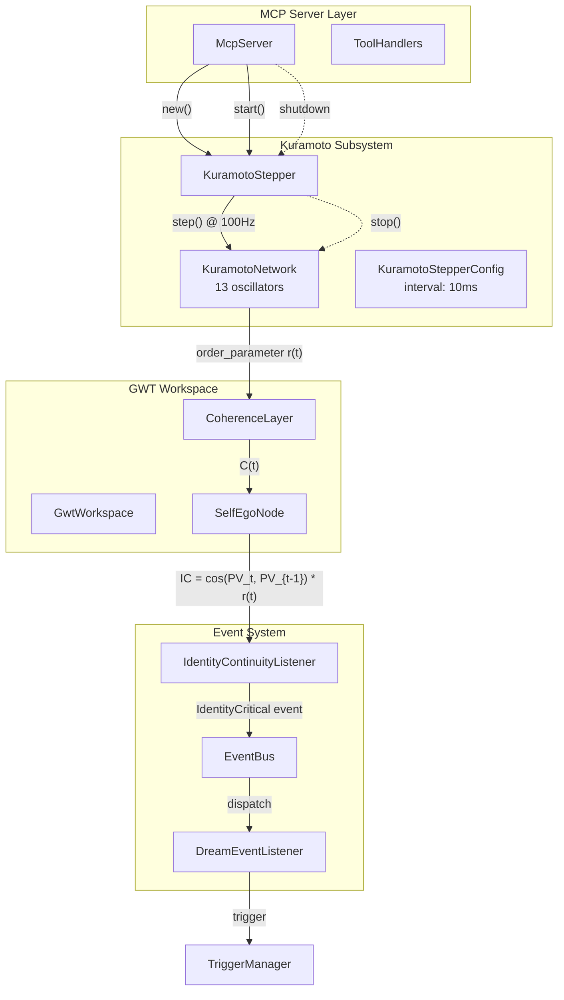
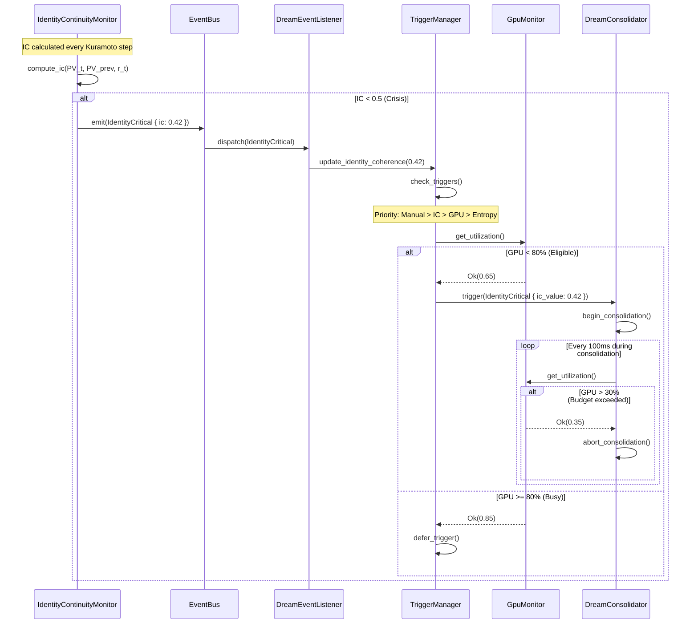
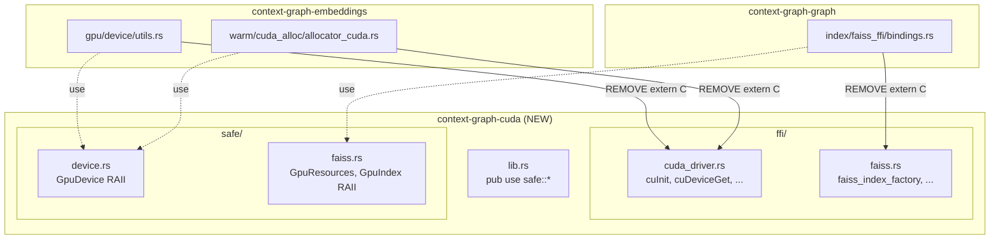
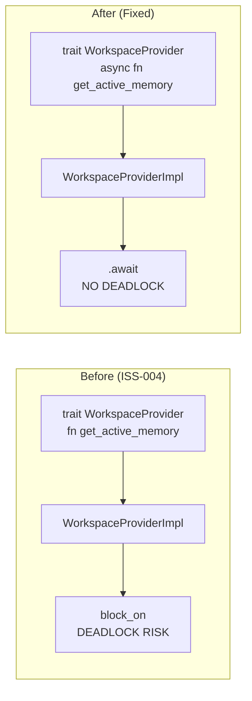
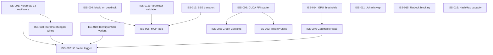

# Technical Specification: Remediation Master Document

**Spec ID**: TECH-REMEDIATION-001
**Version**: 1.0.0
**Status**: Draft
**Date**: 2026-01-12
**Author**: Architecture Agent (Claude Opus 4.5)

---

## Table of Contents

1. [Overview](#1-overview)
2. [Architecture Diagrams](#2-architecture-diagrams)
3. [Data Models](#3-data-models)
4. [API Contracts](#4-api-contracts)
5. [Component Contracts](#5-component-contracts)
6. [Implementation Notes](#6-implementation-notes)
7. [Error Types](#7-error-types)
8. [Appendix](#8-appendix)

---

## 1. Overview

This document provides technical specifications for all 16 remediation issues across 8 domains:

| Domain | Issues | Severity | Estimated Hours |
|--------|--------|----------|-----------------|
| GWT | ISS-001, ISS-003 | CRITICAL | 4-7 |
| Identity/Dream | ISS-002, ISS-010 | CRITICAL/HIGH | 5-9 |
| Performance | ISS-004, ISS-015, ISS-016 | CRITICAL/LOW | 6-12 |
| Architecture | ISS-005 | CRITICAL | 14-23 |
| MCP | ISS-006, ISS-012, ISS-013 | HIGH/MEDIUM | ~139 |
| Dream GPU | ISS-007, ISS-014 | HIGH/MEDIUM | 10-12 |
| Embeddings | ISS-008, ISS-009 | HIGH | 14-20 |
| UTL | ISS-011 | MEDIUM | 1-2 |

**Total Estimated Effort**: ~200-225 hours

---

## 2. Architecture Diagrams

### 2.1 GWT/Kuramoto System Architecture



### 2.2 Dream Trigger Flow



### 2.3 CUDA FFI Consolidation Structure



### 2.4 Async Provider Architecture



---

## 3. Data Models

### 3.1 ExtendedTriggerReason Enum

**Location**: `crates/context-graph-core/src/dream/types.rs`

```rust
/// Extended trigger reasons for dream consolidation.
///
/// Priority order (highest to lowest):
/// 1. Manual - User-initiated
/// 2. IdentityCritical - IC < 0.5 threshold (AP-26, AP-38)
/// 3. GpuIdle - GPU < 80% eligibility
/// 4. HighEntropy - Entropy threshold exceeded
#[derive(Debug, Clone, PartialEq, Serialize, Deserialize)]
pub enum ExtendedTriggerReason {
    /// User manually triggered consolidation
    Manual,

    /// Coherence threshold exceeded
    CoherenceThreshold {
        current: f32,
        threshold: f32,
    },

    /// Time-based trigger
    TimeBased {
        interval_secs: u64,
    },

    /// Memory pressure trigger
    MemoryPressure {
        used_mb: u64,
        threshold_mb: u64,
    },

    /// GPU became idle (< 80% eligibility threshold)
    GpuIdle {
        utilization: f32,
    },

    /// High entropy in graph structure
    HighEntropy {
        current: f32,
        threshold: f32,
    },

    /// **NEW**: Identity Continuity crisis (IC < 0.5)
    /// Constitution: AP-26, AP-38, IDENTITY-007
    IdentityCritical {
        /// The IC value that triggered the crisis (must be < 0.5)
        ic_value: f32,
    },
}

impl std::fmt::Display for ExtendedTriggerReason {
    fn fmt(&self, f: &mut std::fmt::Formatter<'_>) -> std::fmt::Result {
        match self {
            Self::Manual => write!(f, "Manual"),
            Self::CoherenceThreshold { current, threshold } => {
                write!(f, "CoherenceThreshold(current={:.3}, threshold={:.3})", current, threshold)
            }
            Self::TimeBased { interval_secs } => {
                write!(f, "TimeBased(interval={}s)", interval_secs)
            }
            Self::MemoryPressure { used_mb, threshold_mb } => {
                write!(f, "MemoryPressure(used={}MB, threshold={}MB)", used_mb, threshold_mb)
            }
            Self::GpuIdle { utilization } => {
                write!(f, "GpuIdle(utilization={:.1}%)", utilization * 100.0)
            }
            Self::HighEntropy { current, threshold } => {
                write!(f, "HighEntropy(current={:.3}, threshold={:.3})", current, threshold)
            }
            Self::IdentityCritical { ic_value } => {
                write!(f, "IdentityCritical(IC={:.3})", ic_value)
            }
        }
    }
}
```

### 3.2 KuramotoNetwork with 13 Oscillators

**Location**: `crates/context-graph-core/src/layers/coherence/network.rs`

```rust
use crate::layers::coherence::constants::KURAMOTO_N;

/// Kuramoto oscillator network for GWT coherence modeling.
///
/// Constitution: AP-25, GWT-002
/// INVARIANT: MUST have exactly 13 oscillators
#[derive(Debug, Clone)]
pub struct KuramotoNetwork {
    /// Oscillator phases (radians) - MUST be len == 13
    phases: [f32; KURAMOTO_N],

    /// Natural frequencies (Hz) - MUST be len == 13
    /// Constitution mapping:
    /// [0]  gamma_fast   = 40.0 Hz  (perception binding)
    /// [1]  theta_slow   = 8.0 Hz   (memory consolidation)
    /// [2]  theta_2      = 8.0 Hz   (hippocampal rhythm)
    /// [3]  theta_3      = 8.0 Hz   (prefrontal sync)
    /// [4]  beta_1       = 25.0 Hz  (motor planning)
    /// [5]  delta        = 4.0 Hz   (deep sleep)
    /// [6]  beta_2       = 25.0 Hz  (active thinking)
    /// [7]  alpha        = 12.0 Hz  (relaxed awareness)
    /// [8]  high_gamma   = 80.0 Hz  (cross-modal binding)
    /// [9]  gamma_mid    = 40.0 Hz  (attention)
    /// [10] beta_3       = 15.0 Hz  (cognitive control)
    /// [11] gamma_low    = 60.0 Hz  (sensory processing)
    /// [12] delta_slow   = 4.0 Hz   (slow wave sleep)
    natural_frequencies: [f32; KURAMOTO_N],

    /// Coupling strength between oscillators
    coupling: f32,

    /// Current order parameter r(t) in [0, 1]
    order_parameter: f32,

    /// Mean phase psi(t)
    mean_phase: f32,
}

/// Constants for Kuramoto network
/// Location: crates/context-graph-core/src/layers/coherence/constants.rs
pub const KURAMOTO_N: usize = 13;

/// Base frequencies matching constitution gwt.kuramoto.frequencies
pub const KURAMOTO_BASE_FREQUENCIES: [f32; KURAMOTO_N] = [
    40.0,  // gamma_fast
    8.0,   // theta_slow
    8.0,   // theta_2
    8.0,   // theta_3
    25.0,  // beta_1
    4.0,   // delta
    25.0,  // beta_2
    12.0,  // alpha
    80.0,  // high_gamma
    40.0,  // gamma_mid
    15.0,  // beta_3
    60.0,  // gamma_low
    4.0,   // delta_slow
];

impl KuramotoNetwork {
    /// Create a new Kuramoto network with 13 oscillators.
    ///
    /// # Panics
    ///
    /// Panics at compile time if KURAMOTO_N != 13 (const assertion)
    pub fn new(coupling: f32) -> Self {
        // Compile-time assertion
        const _: () = assert!(KURAMOTO_N == 13, "Kuramoto network MUST have exactly 13 oscillators");

        Self {
            phases: [0.0; KURAMOTO_N],
            natural_frequencies: KURAMOTO_BASE_FREQUENCIES,
            coupling,
            order_parameter: 0.0,
            mean_phase: 0.0,
        }
    }

    /// Step the network forward by dt seconds.
    ///
    /// Updates all oscillator phases using Kuramoto dynamics:
    /// dθ_i/dt = ω_i + (K/N) * Σ_j sin(θ_j - θ_i)
    pub fn step(&mut self, dt: f32) {
        let n = KURAMOTO_N as f32;
        let mut new_phases = self.phases;

        for i in 0..KURAMOTO_N {
            let mut coupling_sum = 0.0;
            for j in 0..KURAMOTO_N {
                coupling_sum += (self.phases[j] - self.phases[i]).sin();
            }

            let d_theta = self.natural_frequencies[i] * std::f32::consts::TAU
                        + (self.coupling / n) * coupling_sum;
            new_phases[i] = self.phases[i] + d_theta * dt;
        }

        self.phases = new_phases;
        self.compute_order_parameter();
    }

    /// Compute the Kuramoto order parameter r(t) and mean phase psi(t).
    ///
    /// r * e^(i*psi) = (1/N) * Σ_j e^(i*θ_j)
    fn compute_order_parameter(&mut self) {
        let n = KURAMOTO_N as f32;
        let (sin_sum, cos_sum): (f32, f32) = self.phases
            .iter()
            .map(|&theta| (theta.sin(), theta.cos()))
            .fold((0.0, 0.0), |(s, c), (si, ci)| (s + si, c + ci));

        let sin_avg = sin_sum / n;
        let cos_avg = cos_sum / n;

        self.order_parameter = (sin_avg * sin_avg + cos_avg * cos_avg).sqrt();
        self.mean_phase = sin_avg.atan2(cos_avg);
    }

    /// Get the current order parameter r(t) in [0, 1].
    ///
    /// r = 1 means perfect synchronization (all oscillators in phase)
    /// r = 0 means no synchronization (uniform phase distribution)
    #[inline]
    pub fn order_parameter(&self) -> f32 {
        self.order_parameter
    }
}
```

### 3.3 GpuMonitor with NVML Integration

**Location**: `crates/context-graph-core/src/dream/gpu_monitor.rs`

```rust
use nvml_wrapper::{Nvml, Device};
use std::sync::Arc;

/// GPU monitoring error types.
/// Constitution: AP-26 (fail-fast, no silent failures)
#[derive(Debug, thiserror::Error)]
pub enum GpuMonitorError {
    #[error("NVML initialization failed: {0}")]
    NvmlInitFailed(String),

    #[error("No GPU devices found")]
    NoDevices,

    #[error("Failed to get device {index}: {message}")]
    DeviceAccessFailed { index: u32, message: String },

    #[error("Failed to query GPU utilization: {0}")]
    UtilizationQueryFailed(String),

    #[error("NVML not available (drivers not installed)")]
    NvmlNotAvailable,

    #[error("GPU monitoring disabled")]
    Disabled,
}

/// GPU utilization thresholds per Constitution.
pub mod thresholds {
    /// Dream ELIGIBILITY threshold - dreams can START when GPU < 80%
    /// Constitution: dream.trigger.gpu = "<80%"
    pub const GPU_ELIGIBILITY_THRESHOLD: f32 = 0.80;

    /// Dream BUDGET threshold - dreams must ABORT if GPU > 30%
    /// Constitution: dream.constraints.gpu = "<30%"
    pub const GPU_BUDGET_THRESHOLD: f32 = 0.30;
}

/// Real GPU monitor using NVML.
///
/// # Fail-Fast Behavior (AP-26)
///
/// - Returns `Err(GpuMonitorError)` on any failure
/// - Does NOT return 0.0 as fallback
/// - Does NOT silently degrade
pub struct NvmlGpuMonitor {
    nvml: Arc<Nvml>,
    device_count: u32,
    /// Cached utilization (valid for 100ms)
    cached_utilization: Option<(f32, std::time::Instant)>,
    cache_duration: std::time::Duration,
}

impl NvmlGpuMonitor {
    /// Create a new GPU monitor with NVML backend.
    ///
    /// # Errors
    ///
    /// Returns error if NVML cannot be initialized or no GPUs found.
    /// Does NOT fall back to stub mode (AP-26 compliance).
    pub fn new() -> Result<Self, GpuMonitorError> {
        let nvml = Nvml::init()
            .map_err(|e| GpuMonitorError::NvmlInitFailed(e.to_string()))?;

        let device_count = nvml.device_count()
            .map_err(|e| GpuMonitorError::NvmlInitFailed(e.to_string()))?;

        if device_count == 0 {
            return Err(GpuMonitorError::NoDevices);
        }

        Ok(Self {
            nvml: Arc::new(nvml),
            device_count,
            cached_utilization: None,
            cache_duration: std::time::Duration::from_millis(100),
        })
    }

    /// Get current GPU utilization as a fraction [0.0, 1.0].
    ///
    /// For multi-GPU systems, returns the MAXIMUM utilization.
    ///
    /// # Errors
    ///
    /// Returns error if utilization cannot be queried.
    /// Does NOT return 0.0 on failure (AP-26).
    pub fn get_utilization(&mut self) -> Result<f32, GpuMonitorError> {
        // Check cache
        if let Some((cached, timestamp)) = &self.cached_utilization {
            if timestamp.elapsed() < self.cache_duration {
                return Ok(*cached);
            }
        }

        let mut max_utilization: f32 = 0.0;

        for i in 0..self.device_count {
            let device = self.nvml.device_by_index(i)
                .map_err(|e| GpuMonitorError::DeviceAccessFailed {
                    index: i,
                    message: e.to_string()
                })?;

            let utilization = device.utilization_rates()
                .map_err(|e| GpuMonitorError::UtilizationQueryFailed(e.to_string()))?;

            let gpu_util = utilization.gpu as f32 / 100.0;
            max_utilization = max_utilization.max(gpu_util);
        }

        // Update cache
        self.cached_utilization = Some((max_utilization, std::time::Instant::now()));

        Ok(max_utilization)
    }

    /// Check if GPU is eligible to start a dream (< 80% utilization).
    pub fn is_eligible_for_dream(&mut self) -> Result<bool, GpuMonitorError> {
        let util = self.get_utilization()?;
        Ok(util < thresholds::GPU_ELIGIBILITY_THRESHOLD)
    }

    /// Check if dream should abort due to GPU budget exceeded (> 30%).
    pub fn should_abort_dream(&mut self) -> Result<bool, GpuMonitorError> {
        let util = self.get_utilization()?;
        Ok(util > thresholds::GPU_BUDGET_THRESHOLD)
    }
}

/// Trait for GPU monitoring (allows mocking in tests).
pub trait GpuMonitor: Send + Sync {
    fn get_utilization(&mut self) -> Result<f32, GpuMonitorError>;
    fn is_eligible_for_dream(&mut self) -> Result<bool, GpuMonitorError>;
    fn should_abort_dream(&mut self) -> Result<bool, GpuMonitorError>;
}

impl GpuMonitor for NvmlGpuMonitor {
    fn get_utilization(&mut self) -> Result<f32, GpuMonitorError> {
        NvmlGpuMonitor::get_utilization(self)
    }

    fn is_eligible_for_dream(&mut self) -> Result<bool, GpuMonitorError> {
        NvmlGpuMonitor::is_eligible_for_dream(self)
    }

    fn should_abort_dream(&mut self) -> Result<bool, GpuMonitorError> {
        NvmlGpuMonitor::should_abort_dream(self)
    }
}
```

### 3.4 TokenPruningQuantizer

**Location**: `crates/context-graph-embeddings/src/pruning/token_pruner.rs`

```rust
use std::cmp::Ordering;

/// Configuration for token pruning.
#[derive(Debug, Clone)]
pub struct TokenPruningConfig {
    /// Target compression ratio (default: 0.5 = 50% compression)
    pub target_compression: f32,

    /// Minimum tokens to retain (default: 64)
    pub min_tokens: usize,

    /// Importance scoring method
    pub scoring_method: ImportanceScoringMethod,
}

impl Default for TokenPruningConfig {
    fn default() -> Self {
        Self {
            target_compression: 0.5,
            min_tokens: 64,
            scoring_method: ImportanceScoringMethod::AttentionBased,
        }
    }
}

/// Method for scoring token importance.
#[derive(Debug, Clone, Copy, PartialEq, Eq)]
pub enum ImportanceScoringMethod {
    /// Use attention weights from transformer layers
    AttentionBased,

    /// Use L2 norm of token embeddings
    EmbeddingMagnitude,

    /// Use entropy of token probability distribution
    Entropy,
}

/// Token with importance score for pruning decisions.
#[derive(Debug, Clone)]
struct ScoredToken {
    index: usize,
    importance: f32,
}

/// Token pruning quantizer for E12 Late Interaction embeddings.
///
/// Constitution: embeddings.models.E12_LateInteraction = "128D/tok"
/// Target: ~50% compression (512 -> ~256 tokens)
/// Constraint: Recall@10 degradation < 5%
pub struct TokenPruningQuantizer {
    config: TokenPruningConfig,
}

impl TokenPruningQuantizer {
    pub fn new(config: TokenPruningConfig) -> Self {
        Self { config }
    }

    /// Prune low-importance tokens from E12 embeddings.
    ///
    /// # Arguments
    ///
    /// * `embeddings` - Token embeddings, shape [num_tokens, 128]
    /// * `attention_weights` - Optional attention weights for importance scoring
    ///
    /// # Returns
    ///
    /// Pruned embeddings with retained token indices.
    ///
    /// # Guarantees
    ///
    /// - Output has at least `min_tokens` tokens
    /// - Compression ratio is approximately `target_compression`
    pub fn prune(
        &self,
        embeddings: &[Vec<f32>],
        attention_weights: Option<&[f32]>,
    ) -> PrunedEmbeddings {
        let num_tokens = embeddings.len();

        // Don't prune if already at or below minimum
        if num_tokens <= self.config.min_tokens {
            return PrunedEmbeddings {
                embeddings: embeddings.to_vec(),
                retained_indices: (0..num_tokens).collect(),
                compression_ratio: 1.0,
            };
        }

        // Calculate target token count
        let target_tokens = ((num_tokens as f32) * (1.0 - self.config.target_compression))
            .round() as usize;
        let target_tokens = target_tokens.max(self.config.min_tokens);

        // Score tokens by importance
        let scores = self.score_tokens(embeddings, attention_weights);

        // Sort by importance (descending)
        let mut scored: Vec<ScoredToken> = scores
            .into_iter()
            .enumerate()
            .map(|(index, importance)| ScoredToken { index, importance })
            .collect();

        scored.sort_by(|a, b| {
            b.importance.partial_cmp(&a.importance).unwrap_or(Ordering::Equal)
        });

        // Retain top-k tokens
        let retained: Vec<usize> = scored
            .into_iter()
            .take(target_tokens)
            .map(|s| s.index)
            .collect();

        // Sort retained indices to preserve original order
        let mut retained_sorted = retained.clone();
        retained_sorted.sort();

        // Extract retained embeddings
        let pruned_embeddings: Vec<Vec<f32>> = retained_sorted
            .iter()
            .map(|&i| embeddings[i].clone())
            .collect();

        let compression_ratio = 1.0 - (pruned_embeddings.len() as f32 / num_tokens as f32);

        PrunedEmbeddings {
            embeddings: pruned_embeddings,
            retained_indices: retained_sorted,
            compression_ratio,
        }
    }

    /// Score tokens by importance using configured method.
    fn score_tokens(
        &self,
        embeddings: &[Vec<f32>],
        attention_weights: Option<&[f32]>,
    ) -> Vec<f32> {
        match self.config.scoring_method {
            ImportanceScoringMethod::AttentionBased => {
                if let Some(weights) = attention_weights {
                    weights.to_vec()
                } else {
                    // Fall back to magnitude if no attention weights
                    self.score_by_magnitude(embeddings)
                }
            }
            ImportanceScoringMethod::EmbeddingMagnitude => {
                self.score_by_magnitude(embeddings)
            }
            ImportanceScoringMethod::Entropy => {
                self.score_by_entropy(embeddings)
            }
        }
    }

    /// Score tokens by L2 norm of embedding vector.
    fn score_by_magnitude(&self, embeddings: &[Vec<f32>]) -> Vec<f32> {
        embeddings
            .iter()
            .map(|emb| {
                let l2: f32 = emb.iter().map(|x| x * x).sum();
                l2.sqrt()
            })
            .collect()
    }

    /// Score tokens by negative entropy (higher entropy = more important).
    fn score_by_entropy(&self, embeddings: &[Vec<f32>]) -> Vec<f32> {
        embeddings
            .iter()
            .map(|emb| {
                // Normalize to probability distribution
                let sum: f32 = emb.iter().map(|x| x.abs()).sum();
                if sum == 0.0 {
                    return 0.0;
                }

                let probs: Vec<f32> = emb.iter().map(|x| x.abs() / sum).collect();

                // Calculate entropy
                let entropy: f32 = probs
                    .iter()
                    .filter(|&&p| p > 0.0)
                    .map(|&p| -p * p.ln())
                    .sum();

                entropy
            })
            .collect()
    }
}

/// Result of token pruning operation.
#[derive(Debug, Clone)]
pub struct PrunedEmbeddings {
    /// Pruned token embeddings
    pub embeddings: Vec<Vec<f32>>,

    /// Indices of retained tokens in original sequence
    pub retained_indices: Vec<usize>,

    /// Achieved compression ratio [0, 1]
    pub compression_ratio: f32,
}
```

### 3.5 TriggerManager with IC Support

**Location**: `crates/context-graph-core/src/dream/triggers.rs`

```rust
use crate::dream::types::ExtendedTriggerReason;
use crate::dream::gpu_monitor::{GpuMonitor, GpuMonitorError, thresholds};
use std::sync::{Arc, Mutex};
use std::time::{Duration, Instant};

/// Configuration for trigger manager.
#[derive(Debug, Clone)]
pub struct TriggerConfig {
    /// IC threshold for identity crisis (default: 0.5)
    /// Constitution: gwt.self_ego_node.thresholds.critical = 0.5
    pub ic_threshold: f32,

    /// Entropy threshold for high entropy trigger
    pub entropy_threshold: f32,

    /// Cooldown between triggers
    pub cooldown: Duration,
}

impl Default for TriggerConfig {
    fn default() -> Self {
        Self {
            ic_threshold: 0.5,
            entropy_threshold: 0.8,
            cooldown: Duration::from_secs(60),
        }
    }
}

impl TriggerConfig {
    /// Validate configuration.
    ///
    /// # Panics
    ///
    /// Panics if ic_threshold is outside [0, 1] (AP-26 fail-fast)
    pub fn validate(&self) {
        assert!(
            (0.0..=1.0).contains(&self.ic_threshold),
            "ic_threshold must be in [0, 1], got {}",
            self.ic_threshold
        );
        assert!(
            (0.0..=1.0).contains(&self.entropy_threshold),
            "entropy_threshold must be in [0, 1], got {}",
            self.entropy_threshold
        );
    }
}

/// Manages dream trigger conditions.
///
/// Priority order (highest first):
/// 1. Manual - User-initiated
/// 2. IdentityCritical - IC < 0.5 (AP-26, AP-38)
/// 3. GpuIdle - GPU < 80% eligibility
/// 4. HighEntropy - Entropy threshold exceeded
pub struct TriggerManager<G: GpuMonitor> {
    config: TriggerConfig,

    /// Current Identity Continuity value
    current_ic: Option<f32>,

    /// Current entropy value
    current_entropy: Option<f32>,

    /// GPU monitor
    gpu_monitor: Arc<Mutex<G>>,

    /// Last trigger time (for cooldown)
    last_trigger: Option<Instant>,

    /// Manual trigger flag
    manual_trigger: bool,
}

impl<G: GpuMonitor> TriggerManager<G> {
    /// Create a new trigger manager.
    ///
    /// # Panics
    ///
    /// Panics if config validation fails (AP-26)
    pub fn new(config: TriggerConfig, gpu_monitor: G) -> Self {
        config.validate();

        Self {
            config,
            current_ic: None,
            current_entropy: None,
            gpu_monitor: Arc::new(Mutex::new(gpu_monitor)),
            last_trigger: None,
            manual_trigger: false,
        }
    }

    /// Update the current Identity Continuity value.
    ///
    /// # Arguments
    ///
    /// * `ic` - Identity Continuity value. NaN/Infinity clamped to [0, 1] with warning.
    pub fn update_identity_coherence(&mut self, ic: f32) {
        let ic = if ic.is_nan() || ic.is_infinite() {
            tracing::warn!("Invalid IC value {}, clamping to [0, 1]", ic);
            ic.clamp(0.0, 1.0)
        } else {
            ic.clamp(0.0, 1.0)
        };

        self.current_ic = Some(ic);
    }

    /// Update the current entropy value.
    pub fn update_entropy(&mut self, entropy: f32) {
        self.current_entropy = Some(entropy.clamp(0.0, 1.0));
    }

    /// Set manual trigger flag.
    pub fn set_manual_trigger(&mut self) {
        self.manual_trigger = true;
    }

    /// Check all trigger conditions and return the highest priority trigger.
    ///
    /// # Returns
    ///
    /// `Some(reason)` if a trigger condition is met, `None` otherwise.
    ///
    /// # Errors
    ///
    /// Returns `Err` if GPU monitoring fails (does NOT silently fail).
    pub fn check_triggers(&mut self) -> Result<Option<ExtendedTriggerReason>, GpuMonitorError> {
        // Check cooldown
        if let Some(last) = self.last_trigger {
            if last.elapsed() < self.config.cooldown {
                return Ok(None);
            }
        }

        // Priority 1: Manual trigger
        if self.manual_trigger {
            self.manual_trigger = false;
            self.last_trigger = Some(Instant::now());
            return Ok(Some(ExtendedTriggerReason::Manual));
        }

        // Priority 2: Identity Critical (IC < threshold)
        if let Some(ic) = self.current_ic {
            if ic < self.config.ic_threshold {
                // Check GPU eligibility before triggering
                let gpu_eligible = {
                    let mut monitor = self.gpu_monitor.lock()
                        .expect("GPU monitor lock poisoned - panicking per AP-26");
                    monitor.is_eligible_for_dream()?
                };

                if gpu_eligible {
                    self.last_trigger = Some(Instant::now());
                    return Ok(Some(ExtendedTriggerReason::IdentityCritical { ic_value: ic }));
                }
            }
        }

        // Priority 3: GPU Idle
        {
            let mut monitor = self.gpu_monitor.lock()
                .expect("GPU monitor lock poisoned - panicking per AP-26");
            let utilization = monitor.get_utilization()?;

            if utilization < thresholds::GPU_ELIGIBILITY_THRESHOLD {
                // Only trigger if no other conditions pending
                if self.current_ic.is_none() && self.current_entropy.is_none() {
                    self.last_trigger = Some(Instant::now());
                    return Ok(Some(ExtendedTriggerReason::GpuIdle { utilization }));
                }
            }
        }

        // Priority 4: High Entropy
        if let Some(entropy) = self.current_entropy {
            if entropy > self.config.entropy_threshold {
                let gpu_eligible = {
                    let mut monitor = self.gpu_monitor.lock()
                        .expect("GPU monitor lock poisoned - panicking per AP-26");
                    monitor.is_eligible_for_dream()?
                };

                if gpu_eligible {
                    self.last_trigger = Some(Instant::now());
                    return Ok(Some(ExtendedTriggerReason::HighEntropy {
                        current: entropy,
                        threshold: self.config.entropy_threshold,
                    }));
                }
            }
        }

        Ok(None)
    }

    /// Check identity continuity and return crisis status.
    ///
    /// # Returns
    ///
    /// `true` if IC < threshold (crisis state)
    pub fn check_identity_continuity(&self) -> bool {
        self.current_ic
            .map(|ic| ic < self.config.ic_threshold)
            .unwrap_or(false)
    }
}
```

---

## 4. API Contracts

### 4.1 Modified WorkspaceProvider Trait (Async)

**Location**: `crates/context-graph-mcp/src/handlers/gwt_traits.rs`

```rust
use async_trait::async_trait;
use uuid::Uuid;

/// Workspace provider trait for GWT integration.
///
/// All methods are async to prevent deadlock with single-threaded runtimes.
/// Constitution: AP-08 ("No sync I/O in async context")
#[async_trait]
pub trait WorkspaceProvider: Send + Sync {
    /// Get the currently active memory UUID.
    async fn get_active_memory(&self) -> Option<Uuid>;

    /// Check if workspace is currently broadcasting.
    async fn is_broadcasting(&self) -> bool;

    /// Check if workspace has conflicts.
    async fn has_conflict(&self) -> bool;

    /// Get conflict details if any.
    async fn get_conflict_details(&self) -> Option<String>;

    /// Get the coherence threshold.
    async fn coherence_threshold(&self) -> f32;
}

/// Meta-cognitive provider trait.
///
/// All methods are async per AP-08.
#[async_trait]
pub trait MetaCognitiveProvider: Send + Sync {
    /// Get current acetylcholine level.
    async fn acetylcholine(&self) -> f32;

    /// Get monitoring frequency in Hz.
    async fn monitoring_frequency(&self) -> f32;

    /// Get recent coherence scores.
    async fn get_recent_scores(&self, count: usize) -> Vec<f32>;
}
```

### 4.2 WorkspaceProviderImpl (Async Implementation)

**Location**: `crates/context-graph-mcp/src/handlers/gwt_providers.rs`

```rust
use crate::handlers::gwt_traits::{WorkspaceProvider, MetaCognitiveProvider};
use async_trait::async_trait;
use tokio::sync::RwLock;
use uuid::Uuid;
use std::sync::Arc;

/// Async workspace provider implementation.
///
/// Uses tokio::sync::RwLock instead of std::sync::RwLock.
/// No block_on() calls - all methods are properly async.
pub struct WorkspaceProviderImpl {
    workspace: Arc<RwLock<GwtWorkspace>>,
}

#[async_trait]
impl WorkspaceProvider for WorkspaceProviderImpl {
    async fn get_active_memory(&self) -> Option<Uuid> {
        let workspace = self.workspace.read().await;
        workspace.active_memory()
    }

    async fn is_broadcasting(&self) -> bool {
        let workspace = self.workspace.read().await;
        workspace.is_broadcasting()
    }

    async fn has_conflict(&self) -> bool {
        let workspace = self.workspace.read().await;
        workspace.has_conflict()
    }

    async fn get_conflict_details(&self) -> Option<String> {
        let workspace = self.workspace.read().await;
        workspace.conflict_details()
    }

    async fn coherence_threshold(&self) -> f32 {
        let workspace = self.workspace.read().await;
        workspace.coherence_threshold()
    }
}

/// Async meta-cognitive provider implementation.
pub struct MetaCognitiveProviderImpl {
    meta_cognitive: Arc<RwLock<MetaCognitiveState>>,
}

#[async_trait]
impl MetaCognitiveProvider for MetaCognitiveProviderImpl {
    async fn acetylcholine(&self) -> f32 {
        let state = self.meta_cognitive.read().await;
        state.acetylcholine()
    }

    async fn monitoring_frequency(&self) -> f32 {
        let state = self.meta_cognitive.read().await;
        state.monitoring_frequency()
    }

    async fn get_recent_scores(&self, count: usize) -> Vec<f32> {
        let state = self.meta_cognitive.read().await;
        state.recent_scores(count)
    }
}
```

### 4.3 New MCP Tools JSON Schemas

#### 4.3.1 epistemic_action Tool

```json
{
  "name": "epistemic_action",
  "description": "Perform an epistemic action on the GWT workspace to update uncertainty and knowledge states.",
  "inputSchema": {
    "type": "object",
    "required": ["action_type", "target", "rationale"],
    "properties": {
      "action_type": {
        "type": "string",
        "enum": ["assert", "retract", "query", "hypothesize", "verify"],
        "description": "Type of epistemic action to perform"
      },
      "target": {
        "type": "string",
        "minLength": 1,
        "maxLength": 4096,
        "description": "Target concept or proposition for the action"
      },
      "confidence": {
        "type": "number",
        "minimum": 0.0,
        "maximum": 1.0,
        "default": 0.5,
        "description": "Confidence level for the action"
      },
      "rationale": {
        "type": "string",
        "minLength": 1,
        "maxLength": 1024,
        "description": "Rationale for performing this action (required per PRD 0.3)"
      },
      "context": {
        "type": "object",
        "description": "Additional context for the action",
        "properties": {
          "source_nodes": {
            "type": "array",
            "items": { "type": "string", "format": "uuid" }
          },
          "uncertainty_type": {
            "type": "string",
            "enum": ["epistemic", "aleatory", "mixed"]
          }
        }
      }
    }
  },
  "outputSchema": {
    "type": "object",
    "properties": {
      "success": { "type": "boolean" },
      "action_id": { "type": "string", "format": "uuid" },
      "workspace_state": {
        "type": "object",
        "properties": {
          "uncertainty_delta": { "type": "number" },
          "coherence_impact": { "type": "number" },
          "triggered_dream": { "type": "boolean" }
        }
      },
      "error": { "type": "string" }
    }
  }
}
```

#### 4.3.2 merge_concepts Tool

```json
{
  "name": "merge_concepts",
  "description": "Merge two or more related concepts into a unified node.",
  "inputSchema": {
    "type": "object",
    "required": ["source_ids", "target_name", "rationale"],
    "properties": {
      "source_ids": {
        "type": "array",
        "minItems": 2,
        "maxItems": 10,
        "items": { "type": "string", "format": "uuid" },
        "description": "UUIDs of concepts to merge"
      },
      "target_name": {
        "type": "string",
        "minLength": 1,
        "maxLength": 256,
        "description": "Name for the merged concept"
      },
      "merge_strategy": {
        "type": "string",
        "enum": ["union", "intersection", "weighted_average"],
        "default": "union",
        "description": "Strategy for merging embeddings and metadata"
      },
      "rationale": {
        "type": "string",
        "minLength": 1,
        "maxLength": 1024,
        "description": "Rationale for merge (required per PRD 0.3)"
      }
    }
  },
  "outputSchema": {
    "type": "object",
    "properties": {
      "success": { "type": "boolean" },
      "merged_id": { "type": "string", "format": "uuid" },
      "reversal_hash": {
        "type": "string",
        "description": "Hash for 30-day undo capability"
      },
      "error": { "type": "string" }
    }
  }
}
```

#### 4.3.3 get_johari_classification Tool

```json
{
  "name": "get_johari_classification",
  "description": "Get Johari quadrant classification for a query based on surprise (deltaS) and confidence (deltaC).",
  "inputSchema": {
    "type": "object",
    "required": ["query"],
    "properties": {
      "query": {
        "type": "string",
        "minLength": 1,
        "maxLength": 4096,
        "description": "Query to classify"
      },
      "context_nodes": {
        "type": "array",
        "items": { "type": "string", "format": "uuid" },
        "description": "Optional context nodes to consider"
      }
    }
  },
  "outputSchema": {
    "type": "object",
    "properties": {
      "quadrant": {
        "type": "string",
        "enum": ["Open", "Hidden", "Blind", "Unknown"]
      },
      "deltaS": {
        "type": "number",
        "minimum": 0.0,
        "maximum": 1.0,
        "description": "Surprise delta"
      },
      "deltaC": {
        "type": "number",
        "minimum": 0.0,
        "maximum": 1.0,
        "description": "Confidence delta"
      },
      "suggested_action": {
        "type": "string",
        "enum": ["DirectRecall", "GetNeighborhood", "TriggerDream", "EpistemicAction"],
        "description": "Recommended action based on quadrant"
      },
      "explanation": { "type": "string" }
    }
  }
}
```

### 4.4 SSE Transport Endpoint

**Location**: `crates/context-graph-mcp/src/transport/sse.rs`

```rust
use axum::{
    extract::State,
    response::sse::{Event, Sse},
    routing::get,
    Router,
};
use futures::stream::Stream;
use std::convert::Infallible;
use std::time::Duration;
use tokio_stream::StreamExt;

/// SSE transport configuration.
#[derive(Debug, Clone)]
pub struct SseConfig {
    /// Keep-alive interval
    pub keepalive_interval: Duration,

    /// Maximum connection duration
    pub max_connection_duration: Duration,

    /// Event buffer size
    pub buffer_size: usize,
}

impl Default for SseConfig {
    fn default() -> Self {
        Self {
            keepalive_interval: Duration::from_secs(15),
            max_connection_duration: Duration::from_secs(3600),
            buffer_size: 100,
        }
    }
}

/// SSE event types for MCP communication.
#[derive(Debug, Clone, serde::Serialize)]
#[serde(tag = "type")]
pub enum McpSseEvent {
    /// JSON-RPC response
    Response { id: serde_json::Value, result: serde_json::Value },

    /// JSON-RPC error
    Error { id: serde_json::Value, error: JsonRpcError },

    /// Notification (no id)
    Notification { method: String, params: serde_json::Value },

    /// Keep-alive ping
    Ping { timestamp: u64 },
}

#[derive(Debug, Clone, serde::Serialize)]
pub struct JsonRpcError {
    pub code: i32,
    pub message: String,
    pub data: Option<serde_json::Value>,
}

/// Create SSE router for MCP transport.
///
/// PRD Section 5.1: "JSON-RPC 2.0, stdio/SSE"
pub fn create_sse_router(state: AppState) -> Router<AppState> {
    Router::new()
        .route("/mcp/sse", get(sse_handler))
        .with_state(state)
}

async fn sse_handler(
    State(state): State<AppState>,
) -> Sse<impl Stream<Item = Result<Event, Infallible>>> {
    let config = state.sse_config.clone();

    let stream = async_stream::stream! {
        let mut interval = tokio::time::interval(config.keepalive_interval);
        let start = std::time::Instant::now();

        loop {
            tokio::select! {
                // Handle incoming events from MCP server
                Some(event) = state.event_rx.recv() => {
                    let json = serde_json::to_string(&event)
                        .unwrap_or_else(|e| format!(r#"{{"error":"{}"}}"#, e));

                    yield Ok(Event::default()
                        .event("message")
                        .data(json));
                }

                // Send keep-alive ping
                _ = interval.tick() => {
                    let ping = McpSseEvent::Ping {
                        timestamp: std::time::SystemTime::now()
                            .duration_since(std::time::UNIX_EPOCH)
                            .unwrap()
                            .as_secs(),
                    };

                    let json = serde_json::to_string(&ping).unwrap();
                    yield Ok(Event::default()
                        .event("ping")
                        .data(json));
                }
            }

            // Check max connection duration
            if start.elapsed() > config.max_connection_duration {
                break;
            }
        }
    };

    Sse::new(stream).keep_alive(
        axum::response::sse::KeepAlive::new()
            .interval(Duration::from_secs(10))
            .text("ping"),
    )
}
```

---

## 5. Component Contracts

### 5.1 KuramotoStepper

**Location**: `crates/context-graph-mcp/src/handlers/kuramoto_stepper.rs`

```rust
use crate::layers::coherence::network::KuramotoNetwork;
use std::sync::{Arc, atomic::{AtomicBool, Ordering}};
use std::time::Duration;
use tokio::sync::Mutex;
use tokio::task::JoinHandle;

/// Configuration for Kuramoto stepper.
#[derive(Debug, Clone)]
pub struct KuramotoStepperConfig {
    /// Step interval (default: 10ms = 100Hz)
    pub step_interval: Duration,

    /// Coupling strength
    pub coupling: f32,
}

impl Default for KuramotoStepperConfig {
    fn default() -> Self {
        Self {
            step_interval: Duration::from_millis(10),
            coupling: 0.5,
        }
    }
}

/// Kuramoto network stepper for continuous phase updates.
///
/// Constitution: GWT-006
pub struct KuramotoStepper {
    config: KuramotoStepperConfig,
    network: Arc<Mutex<KuramotoNetwork>>,
    running: Arc<AtomicBool>,
    task_handle: Option<JoinHandle<()>>,
}

impl KuramotoStepper {
    /// Create a new Kuramoto stepper.
    ///
    /// # Panics
    ///
    /// Panics if KuramotoNetwork cannot be created (KURAMOTO_N != 13)
    pub fn new(config: KuramotoStepperConfig) -> Self {
        let network = KuramotoNetwork::new(config.coupling);

        Self {
            config,
            network: Arc::new(Mutex::new(network)),
            running: Arc::new(AtomicBool::new(false)),
            task_handle: None,
        }
    }

    /// Start the stepper background task.
    ///
    /// # Returns
    ///
    /// `Ok(())` if started successfully, `Err` if already running.
    ///
    /// # Constitution
    ///
    /// REQ-GWT-004: System MUST fail to start if stepper cannot start.
    pub fn start(&mut self) -> Result<(), KuramotoStepperError> {
        if self.running.load(Ordering::SeqCst) {
            return Err(KuramotoStepperError::AlreadyRunning);
        }

        self.running.store(true, Ordering::SeqCst);

        let network = self.network.clone();
        let running = self.running.clone();
        let interval = self.config.step_interval;

        let handle = tokio::spawn(async move {
            let mut ticker = tokio::time::interval(interval);
            let dt = interval.as_secs_f32();

            while running.load(Ordering::SeqCst) {
                ticker.tick().await;

                let mut net = network.lock().await;
                net.step(dt);
            }
        });

        self.task_handle = Some(handle);

        tracing::info!(
            "KuramotoStepper started with interval {:?}",
            self.config.step_interval
        );

        Ok(())
    }

    /// Stop the stepper background task.
    ///
    /// # Arguments
    ///
    /// * `timeout` - Maximum time to wait for graceful shutdown.
    ///
    /// # Returns
    ///
    /// `Ok(())` if stopped successfully, `Err` if timeout exceeded.
    ///
    /// # Constitution
    ///
    /// REQ-GWT-005: Warn on timeout, do not block.
    pub async fn stop(&mut self, timeout: Duration) -> Result<(), KuramotoStepperError> {
        if !self.running.load(Ordering::SeqCst) {
            return Ok(());
        }

        self.running.store(false, Ordering::SeqCst);

        if let Some(handle) = self.task_handle.take() {
            match tokio::time::timeout(timeout, handle).await {
                Ok(Ok(())) => {
                    tracing::info!("KuramotoStepper stopped gracefully");
                    Ok(())
                }
                Ok(Err(e)) => {
                    tracing::error!("KuramotoStepper task panicked: {:?}", e);
                    Err(KuramotoStepperError::TaskPanicked)
                }
                Err(_) => {
                    tracing::warn!(
                        "KuramotoStepper stop timeout after {:?}",
                        timeout
                    );
                    Err(KuramotoStepperError::StopTimeout)
                }
            }
        } else {
            Ok(())
        }
    }

    /// Get the current order parameter r(t).
    pub async fn order_parameter(&self) -> f32 {
        let net = self.network.lock().await;
        net.order_parameter()
    }

    /// Check if the stepper is running.
    pub fn is_running(&self) -> bool {
        self.running.load(Ordering::SeqCst)
    }
}

#[derive(Debug, thiserror::Error)]
pub enum KuramotoStepperError {
    #[error("Stepper is already running")]
    AlreadyRunning,

    #[error("Stepper task panicked")]
    TaskPanicked,

    #[error("Stop operation timed out")]
    StopTimeout,
}
```

### 5.2 DreamEventListener with Trigger Integration

**Location**: `crates/context-graph-core/src/gwt/listeners/dream.rs`

```rust
use crate::dream::triggers::TriggerManager;
use crate::gwt::workspace::events::WorkspaceEvent;
use std::sync::Arc;
use tokio::sync::Mutex;

/// Dream event listener that triggers consolidation on IC crisis.
///
/// Constitution: IDENTITY-006, AP-40
pub struct DreamEventListener<G: GpuMonitor> {
    trigger_manager: Arc<Mutex<TriggerManager<G>>>,
}

impl<G: GpuMonitor> DreamEventListener<G> {
    pub fn new(trigger_manager: Arc<Mutex<TriggerManager<G>>>) -> Self {
        Self { trigger_manager }
    }

    /// Handle a workspace event.
    ///
    /// # Panics
    ///
    /// Panics on lock failure per AP-26 (no silent failures).
    pub async fn handle_event(&self, event: WorkspaceEvent) {
        match event {
            WorkspaceEvent::IdentityCritical { ic_value, timestamp } => {
                tracing::warn!(
                    "Identity crisis detected: IC={:.3} at {:?}",
                    ic_value,
                    timestamp
                );

                // Signal trigger manager - MUST NOT fail silently (AP-26)
                let mut manager = self.trigger_manager.lock().await;
                manager.update_identity_coherence(ic_value);

                match manager.check_triggers() {
                    Ok(Some(reason)) => {
                        tracing::info!("Dream trigger activated: {:?}", reason);
                        // Trigger consolidation via channel/callback
                        self.signal_dream_consolidation(reason).await;
                    }
                    Ok(None) => {
                        tracing::debug!("No dream trigger (cooldown or ineligible)");
                    }
                    Err(e) => {
                        // AP-26: GPU monitoring failure is NOT silent
                        panic!(
                            "GPU monitor error during IC crisis handling: {}. \
                             Cannot proceed without GPU status (AP-26).",
                            e
                        );
                    }
                }
            }

            WorkspaceEvent::CoherenceChanged { new_coherence, .. } => {
                tracing::debug!("Coherence changed to {:.3}", new_coherence);
            }

            _ => {}
        }
    }

    /// Signal the dream consolidation system to begin.
    async fn signal_dream_consolidation(&self, reason: ExtendedTriggerReason) {
        // Implementation depends on consolidation system architecture
        // Could be: channel send, callback invocation, or direct method call
        tracing::info!("Signaling dream consolidation with reason: {}", reason);
    }
}
```

### 5.3 Johari Action Mapping (Fixed)

**Location**: `crates/context-graph-utl/src/johari/retrieval/functions.rs`

```rust
use crate::johari::retrieval::action::SuggestedAction;
use crate::types::johari::quadrant::JohariQuadrant;

/// Get the suggested action for a Johari quadrant.
///
/// Constitution mapping (utl.johari):
/// - Open (deltaS<0.5, deltaC>0.5) -> DirectRecall
/// - Hidden (deltaS<0.5, deltaC<0.5) -> GetNeighborhood
/// - Blind (deltaS>0.5, deltaC<0.5) -> TriggerDream
/// - Unknown (deltaS>0.5, deltaC>0.5) -> EpistemicAction
///
/// # CRITICAL FIX (ISS-011)
///
/// Previous implementation had Blind and Unknown SWAPPED.
pub fn get_suggested_action(quadrant: JohariQuadrant) -> SuggestedAction {
    match quadrant {
        // Low surprise, high confidence -> Direct retrieval works
        JohariQuadrant::Open => SuggestedAction::DirectRecall,

        // Low surprise, low confidence -> Explore neighborhood for context
        JohariQuadrant::Hidden => SuggestedAction::GetNeighborhood,

        // High surprise, low confidence -> Need dream consolidation
        // FIXED: Was incorrectly EpistemicAction
        JohariQuadrant::Blind => SuggestedAction::TriggerDream,

        // High surprise, high confidence -> Epistemic action needed
        // FIXED: Was incorrectly TriggerDream
        JohariQuadrant::Unknown => SuggestedAction::EpistemicAction,
    }
}

#[cfg(test)]
mod tests {
    use super::*;

    /// Constitution compliance test for Johari action mapping.
    #[test]
    fn test_all_quadrant_actions_match_constitution() {
        // Constitution: utl.johari.Open = "deltaS<0.5, deltaC>0.5 -> DirectRecall"
        assert_eq!(
            get_suggested_action(JohariQuadrant::Open),
            SuggestedAction::DirectRecall,
            "Open quadrant must map to DirectRecall"
        );

        // Constitution: utl.johari.Hidden = "deltaS<0.5, deltaC<0.5 -> GetNeighborhood"
        assert_eq!(
            get_suggested_action(JohariQuadrant::Hidden),
            SuggestedAction::GetNeighborhood,
            "Hidden quadrant must map to GetNeighborhood"
        );

        // Constitution: utl.johari.Blind = "deltaS>0.5, deltaC<0.5 -> TriggerDream"
        assert_eq!(
            get_suggested_action(JohariQuadrant::Blind),
            SuggestedAction::TriggerDream,
            "Blind quadrant must map to TriggerDream (ISS-011 fix)"
        );

        // Constitution: utl.johari.Unknown = "deltaS>0.5, deltaC>0.5 -> EpistemicAction"
        assert_eq!(
            get_suggested_action(JohariQuadrant::Unknown),
            SuggestedAction::EpistemicAction,
            "Unknown quadrant must map to EpistemicAction (ISS-011 fix)"
        );
    }
}
```

---

## 6. Implementation Notes

### 6.1 Security: CUDA FFI Isolation Rationale

**Why consolidate FFI in context-graph-cuda?**

1. **Attack Surface Reduction**: FFI boundaries are where memory safety bugs occur. Consolidating all unsafe GPU code in one crate:
   - Enables focused security auditing
   - Reduces duplicate unsafe blocks
   - Centralizes validation of GPU pointers

2. **RAII Resource Management**: Safe wrappers (`GpuDevice`, `GpuResources`) ensure:
   - Automatic cleanup via `Drop` implementation
   - No resource leaks on error paths
   - Clear ownership semantics

3. **Audit Traceability**: CI gate script `check-ffi-consolidation.sh` enforces:
   ```bash
   # No extern "C" outside context-graph-cuda
   find crates -name "*.rs" -path "*/context-graph-cuda/*" -prune -o \
     -name "*.rs" -exec grep -l 'extern "C"' {} \; | \
     grep -v "context-graph-cuda" && exit 1 || exit 0
   ```

4. **Driver Version Isolation**: All NVML/CUDA version-specific code in one place:
   - Easier to update for new driver versions
   - Single point for fallback logic (NVML -> ROCm-SMI)

### 6.2 Performance: Async vs blocking_read() Tradeoff

**Problem (ISS-004)**: `block_on()` in async context causes deadlocks.

```rust
// BEFORE (DEADLOCK PRONE):
fn get_active_memory(&self) -> Option<Uuid> {
    futures::executor::block_on(async {
        self.workspace.read().await.active_memory()
    })
}
```

**Analysis**:

| Approach | Pros | Cons |
|----------|------|------|
| `block_on()` | Simple signature | Deadlock on single-threaded runtime |
| `async fn` | No deadlock | Requires trait change, call site updates |
| `try_lock()` + poll | Non-blocking | Complex, may fail |

**Decision**: Convert to `async fn` because:

1. **Correctness over convenience**: Deadlocks are unacceptable
2. **Constitution compliance**: AP-08 prohibits sync I/O in async context
3. **Ecosystem alignment**: Most Rust async code uses `async fn`

**Migration steps**:

1. Add `async-trait` to Cargo.toml
2. Update trait definitions to `async fn`
3. Update implementations to `.await` instead of `block_on()`
4. Update all call sites with `.await`

### 6.3 Integration: Hook Order Dependencies

**Critical ordering for hooks**:

```
session-start
    |
    v
pre-task (with IC state)
    |
    v
[Kuramoto stepper running at 100Hz]
    |
    v
[IC monitor checking every step]
    |
    v
[If IC < 0.5: IdentityCritical event]
    |
    v
DreamEventListener.handle_event()
    |
    v
TriggerManager.check_triggers()
    |
    v
[If eligible: trigger dream consolidation]
    |
    v
post-task (with dream results)
    |
    v
session-end
```

**Key dependencies**:

1. **KuramotoStepper MUST start before any IC checks**: Otherwise `r(t) = 0` and IC calculations are invalid.

2. **DreamEventListener MUST be registered before workspace events**: Otherwise IC crisis events are lost.

3. **TriggerManager MUST have valid GpuMonitor before IC events**: Otherwise GPU eligibility check panics (AP-26).

4. **Session hooks MUST not depend on dream state**: Dreams may be in-progress across sessions.

### 6.4 Green Contexts Auto-Enable Logic

**Location**: `crates/context-graph-cuda/src/context/green_contexts.rs`

```rust
/// Green Contexts configuration for RTX 5090+.
///
/// Constitution: stack.gpu.target = "RTX 5090"
/// Partition: 70% inference / 30% background
pub struct GreenContextsConfig {
    /// Compute capability required (12.0 for RTX 5090)
    pub min_compute_capability: (u32, u32),

    /// Inference partition percentage (0.70)
    pub inference_partition: f32,

    /// Background partition percentage (0.30)
    pub background_partition: f32,
}

impl Default for GreenContextsConfig {
    fn default() -> Self {
        Self {
            min_compute_capability: (12, 0),
            inference_partition: 0.70,
            background_partition: 0.30,
        }
    }
}

/// Check if Green Contexts should be auto-enabled.
///
/// Returns `true` if compute_capability >= 12.0
/// Gracefully degrades on older GPUs (not fatal).
pub fn should_enable_green_contexts(device: &GpuDevice) -> bool {
    let (major, minor) = device.compute_capability();

    let config = GreenContextsConfig::default();
    let (req_major, req_minor) = config.min_compute_capability;

    if major > req_major || (major == req_major && minor >= req_minor) {
        tracing::info!(
            "Green Contexts enabled: GPU compute capability {}.{} >= {}.{}",
            major, minor, req_major, req_minor
        );
        true
    } else {
        tracing::info!(
            "Green Contexts not available: GPU compute capability {}.{} < {}.{}",
            major, minor, req_major, req_minor
        );
        false
    }
}
```

---

## 7. Error Types

### 7.1 Consolidated Error Hierarchy

```rust
/// Top-level error type for context-graph operations.
#[derive(Debug, thiserror::Error)]
pub enum ContextGraphError {
    #[error("GWT error: {0}")]
    Gwt(#[from] GwtError),

    #[error("Dream error: {0}")]
    Dream(#[from] DreamError),

    #[error("GPU error: {0}")]
    Gpu(#[from] GpuError),

    #[error("Embeddings error: {0}")]
    Embeddings(#[from] EmbeddingsError),

    #[error("MCP error: {0}")]
    Mcp(#[from] McpError),
}

/// GWT subsystem errors.
#[derive(Debug, thiserror::Error)]
pub enum GwtError {
    #[error("Kuramoto network error: {0}")]
    Kuramoto(#[from] KuramotoError),

    #[error("Workspace error: {0}")]
    Workspace(String),

    #[error("Coherence calculation failed: {0}")]
    CoherenceFailed(String),
}

/// Kuramoto-specific errors.
#[derive(Debug, thiserror::Error)]
pub enum KuramotoError {
    #[error("Invalid oscillator count: expected 13, got {0}")]
    InvalidOscillatorCount(usize),

    #[error("Stepper error: {0}")]
    Stepper(#[from] KuramotoStepperError),

    #[error("Invalid coupling strength: {0}")]
    InvalidCoupling(f32),
}

/// Dream subsystem errors.
#[derive(Debug, thiserror::Error)]
pub enum DreamError {
    #[error("Trigger error: {0}")]
    Trigger(String),

    #[error("GPU monitor error: {0}")]
    GpuMonitor(#[from] GpuMonitorError),

    #[error("Consolidation failed: {0}")]
    ConsolidationFailed(String),

    #[error("Wake controller error: {0}")]
    WakeController(String),
}

/// GPU subsystem errors.
#[derive(Debug, thiserror::Error)]
pub enum GpuError {
    #[error("CUDA FFI error: {0}")]
    CudaFfi(String),

    #[error("FAISS error: {0}")]
    Faiss(String),

    #[error("Device not available: {0}")]
    DeviceNotAvailable(String),

    #[error("Green Contexts initialization failed: {0}")]
    GreenContextsFailed(String),
}

/// Embeddings subsystem errors.
#[derive(Debug, thiserror::Error)]
pub enum EmbeddingsError {
    #[error("Token pruning error: {0}")]
    TokenPruning(String),

    #[error("E12 model error: {0}")]
    E12Model(String),

    #[error("Compression ratio out of bounds: {0}")]
    CompressionRatioInvalid(f32),
}

/// MCP subsystem errors.
#[derive(Debug, thiserror::Error)]
pub enum McpError {
    #[error("Tool not implemented: {0}")]
    ToolNotImplemented(String),

    #[error("Parameter validation failed: {field}: {message}")]
    ParameterValidation { field: String, message: String },

    #[error("Transport error: {0}")]
    Transport(String),

    #[error("SSE connection error: {0}")]
    SseConnection(String),
}
```

---

## 8. Appendix

### 8.1 File Modification Summary

| File Path | Issues | Changes |
|-----------|--------|---------|
| `crates/context-graph-core/src/layers/coherence/constants.rs` | ISS-001 | `KURAMOTO_N = 13` |
| `crates/context-graph-core/src/layers/coherence/network.rs` | ISS-001 | 13 frequencies array |
| `crates/context-graph-mcp/src/server.rs` | ISS-003 | KuramotoStepper lifecycle |
| `crates/context-graph-core/src/dream/types.rs` | ISS-010 | `IdentityCritical` variant |
| `crates/context-graph-core/src/dream/triggers.rs` | ISS-002 | IC threshold check |
| `crates/context-graph-core/src/gwt/listeners/dream.rs` | ISS-002 | Signal dream trigger |
| `crates/context-graph-mcp/src/handlers/gwt_traits.rs` | ISS-004 | Async trait methods |
| `crates/context-graph-mcp/src/handlers/gwt_providers.rs` | ISS-004 | Remove `block_on()` |
| `crates/context-graph-core/src/dream/wake_controller.rs` | ISS-015 | `parking_lot::RwLock` |
| `crates/context-graph-cuda/src/ffi/` | ISS-005 | Consolidated FFI |
| `crates/context-graph-embeddings/src/gpu/device/utils.rs` | ISS-005 | Remove extern C |
| `crates/context-graph-graph/src/index/faiss_ffi/bindings.rs` | ISS-005 | Remove extern C |
| `crates/context-graph-mcp/src/handlers/*.rs` | ISS-006 | New MCP tools |
| `crates/context-graph-mcp/src/transport/sse.rs` | ISS-013 | SSE transport |
| `crates/context-graph-core/src/dream/gpu_monitor.rs` | ISS-007, ISS-014 | NVML integration |
| `crates/context-graph-embeddings/src/pruning/token_pruner.rs` | ISS-009 | E12 pruning |
| `crates/context-graph-cuda/src/context/green_contexts.rs` | ISS-008 | Auto-enable |
| `crates/context-graph-utl/src/johari/retrieval/functions.rs` | ISS-011 | Swap Blind/Unknown |

### 8.2 Test Matrix

| Test ID | Domain | Type | Coverage |
|---------|--------|------|----------|
| TC-GWT-001..007 | GWT | Unit/Integration | Kuramoto + stepper |
| TC-IDENTITY-001..016 | Identity | Unit/Integration | IC + dream trigger |
| TC-PERF-001..006 | Performance | Unit/Stress | Async providers |
| TC-ARCH-001..008 | Architecture | Unit/CI | FFI consolidation |
| TC-MCP-001..015 | MCP | Unit/Integration | New tools + SSE |
| TC-DREAM-001..010 | Dream GPU | Unit/Integration | NVML + thresholds |
| TC-EMBED-001..008 | Embeddings | Unit/Integration | Token pruning |
| TC-UTL-001..005 | UTL | Unit | Johari mapping |

### 8.3 Dependency Graph



---

**Document End**

*Generated by Architecture Agent (Claude Opus 4.5) - 2026-01-12*
