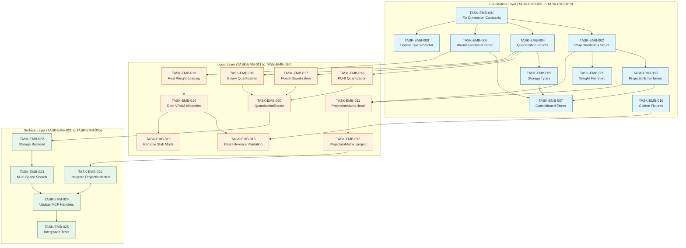

# Embedding Pipeline Task Dependency Graph Index

<task_index id="INDEX-EMB-001" version="1.0">

## Metadata

| Field | Value |
|-------|-------|
| **Document ID** | INDEX-EMB-001 |
| **Title** | Task Dependency Graph Index |
| **Version** | 1.0 |
| **Created** | 2026-01-06 |
| **Status** | Complete |
| **Total Tasks** | 25 |
| **Layers** | 3 (Foundation, Logic, Surface) |

---

## Task Dependency Graph



---

## Execution Order Table

### Phase 1: Foundation Layer

| Order | Task ID | Title | Dependencies | Complexity | Parallel Group |
|-------|---------|-------|--------------|------------|----------------|
| 1 | TASK-EMB-001 | Fix Dimension Constants | None | Low | A |
| 1 | TASK-EMB-010 | Create Golden Fixtures | None | Low | A |
| 2 | TASK-EMB-002 | Create ProjectionMatrix Struct | 001 | Medium | B |
| 2 | TASK-EMB-004 | Create Quantization Structs | 001 | Medium | B |
| 2 | TASK-EMB-006 | Create WarmLoadResult Struct | 001 | Medium | B |
| 2 | TASK-EMB-008 | Update SparseVector Struct | 001 | Low | B |
| 3 | TASK-EMB-003 | Create ProjectionError Enum | 002 | Low | C |
| 3 | TASK-EMB-005 | Create Storage Types | 004 | Medium | C |
| 3 | TASK-EMB-009 | Create Weight File Spec | 002 | Low | C |
| 4 | TASK-EMB-007 | Create Consolidated Errors | 003, 005, 006 | Medium | D |

### Phase 2: Logic Layer

| Order | Task ID | Title | Dependencies | Complexity | Parallel Group |
|-------|---------|-------|--------------|------------|----------------|
| 5 | TASK-EMB-011 | Implement ProjectionMatrix::load() | 002, 003 | High | E |
| 5 | TASK-EMB-013 | Implement Real Weight Loading | 006 | High | E |
| 5 | TASK-EMB-016 | Implement PQ-8 Quantization | 004 | High | E |
| 5 | TASK-EMB-017 | Implement Float8 Quantization | 004 | Medium | E |
| 5 | TASK-EMB-018 | Implement Binary Quantization | 004 | Low | E |
| 6 | TASK-EMB-012 | Implement ProjectionMatrix::project() | 011 | High | F |
| 6 | TASK-EMB-014 | Implement Real VRAM Allocation | 013 | High | F |
| 6 | TASK-EMB-020 | Implement QuantizationRouter | 016, 017, 018 | Medium | F |
| 7 | TASK-EMB-015 | Implement Real Inference Validation | 014, 010 | High | G |
| 7 | TASK-EMB-019 | Remove Stub Mode from Preflight | 014 | Low | G |

### Phase 3: Surface Layer

| Order | Task ID | Title | Dependencies | Complexity | Parallel Group |
|-------|---------|-------|--------------|------------|----------------|
| 8 | TASK-EMB-021 | Integrate ProjectionMatrix into SparseModel | 012 | Medium | H |
| 8 | TASK-EMB-022 | Implement Storage Backend | 020 | High | H |
| 9 | TASK-EMB-023 | Implement Multi-Space Search | 022 | High | I |
| 10 | TASK-EMB-024 | Update MCP Handlers | 021, 023 | Medium | J |
| 11 | TASK-EMB-025 | Integration Tests | All | High | K |

---

## Critical Path

The critical path (longest sequence of dependent tasks):

```
TASK-EMB-001 (Foundation)
    |
    v
TASK-EMB-002 (Foundation)
    |
    v
TASK-EMB-003 (Foundation)
    |
    v
TASK-EMB-011 (Logic)
    |
    v
TASK-EMB-012 (Logic)
    |
    v
TASK-EMB-021 (Surface)
    |
    v
TASK-EMB-024 (Surface)
    |
    v
TASK-EMB-025 (Surface)
```

**Critical Path Length:** 8 tasks

---

## Parallel Execution Groups

### Group A (No Dependencies - Start Immediately)
- TASK-EMB-001: Fix Dimension Constants
- TASK-EMB-010: Create Golden Reference Fixtures

### Group B (Depends on TASK-EMB-001)
- TASK-EMB-002: Create ProjectionMatrix Struct
- TASK-EMB-004: Create Quantization Structs
- TASK-EMB-006: Create WarmLoadResult Struct
- TASK-EMB-008: Update SparseVector Struct

### Group C (Mixed Dependencies)
- TASK-EMB-003: Create ProjectionError Enum (depends on 002)
- TASK-EMB-005: Create Storage Types (depends on 004)
- TASK-EMB-009: Create Weight File Spec (depends on 002)

### Group D (Consolidation)
- TASK-EMB-007: Create Consolidated Errors (depends on 003, 005, 006)

### Group E (Logic - Independent Tracks)
- TASK-EMB-011: ProjectionMatrix::load() (depends on 002, 003)
- TASK-EMB-013: Real Weight Loading (depends on 006)
- TASK-EMB-016: PQ-8 Quantization (depends on 004)
- TASK-EMB-017: Float8 Quantization (depends on 004)
- TASK-EMB-018: Binary Quantization (depends on 004)

### Group F (Logic - Second Wave)
- TASK-EMB-012: ProjectionMatrix::project() (depends on 011)
- TASK-EMB-014: Real VRAM Allocation (depends on 013)
- TASK-EMB-020: QuantizationRouter (depends on 016, 017, 018)

### Group G (Logic - Third Wave)
- TASK-EMB-015: Real Inference Validation (depends on 014, 010)
- TASK-EMB-019: Remove Stub Mode (depends on 014)

### Group H (Surface - Initial)
- TASK-EMB-021: Integrate ProjectionMatrix (depends on 012)
- TASK-EMB-022: Storage Backend (depends on 020)

### Group I (Surface - Search)
- TASK-EMB-023: Multi-Space Search (depends on 022)

### Group J (Surface - Handlers)
- TASK-EMB-024: Update MCP Handlers (depends on 021, 023)

### Group K (Surface - Final)
- TASK-EMB-025: Integration Tests (depends on all)

---

## Status Tracking Template

### Foundation Layer Status

| Task ID | Title | Status | Assignee | Start | Complete |
|---------|-------|--------|----------|-------|----------|
| TASK-EMB-001 | Fix Dimension Constants | [ ] Pending | - | - | - |
| TASK-EMB-002 | Create ProjectionMatrix Struct | [ ] Pending | - | - | - |
| TASK-EMB-003 | Create ProjectionError Enum | [ ] Pending | - | - | - |
| TASK-EMB-004 | Create Quantization Structs | [ ] Pending | - | - | - |
| TASK-EMB-005 | Create Storage Types | [ ] Pending | - | - | - |
| TASK-EMB-006 | Create WarmLoadResult Struct | [ ] Pending | - | - | - |
| TASK-EMB-007 | Create Consolidated Errors | [ ] Pending | - | - | - |
| TASK-EMB-008 | Update SparseVector Struct | [ ] Pending | - | - | - |
| TASK-EMB-009 | Create Weight File Spec | [ ] Pending | - | - | - |
| TASK-EMB-010 | Create Golden Reference Fixtures | [ ] Pending | - | - | - |

### Logic Layer Status

| Task ID | Title | Status | Assignee | Start | Complete |
|---------|-------|--------|----------|-------|----------|
| TASK-EMB-011 | Implement ProjectionMatrix::load() | [ ] Pending | - | - | - |
| TASK-EMB-012 | Implement ProjectionMatrix::project() | [ ] Pending | - | - | - |
| TASK-EMB-013 | Implement Real Weight Loading | [ ] Pending | - | - | - |
| TASK-EMB-014 | Implement Real VRAM Allocation | [ ] Pending | - | - | - |
| TASK-EMB-015 | Implement Real Inference Validation | [ ] Pending | - | - | - |
| TASK-EMB-016 | Implement PQ-8 Quantization | [ ] Pending | - | - | - |
| TASK-EMB-017 | Implement Float8 Quantization | [ ] Pending | - | - | - |
| TASK-EMB-018 | Implement Binary Quantization | [ ] Pending | - | - | - |
| TASK-EMB-019 | Remove Stub Mode from Preflight | [ ] Pending | - | - | - |
| TASK-EMB-020 | Implement QuantizationRouter | [ ] Pending | - | - | - |

### Surface Layer Status

| Task ID | Title | Status | Assignee | Start | Complete |
|---------|-------|--------|----------|-------|----------|
| TASK-EMB-021 | Integrate ProjectionMatrix into SparseModel | [ ] Pending | - | - | - |
| TASK-EMB-022 | Implement Storage Backend | [ ] Pending | - | - | - |
| TASK-EMB-023 | Implement Multi-Space Search | [ ] Pending | - | - | - |
| TASK-EMB-024 | Update MCP Handlers | [ ] Pending | - | - | - |
| TASK-EMB-025 | Integration Tests | [ ] Pending | - | - | - |

---

## Complexity Summary

| Complexity | Count | Tasks |
|------------|-------|-------|
| **Low** | 6 | 001, 003, 008, 009, 010, 018, 019 |
| **Medium** | 9 | 002, 004, 005, 006, 007, 017, 020, 021, 024 |
| **High** | 10 | 011, 012, 013, 014, 015, 016, 022, 023, 025 |

---

## Layer Summary

| Layer | Task Range | Count | Primary Focus |
|-------|------------|-------|---------------|
| **Foundation** | 001-010 | 10 | Data structures, types, constants |
| **Logic** | 011-020 | 10 | Business logic, algorithms, CUDA |
| **Surface** | 021-025 | 5 | API integration, handlers, tests |

---

## Document References

| Document | Description | Path |
|----------|-------------|------|
| SPEC-EMB-001 | Master Functional Specification | `SPEC-EMB-001-master-functional.md` |
| TECH-EMB-001 | Sparse Projection Tech Spec | `TECH-EMB-001-sparse-projection.md` |
| TECH-EMB-002 | Warm Loading Tech Spec | `TECH-EMB-002-warm-loading.md` |
| TECH-EMB-003 | Quantization Tech Spec | `TECH-EMB-003-quantization.md` |
| TECH-EMB-004 | Storage Module Tech Spec | `TECH-EMB-004-storage-module.md` |
| TASK-EMB-FOUNDATION | Foundation Layer Tasks | `TASK-EMB-FOUNDATION.md` |
| TASK-EMB-LOGIC | Logic Layer Tasks | `TASK-EMB-LOGIC.md` |
| TASK-EMB-SURFACE | Surface Layer Tasks | `TASK-EMB-SURFACE.md` |
| TRACEABILITY-MATRIX | Full Traceability | `TRACEABILITY-MATRIX.md` |
| TASK-INDEX | This Document | `TASK-INDEX.md` |

---

## Quick Reference

### Start Here (No Dependencies)
```
TASK-EMB-001: Fix Dimension Constants
TASK-EMB-010: Create Golden Reference Fixtures
```

### Blocked On Foundation
```
Logic Layer: All tasks blocked until Foundation complete
Surface Layer: All tasks blocked until Logic complete
```

### Final Deliverable
```
TASK-EMB-025: Integration Tests (depends on ALL other tasks)
```

---

## Memory Key

Store index reference:
```
contextgraph/embedding-issues/task-index-complete
```

</task_index>
