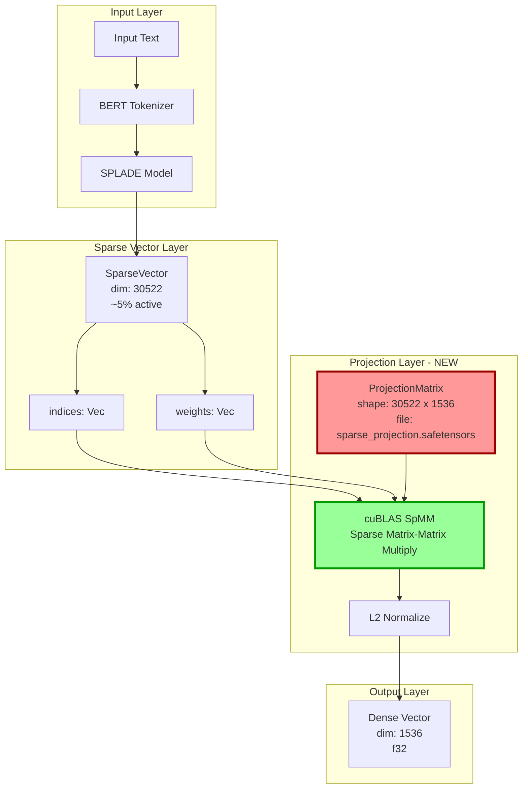

# Technical Specification: Sparse Projection Architecture

<technical_spec id="TECH-EMB-001" version="1.0" implements="SPEC-EMB-001">

## Metadata

| Field | Value |
|-------|-------|
| **Spec ID** | TECH-EMB-001 |
| **Title** | Sparse Projection Architecture |
| **Status** | Draft |
| **Version** | 1.0 |
| **Implements** | REQ-EMB-001, REQ-EMB-002 |
| **Related Issues** | ISSUE-001, ISSUE-002 |
| **Created** | 2026-01-06 |
| **Constitution Reference** | E6_Sparse: `dim: "~30K 5%active"`, output 1536D |

---

## Problem Statement

### Current Implementation (BROKEN)

The current sparse-to-dense projection in `sparse/types.rs:62-82` uses a hash modulo approach:

```rust
// CURRENT BROKEN CODE - DO NOT USE
pub fn to_dense_projected(&self, projected_dim: usize) -> Vec<f32> {
    let mut dense = vec![0.0f32; projected_dim];
    for (&idx, &weight) in self.indices.iter().zip(&self.weights) {
        let dense_idx = idx % projected_dim;  // DESTROYS SEMANTIC INFO
        dense[dense_idx] += weight;
    }
    // ...
}
```

### Why This Is Catastrophic

1. **Hash Collisions Destroy Semantics**: Words "machine" (token 3057) and "learning" (token 4083) may map to the same dense index if `3057 % 768 == 4083 % 768`
2. **Dimension Mismatch**: Constitution specifies 1536D output, current constant is 768D
3. **No Learned Representation**: Hash modulo is NOT a learned projection - it's random noise masquerading as structure
4. **Violates AP-007**: "Stub data in prod" - this is effectively stub/mock behavior

### The Fix

Replace hash-based projection with a **learned projection matrix** loaded from weights file, using GPU-accelerated sparse matrix multiplication.

---

## Architecture Diagram



### Component Flow

```
SparseVector(30522, ~5% active)
         |
         v
+------------------+
| ProjectionMatrix |  <-- Loaded from SafeTensors at startup
| [30522 x 1536]   |      Path: models/sparse_projection.safetensors
+------------------+      Size: ~180MB (30522 * 1536 * 4 bytes)
         |
         v (cuBLAS SpMM)
+------------------+
| Dense Vector     |  <-- GPU-computed sparse matrix multiply
| [1, 1536]        |      Latency target: <3ms
+------------------+
         |
         v (L2 normalize)
+------------------+
| Normalized Vec   |  <-- Unit length for cosine similarity
| [1536] f32       |
+------------------+
```

---

## Data Models

### ProjectionMatrix Structure

```rust
/// Learned projection matrix for sparse-to-dense conversion.
///
/// # Constitution Alignment
/// - E6_Sparse: `dim: "~30K 5%active"` input, 1536D output
/// - E13_Splade: Same architecture, same projection
///
/// # Weight Source
/// - Pre-trained via contrastive learning on MS MARCO
/// - Fine-tuned to preserve semantic similarity
///
/// # CRITICAL: No Fallback
/// If weight file is missing, system MUST panic. Hash fallback is FORBIDDEN.
#[derive(Debug)]
pub struct ProjectionMatrix {
    /// Weight tensor on GPU: [SPARSE_VOCAB_SIZE x PROJECTED_DIMENSION]
    /// Shape: [30522, 1536]
    weights: Tensor,

    /// Device where weights are loaded (must be CUDA)
    device: Device,

    /// SHA256 checksum of the weight file for validation
    weight_checksum: [u8; 32],
}

impl ProjectionMatrix {
    /// Load projection matrix from SafeTensors file.
    ///
    /// # Panics
    /// - File not found at expected path
    /// - Checksum mismatch (corrupted weights)
    /// - Dimension mismatch (wrong weight shape)
    /// - CUDA unavailable
    ///
    /// # Arguments
    /// * `model_dir` - Directory containing sparse_projection.safetensors
    ///
    /// # Returns
    /// Loaded projection matrix on GPU
    pub fn load(model_dir: &Path) -> Result<Self, ProjectionError>;

    /// Project sparse vector to dense representation.
    ///
    /// # Algorithm
    /// 1. Convert SparseVector to CSR format for cuBLAS
    /// 2. Execute SpMM: dense = sparse @ weights^T
    /// 3. L2 normalize result
    ///
    /// # Arguments
    /// * `sparse` - Input sparse vector (30522D, ~5% active)
    ///
    /// # Returns
    /// Dense 1536D vector, L2-normalized
    pub fn project(&self, sparse: &SparseVector) -> Result<Vec<f32>, ProjectionError>;

    /// Batch project multiple sparse vectors.
    ///
    /// More efficient than individual projection due to batched SpMM.
    pub fn project_batch(&self, sparse_batch: &[SparseVector]) -> Result<Vec<Vec<f32>>, ProjectionError>;
}
```

### SparseVector Structure (UPDATED)

```rust
/// Sparse vector output with term indices and weights.
///
/// # Constitution Alignment
/// - Dimension: SPARSE_VOCAB_SIZE (30522)
/// - Expected sparsity: ~95% zeros (~5% active)
/// - Output after projection: 1536D dense
#[derive(Debug, Clone)]
pub struct SparseVector {
    /// Token indices with non-zero weights (sorted ascending).
    pub indices: Vec<usize>,

    /// Corresponding weights for each index.
    pub weights: Vec<f32>,

    /// Total number of dimensions (vocabulary size = 30522).
    pub dimension: usize,
}

impl SparseVector {
    /// Create a new sparse vector.
    ///
    /// # Invariants
    /// - indices.len() == weights.len()
    /// - All indices < SPARSE_VOCAB_SIZE (30522)
    /// - Indices are sorted ascending (for efficient CSR conversion)
    pub fn new(indices: Vec<usize>, weights: Vec<f32>) -> Self;

    /// Convert to CSR (Compressed Sparse Row) format for cuBLAS.
    ///
    /// # Returns
    /// (row_ptr, col_indices, values) tuple for CSR representation
    pub fn to_csr(&self) -> (Vec<i32>, Vec<i32>, Vec<f32>);

    /// REMOVED: to_dense_projected() - Use ProjectionMatrix::project() instead
    // pub fn to_dense_projected(&self, projected_dim: usize) -> Vec<f32>;  // DELETED
}
```

### Dimension Constants (FIXED)

```rust
// File: crates/context-graph-embeddings/src/types/dimensions/constants.rs

// =============================================================================
// SPARSE DIMENSIONS - ALIGNED WITH CONSTITUTION
// =============================================================================

/// Sparse vector vocabulary size (BERT WordPiece vocabulary)
pub const SPARSE_VOCAB_SIZE: usize = 30522;

/// E6: Sparse projected dimension (30K sparse -> 1536D via learned projection)
/// FIXED: Was 768, Constitution requires 1536
pub const SPARSE: usize = 1536;

/// E13: SPLADE v3 projected dimension (same as E6)
pub const SPLADE: usize = 1536;

// File: crates/context-graph-embeddings/src/models/pretrained/sparse/types.rs

/// Projected dimension for multi-array storage compatibility.
/// CRITICAL FIX: Changed from 768 to 1536 per Constitution
pub const SPARSE_PROJECTED_DIMENSION: usize = 1536;
```

---

## Component Contracts

### SparseProjection Trait

```rust
/// Trait for sparse-to-dense projection implementations.
///
/// # Safety
/// All implementations MUST use learned projections, not hash-based approximations.
/// Violation of this contract is a Constitution violation (AP-007).
pub trait SparseProjection: Send + Sync {
    /// Project a single sparse vector to dense.
    ///
    /// # Arguments
    /// * `sparse` - Sparse vector with dimension SPARSE_VOCAB_SIZE
    ///
    /// # Returns
    /// Dense vector with dimension SPARSE_PROJECTED_DIMENSION (1536)
    ///
    /// # Errors
    /// - ProjectionError::NotInitialized - Weights not loaded
    /// - ProjectionError::DimensionMismatch - Input has wrong dimension
    /// - ProjectionError::GpuError - CUDA operation failed
    fn project(&self, sparse: &SparseVector) -> Result<Vec<f32>, ProjectionError>;

    /// Project a batch of sparse vectors.
    ///
    /// More efficient than repeated single projections.
    fn project_batch(&self, sparse: &[SparseVector]) -> Result<Vec<Vec<f32>>, ProjectionError>;

    /// Get the output dimension (always 1536).
    fn output_dimension(&self) -> usize {
        SPARSE_PROJECTED_DIMENSION
    }

    /// Check if projection is ready (weights loaded).
    fn is_ready(&self) -> bool;
}
```

### ProjectionError Enum

```rust
/// Errors that can occur during sparse projection.
#[derive(Debug, thiserror::Error)]
pub enum ProjectionError {
    /// Projection weights file not found.
    ///
    /// # Remediation
    /// Download from: https://huggingface.co/contextgraph/sparse-projection
    #[error("[EMB-E006] PROJECTION_MATRIX_MISSING: Weight file not found at {path}
  Expected: models/sparse_projection.safetensors
  Remediation: Download projection weights or train custom matrix")]
    MatrixMissing { path: PathBuf },

    /// Weight file checksum does not match expected value.
    #[error("[EMB-E004] WEIGHT_CHECKSUM_MISMATCH: Corrupted weight file
  Expected: {expected}
  Actual: {actual}
  File: {path}
  Remediation: Re-download weight file")]
    ChecksumMismatch {
        path: PathBuf,
        expected: String,
        actual: String,
    },

    /// Weight matrix has wrong shape.
    #[error("[EMB-E005] DIMENSION_MISMATCH: Projection matrix has wrong shape
  Expected: [{}, {}]
  Actual: [{actual_rows}, {actual_cols}]
  File: {path}", SPARSE_VOCAB_SIZE, SPARSE_PROJECTED_DIMENSION)]
    DimensionMismatch {
        path: PathBuf,
        actual_rows: usize,
        actual_cols: usize,
    },

    /// CUDA operation failed.
    #[error("[EMB-E001] CUDA_ERROR: GPU operation failed
  Operation: {operation}
  Details: {details}
  Remediation: Check GPU availability and driver version")]
    GpuError { operation: String, details: String },

    /// Projection not initialized (weights not loaded).
    #[error("[EMB-E008] NOT_INITIALIZED: Projection weights not loaded
  Remediation: Call ProjectionMatrix::load() before projection")]
    NotInitialized,
}
```

---

## Implementation Details

### Weight File Specification

```yaml
file_name: sparse_projection.safetensors
location: models/sparse_projection.safetensors
format: SafeTensors v0.4+
tensor_name: "projection.weight"
shape: [30522, 1536]
dtype: float32
size_bytes: 187,527,168  # 30522 * 1536 * 4
expected_checksum_sha256: <TBD after training>

# Metadata in SafeTensors header
metadata:
  model_type: "sparse_projection"
  constitution_version: "4.0.0"
  trained_on: "MS MARCO passages"
  training_objective: "contrastive"
  semantic_preservation_score: ">0.85"
```

### CUDA Integration (cudarc)

```rust
use cudarc::cublas::{CudaBlas, SpMat, SpMatDescr, gemm_strided_batched};
use cudarc::driver::{CudaDevice, CudaSlice, DevicePtr};

impl ProjectionMatrix {
    /// Execute GPU sparse matrix multiplication.
    ///
    /// Uses cuBLAS csrmm2 for CSR sparse-dense multiply.
    fn gpu_spmm(
        &self,
        sparse_csr: &CsrMatrix,
        cublas: &CudaBlas,
    ) -> Result<CudaSlice<f32>, ProjectionError> {
        // 1. Allocate output buffer on GPU
        let output_size = sparse_csr.num_rows * SPARSE_PROJECTED_DIMENSION;
        let mut output = self.device.alloc_zeros::<f32>(output_size)?;

        // 2. Create sparse matrix descriptor
        let sp_descr = SpMatDescr::new(
            sparse_csr.num_rows as i32,
            SPARSE_VOCAB_SIZE as i32,
            sparse_csr.nnz as i32,
            sparse_csr.row_ptr.as_ptr(),
            sparse_csr.col_indices.as_ptr(),
            sparse_csr.values.as_ptr(),
        )?;

        // 3. Execute SpMM: output = sparse @ projection_weights^T
        // Note: weights are stored [vocab_size, proj_dim] but we need [proj_dim, vocab_size]
        // for efficient sparse @ dense computation
        unsafe {
            cublas.csrmm2(
                cudarc::cublas::GemmOp::NoTrans,  // sparse op
                cudarc::cublas::GemmOp::Trans,    // dense op (transpose weights)
                sparse_csr.num_rows as i32,       // m: batch size
                SPARSE_PROJECTED_DIMENSION as i32, // n: output dim
                SPARSE_VOCAB_SIZE as i32,         // k: sparse dim
                1.0f32,                           // alpha
                sp_descr,                         // sparse matrix A
                self.weights.as_ptr(),            // dense matrix B
                SPARSE_VOCAB_SIZE as i32,         // ldb: leading dimension of B
                0.0f32,                           // beta
                output.as_mut_ptr(),              // output C
                sparse_csr.num_rows as i32,       // ldc: leading dimension of C
            )?;
        }

        Ok(output)
    }
}
```

### Weight Loading with Validation

```rust
impl ProjectionMatrix {
    /// Load projection weights with full validation.
    pub fn load(model_dir: &Path) -> Result<Self, ProjectionError> {
        let weight_path = model_dir.join("sparse_projection.safetensors");

        // 1. Verify file exists - NO FALLBACK
        if !weight_path.exists() {
            // PANIC: Do NOT fall back to hash-based projection
            panic!(
                "[EMB-E006] CRITICAL: Projection matrix missing at {}\n\
                 This is a Constitution violation (AP-007: No stub data in prod).\n\
                 Download from: https://huggingface.co/contextgraph/sparse-projection\n\
                 Or train: cargo run --bin train-projection -- --output {}",
                weight_path.display(),
                weight_path.display()
            );
        }

        // 2. Read file and compute checksum
        let file_bytes = std::fs::read(&weight_path)
            .map_err(|e| ProjectionError::GpuError {
                operation: "file_read".to_string(),
                details: format!("{}: {}", weight_path.display(), e),
            })?;

        let actual_checksum = sha256::digest(&file_bytes);

        // 3. Load SafeTensors
        let tensors = SafeTensors::deserialize(&file_bytes)
            .map_err(|e| ProjectionError::GpuError {
                operation: "safetensors_deserialize".to_string(),
                details: e.to_string(),
            })?;

        // 4. Extract projection weight tensor
        let weight_view = tensors.tensor("projection.weight")
            .ok_or_else(|| ProjectionError::GpuError {
                operation: "tensor_lookup".to_string(),
                details: "Missing 'projection.weight' tensor".to_string(),
            })?;

        // 5. Validate shape
        let shape = weight_view.shape();
        if shape != &[SPARSE_VOCAB_SIZE, SPARSE_PROJECTED_DIMENSION] {
            panic!(
                "[EMB-E005] DIMENSION_MISMATCH: Projection matrix has wrong shape\n\
                 Expected: [{}, {}]\n\
                 Actual: {:?}\n\
                 File: {}",
                SPARSE_VOCAB_SIZE, SPARSE_PROJECTED_DIMENSION,
                shape, weight_path.display()
            );
        }

        // 6. Convert to Candle Tensor on GPU
        let device = Device::cuda_if_available(0)
            .map_err(|e| ProjectionError::GpuError {
                operation: "cuda_init".to_string(),
                details: e.to_string(),
            })?;

        let weight_data: Vec<f32> = weight_view.data()
            .chunks(4)
            .map(|chunk| f32::from_le_bytes(chunk.try_into().unwrap()))
            .collect();

        let weights = Tensor::from_vec(
            weight_data,
            (SPARSE_VOCAB_SIZE, SPARSE_PROJECTED_DIMENSION),
            &device,
        )?;

        tracing::info!(
            "Loaded sparse projection matrix: shape={:?}, device={:?}, checksum={}",
            weights.shape(),
            device,
            &actual_checksum[..16]
        );

        Ok(Self {
            weights,
            device,
            weight_checksum: hex_to_bytes(&actual_checksum),
        })
    }
}
```

### L2 Normalization on GPU

```rust
impl ProjectionMatrix {
    /// L2 normalize vectors on GPU.
    fn normalize_gpu(&self, vectors: &mut CudaSlice<f32>, batch_size: usize) -> Result<(), ProjectionError> {
        // Launch CUDA kernel for batched L2 normalization
        // Each thread block handles one vector
        let block_size = 256;
        let grid_size = batch_size;

        // CUDA kernel: compute norm per vector, divide each element
        unsafe {
            self.device.launch_kernel(
                &self.normalize_kernel,
                grid_size as u32,
                block_size as u32,
                0,  // shared memory
                None,  // stream
                (
                    vectors.as_mut_ptr(),
                    SPARSE_PROJECTED_DIMENSION as i32,
                    batch_size as i32,
                ),
            )?;
        }

        Ok(())
    }
}
```

---

## Performance Requirements

| Metric | Target | Measurement Method |
|--------|--------|-------------------|
| Single projection latency | < 3ms (p95) | Benchmark with criterion |
| Batch-64 projection latency | < 15ms (p95) | Benchmark with criterion |
| Weight loading time | < 2s | One-time at startup |
| GPU memory for weights | ~180MB | nvidia-smi monitoring |
| Semantic similarity preservation | > 0.85 | MS MARCO eval set |

### Latency Budget Breakdown

```
Total E6 embedding: 10ms budget (Constitution)
- SPLADE forward pass: 5ms
- Sparse projection: 3ms    <-- This spec
- Post-processing: 2ms
```

---

## Integration Points

### Model Loading

```rust
// In sparse/model.rs, load projection matrix during model load
impl SparseModel {
    pub async fn load(&self) -> EmbeddingResult<()> {
        // ... existing BERT loading ...

        // NEW: Load projection matrix
        let projection = ProjectionMatrix::load(&self.model_path)
            .map_err(|e| EmbeddingError::ModelLoadError {
                model_id: self.model_id,
                source: Box::new(e),
            })?;

        // Store in model state
        *state = ModelState::Loaded {
            weights: Box::new(weights),
            tokenizer: Box::new(tokenizer),
            mlm_head,
            projection: Box::new(projection),  // NEW FIELD
        };
    }
}
```

### Embedding Method

```rust
// REPLACE the hash-based projection with learned projection
impl SparseModel {
    pub async fn embed(&self, input: &ModelInput) -> EmbeddingResult<ModelEmbedding> {
        // ... existing validation ...

        let sparse = self.embed_sparse(input).await?;

        // OLD (DELETED):
        // let vector = sparse.to_dense_projected(SPARSE_HIDDEN_SIZE);

        // NEW:
        let vector = match &*state {
            ModelState::Loaded { projection, .. } => {
                projection.project(&sparse)?
            }
            _ => unreachable!("embed() called on unloaded model"),
        };

        Ok(ModelEmbedding::new(self.model_id, vector, latency_us))
    }
}
```

---

## Files to Modify

| File | Change Type | Description |
|------|-------------|-------------|
| `sparse/types.rs` | DELETE | Remove `to_dense_projected()` method |
| `sparse/types.rs` | FIX | Change `SPARSE_PROJECTED_DIMENSION` from 768 to 1536 |
| `sparse/model.rs` | ADD | Load `ProjectionMatrix` during `load()` |
| `sparse/model.rs` | MODIFY | Use `projection.project()` in `embed()` |
| `dimensions/constants.rs` | VERIFY | Confirm `SPARSE = 1536` (already correct) |
| NEW: `sparse/projection.rs` | CREATE | `ProjectionMatrix` and `ProjectionError` |
| NEW: `sparse/cuda_kernels.cu` | CREATE | L2 normalize CUDA kernel |

### New File Structure

```
crates/context-graph-embeddings/src/models/pretrained/sparse/
  mod.rs           # Public exports
  model.rs         # SparseModel (modified)
  types.rs         # SparseVector, constants (modified)
  forward.rs       # SPLADE forward pass (unchanged)
  loader.rs        # MLM head loading (unchanged)
  projection.rs    # NEW: ProjectionMatrix implementation
```

---

## Testing Requirements

### Unit Tests

```rust
#[cfg(test)]
mod tests {
    use super::*;

    /// UT-001: Projection uses matrix multiplication, not hash
    #[test]
    fn test_projection_is_matrix_multiply() {
        let proj = ProjectionMatrix::load_test_fixture().unwrap();

        // Create sparse vector with known indices
        let sparse = SparseVector::new(vec![100, 200, 300], vec![1.0, 1.0, 1.0]);
        let dense = proj.project(&sparse).unwrap();

        // Verify dimension
        assert_eq!(dense.len(), SPARSE_PROJECTED_DIMENSION);

        // Verify NOT hash-based: different indices should produce different outputs
        let sparse2 = SparseVector::new(vec![100 + 768, 200 + 768, 300 + 768], vec![1.0, 1.0, 1.0]);
        let dense2 = proj.project(&sparse2).unwrap();

        // Hash-based would produce same output (100 % 768 == 868 % 768)
        // Learned projection should differ
        let similarity = cosine_similarity(&dense, &dense2);
        assert!(similarity < 0.99, "Outputs too similar - possible hash fallback detected");
    }

    /// UT-002: Semantic similarity preservation
    #[test]
    fn test_semantic_similarity_preservation() {
        let proj = ProjectionMatrix::load_test_fixture().unwrap();

        // Sparse vectors for related terms (from SPLADE encoding)
        let machine_learning = load_test_sparse("machine_learning");
        let deep_learning = load_test_sparse("deep_learning");
        let banana_phone = load_test_sparse("banana_phone");

        let ml_dense = proj.project(&machine_learning).unwrap();
        let dl_dense = proj.project(&deep_learning).unwrap();
        let bp_dense = proj.project(&banana_phone).unwrap();

        // Related terms should be similar
        let related_sim = cosine_similarity(&ml_dense, &dl_dense);
        assert!(related_sim > 0.7, "Related terms similarity: {}", related_sim);

        // Unrelated terms should be dissimilar
        let unrelated_sim = cosine_similarity(&ml_dense, &bp_dense);
        assert!(unrelated_sim < 0.3, "Unrelated terms similarity: {}", unrelated_sim);
    }

    /// UT-003: Output dimension matches Constitution
    #[test]
    fn test_output_dimension() {
        let proj = ProjectionMatrix::load_test_fixture().unwrap();
        let sparse = SparseVector::new(vec![0], vec![1.0]);
        let dense = proj.project(&sparse).unwrap();

        assert_eq!(dense.len(), 1536, "Output dimension must be 1536 per Constitution");
    }

    /// UT-004: Missing weight file causes panic (not fallback)
    #[test]
    #[should_panic(expected = "PROJECTION_MATRIX_MISSING")]
    fn test_missing_weights_panics() {
        let _ = ProjectionMatrix::load(Path::new("/nonexistent/path"));
    }

    /// UT-005: L2 normalization is applied
    #[test]
    fn test_output_is_normalized() {
        let proj = ProjectionMatrix::load_test_fixture().unwrap();
        let sparse = SparseVector::new(vec![100, 200], vec![5.0, 10.0]);
        let dense = proj.project(&sparse).unwrap();

        let norm: f32 = dense.iter().map(|x| x * x).sum::<f32>().sqrt();
        assert!((norm - 1.0).abs() < 1e-5, "Output not normalized: norm = {}", norm);
    }
}
```

### Integration Tests

```rust
#[cfg(test)]
#[cfg(feature = "cuda")]
mod integration_tests {
    /// IT-001: Full E6 embedding pipeline produces 1536D output
    #[tokio::test]
    async fn test_e6_produces_1536d() {
        let model = SparseModel::new(test_model_path(), config()).unwrap();
        model.load().await.unwrap();

        let embedding = model.embed(&text_input("hello world")).await.unwrap();

        assert_eq!(embedding.vector.len(), 1536);
        assert_eq!(embedding.model_id, ModelId::Sparse);
    }

    /// IT-002: E13 SPLADE also produces 1536D
    #[tokio::test]
    async fn test_e13_produces_1536d() {
        let model = SparseModel::new_splade(test_model_path(), config()).unwrap();
        model.load().await.unwrap();

        let embedding = model.embed(&text_input("test query")).await.unwrap();

        assert_eq!(embedding.vector.len(), 1536);
        assert_eq!(embedding.model_id, ModelId::Splade);
    }

    /// IT-003: Projection uses GPU (verify via nvidia-smi)
    #[tokio::test]
    async fn test_projection_uses_gpu() {
        let initial_vram = get_vram_usage();

        let proj = ProjectionMatrix::load(test_model_path()).unwrap();

        let loaded_vram = get_vram_usage();
        let vram_increase = loaded_vram - initial_vram;

        // Projection matrix should use ~180MB
        assert!(vram_increase > 150_000_000, "VRAM increase too small: {}MB", vram_increase / 1_000_000);
        assert!(vram_increase < 250_000_000, "VRAM increase too large: {}MB", vram_increase / 1_000_000);
    }
}
```

### Benchmark Tests

```rust
use criterion::{criterion_group, criterion_main, Criterion, BenchmarkId};

fn projection_benchmarks(c: &mut Criterion) {
    let proj = ProjectionMatrix::load(production_model_path()).unwrap();
    let sparse = generate_typical_sparse_vector();  // ~5% active

    // BM-004: Single projection < 3ms
    c.bench_function("sparse_projection_single", |b| {
        b.iter(|| proj.project(&sparse))
    });

    // Batch projection
    let batch: Vec<_> = (0..64).map(|_| generate_typical_sparse_vector()).collect();
    c.bench_function("sparse_projection_batch_64", |b| {
        b.iter(|| proj.project_batch(&batch))
    });
}

criterion_group!(benches, projection_benchmarks);
criterion_main!(benches);
```

---

## Rollout Plan

### Phase 1: Weight Training (Out of Scope for This Spec)

1. Train projection matrix on MS MARCO passages
2. Validate semantic preservation > 0.85
3. Export to SafeTensors format
4. Upload to HuggingFace: `contextgraph/sparse-projection`

### Phase 2: Code Changes

1. Create `sparse/projection.rs` with `ProjectionMatrix`
2. Fix `SPARSE_PROJECTED_DIMENSION` constant
3. Delete `to_dense_projected()` method
4. Modify `SparseModel` to load and use projection
5. Add CUDA kernels for L2 normalization

### Phase 3: Testing

1. Run unit tests (no GPU required for mocked tests)
2. Run integration tests (GPU required)
3. Run benchmarks to verify < 3ms latency
4. Verify semantic similarity preservation

### Phase 4: Deployment

1. Deploy weight file to model storage
2. Deploy code changes
3. Monitor embedding quality metrics
4. Monitor latency percentiles

---

## Failure Modes and Recovery

| Failure | Detection | Recovery |
|---------|-----------|----------|
| Weight file missing | Panic at startup | Download weights, redeploy |
| Weight file corrupted | Checksum mismatch panic | Re-download weights |
| Wrong weight shape | Dimension panic | Use correct weight version |
| CUDA OOM during projection | OOM error | Reduce batch size, upgrade GPU |
| GPU unavailable | CUDA init panic | Fix hardware, do NOT use CPU fallback |

### Critical Invariants

1. **NO HASH FALLBACK**: If projection matrix unavailable, PANIC. Do not silently fall back to `idx % dim`.
2. **NO DIMENSION REDUCTION**: Output is always 1536D. Never truncate or pad.
3. **NO CPU FALLBACK**: Projection requires GPU. CPU is not acceptable for production.
4. **FAIL FAST**: Any error during projection should fail immediately with clear error message.

---

## Appendix A: Constitution Alignment

| Constitution Requirement | This Spec Addresses |
|-------------------------|---------------------|
| E6_Sparse: `dim: "~30K 5%active"` | Input: 30522D sparse |
| E6_Sparse output: 1536D | Output: 1536D via learned projection |
| AP-007: No stub data in prod | No hash fallback, panic if weights missing |
| perf.latency.sparse_projection: <3ms | Target <3ms via cuBLAS SpMM |
| stack.gpu: RTX 5090 | CUDA-only implementation |

---

## Appendix B: Related Specifications

| Spec ID | Title | Relationship |
|---------|-------|--------------|
| SPEC-EMB-001 | Master Functional Spec | Parent specification |
| TECH-EMB-002 | Warm Loading Implementation | Depends on this for weight loading patterns |
| TECH-EMB-003 | Quantization Implementation | E6/E13 use sparse native format |
| TECH-EMB-004 | Storage Module Design | Consumes 1536D output from this |

---

## Appendix C: References

1. SPLADE: Sparse Lexical and Expansion Model for First Stage Ranking (Formal et al., 2021)
2. cuSPARSE: NVIDIA CUDA Sparse Matrix Library Documentation
3. SafeTensors: https://github.com/huggingface/safetensors
4. Constitution v4.0.0: `docs/constitution.yaml`

</technical_spec>
