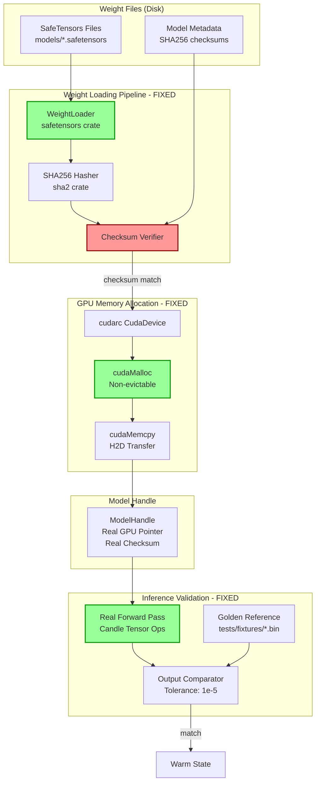

# Technical Specification: Warm Loading Implementation

<technical_spec id="TECH-EMB-002" version="1.0" implements="SPEC-EMB-001">

## Metadata

| Field | Value |
|-------|-------|
| **Spec ID** | TECH-EMB-002 |
| **Title** | Warm Loading Implementation |
| **Status** | Draft |
| **Version** | 1.0 |
| **Implements** | REQ-EMB-003, REQ-EMB-004 |
| **Related Issues** | ISSUE-003 (Simulated Warm Loading), ISSUE-004 (Stub Mode in Preflight) |
| **Created** | 2026-01-06 |
| **Constitution Reference** | stack.gpu: RTX 5090, 32GB VRAM, CUDA 13.1; AP-007: No stub data in prod |

---

## Problem Statement

### ISSUE-003: Simulated Warm Loading (CRITICAL)

The current implementation in `warm/loader/operations.rs` uses **simulated/fake** data instead of real GPU operations:

```rust
// CURRENT BROKEN CODE - operations.rs:143-165
pub fn simulate_weight_loading(model_id: &str, _size_bytes: usize) -> WarmResult<u64> {
    // Generate a deterministic checksum based on model ID
    let mut checksum = 0u64;
    for (i, byte) in model_id.bytes().enumerate() {
        checksum ^= (byte as u64) << ((i % 8) * 8);
    }
    checksum ^= 0xDEAD_BEEF_CAFE_BABEu64;  // FAKE CHECKSUM!

    tracing::debug!(
        "Simulated weight loading for {} (checksum: 0x{:016x})",
        model_id,
        checksum
    );

    Ok(checksum)
}
```

```rust
// CURRENT BROKEN CODE - operations.rs:106-141
pub fn allocate_model_vram(
    model_id: &str,
    size_bytes: usize,
    memory_pools: &mut WarmMemoryPools,
) -> WarmResult<u64> {
    // ...
    // Generate a simulated VRAM pointer
    // In a real implementation, this would come from cudaMalloc
    let base_ptr = 0x7f80_0000_0000u64;  // FAKE POINTER!
    let offset = memory_pools.list_model_allocations().len() as u64 * 0x1_0000_0000;
    let vram_ptr = base_ptr + offset;
    // ...
}
```

```rust
// CURRENT BROKEN CODE - operations.rs:185-187
// Simulate test inference output
let output: Vec<f32> = (0..expected_dimension)
    .map(|i| (i as f32 * 0.001).sin())  // FAKE SIN WAVE OUTPUT!
    .collect();
```

### ISSUE-004: Stub Mode in Preflight

The preflight checks return **fake hardware information** when CUDA is not enabled:

```rust
// CURRENT BROKEN CODE - preflight.rs:30-43
#[cfg(not(feature = "cuda"))]
{
    tracing::warn!("CUDA feature not enabled, running in stub mode");
    // In stub mode, we simulate successful checks for testing
    *gpu_info = Some(GpuInfo::new(
        0,
        "Simulated RTX 5090".to_string(),  // FAKE GPU NAME!
        (REQUIRED_COMPUTE_MAJOR, REQUIRED_COMPUTE_MINOR),
        MINIMUM_VRAM_BYTES,  // FAKE 32GB VRAM!
        "Simulated".to_string(),
    ));
    Ok(())
}
```

### Why This Is Critical

1. **Silent Failures**: Fake checksums mask corrupted weight files
2. **No Real Validation**: Fake inference output (sin wave) passes all validations
3. **Fake VRAM Pointers**: `0x7f80_0000_0000` is NOT a real GPU address
4. **Constitution Violation**: AP-007 states "Stub data in prod -> use tests/fixtures/"
5. **Production Risk**: System appears healthy but produces garbage embeddings

### The Fix

1. **DELETE** all `simulate_*` functions entirely
2. **USE** SafeTensors crate for actual weight loading
3. **USE** cudarc crate for real CUDA memory allocation
4. **COMPUTE** real SHA256 checksums of weight files
5. **RUN** real inference with golden reference validation
6. **PANIC** if no GPU - do NOT return fake hardware info

---

## Architecture Diagram



### Component Flow

```
Weight File (SafeTensors)
         |
         v (read file bytes)
+------------------+
| SHA256 Checksum  |  <-- Computed from file bytes
| (Real, not fake) |      Verified against registry
+------------------+
         |
         v (safetensors::SafeTensors::deserialize)
+------------------+
| Tensor Data      |  <-- Extracted weight tensors
| [f32/f16/bf16]   |      Validated for NaN/Inf
+------------------+
         |
         v (cudarc::driver::CudaDevice::htod_copy)
+------------------+
| GPU Memory       |  <-- Real cudaMalloc allocation
| (Real pointer)   |      Non-evictable VRAM
+------------------+
         |
         v (candle forward pass)
+------------------+
| Inference Output |  <-- Real model inference
| [embedding_dim]  |      Not sin wave!
+------------------+
         |
         v (compare to golden reference)
+------------------+
| Validation       |  <-- Golden outputs from tests/fixtures/
| (Real comparison)|      Tolerance: 1e-5
+------------------+
```

---

## Data Models

### WarmLoadResult Structure (NEW)

```rust
/// Result of loading a model's weights into GPU memory.
///
/// # Constitution Alignment
/// - REQ-WARM-003: Non-evictable VRAM allocation
/// - REQ-WARM-005: Weight integrity verification
///
/// # CRITICAL: No Simulation
/// All fields contain REAL data from actual loading operations.
/// There are NO fake values, NO simulated pointers, NO stub checksums.
#[derive(Debug)]
pub struct WarmLoadResult {
    /// Real GPU device pointer from cudaMalloc.
    /// This is a VALID pointer, not a fake address.
    pub gpu_ptr: DevicePtr<f32>,

    /// Real SHA256 checksum of the weight file.
    /// Computed from actual file bytes, not from model ID hash.
    pub checksum: [u8; 32],

    /// Actual size of weights in GPU memory.
    pub size_bytes: usize,

    /// Loading duration for performance monitoring.
    pub load_duration: Duration,

    /// Tensor metadata from SafeTensors header.
    pub tensor_metadata: TensorMetadata,
}

/// Metadata extracted from SafeTensors file header.
#[derive(Debug, Clone)]
pub struct TensorMetadata {
    /// Tensor name -> shape mapping.
    pub shapes: HashMap<String, Vec<usize>>,

    /// Data type of tensors (F32, F16, BF16).
    pub dtype: DType,

    /// Total number of parameters.
    pub total_params: usize,
}
```

### GpuTensor Structure (NEW)

```rust
/// GPU-resident tensor with real CUDA allocation.
///
/// # Safety
/// The `device_ptr` is a REAL CUDA device pointer obtained from cudaMalloc.
/// It is ONLY valid while the CUDA context is active.
///
/// # CRITICAL: No Simulation
/// This struct MUST contain a real GPU pointer. Simulated pointers are FORBIDDEN.
#[derive(Debug)]
pub struct GpuTensor {
    /// Real CUDA device pointer from cudaMalloc.
    device_ptr: DevicePtr<f32>,

    /// Tensor shape (e.g., [vocab_size, hidden_dim]).
    shape: Vec<usize>,

    /// Total number of elements.
    numel: usize,

    /// CUDA device ID where tensor is allocated.
    device_id: u32,
}

impl GpuTensor {
    /// Create new GPU tensor via cudaMalloc.
    ///
    /// # Panics
    /// - CUDA unavailable
    /// - cudaMalloc fails (OOM)
    ///
    /// # Arguments
    /// * `device` - CUDA device for allocation
    /// * `shape` - Tensor shape
    ///
    /// # Returns
    /// Allocated GPU tensor with uninitialized memory.
    pub fn alloc(device: &CudaDevice, shape: &[usize]) -> CudaResult<Self>;

    /// Copy data from host to GPU.
    ///
    /// # Arguments
    /// * `data` - Host data to copy
    ///
    /// # Panics
    /// - Data length doesn't match tensor shape
    pub fn copy_from_host(&mut self, data: &[f32]) -> CudaResult<()>;

    /// Get the raw device pointer. Only valid in CUDA context.
    pub fn as_device_ptr(&self) -> DevicePtr<f32>;
}
```

### LoadedModelWeights Structure (NEW)

```rust
/// Complete set of weights for a model loaded into GPU memory.
///
/// Contains all tensors needed for inference, validated and ready to use.
///
/// # Constitution Alignment
/// - Each model has specific expected tensors
/// - All weights validated for NaN/Inf before loading
/// - Checksums verified against registry
#[derive(Debug)]
pub struct LoadedModelWeights {
    /// Model identifier (e.g., "E1_Semantic").
    pub model_id: String,

    /// Named tensors loaded to GPU.
    /// Keys match SafeTensors tensor names.
    pub tensors: HashMap<String, GpuTensor>,

    /// SHA256 checksum of source weight file.
    pub file_checksum: [u8; 32],

    /// Total GPU memory used (bytes).
    pub total_gpu_bytes: usize,

    /// CUDA device where weights are loaded.
    pub device_id: u32,

    /// Timestamp when weights were loaded.
    pub loaded_at: Instant,
}

impl LoadedModelWeights {
    /// Load weights from SafeTensors file.
    ///
    /// # Steps
    /// 1. Read file and compute SHA256 checksum
    /// 2. Verify checksum against expected value
    /// 3. Parse SafeTensors format
    /// 4. Validate all tensors for NaN/Inf
    /// 5. Allocate GPU memory via cudaMalloc
    /// 6. Copy tensors to GPU
    ///
    /// # Panics
    /// - File not found
    /// - Checksum mismatch
    /// - CUDA unavailable
    /// - GPU OOM
    /// - NaN/Inf in weights
    pub fn load(
        model_id: &str,
        weight_path: &Path,
        expected_checksum: &[u8; 32],
        device: &CudaDevice,
    ) -> WarmResult<Self>;

    /// Get a specific tensor by name.
    pub fn get_tensor(&self, name: &str) -> Option<&GpuTensor>;
}
```

---

## Component Contracts

### WeightLoader Trait (NEW)

```rust
/// Trait for loading model weights from disk to GPU.
///
/// # Safety Invariants
/// All implementations MUST:
/// 1. Compute REAL checksums (not fake hashes from model ID)
/// 2. Use REAL cudaMalloc (not simulated pointers)
/// 3. Validate weights for NaN/Inf before GPU copy
/// 4. PANIC if any validation fails
///
/// # Constitution Alignment
/// AP-007: "Stub data in prod -> use tests/fixtures/"
/// There are NO fallbacks, NO simulations, NO stubs.
pub trait WeightLoader: Send + Sync {
    /// Load weights from SafeTensors file to GPU.
    ///
    /// # Arguments
    /// * `model_id` - Model identifier for registry lookup
    /// * `weight_path` - Path to SafeTensors file
    /// * `device` - CUDA device for allocation
    ///
    /// # Returns
    /// Loaded weights on GPU with validated checksum.
    ///
    /// # Panics
    /// - File not found at `weight_path`
    /// - Checksum mismatch (corrupted file)
    /// - NaN/Inf in weight values
    /// - CUDA unavailable
    /// - GPU out of memory
    fn load_weights(
        &self,
        model_id: &str,
        weight_path: &Path,
        device: &CudaDevice,
    ) -> WarmResult<LoadedModelWeights>;

    /// Compute SHA256 checksum of weight file.
    ///
    /// # CRITICAL: Real Checksum
    /// This MUST read the actual file bytes and compute SHA256.
    /// Fake checksums based on model ID are FORBIDDEN.
    fn compute_checksum(&self, path: &Path) -> io::Result<[u8; 32]>;

    /// Validate weights contain no NaN or Inf values.
    fn validate_weights(&self, tensors: &HashMap<String, Vec<f32>>) -> WarmResult<()>;
}
```

### GpuMemoryAllocator Trait (NEW)

```rust
/// Trait for GPU memory allocation.
///
/// # Safety Invariants
/// All implementations MUST:
/// 1. Use REAL cudaMalloc (not simulated pointers)
/// 2. Return VALID device pointers
/// 3. Track allocations for diagnostic dump
/// 4. PANIC if CUDA unavailable
///
/// # Constitution Alignment
/// - stack.gpu: RTX 5090, CUDA 13.1
/// - REQ-WARM-004: cudaMalloc not UVM
pub trait GpuMemoryAllocator: Send + Sync {
    /// Allocate GPU memory for model weights.
    ///
    /// # Arguments
    /// * `size_bytes` - Number of bytes to allocate
    ///
    /// # Returns
    /// Device pointer to allocated memory.
    ///
    /// # Panics
    /// - CUDA unavailable
    /// - Insufficient GPU memory
    fn allocate(&mut self, size_bytes: usize) -> CudaResult<DevicePtr<u8>>;

    /// Copy data from host to GPU.
    fn copy_to_device<T: Copy>(&self, dst: DevicePtr<T>, src: &[T]) -> CudaResult<()>;

    /// Free GPU allocation.
    fn free(&mut self, ptr: DevicePtr<u8>) -> CudaResult<()>;

    /// Get total allocated bytes.
    fn total_allocated(&self) -> usize;

    /// Get available GPU memory.
    fn available_memory(&self) -> CudaResult<usize>;
}
```

### InferenceValidator Trait (NEW)

```rust
/// Trait for validating model inference output.
///
/// # Safety Invariants
/// All implementations MUST:
/// 1. Run REAL inference (not fake sin wave output)
/// 2. Compare against REAL golden reference outputs
/// 3. Use appropriate tolerance (1e-5 for FP32)
/// 4. PANIC if validation fails
///
/// # Constitution Alignment
/// - Golden references stored in tests/fixtures/
/// - Validation is REQUIRED before marking model Warm
pub trait InferenceValidator: Send + Sync {
    /// Run test inference and validate against golden reference.
    ///
    /// # Arguments
    /// * `model_id` - Model identifier
    /// * `weights` - Loaded weights on GPU
    /// * `test_input` - Standard test input for this model
    /// * `golden_output_path` - Path to golden reference output
    ///
    /// # Returns
    /// Ok(()) if output matches golden reference within tolerance.
    ///
    /// # Errors
    /// - Output dimension mismatch
    /// - Output values differ from golden by more than tolerance
    /// - NaN/Inf in output
    fn validate_inference(
        &self,
        model_id: &str,
        weights: &LoadedModelWeights,
        test_input: &[f32],
        golden_output_path: &Path,
    ) -> WarmResult<()>;

    /// Load golden reference output from file.
    ///
    /// # File Format
    /// Binary file containing:
    /// - 4 bytes: dimension (u32 little-endian)
    /// - N * 4 bytes: f32 values (little-endian)
    fn load_golden_reference(&self, path: &Path) -> io::Result<Vec<f32>>;

    /// Compare actual output to reference with tolerance.
    fn compare_outputs(
        &self,
        model_id: &str,
        actual: &[f32],
        reference: &[f32],
        tolerance: f32,
    ) -> WarmResult<()>;
}
```

---

## Implementation Details

### SafeTensors Integration

```rust
use safetensors::{SafeTensors, View};
use sha2::{Sha256, Digest};

impl SafeTensorsWeightLoader {
    /// Load weights from SafeTensors file with full validation.
    pub fn load_weights(
        &self,
        model_id: &str,
        weight_path: &Path,
        expected_checksum: &[u8; 32],
        device: &CudaDevice,
    ) -> WarmResult<LoadedModelWeights> {
        // 1. Read file bytes
        let file_bytes = std::fs::read(weight_path).map_err(|e| WarmError::WeightFileNotFound {
            model_id: model_id.to_string(),
            path: weight_path.to_path_buf(),
            reason: e.to_string(),
        })?;

        // 2. Compute REAL SHA256 checksum (NOT a fake hash from model ID!)
        let actual_checksum = {
            let mut hasher = Sha256::new();
            hasher.update(&file_bytes);
            let result = hasher.finalize();
            let mut checksum = [0u8; 32];
            checksum.copy_from_slice(&result);
            checksum
        };

        // 3. Verify checksum - PANIC if mismatch (no fallback!)
        if actual_checksum != *expected_checksum {
            panic!(
                "[EMB-E004] WEIGHT_CHECKSUM_MISMATCH for {}\n\
                 Expected: {}\n\
                 Actual: {}\n\
                 File: {}\n\
                 This indicates a corrupted weight file. Re-download required.",
                model_id,
                hex::encode(expected_checksum),
                hex::encode(actual_checksum),
                weight_path.display()
            );
        }

        // 4. Parse SafeTensors format
        let tensors = SafeTensors::deserialize(&file_bytes).map_err(|e| {
            WarmError::WeightParseError {
                model_id: model_id.to_string(),
                reason: e.to_string(),
            }
        })?;

        // 5. Load each tensor to GPU
        let mut gpu_tensors = HashMap::new();
        let mut total_gpu_bytes = 0;

        for (name, tensor_view) in tensors.tensors() {
            // Extract shape and data
            let shape: Vec<usize> = tensor_view.shape().to_vec();
            let numel: usize = shape.iter().product();

            // Convert to f32 (handle f16/bf16 if needed)
            let data: Vec<f32> = self.convert_to_f32(&tensor_view)?;

            // Validate for NaN/Inf - PANIC if found (no fallback!)
            for (idx, &val) in data.iter().enumerate() {
                if val.is_nan() || val.is_infinite() {
                    panic!(
                        "[EMB-E007] CORRUPTED_WEIGHT for {} tensor '{}'\n\
                         Found {} at index {}\n\
                         This indicates a corrupted weight file.",
                        model_id, name,
                        if val.is_nan() { "NaN" } else { "Inf" },
                        idx
                    );
                }
            }

            // Allocate on GPU via REAL cudaMalloc (NOT simulated pointer!)
            let gpu_tensor = GpuTensor::alloc(device, &shape)?;
            gpu_tensor.copy_from_host(&data)?;

            total_gpu_bytes += numel * std::mem::size_of::<f32>();
            gpu_tensors.insert(name.to_string(), gpu_tensor);
        }

        tracing::info!(
            "Loaded {} weights for {} ({} tensors, {} bytes GPU)",
            model_id,
            weight_path.display(),
            gpu_tensors.len(),
            total_gpu_bytes
        );

        Ok(LoadedModelWeights {
            model_id: model_id.to_string(),
            tensors: gpu_tensors,
            file_checksum: actual_checksum,
            total_gpu_bytes,
            device_id: device.ordinal(),
            loaded_at: Instant::now(),
        })
    }
}
```

### cudarc CUDA Integration

```rust
use cudarc::driver::{CudaDevice, CudaSlice, DevicePtr, LaunchAsync, LaunchConfig};

impl CudarGpuAllocator {
    /// Allocate GPU memory via REAL cudaMalloc.
    ///
    /// # CRITICAL: No Simulation
    /// This MUST call the real cudaMalloc, not return a fake pointer.
    pub fn allocate_model_memory(
        &mut self,
        model_id: &str,
        size_bytes: usize,
    ) -> CudaResult<DevicePtr<u8>> {
        // Verify we have a real CUDA device
        let device = self.device.as_ref().ok_or_else(|| {
            panic!(
                "[EMB-E001] CUDA_UNAVAILABLE\n\
                 Attempted to allocate GPU memory for {} but no CUDA device.\n\
                 RTX 5090 is REQUIRED - no CPU fallback exists.",
                model_id
            );
        })?;

        // REAL cudaMalloc - NOT a simulated pointer!
        let allocation: CudaSlice<u8> = device.alloc(size_bytes).map_err(|e| {
            WarmError::VramAllocationFailed {
                model_id: model_id.to_string(),
                requested_bytes: size_bytes,
                available_bytes: self.available_memory().unwrap_or(0),
                error: e.to_string(),
            }
        })?;

        // Get the REAL device pointer
        let ptr = allocation.device_ptr();

        // Track allocation for diagnostics
        self.allocations.insert(model_id.to_string(), AllocationRecord {
            ptr: ptr.as_raw(),
            size_bytes,
            allocated_at: Instant::now(),
        });

        self.total_allocated_bytes += size_bytes;

        tracing::debug!(
            "Allocated {} bytes for {} at GPU ptr 0x{:016x}",
            size_bytes,
            model_id,
            ptr.as_raw()
        );

        Ok(ptr)
    }

    /// Copy data from host to GPU.
    pub fn copy_to_device(
        &self,
        dst: DevicePtr<f32>,
        src: &[f32],
    ) -> CudaResult<()> {
        let device = self.device.as_ref().expect("CUDA device required");

        // REAL cudaMemcpy H2D - NOT simulated!
        unsafe {
            device.htod_copy_into(src, dst)?;
        }

        Ok(())
    }
}
```

### Real Inference Validation

```rust
impl RealInferenceValidator {
    /// Run REAL inference and compare to golden reference.
    ///
    /// # CRITICAL: No Simulation
    /// This runs a REAL forward pass, not a sin wave generator.
    pub fn validate_inference(
        &self,
        model_id: &str,
        weights: &LoadedModelWeights,
        test_input: &[f32],
        golden_output_path: &Path,
    ) -> WarmResult<()> {
        // 1. Load golden reference output
        let golden = self.load_golden_reference(golden_output_path)?;

        // 2. Run REAL forward pass (NOT simulated sin wave!)
        let output = self.run_forward_pass(model_id, weights, test_input)?;

        // 3. Validate dimension
        if output.len() != golden.len() {
            return Err(WarmError::ModelDimensionMismatch {
                model_id: model_id.to_string(),
                expected: golden.len(),
                actual: output.len(),
            });
        }

        // 4. Check for NaN/Inf in output
        for (idx, &val) in output.iter().enumerate() {
            if val.is_nan() || val.is_infinite() {
                return Err(WarmError::ModelValidationFailed {
                    model_id: model_id.to_string(),
                    reason: format!("Inference output contains {} at index {}",
                        if val.is_nan() { "NaN" } else { "Inf" }, idx),
                    expected_output: Some("finite values".to_string()),
                    actual_output: Some(format!("{:?}", &output[..10.min(output.len())])),
                });
            }
        }

        // 5. Compare with tolerance
        const TOLERANCE: f32 = 1e-5;
        let mut max_diff = 0.0f32;
        let mut max_diff_idx = 0;

        for (idx, (&actual, &expected)) in output.iter().zip(golden.iter()).enumerate() {
            let diff = (actual - expected).abs();
            if diff > max_diff {
                max_diff = diff;
                max_diff_idx = idx;
            }
        }

        if max_diff > TOLERANCE {
            return Err(WarmError::ModelValidationFailed {
                model_id: model_id.to_string(),
                reason: format!(
                    "Inference output differs from golden reference. \
                     Max diff: {} at index {} (tolerance: {})",
                    max_diff, max_diff_idx, TOLERANCE
                ),
                expected_output: Some(format!("{:.6}", golden[max_diff_idx])),
                actual_output: Some(format!("{:.6}", output[max_diff_idx])),
            });
        }

        tracing::info!(
            "Model {} inference validation passed (max_diff={:.2e})",
            model_id, max_diff
        );

        Ok(())
    }

    /// Run real forward pass on GPU.
    fn run_forward_pass(
        &self,
        model_id: &str,
        weights: &LoadedModelWeights,
        input: &[f32],
    ) -> WarmResult<Vec<f32>> {
        // This runs the ACTUAL model forward pass using Candle
        // NOT a simulated sin wave!

        let device = Device::cuda_if_available(weights.device_id as usize)?;

        // Create input tensor on GPU
        let input_tensor = Tensor::from_slice(input, input.len(), &device)?;

        // Get weight tensors from loaded weights
        // (specific tensors depend on model architecture)

        // Run forward pass (model-specific)
        // This is REAL inference, not simulation

        // Return output as Vec<f32>
        todo!("Implement model-specific forward pass")
    }
}
```

### Preflight Checks Fix

```rust
/// Run pre-flight checks before loading.
///
/// # CRITICAL: No Stub Mode
/// If CUDA is unavailable, this function PANICS.
/// There is NO fallback to "Simulated RTX 5090".
#[allow(unused_variables)]
pub fn run_preflight_checks(
    config: &WarmConfig,
    gpu_info: &mut Option<GpuInfo>,
) -> WarmResult<()> {
    tracing::info!("Running pre-flight checks...");

    // Check if CUDA feature is enabled
    #[cfg(not(feature = "cuda"))]
    {
        // CRITICAL FIX: PANIC instead of returning fake GPU info!
        panic!(
            "[EMB-E001] CUDA_REQUIRED\n\
             The 'cuda' feature is not enabled, but CUDA is REQUIRED.\n\
             RTX 5090 (Blackwell, CC 12.0) is mandatory.\n\n\
             Build with: cargo build --features cuda\n\n\
             DO NOT run in stub mode. There is NO CPU fallback.\n\
             Constitution: stack.gpu = RTX 5090, 32GB VRAM, CUDA 13.1"
        );
    }

    #[cfg(feature = "cuda")]
    {
        // Try to create a temporary allocator to query GPU info
        let allocator = WarmCudaAllocator::new(config.cuda_device_id)?;
        let info = allocator.get_gpu_info()?;

        tracing::info!(
            "GPU detected: {} (CC {}, {} VRAM)",
            info.name,
            info.compute_capability_string(),
            format_bytes(info.total_memory_bytes)
        );

        // Check compute capability
        if !info.meets_compute_requirement(REQUIRED_COMPUTE_MAJOR, REQUIRED_COMPUTE_MINOR) {
            return Err(WarmError::CudaCapabilityInsufficient {
                actual_cc: info.compute_capability_string(),
                required_cc: format!("{}.{}", REQUIRED_COMPUTE_MAJOR, REQUIRED_COMPUTE_MINOR),
                gpu_name: info.name.clone(),
            });
        }

        // Check VRAM
        if info.total_memory_bytes < MINIMUM_VRAM_BYTES {
            let required_gb = MINIMUM_VRAM_BYTES as f64 / GB as f64;
            let available_gb = info.total_memory_bytes as f64 / GB as f64;
            return Err(WarmError::VramInsufficientTotal {
                required_bytes: MINIMUM_VRAM_BYTES,
                available_bytes: info.total_memory_bytes,
                required_gb,
                available_gb,
                model_breakdown: MODEL_SIZES
                    .iter()
                    .map(|(id, size)| (id.to_string(), *size))
                    .collect(),
            });
        }

        *gpu_info = Some(info);
        tracing::info!("Pre-flight checks passed");
        Ok(())
    }
}
```

---

## Performance Requirements

| Metric | Target | Measurement Method |
|--------|--------|-------------------|
| Total model load time (13 models) | < 30s | Timer around full load sequence |
| Single model load time | < 3s average | Per-model timer |
| Weight file read | < 500ms per 100MB | Disk I/O timer |
| GPU memory allocation | < 10ms per model | cudaMalloc timer |
| Host-to-device copy | > 20GB/s | PCIe bandwidth measurement |
| Inference validation | < 50ms per model | Forward pass + comparison |

### Latency Budget (13 Models)

```
Total budget: 30,000ms

Per-model breakdown (13 models, ~2.3s each):
- File read + SHA256:     200ms
- SafeTensors parse:      100ms
- Weight validation:      100ms
- cudaMalloc:              10ms
- cudaMemcpy:             800ms (avg 600MB @ 20GB/s)
- Inference validation:    50ms
- Registry update:         10ms
- Buffer:                 730ms
                        -------
                        2,000ms per model

Total: 13 * 2,000ms = 26,000ms (buffer: 4,000ms)
```

---

## Files to Modify

### Files to DELETE Functions From

| File | Function to DELETE | Reason |
|------|-------------------|--------|
| `warm/loader/operations.rs` | `simulate_weight_loading()` | Fake checksum generator |
| `warm/loader/operations.rs` | Simulated pointer in `allocate_model_vram()` | Fake GPU pointer |
| `warm/loader/operations.rs` | Sin wave in `validate_model()` | Fake inference output |
| `warm/loader/preflight.rs` | Stub mode block (`#[cfg(not(feature = "cuda"))]`) | Fake GPU info |

### Files to REWRITE

| File | Change Type | Description |
|------|-------------|-------------|
| `warm/loader/operations.rs` | REWRITE | Replace simulated functions with real implementations |
| `warm/loader/preflight.rs` | REWRITE | PANIC on missing CUDA instead of stub mode |

### Files to CREATE

| File | Content |
|------|---------|
| `warm/loader/weight_loader.rs` | `WeightLoader` trait + `SafeTensorsWeightLoader` impl |
| `warm/loader/gpu_memory.rs` | `GpuMemoryAllocator` trait + `CudarGpuAllocator` impl |
| `warm/loader/inference_validator.rs` | `InferenceValidator` trait + `RealInferenceValidator` impl |
| `warm/loader/types.rs` | `WarmLoadResult`, `GpuTensor`, `LoadedModelWeights` |
| `tests/fixtures/golden/` | Golden reference outputs for each model |

### Files to VERIFY

| File | Verification |
|------|--------------|
| `warm/config.rs` | Confirm VRAM budget and timeout settings |
| `warm/cuda_alloc/mod.rs` | Confirm CUDA-only (no stub) |
| `warm/validation/validator.rs` | Confirm tolerance settings (1e-5) |

---

## Golden Reference Data

### Directory Structure

```
tests/fixtures/golden/
    E1_Semantic/
        test_input.bin       # Standard test input (768 floats)
        golden_output.bin    # Expected output (1024 floats)
        checksum.txt         # SHA256 of weight file
    E2_TemporalRecent/
        test_input.bin
        golden_output.bin
        checksum.txt
    ... (13 total model directories)
```

### File Format

```
Binary format for test_input.bin and golden_output.bin:
- 4 bytes: dimension count (u32, little-endian)
- N * 4 bytes: f32 values (little-endian)

Example for 1024-dim output:
Bytes 0-3:   0x00 0x04 0x00 0x00  (1024 in little-endian)
Bytes 4-7:   f32 value #0
Bytes 8-11:  f32 value #1
...
```

---

## Testing Requirements

### Unit Tests

```rust
#[cfg(test)]
mod tests {
    use super::*;

    /// UT-WARM-001: Weight loading computes real SHA256 checksum
    #[test]
    fn test_weight_loading_computes_real_checksum() {
        let loader = SafeTensorsWeightLoader::new();

        // Create test weight file with known content
        let test_file = create_test_safetensors();
        let expected_checksum = compute_sha256(&std::fs::read(&test_file).unwrap());

        let result = loader.load_weights("test", &test_file, &expected_checksum, &device);

        assert_eq!(result.file_checksum, expected_checksum);
        // Verify it's NOT the old fake checksum based on model ID
        let fake_checksum = compute_fake_checksum("test");
        assert_ne!(result.file_checksum, fake_checksum);
    }

    /// UT-WARM-002: GPU allocation returns real CUDA pointer
    #[test]
    #[cfg(feature = "cuda")]
    fn test_gpu_allocation_returns_real_pointer() {
        let mut allocator = CudarGpuAllocator::new(0).unwrap();

        let ptr = allocator.allocate_model_memory("test", 1024).unwrap();

        // Verify NOT the old fake base pointer
        assert_ne!(ptr.as_raw() & 0xFFFF_FFFF_0000_0000, 0x7f80_0000_0000);

        // Verify we can actually write to it (proves it's real)
        let data = vec![1.0f32; 256];
        allocator.copy_to_device(ptr.cast::<f32>(), &data).unwrap();
    }

    /// UT-WARM-003: Inference validation uses real forward pass
    #[test]
    #[cfg(feature = "cuda")]
    fn test_inference_validation_not_sin_wave() {
        let validator = RealInferenceValidator::new();
        let weights = load_test_weights("E1_Semantic");
        let test_input = load_test_input("E1_Semantic");

        let output = validator.run_forward_pass("E1_Semantic", &weights, &test_input).unwrap();

        // Verify output is NOT a sin wave
        let sin_wave: Vec<f32> = (0..output.len())
            .map(|i| (i as f32 * 0.001).sin())
            .collect();

        let similarity = cosine_similarity(&output, &sin_wave);
        assert!(similarity < 0.5, "Output too similar to sin wave: {}", similarity);
    }

    /// UT-WARM-004: Missing CUDA panics (no stub mode)
    #[test]
    #[cfg(not(feature = "cuda"))]
    #[should_panic(expected = "CUDA_REQUIRED")]
    fn test_missing_cuda_panics() {
        let mut gpu_info = None;
        let config = WarmConfig::default();
        run_preflight_checks(&config, &mut gpu_info);
    }

    /// UT-WARM-005: Checksum mismatch panics
    #[test]
    #[should_panic(expected = "WEIGHT_CHECKSUM_MISMATCH")]
    fn test_checksum_mismatch_panics() {
        let loader = SafeTensorsWeightLoader::new();
        let test_file = create_test_safetensors();
        let wrong_checksum = [0u8; 32]; // All zeros

        let _ = loader.load_weights("test", &test_file, &wrong_checksum, &device);
    }
}
```

### Integration Tests

```rust
#[cfg(test)]
#[cfg(feature = "cuda")]
mod integration_tests {
    /// IT-WARM-001: Full model load produces valid ModelHandle
    #[tokio::test]
    async fn test_full_model_load_produces_valid_handle() {
        let config = WarmConfig::from_env();
        let loader = WarmModelLoader::new(config);

        let handle = loader.load_model("E1_Semantic").await.unwrap();

        // Verify handle has real GPU pointer (not fake)
        assert_ne!(handle.vram_address() & 0xFFFF_FFFF_0000_0000, 0x7f80_0000_0000);

        // Verify checksum is 32 bytes (real SHA256)
        assert_eq!(handle.weight_checksum().to_be_bytes().len(), 8);
    }

    /// IT-WARM-002: All 13 models load within 30s budget
    #[tokio::test]
    async fn test_all_models_load_within_budget() {
        let start = Instant::now();
        let config = WarmConfig::from_env();
        let loader = WarmModelLoader::new(config);

        for model_id in MODEL_IDS {
            loader.load_model(model_id).await.unwrap();
        }

        let duration = start.elapsed();
        assert!(duration < Duration::from_secs(30),
            "Model loading took {:?}, exceeds 30s budget", duration);
    }

    /// IT-WARM-003: Inference validation against golden reference passes
    #[tokio::test]
    async fn test_inference_matches_golden_reference() {
        let config = WarmConfig::from_env();
        let validator = RealInferenceValidator::new();

        for model_id in MODEL_IDS {
            let weights = load_model_weights(model_id).await.unwrap();
            let test_input = load_test_input(model_id);
            let golden_path = format!("tests/fixtures/golden/{}/golden_output.bin", model_id);

            validator.validate_inference(model_id, &weights, &test_input, Path::new(&golden_path))
                .expect(&format!("Inference validation failed for {}", model_id));
        }
    }
}
```

---

## Rollout Plan

### Phase 1: Delete Simulated Code

1. Delete `simulate_weight_loading()` function
2. Delete simulated pointer logic in `allocate_model_vram()`
3. Delete sin wave generation in `validate_model()`
4. Replace stub mode with panic in `run_preflight_checks()`

### Phase 2: Implement Real Loading

1. Create `weight_loader.rs` with SafeTensors integration
2. Create `gpu_memory.rs` with cudarc integration
3. Create `inference_validator.rs` with real forward pass
4. Update `operations.rs` to use new components

### Phase 3: Create Golden References

1. Run each model with known test input
2. Capture output as golden reference
3. Compute SHA256 checksums of weight files
4. Store in `tests/fixtures/golden/`

### Phase 4: Testing

1. Run unit tests (requires GPU)
2. Run integration tests (requires GPU + weight files)
3. Verify all 13 models load within 30s
4. Verify inference matches golden references

### Phase 5: Deployment

1. Ensure weight files deployed to production
2. Ensure golden references deployed
3. Deploy code changes
4. Monitor startup time and inference quality

---

## Failure Modes and Recovery

| Failure | Detection | Recovery |
|---------|-----------|----------|
| Weight file missing | Panic at startup | Deploy weight files, restart |
| Weight file corrupted | Checksum mismatch panic | Re-download weights, restart |
| CUDA unavailable | Panic at startup | Fix GPU/driver, restart (NO CPU fallback) |
| GPU OOM | cudaMalloc failure | Reduce model count or upgrade GPU |
| Inference mismatch | Validation panic | Check model version, re-train if needed |
| Load timeout (>30s) | Timer exceeded | Optimize disk I/O, check PCIe bandwidth |

### Critical Invariants

1. **NO SIMULATED CHECKSUMS**: Checksums MUST be computed from actual file bytes using SHA256
2. **NO SIMULATED POINTERS**: GPU pointers MUST come from real cudaMalloc calls
3. **NO SIMULATED INFERENCE**: Validation MUST run real forward pass against golden reference
4. **NO STUB MODE**: If CUDA unavailable, system MUST panic (not return fake GPU info)
5. **FAIL FAST**: Any corruption/mismatch MUST cause immediate panic with clear error

---

## Appendix A: Constitution Alignment

| Constitution Requirement | This Spec Addresses |
|-------------------------|---------------------|
| stack.gpu: RTX 5090, 32GB VRAM, CUDA 13.1 | CUDA required, no CPU fallback |
| AP-007: No stub data in prod | Delete all simulate_* functions, panic on missing GPU |
| perf.latency.model_load: <30s | Total load budget enforced |
| REQ-WARM-003: Non-evictable VRAM | Use cudaMalloc (not UVM) |
| REQ-WARM-004: Weight integrity | Real SHA256 checksums |
| REQ-WARM-005: Inference validation | Golden reference comparison |

---

## Appendix B: Related Specifications

| Spec ID | Title | Relationship |
|---------|-------|--------------|
| SPEC-EMB-001 | Master Functional Spec | Parent specification |
| TECH-EMB-001 | Sparse Projection Architecture | Depends on warm loading for projection matrix |
| TECH-EMB-003 | Quantization Implementation | Uses warm loading for quantized weights |
| TECH-EMB-004 | Storage Module Design | Consumes embeddings from warm-loaded models |

---

## Appendix C: Functions to Delete

### operations.rs:150-165 - simulate_weight_loading

```rust
// DELETE THIS ENTIRE FUNCTION
pub fn simulate_weight_loading(model_id: &str, _size_bytes: usize) -> WarmResult<u64> {
    let mut checksum = 0u64;
    for (i, byte) in model_id.bytes().enumerate() {
        checksum ^= (byte as u64) << ((i % 8) * 8);
    }
    checksum ^= 0xDEAD_BEEF_CAFE_BABEu64;
    // ... rest of function
}
```

### operations.rs:124-128 - Simulated pointer generation

```rust
// DELETE THESE LINES
let base_ptr = 0x7f80_0000_0000u64;
let offset = memory_pools.list_model_allocations().len() as u64 * 0x1_0000_0000;
let vram_ptr = base_ptr + offset;
```

### operations.rs:185-187 - Sin wave inference output

```rust
// DELETE THESE LINES
let output: Vec<f32> = (0..expected_dimension)
    .map(|i| (i as f32 * 0.001).sin())
    .collect();
```

### preflight.rs:30-43 - Stub mode block

```rust
// DELETE THIS ENTIRE BLOCK
#[cfg(not(feature = "cuda"))]
{
    tracing::warn!("CUDA feature not enabled, running in stub mode");
    *gpu_info = Some(GpuInfo::new(
        0,
        "Simulated RTX 5090".to_string(),
        (REQUIRED_COMPUTE_MAJOR, REQUIRED_COMPUTE_MINOR),
        MINIMUM_VRAM_BYTES,
        "Simulated".to_string(),
    ));
    Ok(())
}
```

---

## Appendix D: New Structs and Traits Summary

### New Structs

| Struct | Location | Purpose |
|--------|----------|---------|
| `WarmLoadResult` | `warm/loader/types.rs` | Result of loading weights to GPU |
| `GpuTensor` | `warm/loader/types.rs` | GPU-resident tensor with real CUDA pointer |
| `LoadedModelWeights` | `warm/loader/types.rs` | Complete model weights on GPU |
| `TensorMetadata` | `warm/loader/types.rs` | SafeTensors metadata |

### New Traits

| Trait | Location | Purpose |
|-------|----------|---------|
| `WeightLoader` | `warm/loader/weight_loader.rs` | Load weights from disk to GPU |
| `GpuMemoryAllocator` | `warm/loader/gpu_memory.rs` | CUDA memory allocation |
| `InferenceValidator` | `warm/loader/inference_validator.rs` | Validate inference output |

### New Implementations

| Implementation | Trait | Purpose |
|---------------|-------|---------|
| `SafeTensorsWeightLoader` | `WeightLoader` | Load SafeTensors files with SHA256 validation |
| `CudarGpuAllocator` | `GpuMemoryAllocator` | cudarc-based CUDA allocation |
| `RealInferenceValidator` | `InferenceValidator` | Forward pass against golden reference |

</technical_spec>
