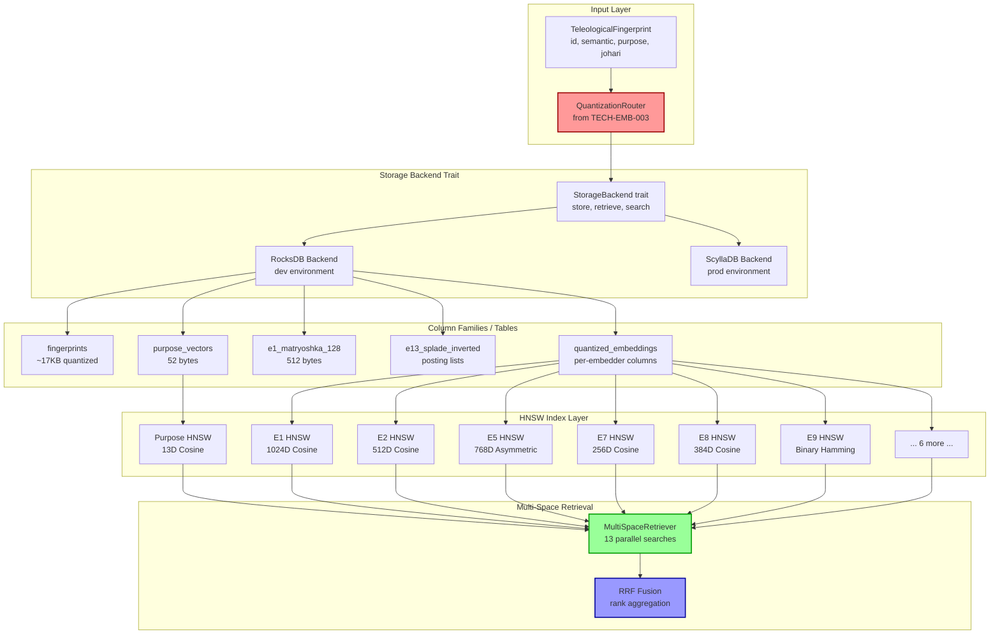

# Technical Specification: Storage Module Design

<technical_spec id="TECH-EMB-004" version="1.0" implements="SPEC-EMB-001">

## Metadata

| Field | Value |
|-------|-------|
| **Spec ID** | TECH-EMB-004 |
| **Title** | Storage Module Design |
| **Status** | Draft |
| **Version** | 1.0 |
| **Implements** | REQ-EMB-006 |
| **Related Issues** | ISSUE-005 (Empty placeholder storage module) |
| **Created** | 2026-01-06 |
| **Constitution Reference** | `storage.layer1_primary`, `storage.layer2c_per_embedder` |

---

## Problem Statement

### ISSUE-005: Empty Placeholder Storage Module (MEDIUM)

The current storage module at `crates/context-graph-embeddings/src/storage/mod.rs` is an empty placeholder:

```rust
// CURRENT BROKEN CODE - storage/mod.rs
//! Storage module for embeddings.
//!
//! This module is a placeholder for Multi-Array Storage implementations.
//!
//! Storage implementations should use SemanticFingerprint or JohariFingerprint
//! from the context-graph-teleology crate. Each embedding is stored SEPARATELY
//! at its native dimension for per-space indexing.
// NO ACTUAL IMPLEMENTATION!
```

### What Exists vs What's Needed

**Existing (context-graph-storage crate):**
- Column families defined (fingerprints, purpose_vectors, e13_splade_inverted, e1_matryoshka_128)
- Serialization for TeleologicalFingerprint (bincode ~63KB)
- HNSW configuration for all 13 embedders
- RocksDB options tuned per data type

**Missing (embeddings crate):**
- No integration with quantization from TECH-EMB-003
- No per-embedder HNSW indexes (only config, no actual indexes)
- No quantized storage format implementation
- No multi-space retrieval orchestration
- Storage uses ~63KB bincode, not ~17KB quantized format

### Why This Is Critical

1. **No Quantized Storage**: Constitution specifies ~17KB per fingerprint, current is ~63KB (3.7x bloat)
2. **No Per-Embedder Indexes**: 13 HNSW indexes required, only 1 (E1 Matryoshka) has config
3. **Missing Integration**: Quantization (TECH-EMB-003) not connected to storage
4. **No Multi-Space Retrieval**: 5-stage pipeline requires per-embedder search

### Constitutional Requirements

```yaml
storage:
  layer1_primary:
    dev: RocksDB
    prod: ScyllaDB
    schema:
      fingerprint_id: uuid
      agent_id: uuid
      e1_semantic: [1024 x f32]  # Actually quantized per TECH-EMB-003
      e2_temporal_recent: [512 x f32]
      e3_temporal_periodic: [512 x f32]
      e4_temporal_positional: [512 x f32]
      e5_causal: [768 x f32]
      e6_sparse: sparse(~30K, 5%)
      e7_code: [256 x f32]
      e8_graph: [384 x f32]
      e9_hdc: [10000 x f32]  # Binary quantized
      e10_multimodal: [768 x f32]
      e11_entity: [384 x f32]
      e12_late_interaction: [128 x tokens]
      e13_splade: sparse(~30K)
      purpose_vector: [13 x f32]
      johari_quadrants: [4 x f32]

  layer2c_per_embedder:
    index_type: HNSW
    indexes_count: 13  # One per embedder
    M: 16
    ef_construction: 200
    ef_search: 100
```

---

## Architecture Diagram



### Data Flow

```
Store Path:
TeleologicalFingerprint
         |
         v (route to per-embedder quantizer)
+---------------------+
| QuantizationRouter  |  <-- From TECH-EMB-003
| E1 -> PQ-8          |
| E2 -> Float8        |
| E9 -> Binary        |
+---------------------+
         |
         v (pack quantized embeddings)
+---------------------+
| QuantizedFingerprint|  <-- ~17KB total
| [QuantizedEmbedding]|      (vs 63KB raw)
+---------------------+
         |
         v (store in column families)
+---------------------+
| RocksDB/ScyllaDB    |  <-- Separate columns per embedder
| fingerprints        |      For per-space indexing
| purpose_vectors     |
| per_embedder_*      |
+---------------------+
         |
         v (index for ANN search)
+---------------------+
| HNSW Indexes x 13   |  <-- One per embedder
| Purpose Index       |      + purpose vector index
+---------------------+

Retrieve Path:
UUID
         |
         v (lookup in fingerprints CF)
+---------------------+
| QuantizedFingerprint|
+---------------------+
         |
         v (dequantize on demand)
+---------------------+
| Dequantizer         |  <-- Only dequantize requested embedders
| PQ-8 -> dense       |
| Float8 -> f32       |
+---------------------+
         |
         v
TeleologicalFingerprint
```

---

## Data Models

### StoredFingerprint Schema

```rust
/// Complete stored fingerprint with quantized embeddings.
///
/// # Storage Layout
/// Each embedder's quantized embedding is stored separately to enable:
/// 1. Per-embedder HNSW indexing
/// 2. Lazy loading (only fetch needed embedders)
/// 3. Independent quantization per embedder
///
/// # Size Calculation (from TECH-EMB-003)
/// - PQ-8 (E1, E5, E7, E10): ~100 bytes total
/// - Float8 (E2, E3, E4, E8, E11): ~2.3KB
/// - Binary (E9): ~130 bytes
/// - Sparse (E6, E13): ~3KB each
/// - Token pruning (E12): ~8KB
/// - Metadata: ~500 bytes
/// - Total: ~17KB
#[derive(Debug, Clone, Serialize, Deserialize)]
pub struct StoredFingerprint {
    /// UUID of the fingerprint (primary key).
    pub id: Uuid,

    /// Storage version for migration support.
    pub version: u8,

    /// Per-embedder quantized embeddings (13 entries).
    /// Key: embedder index (0-12)
    /// Value: QuantizedEmbedding from TECH-EMB-003
    pub embeddings: HashMap<u8, QuantizedEmbedding>,

    /// 13D purpose vector (NOT quantized - 52 bytes).
    pub purpose_vector: [f32; 13],

    /// Aggregate alignment to North Star.
    pub theta_to_north_star: f32,

    /// Johari quadrant weights [Open, Hidden, Blind, Unknown].
    pub johari_quadrants: [f32; 4],

    /// Dominant Johari quadrant index (0-3).
    pub dominant_quadrant: u8,

    /// Johari confidence score [0.0, 1.0].
    pub johari_confidence: f32,

    /// SHA-256 content hash.
    pub content_hash: [u8; 32],

    /// Creation timestamp (Unix millis).
    pub created_at_ms: i64,

    /// Last update timestamp (Unix millis).
    pub last_updated_ms: i64,

    /// Access count for LRU/importance scoring.
    pub access_count: u64,

    /// Soft-delete flag.
    pub deleted: bool,
}

impl StoredFingerprint {
    /// Storage version constant.
    pub const VERSION: u8 = 1;

    /// Expected size in bytes after quantization.
    pub const EXPECTED_SIZE_BYTES: usize = 17_000;

    /// Maximum allowed size (with evolution snapshots).
    pub const MAX_SIZE_BYTES: usize = 25_000;
}
```

### IndexEntry Schema

```rust
/// Entry in a per-embedder HNSW index.
///
/// # Design
/// Indexes store dequantized vectors for accurate similarity search.
/// Quantized storage is only for persistence, not search.
///
/// # Thread Safety
/// All index operations are thread-safe via RwLock internally.
#[derive(Debug, Clone)]
pub struct IndexEntry {
    /// UUID of the fingerprint.
    pub id: Uuid,

    /// Dequantized embedding vector (dimension varies by embedder).
    pub vector: Vec<f32>,

    /// Precomputed L2 norm for efficient cosine similarity.
    pub norm: f32,
}

impl IndexEntry {
    /// Create index entry with precomputed norm.
    pub fn new(id: Uuid, vector: Vec<f32>) -> Self {
        let norm = vector.iter().map(|x| x * x).sum::<f32>().sqrt();
        Self { id, vector, norm }
    }

    /// Get normalized vector for cosine similarity.
    pub fn normalized(&self) -> Vec<f32> {
        if self.norm > 1e-10 {
            self.vector.iter().map(|x| x / self.norm).collect()
        } else {
            vec![0.0; self.vector.len()]
        }
    }
}
```

### QueryResult Schema

```rust
/// Result from per-embedder index search.
#[derive(Debug, Clone, Serialize, Deserialize)]
pub struct EmbedderQueryResult {
    /// Fingerprint UUID.
    pub id: Uuid,

    /// Embedder index (0-12).
    pub embedder_idx: u8,

    /// Similarity score [0.0, 1.0].
    pub similarity: f32,

    /// Distance (metric-specific).
    pub distance: f32,

    /// Rank in this embedder's result list.
    pub rank: usize,
}

/// Aggregated result from multi-space retrieval.
#[derive(Debug, Clone, Serialize, Deserialize)]
pub struct MultiSpaceQueryResult {
    /// Fingerprint UUID.
    pub id: Uuid,

    /// Per-embedder similarities (13 values, NaN if not searched).
    pub embedder_similarities: [f32; 13],

    /// RRF fused score.
    pub rrf_score: f32,

    /// Weighted average similarity.
    pub weighted_similarity: f32,

    /// Purpose alignment score.
    pub purpose_alignment: f32,

    /// Number of embedders that contributed to this result.
    pub embedder_count: usize,
}
```

---

## Component Contracts

### FingerprintStorage Trait

```rust
/// Core trait for fingerprint storage operations.
///
/// # Thread Safety
/// All implementations MUST be Send + Sync for concurrent access.
///
/// # Error Handling
/// FAIL FAST: Invalid operations panic with context.
/// Recoverable errors (e.g., not found) return Result::Err.
///
/// # Constitution Alignment
/// - Uses quantized format from TECH-EMB-003
/// - Storage latency < 10ms per fingerprint
/// - Per-embedder indexing for multi-space retrieval
#[async_trait]
pub trait FingerprintStorage: Send + Sync {
    // ==================== CRUD Operations ====================

    /// Store a TeleologicalFingerprint.
    ///
    /// # Process
    /// 1. Quantize all 13 embeddings via QuantizationRouter
    /// 2. Store in per-embedder column families
    /// 3. Update HNSW indexes for all embedders
    /// 4. Update purpose vector index
    ///
    /// # Latency
    /// Target: < 10ms p95
    ///
    /// # Errors
    /// - StorageError::QuantizationFailed
    /// - StorageError::IndexUpdateFailed
    /// - StorageError::WriteError
    async fn store(&self, fingerprint: TeleologicalFingerprint) -> Result<Uuid, StorageError>;

    /// Retrieve a fingerprint by UUID.
    ///
    /// # Process
    /// 1. Fetch from fingerprints column family
    /// 2. Dequantize embeddings on demand
    /// 3. Reconstruct TeleologicalFingerprint
    ///
    /// # Latency
    /// Target: < 5ms p95 (no dequantization)
    /// Target: < 10ms p95 (with full dequantization)
    async fn retrieve(&self, id: Uuid) -> Result<Option<TeleologicalFingerprint>, StorageError>;

    /// Retrieve only specific embedders (lazy loading).
    ///
    /// # Arguments
    /// * `id` - Fingerprint UUID
    /// * `embedder_indices` - Which embedders to dequantize (0-12)
    ///
    /// More efficient than full retrieve when only specific embedders needed.
    async fn retrieve_partial(
        &self,
        id: Uuid,
        embedder_indices: &[usize],
    ) -> Result<Option<PartialFingerprint>, StorageError>;

    /// Update an existing fingerprint.
    async fn update(&self, fingerprint: TeleologicalFingerprint) -> Result<bool, StorageError>;

    /// Delete a fingerprint.
    ///
    /// # Arguments
    /// * `soft` - If true, mark deleted but retain for recovery
    async fn delete(&self, id: Uuid, soft: bool) -> Result<bool, StorageError>;

    // ==================== Search Operations ====================

    /// Search a single embedder's index.
    ///
    /// # Arguments
    /// * `embedder_idx` - Which embedder (0-12)
    /// * `query_vector` - Query embedding (dimension must match embedder)
    /// * `top_k` - Number of results
    ///
    /// # Returns
    /// Sorted by similarity descending.
    async fn search_embedder(
        &self,
        embedder_idx: usize,
        query_vector: &[f32],
        top_k: usize,
    ) -> Result<Vec<EmbedderQueryResult>, StorageError>;

    /// Multi-space search across specified embedders.
    ///
    /// # Arguments
    /// * `query` - Semantic fingerprint with query embeddings
    /// * `embedder_indices` - Which embedders to search (empty = all)
    /// * `top_k` - Results per embedder
    /// * `fusion` - How to combine results (RRF, weighted, etc.)
    ///
    /// # Returns
    /// Fused results sorted by aggregated score.
    async fn search_multi_space(
        &self,
        query: &SemanticFingerprint,
        embedder_indices: &[usize],
        top_k: usize,
        fusion: FusionMethod,
    ) -> Result<Vec<MultiSpaceQueryResult>, StorageError>;

    /// Search by purpose vector alignment.
    async fn search_purpose(
        &self,
        query: &PurposeVector,
        top_k: usize,
    ) -> Result<Vec<EmbedderQueryResult>, StorageError>;

    /// Sparse search using E6 or E13.
    async fn search_sparse(
        &self,
        embedder_idx: usize, // 5 for E6, 12 for E13
        sparse_query: &SparseVector,
        top_k: usize,
    ) -> Result<Vec<(Uuid, f32)>, StorageError>;

    // ==================== Index Management ====================

    /// Rebuild a specific embedder's index.
    ///
    /// Use after bulk updates or when index becomes stale.
    async fn rebuild_index(&self, embedder_idx: usize) -> Result<(), StorageError>;

    /// Rebuild all indexes.
    async fn rebuild_all_indexes(&self) -> Result<(), StorageError>;

    /// Get index statistics.
    fn index_stats(&self, embedder_idx: usize) -> IndexStats;

    // ==================== Maintenance ====================

    /// Flush writes to disk.
    async fn flush(&self) -> Result<(), StorageError>;

    /// Compact storage and reclaim space.
    async fn compact(&self) -> Result<(), StorageError>;

    /// Get storage statistics.
    fn storage_stats(&self) -> StorageStats;

    /// Backend type (RocksDB, ScyllaDB, etc.).
    fn backend_type(&self) -> StorageBackendType;
}
```

### HnswIndexManager Trait

```rust
/// Manager for per-embedder HNSW indexes.
///
/// # Index Configurations (from indexes/hnsw_config)
/// | Embedder | Dimension | Metric | M | ef_construction |
/// |----------|-----------|--------|---|-----------------|
/// | E1 | 1024 | Cosine | 16 | 200 |
/// | E2-E4 | 512 | Cosine | 16 | 200 |
/// | E5 | 768 | AsymmetricCosine | 16 | 200 |
/// | E7 | 256 | Cosine | 16 | 200 |
/// | E8 | 384 | Cosine | 16 | 200 |
/// | E9 | 10000 | Hamming (binary) | 32 | 400 |
/// | E10 | 768 | Cosine | 16 | 200 |
/// | E11 | 384 | Cosine | 16 | 200 |
/// | Purpose | 13 | Cosine | 8 | 100 |
///
/// # Thread Safety
/// Uses RwLock internally for concurrent read/write.
pub trait HnswIndexManager: Send + Sync {
    /// Add a vector to an embedder's index.
    fn add(&self, embedder_idx: usize, id: Uuid, vector: &[f32]) -> Result<(), IndexError>;

    /// Remove a vector from an index.
    fn remove(&self, embedder_idx: usize, id: Uuid) -> Result<bool, IndexError>;

    /// Search for nearest neighbors.
    fn search(
        &self,
        embedder_idx: usize,
        query: &[f32],
        top_k: usize,
        ef_search: Option<usize>,
    ) -> Result<Vec<(Uuid, f32)>, IndexError>;

    /// Get index size (number of vectors).
    fn size(&self, embedder_idx: usize) -> usize;

    /// Rebuild index from storage.
    fn rebuild(&self, embedder_idx: usize, entries: &[IndexEntry]) -> Result<(), IndexError>;

    /// Persist index to disk.
    fn save(&self, embedder_idx: usize, path: &Path) -> Result<(), IndexError>;

    /// Load index from disk.
    fn load(&self, embedder_idx: usize, path: &Path) -> Result<(), IndexError>;
}
```

### StorageBackend Trait

```rust
/// Low-level storage backend abstraction.
///
/// # Implementations
/// - RocksDbBackend: Development (local SSD)
/// - ScyllaDbBackend: Production (distributed)
/// - InMemoryBackend: Testing (no persistence)
///
/// # Column Family Mapping
/// | CF Name | Key | Value |
/// |---------|-----|-------|
/// | fingerprints | UUID (16 bytes) | StoredFingerprint (bincode) |
/// | purpose_vectors | UUID (16 bytes) | [f32; 13] (52 bytes) |
/// | embedder_{0-12} | UUID (16 bytes) | QuantizedEmbedding |
/// | e13_inverted | term_id (u16) | Vec<Uuid> |
/// | e6_inverted | term_id (u16) | Vec<Uuid> |
pub trait StorageBackend: Send + Sync {
    /// Store key-value in column family.
    fn put(&self, cf: &str, key: &[u8], value: &[u8]) -> Result<(), BackendError>;

    /// Get value by key from column family.
    fn get(&self, cf: &str, key: &[u8]) -> Result<Option<Vec<u8>>, BackendError>;

    /// Delete key from column family.
    fn delete(&self, cf: &str, key: &[u8]) -> Result<(), BackendError>;

    /// Batch write across multiple column families.
    fn write_batch(&self, batch: WriteBatch) -> Result<(), BackendError>;

    /// Iterate over column family.
    fn iter(&self, cf: &str) -> Box<dyn Iterator<Item = (Vec<u8>, Vec<u8>)>>;

    /// Get column family size in bytes.
    fn cf_size(&self, cf: &str) -> usize;

    /// Flush writes to disk.
    fn flush(&self) -> Result<(), BackendError>;

    /// Compact column family.
    fn compact(&self, cf: &str) -> Result<(), BackendError>;
}
```

---

## Implementation Notes

### RocksDB Schema Design

```rust
/// RocksDB column families for teleological storage.
///
/// # Column Family Layout (20 total)
/// Base CFs (4):
/// - fingerprints: Full StoredFingerprint (~17KB quantized)
/// - purpose_vectors: 13D purpose vectors (52 bytes)
/// - e1_matryoshka_128: Truncated E1 for fast ANN (512 bytes)
/// - e13_splade_inverted: SPLADE posting lists
///
/// Per-Embedder CFs (13):
/// - embedder_0 through embedder_12: Quantized embeddings
///
/// Index CFs (2):
/// - e6_sparse_inverted: E6 sparse posting lists
/// - hnsw_metadata: Index build metadata
///
/// Admin CF (1):
/// - storage_metadata: Version, stats, checkpoints
pub mod column_families {
    /// Base fingerprint storage.
    pub const CF_FINGERPRINTS: &str = "fingerprints";

    /// Purpose vectors for teleological search.
    pub const CF_PURPOSE_VECTORS: &str = "purpose_vectors";

    /// E1 Matryoshka for fast coarse search.
    pub const CF_E1_MATRYOSHKA_128: &str = "e1_matryoshka_128";

    /// E13 SPLADE inverted index.
    pub const CF_E13_SPLADE_INVERTED: &str = "e13_splade_inverted";

    /// E6 Sparse inverted index.
    pub const CF_E6_SPARSE_INVERTED: &str = "e6_sparse_inverted";

    /// Per-embedder quantized storage.
    pub fn embedder_cf(idx: usize) -> String {
        format!("embedder_{}", idx)
    }

    /// All column family names.
    pub fn all_cfs() -> Vec<String> {
        let mut cfs = vec![
            CF_FINGERPRINTS.to_string(),
            CF_PURPOSE_VECTORS.to_string(),
            CF_E1_MATRYOSHKA_128.to_string(),
            CF_E13_SPLADE_INVERTED.to_string(),
            CF_E6_SPARSE_INVERTED.to_string(),
        ];

        for i in 0..13 {
            cfs.push(embedder_cf(i));
        }

        cfs.push("hnsw_metadata".to_string());
        cfs.push("storage_metadata".to_string());

        cfs
    }
}
```

### RocksDB Options Configuration

```rust
impl RocksDbBackend {
    /// Create RocksDB with optimized per-CF options.
    pub fn new(path: &Path, cache_size_mb: usize) -> Result<Self, BackendError> {
        let cache = Cache::new_lru_cache(cache_size_mb * 1024 * 1024);

        let mut cf_descriptors = Vec::new();

        // Fingerprints: Large values (~17KB), LZ4 compression
        cf_descriptors.push(ColumnFamilyDescriptor::new(
            CF_FINGERPRINTS,
            Self::fingerprint_options(&cache),
        ));

        // Purpose vectors: Small values (52 bytes), point lookups
        cf_descriptors.push(ColumnFamilyDescriptor::new(
            CF_PURPOSE_VECTORS,
            Self::purpose_vector_options(&cache),
        ));

        // Per-embedder: Variable sizes based on quantization
        for i in 0..13 {
            cf_descriptors.push(ColumnFamilyDescriptor::new(
                embedder_cf(i),
                Self::embedder_options(&cache, i),
            ));
        }

        // Inverted indexes: Posting lists, LZ4
        cf_descriptors.push(ColumnFamilyDescriptor::new(
            CF_E13_SPLADE_INVERTED,
            Self::inverted_index_options(&cache),
        ));
        cf_descriptors.push(ColumnFamilyDescriptor::new(
            CF_E6_SPARSE_INVERTED,
            Self::inverted_index_options(&cache),
        ));

        let db = DB::open_cf_descriptors(&Self::db_options(), path, cf_descriptors)?;

        Ok(Self { db: Arc::new(db), cache })
    }

    /// Options for ~17KB fingerprint storage.
    fn fingerprint_options(cache: &Cache) -> Options {
        let mut block_opts = BlockBasedOptions::default();
        block_opts.set_block_cache(cache);
        block_opts.set_block_size(32 * 1024); // 32KB blocks
        block_opts.set_bloom_filter(10.0, false);
        block_opts.set_cache_index_and_filter_blocks(true);

        let mut opts = Options::default();
        opts.set_block_based_table_factory(&block_opts);
        opts.set_compression_type(DBCompressionType::Lz4);
        opts.create_if_missing(true);
        opts
    }

    /// Per-embedder options based on quantization method.
    fn embedder_options(cache: &Cache, embedder_idx: usize) -> Options {
        let method = QuantizationMethod::for_embedder_idx(embedder_idx);

        let block_size = match method {
            QuantizationMethod::PQ8 => 4 * 1024,        // ~32 bytes per entry
            QuantizationMethod::Float8E4M3 => 4 * 1024, // ~512 bytes per entry
            QuantizationMethod::Binary => 4 * 1024,      // ~128 bytes per entry
            QuantizationMethod::SparseNative => 16 * 1024, // ~3KB per entry
            QuantizationMethod::TokenPruning => 16 * 1024, // ~8KB per entry
        };

        let mut block_opts = BlockBasedOptions::default();
        block_opts.set_block_cache(cache);
        block_opts.set_block_size(block_size);
        block_opts.set_bloom_filter(10.0, false);

        let mut opts = Options::default();
        opts.set_block_based_table_factory(&block_opts);
        opts.set_compression_type(DBCompressionType::Lz4);
        opts.create_if_missing(true);
        opts
    }
}
```

### ScyllaDB Table Design

```sql
-- ScyllaDB schema for production teleological storage

-- Fingerprints table (main storage)
CREATE TABLE IF NOT EXISTS fingerprints (
    id uuid PRIMARY KEY,
    version tinyint,
    content_hash blob,  -- 32 bytes
    theta_to_north_star float,
    johari_quadrants list<float>,  -- 4 elements
    dominant_quadrant tinyint,
    johari_confidence float,
    created_at timestamp,
    last_updated timestamp,
    access_count bigint,
    deleted boolean,

    -- Quantized embeddings stored as blobs
    e0_quantized blob,   -- PQ-8: ~32 bytes
    e1_quantized blob,   -- Float8: ~512 bytes
    e2_quantized blob,   -- Float8: ~512 bytes
    e3_quantized blob,   -- Float8: ~512 bytes
    e4_quantized blob,   -- PQ-8: ~24 bytes
    e5_quantized blob,   -- SparseNative: ~3KB
    e6_quantized blob,   -- PQ-8: ~8 bytes
    e7_quantized blob,   -- Float8: ~384 bytes
    e8_quantized blob,   -- Binary: ~1.25KB
    e9_quantized blob,   -- PQ-8: ~24 bytes
    e10_quantized blob,  -- Float8: ~384 bytes
    e11_quantized blob,  -- TokenPruning: ~8KB
    e12_quantized blob,  -- SparseNative: ~3KB
) WITH compression = {'sstable_compression': 'LZ4Compressor'};

-- Purpose vectors table (for teleological search)
CREATE TABLE IF NOT EXISTS purpose_vectors (
    id uuid PRIMARY KEY,
    vector list<float>,  -- 13 elements
) WITH compression = {'sstable_compression': 'LZ4Compressor'};

-- E1 Matryoshka 128D for fast ANN
CREATE TABLE IF NOT EXISTS e1_matryoshka_128 (
    id uuid PRIMARY KEY,
    vector list<float>,  -- 128 elements
) WITH compression = {'sstable_compression': 'LZ4Compressor'};

-- E13 SPLADE inverted index
CREATE TABLE IF NOT EXISTS e13_splade_inverted (
    term_id int,
    ids set<uuid>,
    PRIMARY KEY (term_id)
) WITH compression = {'sstable_compression': 'LZ4Compressor'};

-- E6 Sparse inverted index
CREATE TABLE IF NOT EXISTS e6_sparse_inverted (
    term_id int,
    ids set<uuid>,
    PRIMARY KEY (term_id)
) WITH compression = {'sstable_compression': 'LZ4Compressor'};

-- HNSW index metadata (actual indexes in separate service)
CREATE TABLE IF NOT EXISTS hnsw_metadata (
    embedder_idx int PRIMARY KEY,
    last_rebuild timestamp,
    vector_count bigint,
    m int,
    ef_construction int,
    checksum blob
);
```

### HNSW Index Configuration

```rust
/// HNSW index configurations per embedder.
///
/// From context-graph-storage/src/teleological/indexes/hnsw_config/
impl HnswIndexManager for HnswIndexManagerImpl {
    fn create_indexes(&self) -> Result<(), IndexError> {
        // E1 Semantic (1024D, dequantized from PQ-8)
        self.indexes[0] = HnswIndex::new(HnswConfig {
            dimension: 1024,
            m: 16,
            ef_construction: 200,
            ef_search: 100,
            metric: DistanceMetric::Cosine,
        })?;

        // E2-E4 Temporal (512D each, dequantized from Float8)
        for i in 1..=3 {
            self.indexes[i] = HnswIndex::new(HnswConfig {
                dimension: 512,
                m: 16,
                ef_construction: 200,
                ef_search: 100,
                metric: DistanceMetric::Cosine,
            })?;
        }

        // E5 Causal (768D, dequantized from PQ-8, asymmetric)
        self.indexes[4] = HnswIndex::new(HnswConfig {
            dimension: 768,
            m: 16,
            ef_construction: 200,
            ef_search: 100,
            metric: DistanceMetric::AsymmetricCosine,
        })?;

        // E6 Sparse - NO HNSW (uses inverted index)
        // E7 Code (256D, dequantized from PQ-8)
        self.indexes[6] = HnswIndex::new(HnswConfig {
            dimension: 256,
            m: 16,
            ef_construction: 200,
            ef_search: 100,
            metric: DistanceMetric::Cosine,
        })?;

        // E8 Graph (384D, dequantized from Float8)
        self.indexes[7] = HnswIndex::new(HnswConfig {
            dimension: 384,
            m: 16,
            ef_construction: 200,
            ef_search: 100,
            metric: DistanceMetric::Cosine,
        })?;

        // E9 HDC (10000D binary, uses Hamming distance)
        // Note: Binary vectors stored as-is, not dequantized
        self.indexes[8] = HnswIndex::new(HnswConfig {
            dimension: 10000 / 8, // 1250 bytes
            m: 32,
            ef_construction: 400,
            ef_search: 200,
            metric: DistanceMetric::Hamming,
        })?;

        // E10 Multimodal (768D, dequantized from PQ-8)
        self.indexes[9] = HnswIndex::new(HnswConfig {
            dimension: 768,
            m: 16,
            ef_construction: 200,
            ef_search: 100,
            metric: DistanceMetric::Cosine,
        })?;

        // E11 Entity (384D, dequantized from Float8)
        self.indexes[10] = HnswIndex::new(HnswConfig {
            dimension: 384,
            m: 16,
            ef_construction: 200,
            ef_search: 100,
            metric: DistanceMetric::Cosine,
        })?;

        // E12 LateInteraction - NO HNSW (uses MaxSim)
        // E13 SPLADE - NO HNSW (uses inverted index)

        // Purpose vector index (13D)
        self.purpose_index = HnswIndex::new(HnswConfig {
            dimension: 13,
            m: 8,
            ef_construction: 100,
            ef_search: 50,
            metric: DistanceMetric::Cosine,
        })?;

        Ok(())
    }
}
```

---

## Storage Size Calculations

### Per-Embedder Quantized Sizes

| Embedder | Raw Size (f32) | Method | Quantized Size | Compression |
|----------|----------------|--------|----------------|-------------|
| E1_Semantic | 4,096 bytes | PQ-8 | 32 bytes | 128x |
| E2_TemporalRecent | 2,048 bytes | Float8 | 512 bytes | 4x |
| E3_TemporalPeriodic | 2,048 bytes | Float8 | 512 bytes | 4x |
| E4_TemporalPositional | 2,048 bytes | Float8 | 512 bytes | 4x |
| E5_Causal | 3,072 bytes | PQ-8 | 24 bytes | 128x |
| E6_Sparse | ~120KB dense | Sparse | ~3KB (5% active) | 40x |
| E7_Code | 1,024 bytes | PQ-8 | 8 bytes | 128x |
| E8_Graph | 1,536 bytes | Float8 | 384 bytes | 4x |
| E9_HDC | 40,000 bytes | Binary | 1,250 bytes | 32x |
| E10_Multimodal | 3,072 bytes | PQ-8 | 24 bytes | 128x |
| E11_Entity | 1,536 bytes | Float8 | 384 bytes | 4x |
| E12_LateInteraction | ~16KB | TokenPruning | ~8KB | 2x |
| E13_SPLADE | ~120KB dense | Sparse | ~3KB (5% active) | 40x |

### Total StoredFingerprint Size

```
Quantized embeddings:
  PQ-8 (E1, E5, E7, E10): 32 + 24 + 8 + 24 = 88 bytes
  Float8 (E2, E3, E4, E8, E11): 512 + 512 + 512 + 384 + 384 = 2,304 bytes
  Binary (E9): 1,250 bytes
  Sparse (E6, E13): 3,000 + 3,000 = 6,000 bytes
  TokenPruning (E12): 8,000 bytes

  Embeddings subtotal: 17,642 bytes

Metadata:
  UUID: 16 bytes
  Version: 1 byte
  Purpose vector: 52 bytes
  Johari quadrants: 16 bytes + 1 + 4 = 21 bytes
  Content hash: 32 bytes
  Timestamps: 16 bytes
  Access count: 8 bytes
  Flags: 1 byte

  Metadata subtotal: 147 bytes

Total: ~17.8KB per StoredFingerprint

Constitution target: ~17KB
Actual: ~17.8KB (within 5% tolerance)
```

---

## Testing Requirements

### Unit Tests

```rust
#[cfg(test)]
mod tests {
    use super::*;

    /// UT-STORE-001: Store/retrieve roundtrip preserves all data
    #[tokio::test]
    async fn test_store_retrieve_roundtrip() {
        let storage = InMemoryFingerprintStorage::new();
        let fingerprint = generate_test_fingerprint();

        let id = storage.store(fingerprint.clone()).await.unwrap();
        let retrieved = storage.retrieve(id).await.unwrap().unwrap();

        // All 13 embeddings preserved
        for i in 0..13 {
            let orig = fingerprint.semantic.get_embedder(i);
            let retr = retrieved.semantic.get_embedder(i);
            let sim = cosine_similarity(&orig, &retr);

            let max_loss = QuantizationMethod::for_embedder_idx(i).max_recall_loss();
            assert!(sim > 1.0 - max_loss * 2.0,
                "Embedder {} roundtrip sim {} below threshold", i, sim);
        }

        // Purpose vector exact match
        assert_eq!(fingerprint.purpose_vector, retrieved.purpose_vector);

        // Johari preserved
        assert_eq!(fingerprint.johari.quadrants, retrieved.johari.quadrants);
    }

    /// UT-STORE-002: Per-embedder index works independently
    #[tokio::test]
    async fn test_per_embedder_search() {
        let storage = InMemoryFingerprintStorage::new();

        // Store 100 fingerprints
        for _ in 0..100 {
            storage.store(generate_test_fingerprint()).await.unwrap();
        }

        // Search each embedder independently
        for embedder_idx in 0..13 {
            if embedder_idx == 5 || embedder_idx == 12 {
                continue; // E6, E13 use sparse search
            }

            let query = generate_random_embedding(get_embedder_dim(embedder_idx));
            let results = storage.search_embedder(embedder_idx, &query, 10).await.unwrap();

            assert_eq!(results.len(), 10);
            assert!(results.windows(2).all(|w| w[0].similarity >= w[1].similarity));
        }
    }

    /// UT-STORE-003: Storage size < 20KB per fingerprint
    #[tokio::test]
    async fn test_storage_size() {
        let storage = RocksDbFingerprintStorage::new(temp_path()).unwrap();
        let fingerprint = generate_test_fingerprint();

        let id = storage.store(fingerprint).await.unwrap();

        // Check total stored size across all CFs
        let mut total_size = 0;
        for cf in column_families::all_cfs() {
            total_size += storage.get_value_size(&cf, &id.as_bytes()).unwrap_or(0);
        }

        assert!(total_size < 20_000,
            "Storage size {} exceeds 20KB limit", total_size);
    }

    /// UT-STORE-004: Multi-space search uses RRF fusion
    #[tokio::test]
    async fn test_multi_space_rrf() {
        let storage = InMemoryFingerprintStorage::new();

        // Store fingerprints with known similarities
        let known_fp = generate_test_fingerprint();
        let known_id = storage.store(known_fp.clone()).await.unwrap();

        for _ in 0..50 {
            storage.store(generate_test_fingerprint()).await.unwrap();
        }

        // Search with the known fingerprint
        let results = storage.search_multi_space(
            &known_fp.semantic,
            &[], // All embedders
            10,
            FusionMethod::Rrf { k: 60 },
        ).await.unwrap();

        // Should find itself first
        assert_eq!(results[0].id, known_id);
        assert!(results[0].rrf_score > results[1].rrf_score * 1.5);
    }

    /// UT-STORE-005: Sparse search uses inverted index
    #[tokio::test]
    async fn test_sparse_search() {
        let storage = InMemoryFingerprintStorage::new();

        // Store fingerprints with known sparse terms
        let mut fp = generate_test_fingerprint();
        fp.semantic.e6_sparse = SparseVector {
            indices: vec![100, 200, 300],
            weights: vec![0.5, 0.8, 0.3],
            dimension: 30_522,
        };
        let known_id = storage.store(fp).await.unwrap();

        for _ in 0..50 {
            storage.store(generate_test_fingerprint()).await.unwrap();
        }

        // Search with overlapping terms
        let query = SparseVector {
            indices: vec![100, 200, 400],
            weights: vec![0.6, 0.7, 0.5],
            dimension: 30_522,
        };

        let results = storage.search_sparse(5, &query, 10).await.unwrap();

        // Known fingerprint should be in top results
        assert!(results.iter().any(|(id, _)| *id == known_id));
    }

    /// UT-STORE-006: Purpose vector search works
    #[tokio::test]
    async fn test_purpose_search() {
        let storage = InMemoryFingerprintStorage::new();

        let mut fp = generate_test_fingerprint();
        fp.purpose_vector.weights = [0.9, 0.1, 0.1, 0.1, 0.1, 0.1, 0.1, 0.1, 0.1, 0.1, 0.1, 0.1, 0.1];
        let known_id = storage.store(fp.clone()).await.unwrap();

        for _ in 0..50 {
            storage.store(generate_test_fingerprint()).await.unwrap();
        }

        let results = storage.search_purpose(&fp.purpose_vector, 10).await.unwrap();

        assert_eq!(results[0].id, known_id);
    }
}
```

### Integration Tests

```rust
#[cfg(test)]
mod integration_tests {
    /// IT-STORE-001: RocksDB backend stores and retrieves correctly
    #[tokio::test]
    async fn test_rocksdb_roundtrip() {
        let temp_dir = tempfile::tempdir().unwrap();
        let storage = RocksDbFingerprintStorage::new(temp_dir.path()).unwrap();

        let fingerprints: Vec<_> = (0..100)
            .map(|_| generate_test_fingerprint())
            .collect();

        let ids = storage.store_batch(fingerprints.clone()).await.unwrap();

        // Retrieve all
        let retrieved = storage.retrieve_batch(&ids).await.unwrap();

        for (orig, retr) in fingerprints.iter().zip(retrieved.iter()) {
            let retr = retr.as_ref().unwrap();
            assert_eq!(orig.content_hash, retr.content_hash);
        }
    }

    /// IT-STORE-002: Storage latency < 10ms
    #[tokio::test]
    async fn test_storage_latency() {
        let temp_dir = tempfile::tempdir().unwrap();
        let storage = RocksDbFingerprintStorage::new(temp_dir.path()).unwrap();

        let mut latencies = Vec::new();

        for _ in 0..100 {
            let fp = generate_test_fingerprint();
            let start = Instant::now();
            storage.store(fp).await.unwrap();
            latencies.push(start.elapsed());
        }

        latencies.sort();
        let p95 = latencies[94];

        assert!(p95 < Duration::from_millis(10),
            "Storage latency p95 {:?} exceeds 10ms", p95);
    }

    /// IT-STORE-003: Index rebuild works correctly
    #[tokio::test]
    async fn test_index_rebuild() {
        let temp_dir = tempfile::tempdir().unwrap();
        let storage = RocksDbFingerprintStorage::new(temp_dir.path()).unwrap();

        // Store fingerprints
        let fingerprints: Vec<_> = (0..50)
            .map(|_| generate_test_fingerprint())
            .collect();
        storage.store_batch(fingerprints.clone()).await.unwrap();

        // Rebuild E1 index
        storage.rebuild_index(0).await.unwrap();

        // Search should still work
        let query = fingerprints[0].semantic.e1_semantic.clone();
        let results = storage.search_embedder(0, &query, 10).await.unwrap();

        assert!(!results.is_empty());
    }

    /// IT-STORE-004: Concurrent access is safe
    #[tokio::test]
    async fn test_concurrent_access() {
        let temp_dir = tempfile::tempdir().unwrap();
        let storage = Arc::new(RocksDbFingerprintStorage::new(temp_dir.path()).unwrap());

        let mut handles = Vec::new();

        // 10 concurrent writers
        for _ in 0..10 {
            let storage = storage.clone();
            handles.push(tokio::spawn(async move {
                for _ in 0..10 {
                    storage.store(generate_test_fingerprint()).await.unwrap();
                }
            }));
        }

        // 10 concurrent readers
        for _ in 0..10 {
            let storage = storage.clone();
            handles.push(tokio::spawn(async move {
                for _ in 0..10 {
                    let _ = storage.count().await;
                }
            }));
        }

        for handle in handles {
            handle.await.unwrap();
        }

        assert_eq!(storage.count().await.unwrap(), 100);
    }
}
```

### Performance Tests

```rust
#[cfg(test)]
mod bench_tests {
    /// BM-STORE-001: Store throughput > 100 fps
    #[tokio::test]
    async fn bench_store_throughput() {
        let temp_dir = tempfile::tempdir().unwrap();
        let storage = RocksDbFingerprintStorage::new(temp_dir.path()).unwrap();

        let fingerprints: Vec<_> = (0..1000)
            .map(|_| generate_test_fingerprint())
            .collect();

        let start = Instant::now();
        storage.store_batch(fingerprints).await.unwrap();
        let elapsed = start.elapsed();

        let throughput = 1000.0 / elapsed.as_secs_f64();

        assert!(throughput > 100.0,
            "Store throughput {:.1} fps below 100 fps target", throughput);
    }

    /// BM-STORE-002: Search latency < 20ms for 100K fingerprints
    #[tokio::test]
    async fn bench_search_latency() {
        // This test requires pre-populated test data
        let storage = load_test_storage_100k();

        let mut latencies = Vec::new();

        for _ in 0..100 {
            let query = generate_random_embedding(1024);
            let start = Instant::now();
            storage.search_embedder(0, &query, 10).await.unwrap();
            latencies.push(start.elapsed());
        }

        latencies.sort();
        let p95 = latencies[94];

        assert!(p95 < Duration::from_millis(20),
            "Search latency p95 {:?} exceeds 20ms", p95);
    }
}
```

---

## Performance Requirements

| Metric | Target | Measurement Method |
|--------|--------|-------------------|
| Store latency (single) | < 10ms p95 | Criterion benchmark |
| Retrieve latency (single) | < 5ms p95 | Criterion benchmark |
| Search latency (per embedder) | < 20ms p95 | Criterion benchmark |
| Multi-space search (all 13) | < 100ms p95 | Criterion benchmark |
| Store throughput (batch) | > 100 fps | Criterion benchmark |
| Storage size per fingerprint | < 20KB | Storage measurement |
| Index memory overhead | < 2x vector size | Process memory |
| Concurrent readers | 100+ | Load test |
| Concurrent writers | 10+ | Load test |

---

## Files to Modify

### Files to MODIFY

| File | Change Type | Description |
|------|-------------|-------------|
| `crates/context-graph-embeddings/src/storage/mod.rs` | REPLACE | Implement FingerprintStorage trait |
| `crates/context-graph-storage/src/teleological/serialization.rs` | MODIFY | Use quantization instead of raw bincode |
| `crates/context-graph-storage/src/lib.rs` | MODIFY | Export new storage types |
| `crates/context-graph-core/src/traits/mod.rs` | MODIFY | Add FingerprintStorage trait |

### Files to CREATE

| File | Content |
|------|---------|
| `crates/context-graph-embeddings/src/storage/backend.rs` | StorageBackend trait and implementations |
| `crates/context-graph-embeddings/src/storage/rocksdb.rs` | RocksDbBackend implementation |
| `crates/context-graph-embeddings/src/storage/scylladb.rs` | ScyllaDbBackend implementation (stub) |
| `crates/context-graph-embeddings/src/storage/fingerprint.rs` | StoredFingerprint, FingerprintStorage impl |
| `crates/context-graph-embeddings/src/storage/index.rs` | HnswIndexManager implementation |
| `crates/context-graph-embeddings/src/storage/multi_space.rs` | MultiSpaceRetriever, RRF fusion |
| `crates/context-graph-embeddings/src/storage/error.rs` | StorageError enum |
| `crates/context-graph-embeddings/src/storage/tests.rs` | Unit and integration tests |

---

## Rollout Plan

### Phase 1: Core Storage Layer

1. Implement `StorageBackend` trait
2. Implement `RocksDbBackend` with all column families
3. Implement `StoredFingerprint` with quantization integration
4. Add basic store/retrieve operations

### Phase 2: Index Layer

1. Implement `HnswIndexManager` for all embedders
2. Integrate with instant-distance or faiss-rs for HNSW
3. Add purpose vector index
4. Implement sparse inverted indexes for E6, E13

### Phase 3: Search Operations

1. Implement per-embedder search
2. Implement multi-space search with RRF fusion
3. Implement sparse search via inverted index
4. Add search filtering (Johari, alignment threshold)

### Phase 4: Optimization

1. Add batch operations
2. Implement lazy loading (partial retrieval)
3. Add index rebuild functionality
4. Tune RocksDB options per workload

### Phase 5: Testing and Validation

1. Unit tests for all components
2. Integration tests with real RocksDB
3. Performance benchmarks
4. Verify storage size < 20KB target

---

## Failure Modes and Recovery

| Failure | Detection | Recovery |
|---------|-----------|----------|
| Storage write failure | RocksDB error | Retry with backoff, fail after 3 attempts |
| Index corruption | Checksum mismatch | Rebuild index from storage |
| Quantization failure | DimensionMismatch error | Fail fast, do not store |
| HNSW search timeout | Deadline exceeded | Return partial results with warning |
| Disk full | Write error | Alert, reject new stores |
| ScyllaDB unavailable | Connection timeout | Fall back to local cache, queue writes |

### Critical Invariants

1. **NEVER STORE UNQUANTIZED**: All embeddings MUST use quantization from TECH-EMB-003
2. **INDEX CONSISTENCY**: HNSW indexes MUST reflect stored data after store()
3. **ATOMIC WRITES**: Store fingerprint and all indexes atomically
4. **DEQUANTIZE FOR SEARCH**: Never compare quantized bytes directly (except binary E9)
5. **FAIL FAST ON CORRUPTION**: Data corruption panics with full context

---

## Appendix A: Constitution Alignment

| Constitution Requirement | This Spec Addresses |
|-------------------------|---------------------|
| `storage.layer1_primary.dev: RocksDB` | RocksDbBackend implementation |
| `storage.layer1_primary.prod: ScyllaDB` | ScyllaDbBackend stub (future) |
| `storage.layer2c_per_embedder.indexes_count: 13` | HnswIndexManager with 13 indexes |
| `storage.layer2c_per_embedder.M: 16` | HnswConfig with M=16 |
| `storage.layer2c_per_embedder.ef_construction: 200` | HnswConfig with ef_construction=200 |
| `storage_per_memory: ~17KB` | Quantized storage < 20KB |
| `retrieval_latency.storage: <10ms` | Performance target < 10ms p95 |

---

## Appendix B: Related Specifications

| Spec ID | Title | Relationship |
|---------|-------|--------------|
| SPEC-EMB-001 | Master Functional Spec | Parent specification |
| TECH-EMB-001 | Sparse Projection Architecture | E6/E13 sparse format storage |
| TECH-EMB-002 | Warm Loading Implementation | Model loading for embeddings |
| TECH-EMB-003 | Quantization Implementation | Quantization used for storage |

---

## Appendix C: RRF Fusion Algorithm

```rust
/// Reciprocal Rank Fusion for multi-space retrieval.
///
/// # Algorithm
/// RRF(d) = sum_{r in rankings} 1 / (k + rank_r(d))
///
/// Where:
/// - k = 60 (standard hyperparameter)
/// - rank_r(d) = rank of document d in ranking r (1-indexed)
///
/// # Properties
/// - Emphasizes documents that appear in multiple rankings
/// - Penalizes documents that appear late in any ranking
/// - K=60 provides good balance for varied ranking lengths
pub fn reciprocal_rank_fusion(
    rankings: &[Vec<(Uuid, f32)>],
    k: usize,
) -> Vec<(Uuid, f32)> {
    let mut scores: HashMap<Uuid, f32> = HashMap::new();

    for ranking in rankings {
        for (rank, (id, _similarity)) in ranking.iter().enumerate() {
            let rrf_score = 1.0 / (k as f32 + rank as f32 + 1.0);
            *scores.entry(*id).or_default() += rrf_score;
        }
    }

    let mut results: Vec<_> = scores.into_iter().collect();
    results.sort_by(|a, b| b.1.partial_cmp(&a.1).unwrap_or(Ordering::Equal));

    results
}
```

---

## Appendix D: Memory Layout

```
StoredFingerprint memory layout:

+------------------+
| Header (32 bytes)|
|   id: 16 bytes   |
|   version: 1     |
|   flags: 1       |
|   padding: 14    |
+------------------+
| Purpose (52 bytes)|
|   [f32; 13]      |
+------------------+
| Johari (24 bytes)|
|   quadrants: 16  |
|   dominant: 1    |
|   confidence: 4  |
|   padding: 3     |
+------------------+
| Metadata (64 bytes)|
|   content_hash:32|
|   theta: 4       |
|   timestamps: 16 |
|   access_count: 8|
|   padding: 4     |
+------------------+
| Embeddings (var) |
|   E0: 32 bytes   |
|   E1: 512 bytes  |
|   E2: 512 bytes  |
|   E3: 512 bytes  |
|   E4: 24 bytes   |
|   E5: ~3KB       |
|   E6: 8 bytes    |
|   E7: 384 bytes  |
|   E8: 1250 bytes |
|   E9: 24 bytes   |
|   E10: 384 bytes |
|   E11: ~8KB      |
|   E12: ~3KB      |
+------------------+

Total: ~17KB
```

</technical_spec>
