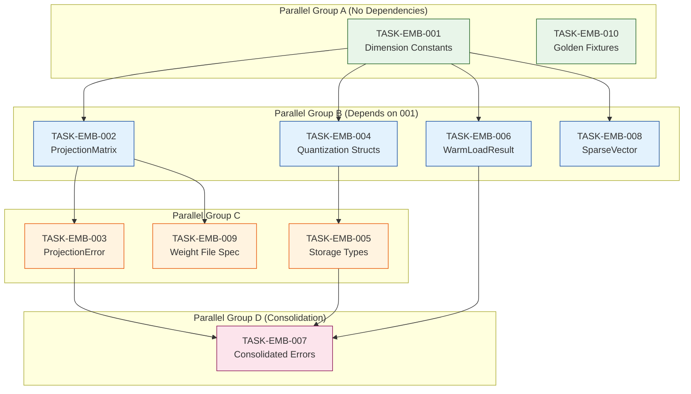

# Foundation Layer Atomic Tasks Index

<task_index id="INDEX-EMB-FOUNDATION" version="1.0">

## Metadata

| Field | Value |
|-------|-------|
| **Document ID** | INDEX-EMB-FOUNDATION |
| **Title** | Foundation Layer Atomic Task Index |
| **Version** | 1.0 |
| **Created** | 2026-01-06 |
| **Status** | Complete |
| **Total Tasks** | 10 |
| **Layer** | Foundation (Data Structures, Types, Constants) |

---

## Overview

This directory contains all **10 Foundation Layer** atomic tasks for the Embedding Pipeline fix. These tasks establish the data structures, types, and constants that Logic and Surface layers depend on.

**Execution Guarantee**: If all Foundation tasks complete in sequence, the Logic Layer tasks can begin.

---

## Task List

| Task ID | Title | Complexity | Dependencies | Parallel Group |
|---------|-------|------------|--------------|----------------|
| [TASK-EMB-001](./TASK-EMB-001.md) | Fix Dimension Constants | Low | None | A |
| [TASK-EMB-002](./TASK-EMB-002.md) | Create ProjectionMatrix Struct | Medium | 001 | B |
| [TASK-EMB-003](./TASK-EMB-003.md) | Create ProjectionError Enum | Low | 002 | C |
| [TASK-EMB-004](./TASK-EMB-004.md) | Create Quantization Structs | Medium | 001 | B |
| [TASK-EMB-005](./TASK-EMB-005.md) | Create Storage Types | Medium | 004 | C |
| [TASK-EMB-006](./TASK-EMB-006.md) | Create WarmLoadResult Struct | Medium | 001 | B |
| [TASK-EMB-007](./TASK-EMB-007.md) | Create Consolidated Errors | Medium | 003, 005, 006 | D |
| [TASK-EMB-008](./TASK-EMB-008.md) | Update SparseVector Struct | Low | 001 | B |
| [TASK-EMB-009](./TASK-EMB-009.md) | Create Weight File Spec | Low | 002 | C |
| [TASK-EMB-010](./TASK-EMB-010.md) | Create Golden Reference Fixtures | Low | None | A |

---

## Dependency Graph



---

## Execution Order

### Batch 1 (Start Immediately)
Execute in parallel:
- **TASK-EMB-001**: Fix Dimension Constants
- **TASK-EMB-010**: Create Golden Reference Fixtures

### Batch 2 (After Batch 1)
Execute in parallel:
- **TASK-EMB-002**: Create ProjectionMatrix Struct
- **TASK-EMB-004**: Create Quantization Structs
- **TASK-EMB-006**: Create WarmLoadResult Struct
- **TASK-EMB-008**: Update SparseVector Struct

### Batch 3 (After Batch 2)
Execute in parallel:
- **TASK-EMB-003**: Create ProjectionError Enum
- **TASK-EMB-005**: Create Storage Types
- **TASK-EMB-009**: Create Weight File Spec

### Batch 4 (Consolidation)
Execute:
- **TASK-EMB-007**: Create Consolidated Errors

---

## Critical Path

The longest dependency chain:

```
TASK-EMB-001 → TASK-EMB-002 → TASK-EMB-003 → TASK-EMB-007
```

**Critical Path Length**: 4 tasks

---

## Files Created Per Task

| Task | Files Created |
|------|---------------|
| TASK-EMB-001 | `config/constants.rs` |
| TASK-EMB-002 | `sparse/projection.rs` |
| TASK-EMB-003 | `sparse/error.rs` |
| TASK-EMB-004 | `quantization/types.rs`, `quantization/mod.rs` |
| TASK-EMB-005 | `storage/types.rs`, `storage/mod.rs` |
| TASK-EMB-006 | `warm/types.rs` |
| TASK-EMB-007 | `error.rs` (embeddings crate root) |
| TASK-EMB-008 | `sparse/types.rs` (modify) |
| TASK-EMB-009 | `sparse/weight_spec.rs` |
| TASK-EMB-010 | `testing/golden.rs`, `tests/fixtures/golden/` |

---

## Progress Tracking

| Task ID | Status | Started | Completed | Notes |
|---------|--------|---------|-----------|-------|
| TASK-EMB-001 | ⏳ Pending | - | - | |
| TASK-EMB-002 | ⏳ Pending | - | - | |
| TASK-EMB-003 | ⏳ Pending | - | - | |
| TASK-EMB-004 | ⏳ Pending | - | - | |
| TASK-EMB-005 | ⏳ Pending | - | - | |
| TASK-EMB-006 | ⏳ Pending | - | - | |
| TASK-EMB-007 | ⏳ Pending | - | - | |
| TASK-EMB-008 | ⏳ Pending | - | - | |
| TASK-EMB-009 | ⏳ Pending | - | - | |
| TASK-EMB-010 | ⏳ Pending | - | - | |

---

## Status Legend

- ⏳ Pending — Ready to start
- 🔄 In Progress — Currently being worked on
- ✅ Complete — Finished and verified
- ⛔ Blocked — Waiting on dependencies
- ❌ Failed — Needs revision

---

## Validation Checklist

Before proceeding to Logic Layer:

- [ ] All 10 Foundation tasks complete
- [ ] `cargo check -p context-graph-core` passes
- [ ] `cargo check -p context-graph-embeddings` passes
- [ ] No hardcoded dimension values (768, 1536) outside constants.rs
- [ ] All error types have Constitution-compliant codes
- [ ] tests/fixtures/golden/ directory exists

---

## Related Documents

| Document | Path |
|----------|------|
| Traceability Matrix | `../TRACEABILITY-MATRIX.md` |
| Full Task Index | `../TASK-INDEX.md` |
| Logic Layer Tasks | `../TASK-EMB-LOGIC.md` |
| Constitution | `../../../../constitution.yaml` |
| Atomic Task Framework | `../../../../atomictask.md` |

---

## Next Steps

After Foundation Layer is complete:
1. Begin Logic Layer tasks (TASK-EMB-011 to TASK-EMB-020)
2. See `../TASK-EMB-LOGIC.md` for specifications

</task_index>
