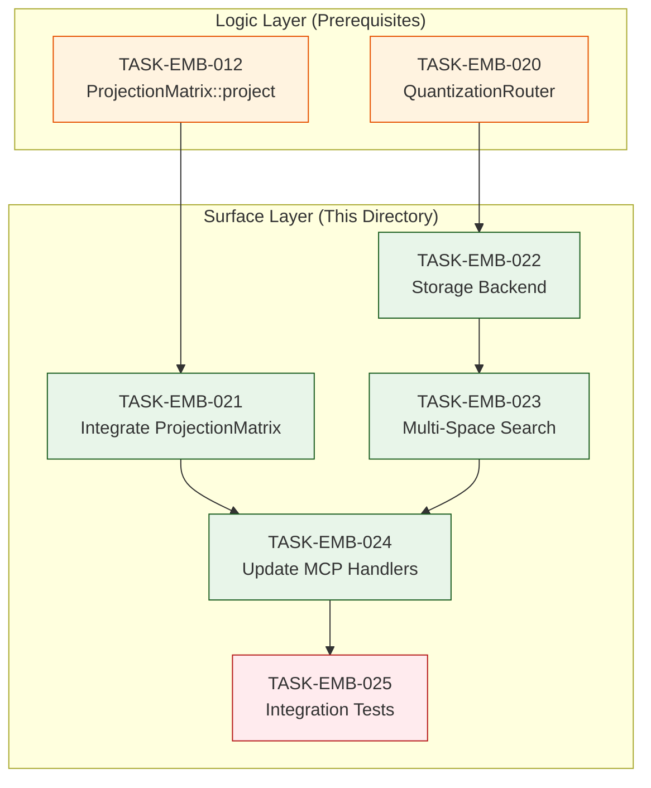

# Surface Layer Tasks Index

<task_index id="INDEX-EMB-SURFACE" version="1.0">

## Metadata

| Field | Value |
|-------|-------|
| **Index ID** | INDEX-EMB-SURFACE |
| **Title** | Surface Layer Atomic Task Index |
| **Version** | 1.0 |
| **Created** | 2026-01-06 |
| **Status** | Complete |
| **Total Tasks** | 5 |
| **Layer** | Surface (API Integration, Handlers, Tests) |
| **Depends On** | Foundation Layer (TASK-EMB-001-010), Logic Layer (TASK-EMB-011-020) |

---

## Overview

This directory contains individual atomic task specifications for the **Surface Layer** of the embedding pipeline fix. These tasks integrate Foundation and Logic layer work into the public API.

### Layer Execution Order

```
Foundation Layer (TASK-EMB-001 through TASK-EMB-010)
         |
         v  (ALL MUST COMPLETE)
Logic Layer (TASK-EMB-011 through TASK-EMB-020)
         |
         v  (ALL MUST COMPLETE)
Surface Layer (This Directory)
         |
         v
Production Ready
```

---

## Task Listing

| Task ID | Title | Dependencies | Complexity | Status |
|---------|-------|--------------|------------|--------|
| [TASK-EMB-021](./TASK-EMB-021.md) | Integrate ProjectionMatrix into SparseModel | TASK-EMB-012 | Medium | Ready |
| [TASK-EMB-022](./TASK-EMB-022.md) | Implement Storage Backend (RocksDB) | TASK-EMB-020 | High | Ready |
| [TASK-EMB-023](./TASK-EMB-023.md) | Implement Multi-Space Search (HNSW + RRF) | TASK-EMB-022 | High | Ready |
| [TASK-EMB-024](./TASK-EMB-024.md) | Update MCP Handlers | TASK-EMB-021, TASK-EMB-023 | Medium | Ready |
| [TASK-EMB-025](./TASK-EMB-025.md) | Integration Tests | All previous | High | Ready |

---

## Dependency Graph



---

## Execution Order

### Parallel Track A: SparseModel Integration
```
TASK-EMB-012 (Logic - prerequisite)
         |
         v
TASK-EMB-021 (Integrate ProjectionMatrix)
         |
         +---> TASK-EMB-024 (MCP Handlers)
```

### Parallel Track B: Storage + Search
```
TASK-EMB-020 (Logic - prerequisite)
         |
         v
TASK-EMB-022 (Storage Backend)
         |
         v
TASK-EMB-023 (Multi-Space Search)
         |
         +---> TASK-EMB-024 (MCP Handlers)
```

### Convergence Point
```
TASK-EMB-024 (requires both Track A and Track B)
         |
         v
TASK-EMB-025 (Integration Tests - Final)
```

---

## Requirements Traceability

| Requirement | Task(s) |
|-------------|---------|
| REQ-EMB-001 (Learned Sparse Projection) | TASK-EMB-021 |
| REQ-EMB-006 (Storage Module) | TASK-EMB-022, TASK-EMB-023 |
| REQ-EMB-007 (Performance Compliance) | TASK-EMB-025 |
| All REQs | TASK-EMB-024 |

---

## Complexity Summary

| Complexity | Count | Tasks |
|------------|-------|-------|
| Medium | 2 | TASK-EMB-021, TASK-EMB-024 |
| High | 3 | TASK-EMB-022, TASK-EMB-023, TASK-EMB-025 |

---

## Files Created by Surface Layer

| File | Task |
|------|------|
| `models/pretrained/sparse/model.rs` (modified) | TASK-EMB-021 |
| `storage/backend.rs` | TASK-EMB-022 |
| `storage/rocksdb.rs` | TASK-EMB-022 |
| `storage/multi_space.rs` | TASK-EMB-023 |
| MCP handlers (modified) | TASK-EMB-024 |
| `tests/integration/*.rs` | TASK-EMB-025 |

---

## Critical Path

The critical path through Surface Layer:

```
TASK-EMB-022 (Storage) → TASK-EMB-023 (Search) → TASK-EMB-024 (Handlers) → TASK-EMB-025 (Tests)
```

**Critical Path Length:** 4 tasks

---

## Quick Start

### Start with (No Dependencies within Surface Layer)

These tasks can be started immediately once Logic Layer is complete:

1. **TASK-EMB-021** - Requires TASK-EMB-012
2. **TASK-EMB-022** - Requires TASK-EMB-020

### Final Task

**TASK-EMB-025** - Depends on ALL other tasks. This is the final validation.

---

## Completion Checklist

- [ ] TASK-EMB-021: ProjectionMatrix integrated into SparseModel
- [ ] TASK-EMB-022: RocksDB storage backend implemented
- [ ] TASK-EMB-023: Multi-space HNSW + RRF search working
- [ ] TASK-EMB-024: All MCP handlers using real embeddings
- [ ] TASK-EMB-025: All integration tests passing

---

## Memory Keys

Store completion status:
```
contextgraph/embedding-issues/surface-tasks/task-emb-021-complete
contextgraph/embedding-issues/surface-tasks/task-emb-022-complete
contextgraph/embedding-issues/surface-tasks/task-emb-023-complete
contextgraph/embedding-issues/surface-tasks/task-emb-024-complete
contextgraph/embedding-issues/surface-tasks/task-emb-025-complete
contextgraph/embedding-issues/surface-layer-complete
```

</task_index>
