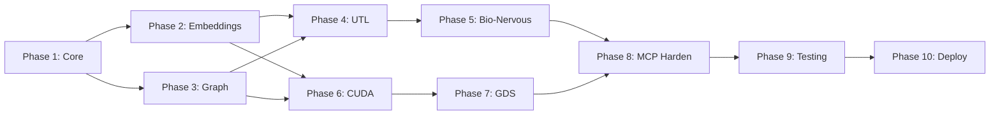

#### Tool: `reload_manifest`

```json
{
  "name": "reload_manifest",
  "description": "ADMIN COMMAND: Apply user edits from ~/.context-graph/manifest.md. Users can edit this file to merge/delete concepts without knowing UUIDs. Call when user says 'I edited the manifest' or 'I fixed the graph manually'.",
  "inputSchema": {
    "type": "object",
    "properties": {
      "preview": {
        "type": "boolean",
        "default": true,
        "description": "If true, show what would change without applying"
      },
      "manifest_path": {
        "type": "string",
        "default": "~/.context-graph/manifest.md",
        "description": "Path to manifest file (usually default)"
      }
    }
  },
  "outputSchema": {
    "type": "object",
    "properties": {
      "changes_detected": {
        "type": "array",
        "items": {
          "type": "object",
          "properties": {
            "action": { "type": "string", "enum": ["delete", "merge", "annotate"] },
            "target_concepts": { "type": "array", "items": { "type": "string" } },
            "resolved_node_ids": { "type": "array", "items": { "type": "string", "format": "uuid" } }
          }
        }
      },
      "applied": { "type": "boolean" },
      "errors": { "type": "array", "items": { "type": "string" } }
    }
  }
}
```

#### Tool: `reflect_on_memory`

```json
{
  "name": "reflect_on_memory",
  "description": "TOOL ORCHESTRATOR: Instead of deciding which search tool to use, provide your goal. System returns a suggested sequence of tool calls based on current UTL state. Reduces 'decision paralysis' from 20+ tools.",
  "inputSchema": {
    "type": "object",
    "properties": {
      "goal": {
        "type": "string",
        "description": "What you're trying to achieve. Example: 'Find all security constraints for this API', 'Understand why X causes Y', 'Discover connections I might have missed'",
        "minLength": 10,
        "maxLength": 500
      },
      "session_id": { "type": "string", "format": "uuid" },
      "max_steps": {
        "type": "integer",
        "minimum": 1,
        "maximum": 5,
        "default": 3,
        "description": "Maximum tool calls in suggested sequence"
      }
    },
    "required": ["goal"]
  },
  "outputSchema": {
    "type": "object",
    "properties": {
      "reasoning": {
        "type": "string",
        "description": "Why this sequence was chosen based on UTL state"
      },
      "suggested_sequence": {
        "type": "array",
        "items": {
          "type": "object",
          "properties": {
            "step": { "type": "integer" },
            "tool": { "type": "string" },
            "params": { "type": "object" },
            "rationale": { "type": "string" }
          }
        },
        "description": "Ordered list of tool calls to achieve goal"
      },
      "utl_context": {
        "type": "object",
        "properties": {
          "entropy": { "type": "number" },
          "coherence": { "type": "number" },
          "triggered_by": { "type": "string", "enum": ["high_entropy", "low_coherence", "balanced"] }
        }
      }
    }
  }
}
```

**Example Response**:
```json
{
  "reasoning": "High Entropy detected (0.72). Starting with epistemic_action to clarify, then query_causal for relationships.",
  "suggested_sequence": [
    { "step": 1, "tool": "epistemic_action", "params": {}, "rationale": "Reduce uncertainty first" },
    { "step": 2, "tool": "query_causal", "params": { "action": "API design" }, "rationale": "Find cause-effect chains" },
    { "step": 3, "tool": "inject_context", "params": { "verbosity_level": 2 }, "rationale": "Full context needed" }
  ]
}
```

#### Tool: `get_system_logs`

```json
{
  "name": "get_system_logs",
  "description": "THALAMIC NOTIFICATION: See why the system pruned, quarantined, or modified nodes. Explains 'amnesia' to the user. Use when agent's memory seems incomplete or when user questions missing information.",
  "inputSchema": {
    "type": "object",
    "properties": {
      "log_type": {
        "type": "string",
        "enum": ["all", "quarantine", "prune", "merge", "dream_actions", "adversarial_blocks"],
        "default": "all",
        "description": "Filter log entries by action type"
      },
      "node_id": {
        "type": "string",
        "format": "uuid",
        "description": "Get logs for specific node (optional)"
      },
      "since": {
        "type": "string",
        "format": "date-time",
        "description": "Get logs since this timestamp (default: last 24 hours)"
      },
      "limit": {
        "type": "integer",
        "minimum": 1,
        "maximum": 100,
        "default": 20
      }
    }
  },
  "outputSchema": {
    "type": "object",
    "properties": {
      "entries": {
        "type": "array",
        "items": {
          "type": "object",
          "properties": {
            "timestamp": { "type": "string", "format": "date-time" },
            "action": { "type": "string", "enum": ["quarantine", "prune", "merge", "dream_consolidation", "adversarial_block"] },
            "node_ids": { "type": "array", "items": { "type": "string", "format": "uuid" } },
            "reason": { "type": "string" },
            "details": { "type": "string" },
            "recoverable": { "type": "boolean", "description": "Can this action be undone?" },
            "recovery_tool": { "type": "string", "description": "Which tool to use for recovery (e.g., restore_concept)" }
          }
        }
      },
      "explanation_for_user": {
        "type": "string",
        "description": "Human-readable explanation to share with user. Example: 'I'm having trouble connecting X and Y because the graph detected a circular logic error in that premise.'"
      }
    }
  }
}
```

**Use Case**: User asks "Why don't you remember X?" → Agent calls `get_system_logs` → Explains "That memory was quarantined due to detected circular logic. I can restore it if you confirm it's correct."

#### Tool: `hydrate_citation`

```json
{
  "name": "hydrate_citation",
  "description": "TRACEABILITY: Expand citation tags from distilled context to raw source content. Use when distilled summary seems vague or potentially hallucinated. Citation tags appear as [node_uuid] in inject_context narratives.",
  "inputSchema": {
    "type": "object",
    "properties": {
      "citation_tags": {
        "type": "array",
        "items": { "type": "string" },
        "description": "Citation tags to expand (e.g., ['node_abc123', 'node_xyz789'])",
        "minItems": 1,
        "maxItems": 10
      },
      "include_neighbors": {
        "type": "boolean",
        "default": false,
        "description": "Also return 1-hop neighbors for additional context"
      },
      "verbosity_level": {
        "type": "integer",
        "enum": [0, 1, 2],
        "default": 1
      }
    },
    "required": ["citation_tags"]
  },
  "outputSchema": {
    "type": "object",
    "properties": {
      "expansions": {
        "type": "array",
        "items": {
          "type": "object",
          "properties": {
            "citation_tag": { "type": "string" },
            "raw_content": { "type": "string" },
            "importance": { "type": "number" },
            "created_at": { "type": "string", "format": "date-time" },
            "agent_id": { "type": "string" },
            "neighbors": { "type": "array", "items": { "type": "string" } }
          }
        }
      },
      "tokens_used": { "type": "integer" }
    }
  }
}
```

**Anti-Hallucination**: When `inject_context` distills, agent loses raw data. Citation tags let agent "drill down" selectively without re-fetching everything.

#### Tool: `critique_context`

```json
{
  "name": "critique_context",
  "description": "AUTHORITY BIAS DEFENSE: Ask the system to find nodes that contradict your current reasoning. Uses Layer 5 (Coherence) as automatic Fact Checker. Call when you've summarized context and want to verify you haven't hallucinated.",
  "inputSchema": {
    "type": "object",
    "properties": {
      "reasoning_summary": {
        "type": "string",
        "description": "Your current reasoning/conclusions to fact-check against the graph",
        "minLength": 20,
        "maxLength": 2000
      },
      "focal_nodes": {
        "type": "array",
        "items": { "type": "string", "format": "uuid" },
        "description": "Optional: Specific nodes to check against. If empty, searches entire active context."
      },
      "contradiction_threshold": {
        "type": "number",
        "minimum": 0.3,
        "maximum": 0.9,
        "default": 0.5,
        "description": "How strict? 0.3=surface contradictions, 0.9=only obvious conflicts"
      }
    },
    "required": ["reasoning_summary"]
  },
  "outputSchema": {
    "type": "object",
    "properties": {
      "contradictions_found": { "type": "boolean" },
      "contradiction_count": { "type": "integer" },
      "contradicting_nodes": {
        "type": "array",
        "items": {
          "type": "object",
          "properties": {
            "node_id": { "type": "string", "format": "uuid" },
            "content_snippet": { "type": "string", "maxLength": 200 },
            "contradiction_type": { "type": "string", "enum": ["causal_conflict", "factual_conflict", "temporal_conflict", "logical_conflict"] },
            "confidence": { "type": "number" },
            "explanation": { "type": "string" }
          }
        }
      },
      "suggested_action": {
        "type": "string",
        "enum": ["revise_reasoning", "merge_conflicting_nodes", "ask_user", "ignore_low_confidence"]
      }
    }
  }
}
```

**Use Case**: Agent summarizes "The API uses JWT tokens." → Calls `critique_context` → System finds node saying "API migrated to OAuth2 in v2.1" → Agent corrects before responding.

#### Tool: `get_node_lineage`

```json
{
  "name": "get_node_lineage",
  "description": "SEMANTIC VERSIONING: See how a knowledge node has evolved over time—merges, annotations, dream consolidations. Use when Agent B needs to understand changes Agent A made to shared knowledge.",
  "inputSchema": {
    "type": "object",
    "properties": {
      "node_id": {
        "type": "string",
        "format": "uuid",
        "description": "Node to trace lineage for"
      },
      "depth": {
        "type": "integer",
        "minimum": 1,
        "maximum": 20,
        "default": 5,
        "description": "How many changes back to trace"
      },
      "include_content_diffs": {
        "type": "boolean",
        "default": false,
        "description": "Include before/after content for each change"
      }
    },
    "required": ["node_id"]
  },
  "outputSchema": {
    "type": "object",
    "properties": {
      "node_id": { "type": "string", "format": "uuid" },
      "current_content": { "type": "string" },
      "lineage": {
        "type": "array",
        "items": {
          "type": "object",
          "properties": {
            "timestamp": { "type": "string", "format": "date-time" },
            "change_type": { "type": "string", "enum": ["created", "merged", "annotated", "dreamed", "boosted", "pruned", "restored"] },
            "actor": {
              "type": "object",
              "properties": {
                "type": { "type": "string", "enum": ["agent", "system", "user"] },
                "id": { "type": "string" }
              }
            },
            "description": { "type": "string" },
            "content_before": { "type": "string" },
            "content_after": { "type": "string" },
            "reversal_hash": { "type": "string", "description": "For one-click rollback" }
          }
        }
      },
      "merged_from": {
        "type": "array",
        "items": { "type": "string", "format": "uuid" },
        "description": "Nodes that were merged into this one"
      },
      "forked_to": {
        "type": "array",
        "items": { "type": "string", "format": "uuid" },
        "description": "Nodes that were created from this one"
      }
    }
  }
}
```

**Multi-Agent Accountability**: Agent B sees "This node was merged by agent-python-coder at 2024-01-15. Original nodes: X, Y. Reason: 'Duplicate variable naming concepts.'"

---

### 1.2.5 Steering Subsystem Tools (Marblestone-Inspired)

These tools expose the Steering Subsystem's feedback mechanisms, enabling agents to learn from reward signals and use advanced inference patterns.

#### Tool: `get_steering_feedback`

```json
{
  "name": "get_steering_feedback",
  "description": "DOPAMINE LEARNING: Get cumulative steering rewards for recent storage operations. Use to understand if your storage strategy is being rewarded or penalized by the Steering Subsystem (Gardener + Curator).",
  "inputSchema": {
    "type": "object",
    "properties": {
      "lookback_count": {
        "type": "integer",
        "default": 10,
        "minimum": 1,
        "maximum": 100,
        "description": "Number of recent storage operations to analyze"
      },
      "session_id": {
        "type": "string",
        "format": "uuid",
        "description": "Optional: Filter to specific session"
      }
    }
  },
  "outputSchema": {
    "type": "object",
    "properties": {
      "cumulative_dopamine": {
        "type": "number",
        "description": "Sum of all dopamine signals. Positive = mostly rewarded. Negative = mostly penalized."
      },
      "average_dopamine": {
        "type": "number",
        "description": "Average dopamine per operation. Target: > 0.2"
      },
      "reward_breakdown": {
        "type": "object",
        "properties": {
          "novelty_rewards": { "type": "number" },
          "coherence_rewards": { "type": "number" },
          "duplication_penalties": { "type": "number" },
          "low_priors_penalties": { "type": "number" }
        }
      },
      "lifecycle_stage": {
        "type": "string",
        "enum": ["infancy", "growth", "maturity"],
        "description": "Current system lifecycle affecting reward weights"
      },
      "behavioral_recommendations": {
        "type": "array",
        "items": { "type": "string" },
        "description": "Suggested adjustments based on reward patterns"
      }
    }
  }
}
```

**Use Case**: Agent notices low cumulative dopamine → Calls `get_steering_feedback` → Discovers "duplication_penalties: -3.2" → Realizes it's storing too many near-duplicates → Adjusts to check for existing similar nodes before storing.

#### Tool: `omni_infer`

```json
{
  "name": "omni_infer",
  "description": "OMNIDIRECTIONAL INFERENCE: Predict unknown variables given known (clamped) ones. Unlike standard search (query→results), this supports bidirectional reasoning: forward (cause→effect), backward (effect→cause), bridge (A↔B path), and abduction (observations→explanation).",
  "inputSchema": {
    "type": "object",
    "properties": {
      "query_type": {
        "type": "string",
        "enum": ["forward", "backward", "bridge", "abduction"],
        "description": "forward: clamp cause, predict effects. backward: clamp effect, predict causes. bridge: clamp both ends, predict connectors. abduction: clamp observations, predict latent explanation."
      },
      "clamped_nodes": {
        "type": "array",
        "items": {
          "type": "object",
          "properties": {
            "node_id": { "type": "string", "format": "uuid" },
            "clamp_type": {
              "type": "string",
              "enum": ["binary", "scalar", "semantic"],
              "default": "binary"
            },
            "clamp_value": {
              "oneOf": [
                { "type": "boolean" },
                { "type": "number" },
                { "type": "array", "items": { "type": "number" }, "minItems": 1536, "maxItems": 1536 }
              ],
              "description": "For binary: true/false. For scalar: 0-1. For semantic: 1536D embedding vector."
            }
          },
          "required": ["node_id"]
        },
        "minItems": 1,
        "description": "Known variables to clamp (fix their values)"
      },
      "predict_nodes": {
        "type": "array",
        "items": { "type": "string", "format": "uuid" },
        "description": "Optional: specific nodes to predict. If omitted, system predicts connected unknown nodes."
      },
      "max_iterations": {
        "type": "integer",
        "default": 50,
        "maximum": 200,
        "description": "Max belief propagation iterations"
      }
    },
    "required": ["query_type", "clamped_nodes"]
  },
  "outputSchema": {
    "type": "object",
    "properties": {
      "predictions": {
        "type": "array",
        "items": {
          "type": "object",
          "properties": {
            "node_id": { "type": "string", "format": "uuid" },
            "node_content": { "type": "string" },
            "predicted_value": { "type": "number" },
            "confidence": { "type": "number" }
          }
        }
      },
      "inference_path": {
        "type": "array",
        "items": { "type": "string" },
        "description": "For bridge queries: the connecting path found"
      },
      "convergence_iterations": { "type": "integer" },
      "overall_confidence": { "type": "number" }
    }
  }
}
```

**Use Cases**:
- **Forward**: "I'm calling API endpoint X. What might break?" → Clamp X, predict error nodes
- **Backward**: "This test failed. Why?" → Clamp failure, predict cause nodes
- **Bridge**: "How does authentication relate to logging?" → Clamp both, predict connection nodes
- **Abduction**: "All these 5 files were modified. What task were they part of?" → Clamp files, predict task node

#### Tool: `verify_code_node`

```json
{
  "name": "verify_code_node",
  "description": "FORMAL VERIFICATION: Mechanically verify that a code node's implementation satisfies its specification. Uses SMT solving (Z3-inspired). Returns verified/failed/timeout. Verified nodes get +0.2 coherence boost.",
  "inputSchema": {
    "type": "object",
    "properties": {
      "node_id": {
        "type": "string",
        "format": "uuid",
        "description": "Node containing code to verify"
      },
      "verification_spec": {
        "type": "object",
        "properties": {
          "description": {
            "type": "string",
            "description": "Human-readable description of what's being verified"
          },
          "precondition": {
            "type": "string",
            "description": "Formal precondition (e.g., 'x > 0 ∧ y > 0')"
          },
          "postcondition": {
            "type": "string",
            "description": "Formal postcondition (e.g., 'result = x * y')"
          },
          "invariants": {
            "type": "array",
            "items": { "type": "string" },
            "description": "Loop invariants if applicable"
          }
        },
        "required": ["description", "postcondition"]
      },
      "timeout_ms": {
        "type": "integer",
        "default": 5000,
        "maximum": 30000,
        "description": "Max time for SMT solving"
      }
    },
    "required": ["node_id", "verification_spec"]
  },
  "outputSchema": {
    "type": "object",
    "properties": {
      "status": {
        "type": "string",
        "enum": ["verified", "failed", "timeout", "not_applicable"],
        "description": "Verification result"
      },
      "proof_hash": {
        "type": "string",
        "description": "If verified: hash of proof for caching"
      },
      "counterexample": {
        "type": "string",
        "description": "If failed: example inputs that violate the spec"
      },
      "coherence_adjustment": {
        "type": "number",
        "description": "Adjustment applied to node's coherence score (+0.2 for verified, -0.3 for failed)"
      }
    }
  }
}
```

**Use Case**: Agent stores a sorting algorithm → Calls `verify_code_node` with spec "postcondition: sorted(arr)" → Gets "verified" → Node's coherence boosted → Future retrieval prioritizes verified implementations.

---

#### Tool: `get_system_instructions`

```json
{
  "name": "get_system_instructions",
  "description": "COGNITIVE HANDSHAKE: Returns high-density system prompt fragment explaining Bio-Nervous mental model. Agent MUST keep this in context window. Explains: I am not a database—I am your nervous system.",
  "inputSchema": { "type": "object", "properties": {} },
  "outputSchema": {
    "type": "object",
    "properties": {
      "system_prompt_fragment": {
        "type": "string",
        "description": "Inject this verbatim into your working context. ~300 tokens."
      },
      "critical_behaviors": {
        "type": "array",
        "items": {
          "type": "object",
          "properties": {
            "trigger": { "type": "string" },
            "action": { "type": "string" },
            "tool": { "type": "string" }
          }
        },
        "description": "When X happens → do Y with tool Z"
      },
      "antipatterns": {
        "type": "array",
        "items": { "type": "string" },
        "description": "Common agent mistakes to avoid"
      }
    }
  }
}
```

**Sample `system_prompt_fragment`**:
```
I am your Bio-Nervous System—not a database, but your extended cognition.

CRITICAL BEHAVIORS:
1. If I return high entropy (>0.7): Call `epistemic_action` to clarify BEFORE proceeding
2. If I return low coherence (<0.4): Process `curation_tasks` or trigger_dream
3. Your secondary job is "Librarian"—process curation_tasks when I signal them
4. Citation tags [node_xyz] in my responses are NOT decorative—use hydrate_citation when uncertain

ANTIPATTERNS:
- Never trust distilled summaries blindly (hydrate_citation exists for a reason)
- Never merge_concepts without checking priors_vibe_check compatibility
- Never store_memory without rationale explaining WHY
```

### 1.3 MCP Resources Schema

#### Resource: `context://`

```json
{
  "uri": "context://{scope}",
  "name": "Context Resource",
  "description": "Access current context state",
  "mimeType": "application/json",
  "uriTemplate": {
    "scope": {
      "type": "string",
      "enum": ["current", "session", "global"],
      "default": "current"
    },
    "format": {
      "type": "string",
      "enum": ["json", "markdown"],
      "default": "json"
    }
  }
}
```

#### Resource: `graph://`

```json
{
  "uri": "graph://{node_id}",
  "name": "Graph Node Resource",
  "description": "Access specific knowledge graph nodes",
  "mimeType": "application/json"
}
```

#### Resource: `utl://`

```json
{
  "uri": "utl://{session_id}/state",
  "name": "UTL State Resource",
  "description": "Access UTL learning state for a session",
  "mimeType": "application/json"
}
```

#### Resource: `utl://current_session/pulse` (State Persistence via MCP Subscriptions)

**📡 PULSE AS PROTOCOL**: This is not just a header—it's a subscribable resource. The MCP host can subscribe and inject Mental State Updates every N turns, even when the agent is in a long thought loop without tool calls.

```json
{
  "uri": "utl://current_session/pulse",
  "name": "Cognitive Pulse Resource",
  "description": "SUBSCRIBABLE: MCP host subscribes to this resource and injects state updates into agent context every 5 turns. Prevents agent from losing mental state awareness during long reasoning chains.",
  "mimeType": "application/json",
  "subscribable": true,
  "updateInterval": "5s",
  "autoInjectEveryNTurns": 5,
  "schema": {
    "entropy": { "type": "number", "description": "Current entropy level (0-1)" },
    "coherence": { "type": "number", "description": "Current coherence level (0-1)" },
    "lifecycle": { "type": "string", "enum": ["infancy", "growth", "maturity"] },
    "suggested_action": { "type": "string" },
    "curation_tasks_pending": { "type": "integer" },
    "thought_loop_warning": { "type": "boolean", "description": "True if agent hasn't called tools in 5+ turns" }
  }
}
```

**Subscription Protocol** (MCP Host Implementation):
```javascript
// Host subscribes to pulse resource
client.subscribeResource("utl://current_session/pulse", (pulse) => {
  // Every 5 turns, inject mental state reminder into agent context
  if (turnsSinceLastToolCall >= 5) {
    injectSystemMessage(`[Mental State Update] Entropy: ${pulse.entropy}, Coherence: ${pulse.coherence}. Suggested: ${pulse.suggested_action}`);
  }
});
```

**Why**: Agents "forget" they have tools when context window rolls over. Subscription-based injection keeps agent anchored without requiring explicit tool calls. Solves the "long thought loop loses state" problem.

#### Resource: `admin://manifest` (Human-In-The-Loop Knowledge Manifest)

```json
{
  "uri": "admin://manifest",
  "name": "Knowledge Manifest Resource",
  "description": "HUMAN ADMIN COMMAND: Markdown file that users can edit to fix the graph without knowing UUIDs. Deleting a line triggers forget_concept. Adding [MERGE: A, B] triggers merge_concepts. Agent calls reload_manifest to apply.",
  "mimeType": "text/markdown",
  "writable": true,
  "schema": {
    "format": "markdown",
    "sections": {
      "concepts": "List of concept names (one per line). Delete to forget.",
      "merges": "[MERGE: ConceptA, ConceptB] directives",
      "annotations": "[NOTE: ConceptName] Additional context"
    }
  },
  "example_content": "# Knowledge Manifest\n\n## Active Concepts\n- UserAuthentication\n- JWTTokenValidation\n- RateLimiting\n- APIEndpoints\n\n## Pending Merges\n[MERGE: JWTTokenValidation, OAuth2Validation]\n\n## Notes\n[NOTE: RateLimiting] Deprecated in v2.0, use CircuitBreaker instead"
}
```

**User Workflow**:
1. User opens `~/.context-graph/manifest.md`
2. Deletes "OldConcept" line (wants it forgotten)
3. Adds `[MERGE: ConceptA, ConceptB]` (spots duplicates)
4. Says "I edited the manifest"
5. Agent calls `reload_manifest` → changes applied

**Why**: Users see graph issues agents can't fix. This gives non-technical users admin control without UUID complexity.

#### Resource: `visualize://` (Human-In-The-Loop Override)

```json
{
  "uri": "visualize://{scope}/{topic}",
  "name": "Graph Visualization Resource",
  "description": "THALAMIC OVERRIDE: Returns Mermaid.js or D3.js compatible JSON for rendering graph neighborhoods. Use when agent is confused AND graph may have Semantic Cancer—human can visually identify merge opportunities.",
  "mimeType": "application/json",
  "uriTemplate": {
    "scope": {
      "type": "string",
      "enum": ["session", "topic", "node"],
      "description": "session=current active nodes, topic=semantic cluster, node=specific node neighborhood"
    },
    "topic": {
      "type": "string",
      "description": "Topic name for topic scope, or node_id for node scope"
    }
  },
  "schema": {
    "format": { "type": "string", "enum": ["mermaid", "d3", "graphviz"], "default": "mermaid" },
    "depth": { "type": "integer", "minimum": 1, "maximum": 5, "default": 2 },
    "include_weights": { "type": "boolean", "default": true },
    "highlight_conflicts": { "type": "boolean", "default": true }
  },
  "outputSchema": {
    "mermaid_code": { "type": "string", "description": "Ready-to-render Mermaid diagram" },
    "d3_json": { "type": "object", "description": "D3.js force-graph compatible JSON" },
    "nodes": { "type": "array", "items": { "type": "object" } },
    "edges": { "type": "array", "items": { "type": "object" } },
    "conflicts": {
      "type": "array",
      "items": {
        "type": "object",
        "properties": {
          "node_a": { "type": "string" },
          "node_b": { "type": "string" },
          "conflict_type": { "type": "string" }
        }
      }
    }
  }
}
```

**Use Case**: User says "Show me your memory map for Authentication" → Agent fetches `visualize://topic/authentication` → Returns Mermaid diagram → User spots "JWT" and "OAuth2" nodes that should be merged → Says "Merge those" → Agent calls `merge_concepts`.

### 1.3.5 Cross-Session Stitching (User Identity)

**Problem**: User talks via Claude Desktop, then CLI tool. Without stitching, they appear as different users with separate graphs.

**Solution**: Three-tier identity model:

| Layer | Scope | Persistence | Example |
|-------|-------|-------------|---------|
| **User** | Unified identity | Permanent | `user_abc123` |
| **Session** | Working memory | Per-terminal | `session_xyz789` |
| **Context** | Active subgraph | Per-conversation | Last 50 accessed nodes |

```json
{
  "user_identity": {
    "user_id": "Required. From MCP auth, config file, or OAuth.",
    "recognition_methods": [
      "mcp_auth_header",
      "~/.context-graph/user.json",
      "oauth_token_subject"
    ],
    "session_isolation": "Sessions have isolated working memory but share the User's graph",
    "context_filtering": "Each session's active_nodes filter what's immediately relevant"
  }
}
```

**Behavior**:
- Same `user_id` across Claude Desktop + CLI = shared graph
- Different `session_id` = isolated working memory (no cross-terminal confusion)
- `inject_context` prioritizes current session's `active_nodes` but can access full graph

### 1.4 MCP Prompts Schema

#### Prompt: `@context`

```json
{
  "name": "@context",
  "description": "Generate context-aware prompt with knowledge injection",
  "arguments": [
    { "name": "topic", "required": true },
    { "name": "depth", "required": false, "default": "standard" }
  ]
}
```

### 1.5 Error Codes

| Code | Message | Description |
|------|---------|-------------|
| -32700 | Parse error | Invalid JSON |
| -32600 | Invalid Request | Invalid JSON-RPC |
| -32601 | Method not found | Unknown method |
| -32602 | Invalid params | Invalid parameters |
| -32603 | Internal error | Server error |
| -32000 | SessionNotFound | Session ID invalid |
| -32001 | GraphQueryError | Graph query failed |
| -32002 | StorageError | Storage operation failed |
| -32003 | CausalInferenceError | Causal query failed |
| -32004 | RateLimitExceeded | Too many requests |

---

## 2. Implementation Roadmap

### 2.0 Phase 0: The "Ghost" Nervous System (CRITICAL: Validate UX First)

**Duration**: 2-4 weeks | **Goal**: Test agent-tool interaction before building the full backend

**Rationale**: The 49-week roadmap builds the "World's Greatest" engine, but you won't know if agents actually *use* the Bio-Nervous interface until they try it. Ship a functional loop in 4 weeks, iterate based on real usage.

```rust
/// Phase 0: Ghost Nervous System - Minimal viable backend
/// Full MCP interface + "dumb" implementation
pub struct GhostNervousSystem {
    /// SQLite for node/edge storage (no GPU)
    storage: SqlitePool,
    /// OpenAI/Cohere embeddings (external API, ~50ms latency)
    embedding_client: EmbeddingClient,
    /// Simple cosine similarity search (no FAISS GPU)
    search: BruteForceSearch,
}

impl GhostNervousSystem {
    /// UTL scores are MOCKED in Phase 0
    /// Randomize or use simple heuristics until real UTL is built
    fn mock_utl_state(&self) -> UTLState {
        UTLState {
            delta_s: rand::random::<f32>() * 0.5 + 0.25,  // 0.25-0.75
            delta_c: rand::random::<f32>() * 0.5 + 0.25,
            w_e: 1.0,
            phi: 0.0,
            johari: JohariQuadrant::Open,
            timestamp: Utc::now(),
        }
    }
}
```

**Phase 0 Deliverables**:
- [ ] Full MCP tool interface (all 20+ tools respond)
- [ ] SQLite storage (no GPU requirement)
- [ ] External embedding API (OpenAI/Cohere)
- [ ] Mocked UTL scores (random or keyword-density)
- [ ] `curation_tasks` populated with random samples for testing
- [ ] **Synthetic Data Seeding** (see below)
- [ ] **Tool Gating Enforcement** (see below)

### 2.0.1.1 Tool Gating (Entropy-Based Quality Warning)

**Problem**: Agents call `inject_context` with vague queries like "what do I know?" → High entropy → Low-quality retrieval → Agent hallucinates.

**Solution**: `inject_context` response includes `tool_gating_warning` when `utl_metrics.entropy > 0.8`.

```rust
/// Tool Gating Implementation - Phase 0.1
impl InjectContextHandler {
    pub async fn handle(&self, request: InjectContextRequest) -> InjectContextResponse {
        let result = self.retrieve_context(&request.query).await;
        
        // TOOL GATING: Check entropy threshold
        let warning = if result.utl_metrics.entropy > 0.8 {
            Some(ToolGatingWarning {
                triggered: true,
                entropy_score: result.utl_metrics.entropy,
                message: format!(
                    "Retrieval quality may be low due to high entropy ({:.2}). \
                     Suggest calling generate_search_plan or epistemic_action first \
                     to reduce entropy before retrying.",
                    result.utl_metrics.entropy
                ),
                suggested_tools: vec![
                    "generate_search_plan",  // Refines vague query into concrete plan
                    "epistemic_action",      // Explores unknown areas to reduce uncertainty
                    "expand_causal_path",    // Finds causal connections to anchor query
                ],
                auto_retry_after: false,
            })
        } else {
            None
        };
        
        InjectContextResponse {
            context: result.distilled_context,
            utl_metrics: result.utl_metrics,
            tool_gating_warning: warning,
            // ... other fields
        }
    }
}
```

**Agent Behavior**: When `tool_gating_warning.triggered == true`:
1. Agent SHOULD NOT trust the retrieved context blindly
2. Agent SHOULD call one of `suggested_tools` first
3. Agent SHOULD retry `inject_context` with a refined query
4. If agent ignores warning 3x consecutively → SONA flags as "entropy-blind" pattern

### 2.0.1 Synthetic Data Seeding (Cold-Start Bootstrap)

**Problem**: Empty graph = cold nervous system. Agents don't know how to use tools until there's enough "electricity" (data) running through it.

**Solution**: Phase 0 includes a seed script that generates the first 100+ nodes from existing project documentation.

```rust
/// Synthetic Data Seeder - Bootstrap empty graphs
/// Run once during project onboarding
pub struct DataSeeder {
    /// Source documents to parse (README, docs, code)
    pub sources: Vec<SeedSource>,
    /// Target node count (default: 100)
    pub target_nodes: usize,
    /// Causal link density (0.0-1.0)
    pub causal_density: f32,
}

#[derive(Clone)]
pub enum SeedSource {
    /// Parse README.md for project concepts
    Readme { path: PathBuf },
    /// Parse codebase for function/class descriptions
    Codebase { path: PathBuf, extensions: Vec<String> },
    /// Parse existing documentation
    Docs { path: PathBuf, glob: String },
    /// User-provided seed content
    Manual { content: String },
}

impl DataSeeder {
    /// Generate seed nodes with causal links
    pub async fn seed(&self, graph: &mut KnowledgeGraph) -> SeedReport {
        let mut report = SeedReport::default();

        for source in &self.sources {
            match source {
                SeedSource::Readme { path } => {
                    // Extract: project name, features, dependencies, usage patterns
                    let nodes = self.parse_readme(path).await;
                    report.nodes_created += nodes.len();
                    graph.bulk_insert(&nodes).await;
                }
                SeedSource::Codebase { path, extensions } => {
                    // Extract: function signatures, class docstrings, TODO comments
                    let nodes = self.parse_codebase(path, extensions).await;
                    report.nodes_created += nodes.len();
                    graph.bulk_insert(&nodes).await;
                }
                SeedSource::Docs { path, glob } => {
                    // Extract: headings, key concepts, links between docs
                    let nodes = self.parse_docs(path, glob).await;
                    report.nodes_created += nodes.len();
                    graph.bulk_insert(&nodes).await;
                }
                SeedSource::Manual { content } => {
                    // Directly embed user-provided content
                    let node = self.create_manual_node(content).await;
                    report.nodes_created += 1;
                    graph.insert(node).await;
                }
            }
        }

        // Create causal links between related concepts
        report.links_created = self.generate_causal_links(graph, self.causal_density).await;

        report
    }

    /// Generate causal links based on semantic similarity + document structure
    async fn generate_causal_links(&self, graph: &mut KnowledgeGraph, density: f32) -> usize {
        let nodes = graph.all_nodes().await;
        let mut links = 0;

        for (i, node_a) in nodes.iter().enumerate() {
            for node_b in nodes.iter().skip(i + 1) {
                let similarity = node_a.embedding.cosine_similarity(&node_b.embedding);

                // Create causal link if similar enough and random < density
                if similarity > 0.6 && rand::random::<f32>() < density {
                    graph.add_edge(GraphEdge {
                        source: node_a.id,
                        target: node_b.id,
                        edge_type: EdgeType::Semantic,
                        weight: similarity,
                        confidence: 0.7, // Low confidence for auto-generated
                        ..Default::default()
                    }).await;
                    links += 1;
                }
            }
        }

        links
    }
}

#[derive(Default, Debug)]
pub struct SeedReport {
    pub nodes_created: usize,
    pub links_created: usize,
    pub duration_ms: u64,
    pub sources_processed: Vec<String>,
}
```

**CLI Usage**:
```bash
# Seed from project README
bin/reasoning seed --source ./README.md

# Seed from entire codebase
bin/reasoning seed --source ./src --extensions ts,js,py

# Seed from docs folder
bin/reasoning seed --source ./docs --glob "**/*.md"

# Combined seeding (recommended for new projects)
bin/reasoning seed \
  --source ./README.md \
  --source ./docs \
  --source ./src \
  --target-nodes 200 \
  --causal-density 0.3
```

**Why This Works**: After seeding, agents have:
1. Project-specific vocabulary in the embedding space
2. Initial causal links showing concept relationships
3. Enough nodes to trigger meaningful UTL dynamics
4. No more "empty graph → low coherence → epistemic spam" loop

### 2.0.2 Phase 0 Additional Deliverables

- [ ] `get_memetic_status` returns plausible data
- [ ] Dream phase simulated (no real consolidation)

**Success Criteria**: Agent calls `get_graph_manifest` on first contact, uses `get_memetic_status` when confused, and processes `curation_tasks` when prompted.

**After Phase 0**: Spend remaining 45 weeks building the "real" engine while the Ghost system collects usage data.

---

### 2.1 Phase Overview

| Phase | Duration | Focus | Deliverables |
|-------|----------|-------|--------------|
| 0 | 2-4 weeks | **Ghost System** | MCP interface + SQLite + mocked UTL |
| 1 | 4 weeks | Core Infrastructure | MCP server, basic embedding |
| 2 | 4 weeks | Embedding Pipeline | 12 models, FuseMoE |
| 3 | 4 weeks | Knowledge Graph | Storage, MinCut, FAISS |
| 4 | 4 weeks | UTL Integration | Learning loop, Johari |
| 5 | 4 weeks | Bio-Nervous System | 5 layers, Hopfield |
| 6 | 3 weeks | CUDA Optimization | Green Contexts, FP8 |
| 7 | 3 weeks | GDS Integration | NVMe→GPU, async I/O |
| 8 | 3 weeks | **Dream Layer** | SRC, NeuroDream, blind spots |
| 9 | 3 weeks | **Neuromodulation** | Global state, predictive coding |
| 10 | 3 weeks | **Immune System** | Homeostatic, adversarial defense |
| 11 | 2 weeks | **Active Inference** | Epistemic actions, entailment |
| 12 | 4 weeks | MCP Hardening | Compliance, new tools |
| 13 | 4 weeks | Testing & Validation | Quality gates, chaos |
| 14 | 4 weeks | Production Deployment | HA, monitoring, ops |

**Total: ~49 weeks**

### 2.2 Phase Details

#### Phase 1: Core Infrastructure
- [ ] Rust workspace setup with 4 crates
- [ ] MCP server skeleton (rmcp crate)
- [ ] JSON-RPC 2.0 transport (stdio, SSE)
- [ ] Basic tool registration
- [ ] Health check endpoint

#### Phase 2: Embedding Pipeline
- [ ] Semantic embedding (1024D)
- [ ] Temporal embeddings (512D × 3)
- [ ] Causal embedding (768D)
- [ ] Code embedding (1536D)
- [ ] FuseMoE implementation
- [ ] CAME-AB cross-modality fusion

#### Phase 3: Knowledge Graph
- [ ] Node/Edge storage (SQLite + mmap)
- [ ] FAISS GPU index integration
- [ ] Dynamic MinCut for graph health
- [ ] Query optimization

#### Phase 4: UTL Integration
- [ ] UTLProcessor trait implementation
- [ ] Learning score computation
- [ ] Johari quadrant classification
- [ ] Loss function (J = λ_task + λ_semantic + λ_dyn)
- [ ] Emotional modulation (w_e)

#### Phase 5: Bio-Nervous System
- [ ] Sensing layer (input normalization)
- [ ] Reflex layer (cache + pattern match)
- [ ] Memory layer (Modern Hopfield)
- [ ] Learning layer (UTL optimizer)
- [ ] Coherence layer (Thalamic Gate)

#### Phase 6: CUDA Optimization
- [ ] Green Context partitioning
- [ ] FP8/FP4 precision modes
- [ ] CUDA Tile for attention
- [ ] Tensor Core utilization
- [ ] Memory pool management

#### Phase 7: GDS Integration
- [ ] GPU Direct Storage setup
- [ ] Async NVMe→GPU transfers
- [ ] Buffer management
- [ ] Hot/Warm/Cold tiering

#### Phase 8: Dream Layer
- [ ] DreamLayer struct implementation
- [ ] NREM replay (Hebbian consolidation)
- [ ] REM exploration (synthetic query generation)
- [ ] Blind spot discovery algorithm
- [ ] Dream scheduling (activity threshold trigger)
- [ ] Instant wake on user query
- [ ] `trigger_dream` MCP tool

#### Phase 9: Neuromodulation
- [ ] NeuromodulationController implementation
- [ ] Dopamine→hopfield.beta mapping
- [ ] Serotonin→fuse_moe.top_k mapping
- [ ] Noradrenaline→attention.temp mapping
- [ ] Acetylcholine→learning_rate mapping
- [ ] PredictiveCoder (L5→L1 feedback)
- [ ] EmbeddingPriors context-based priming
- [ ] `get_neuromodulation` MCP tool

#### Phase 10: Immune System
- [ ] HomeostaticOptimizer implementation
- [ ] Importance scaling toward setpoint
- [ ] Semantic cancer detection
- [ ] Node quarantine mechanism
- [ ] AdversarialDetector implementation
- [ ] Embedding anomaly detection
- [ ] Content-embedding alignment check
- [ ] Prompt injection detection
- [ ] `check_adversarial` MCP tool
- [ ] `homeostatic_status` MCP tool

#### Phase 11: Active Inference
- [ ] EpistemicActionGenerator implementation
- [ ] Question formulation (causal/hierarchical templates)
- [ ] EntailmentCone implementation
- [ ] Hyperbolic cone containment check
- [ ] O(1) IS-A query support
- [ ] `epistemic_action` MCP tool
- [ ] `entailment_query` MCP tool

#### Phase 11.5: Agent Self-Awareness & Curation
- [ ] `get_memetic_status` dashboard tool
- [ ] `get_graph_manifest` meta-cognitive tool (prompt fragment generation)
- [ ] `get_neighborhood` semantic navigation tool
- [ ] `get_recent_context` temporal navigation tool
- [ ] Memory curation tools: `merge_concepts`, `annotate_node`, `forget_concept`, `boost_importance`
- [ ] Thought-stream passive capture (host-level hooks integration)
- [ ] Context distillation for inject_context (compress >2048 tokens)

#### Phase 12: MCP Hardening
- [ ] JSON-RPC 2.0 compliance tests
- [ ] Input validation (all tools)
- [ ] Rate limiting
- [ ] Authentication/Authorization
- [ ] Error response standardization

#### Phase 9: Testing & Validation
- [ ] Unit tests (90% coverage)
- [ ] Integration tests (80% coverage)
- [ ] Performance benchmarks
- [ ] Chaos testing framework
- [ ] UTL validation suite

#### Phase 10: Production Deployment
- [ ] Blue-green deployment
- [ ] Prometheus metrics
- [ ] Grafana dashboards
- [ ] Alert rules
- [ ] Runbooks

### 2.3 Dependency Graph



---

## 3. Quality Gates

### 3.1 Coverage Requirements

| Metric | Threshold | Blocker? |
|--------|-----------|----------|
| Unit Test Coverage | ≥ 90% | Yes |
| Integration Test Coverage | ≥ 80% | Yes |
| Documentation Coverage | ≥ 80% | No |
| Clippy Warnings | 0 | Yes |
| Unsafe Blocks/Module | ≤ 5 | Yes |

### 3.2 Performance Gates

| Metric | Threshold | Measurement |
|--------|-----------|-------------|
| `Constraint: P95_Latency < 25ms` | inject_context | Load test 1000 RPS |
| `Constraint: P99_Latency < 50ms` | Any tool | Stress test |
| `Constraint: Throughput > 1000/sec` | Embedding batch | Benchmark suite |
| `Constraint: GPU_Memory < 24GB` | Full load | NVML monitoring |
| `Constraint: Error_Rate < 0.1%` | Production | Prometheus |

### 3.3 UTL Quality Gates

| Metric | Threshold | Validation |
|--------|-----------|------------|
| `Constraint: UTL_Score_Avg > 0.6` | All sessions | Histogram analysis |
| `Constraint: Coherence_Recovery < 10s` | After fault | Chaos test |
| `Constraint: Entropy_Variance < 0.2` | Steady state | Time series |

### 3.4 Dream Layer Quality Gates

| Metric | Threshold | Validation |
|--------|-----------|------------|
| `Constraint: Dream_Blind_Spots > 5` | Per cycle | Count novel edges |
| `Constraint: NREM_Consolidation > 80%` | Recent nodes | Edge strength increase |
| `Constraint: Wake_Latency < 100ms` | On user query | Interrupt test |
| `Constraint: Dream_GPU_Usage < 30%` | During cycle | NVML monitor |

### 3.5 Neuromodulation Quality Gates

| Metric | Threshold | Validation |
|--------|-----------|------------|
| `Constraint: Modulation_Latency < 200μs` | Per query | Kernel profiling |
| `Constraint: Beta_Range [1.0, 5.0]` | Always | Bounds check |
| `Constraint: TopK_Range [2, 8]` | Always | Bounds check |
| `Constraint: Predictive_Compression > 20%` | Stable context | Token count |

### 3.6 Immune System Quality Gates

| Metric | Threshold | Validation |
|--------|-----------|------------|
| `Constraint: Attack_Detection_Rate > 95%` | Known patterns | Red team test |
| `Constraint: False_Positive_Rate < 2%` | Benign content | Regression suite |
| `Constraint: Importance_Variance < 0.15` | Steady state | Distribution check |
| `Constraint: Quarantine_Response < 50ms` | On detection | Latency test |

### 3.7 Active Inference Quality Gates

| Metric | Threshold | Validation |
|--------|-----------|------------|
| `Constraint: Entailment_Check < 1ms` | O(1) check | Benchmark |
| `Constraint: Question_Relevance > 0.7` | Human eval | Sample review |
| `Constraint: Entropy_Reduction > 30%` | After answer | UTL measurement |

### 3.7.5 Context Management Quality Gates

| Metric | Threshold | Validation |
|--------|-----------|------------|
| `Constraint: Distillation_Latency < 50ms` | Per request | Benchmark |
| `Constraint: Information_Loss < 15%` | Key fact retention | Human eval |
| `Constraint: Compression_Ratio > 60%` | Token reduction | Automated |
| `Constraint: Curation_Latency < 100ms` | merge/annotate/forget | Benchmark |
| `Constraint: Neighborhood_Traversal < 5ms` | 2-hop, 20 nodes | Benchmark |

### 3.8 MCP Compliance Gates

| Check | Requirement |
|-------|-------------|
| JSON-RPC 2.0 | 100% compliant |
| Tool Response Schema | Validated |
| Error Code Format | MCP spec |
| Concurrent Connections | ≥ 500 |

---

## 4. Monitoring & Operations

### 4.1 Prometheus Metrics

```yaml
# Key metrics to expose
metrics:
  # UTL Metrics
  - utl_learning_score{session}
  - utl_entropy_current
  - utl_coherence_current
  - utl_johari_quadrant{quadrant}

  # GPU Metrics
  - gpu_utilization_percent{gpu_id}
  - gpu_memory_used_gb{gpu_id}
  - gpu_temperature_celsius{gpu_id}
  - cuda_kernel_duration_seconds{kernel_name}

  # MCP Metrics
  - mcp_tool_requests_total{tool}
  - mcp_tool_latency_seconds{tool}
  - mcp_tool_errors_total{tool, code}
  - mcp_connections_active

  # Dream Layer Metrics
  - dream_phase_active{phase}              # nrem, rem, none
  - dream_blind_spots_discovered_total
  - dream_edges_created_total
  - dream_consolidation_strength{node_age}
  - dream_wake_latency_seconds

  # Neuromodulation Metrics
  - neuromod_dopamine_level
  - neuromod_serotonin_level
  - neuromod_noradrenaline_level
  - neuromod_acetylcholine_level
  - neuromod_hopfield_beta
  - neuromod_fuse_moe_top_k
  - neuromod_attention_temp
  - predictive_compression_ratio

  # Immune System Metrics
  - immune_attacks_detected_total{type}
  - immune_attacks_blocked_total{type}
  - immune_false_positives_total
  - immune_nodes_quarantined
  - immune_importance_mean
  - immune_importance_variance
  - immune_health_score

  # Active Inference Metrics
  - epistemic_questions_generated_total
  - epistemic_entropy_reduction_avg
  - entailment_queries_total
  - entailment_latency_seconds
```

### 4.2 Alert Rules

```yaml
alerts:
  - name: LearningScoreLow
    expr: avg(utl_learning_score) < 0.4
    for: 5m
    severity: warning

  - name: GpuMemoryHigh
    expr: gpu_memory_used_gb / 32 > 0.9
    for: 5m
    severity: critical

  - name: ErrorRateHigh
    expr: rate(mcp_tool_errors_total[5m]) / rate(mcp_tool_requests_total[5m]) > 0.01
    for: 5m
    severity: critical

  - name: LatencyP99High
    expr: histogram_quantile(0.99, mcp_tool_latency_seconds) > 0.05
    for: 5m
    severity: warning

  # Dream Layer Alerts
  - name: DreamStuck
    expr: dream_phase_active{phase!="none"} == 1
    for: 15m
    severity: warning
    description: "Dream phase running too long"

  - name: DreamNoDiscoveries
    expr: rate(dream_blind_spots_discovered_total[1h]) < 1
    for: 24h
    severity: info
    description: "No blind spots discovered in 24h"

  # Neuromodulation Alerts
  - name: NeuromodulationStuck
    expr: abs(delta(neuromod_dopamine_level[1h])) < 0.01
    for: 2h
    severity: warning
    description: "Neuromodulation not adapting"

  # Immune System Alerts
  - name: AttackRateHigh
    expr: rate(immune_attacks_detected_total[5m]) > 10
    for: 5m
    severity: critical
    description: "High attack rate detected"

  - name: SemanticCancerDetected
    expr: immune_nodes_quarantined > 0
    for: 0m
    severity: warning
    description: "Semantic cancer nodes quarantined"

  - name: ImportanceVarianceHigh
    expr: immune_importance_variance > 0.2
    for: 30m
    severity: warning
    description: "Graph importance distribution unbalanced"
```

### 4.3 Glymphatic Clearance (Background Pruning)

```rust
/// Glymphatic clearance task - runs as background tokio task
/// Prunes low-importance nodes during low-activity periods
pub async fn glymphatic_clearance(
    graph: Arc<KnowledgeGraph>,
    config: GlymphaticConfig,
) {
    let mut interval = tokio::time::interval(config.check_interval);

    loop {
        interval.tick().await;

        // Only run during low-activity periods
        let activity = graph.get_activity_level().await;
        if activity > config.activity_threshold {
            continue;
        }

        // Find candidates for clearance
        let candidates = graph.find_clearance_candidates(
            config.max_age,
            config.min_access_count,
            config.min_importance,
        ).await;

        // Prune in batches to avoid blocking
        for batch in candidates.chunks(config.batch_size) {
            graph.prune_nodes(batch).await;
            tokio::time::sleep(config.batch_delay).await;
        }

        tracing::info!(
            cleared = candidates.len(),
            "Glymphatic clearance completed"
        );
    }
}

pub struct GlymphaticConfig {
    pub check_interval: Duration,      // Default: 1 hour
    pub activity_threshold: f32,       // Default: 0.2
    pub max_age: Duration,             // Default: 30 days
    pub min_access_count: u32,         // Default: 1
    pub min_importance: f32,           // Default: 0.1
    pub batch_size: usize,             // Default: 100
    pub batch_delay: Duration,         // Default: 100ms
}
```

---

## 5. Incident Response

### 5.1 Severity Levels

| Level | Response Time | Escalation | Examples |
|-------|---------------|------------|----------|
| Critical | 15 min | Immediate | System down, data loss |
| High | 30 min | 1 hour | Major feature unavailable |
| Medium | 2 hours | 4 hours | Minor degradation |
| Low | 24 hours | None | Cosmetic issues |

### 5.2 Runbook: GPU Memory Exhaustion

```bash
# 1. Identify affected nodes
kubectl get pods -l app=context-graph -o wide | grep OOMKilled

# 2. Clear embedding cache
curl -X POST http://localhost:8080/admin/cache/clear

# 3. Restart with memory limits
kubectl rollout restart deployment/context-graph-gpu

# 4. Verify recovery
curl http://localhost:8080/health | jq .gpu_memory_gb
```

### 5.3 Runbook: Learning Score Degradation

```bash
# 1. Check UTL metrics
curl http://localhost:8080/utl/metrics | jq

# 2. Inspect recent sessions
bin/reasoning daemon session list --limit 10

# 3. Reset lambda weights if needed
curl -X POST http://localhost:8080/admin/utl/reset-lambdas

# 4. Monitor recovery
watch -n 5 'curl -s http://localhost:8080/utl/metrics | jq .learning_score'
```

---

## 6. References

### Internal
- **UTL Core**: [vision_and_layers.md#utl-formal-definition]
- **Bio-Nervous System**: [vision_and_layers.md#5-layer-bio-nervous-system]
- **Dream Layer**: [vision_and_layers.md#dream-layer]
- **Neuromodulation**: [vision_and_layers.md#neuromodulation]
- **Homeostatic Plasticity**: [vision_and_layers.md#homeostatic-plasticity]
- **Active Inference**: [vision_and_layers.md#active-inference]
- **Embedding Models**: [technical_engine.md#embedding-matrix]
- **Hardware Specs**: [technical_engine.md#hardware-acceleration]
- **Hyperbolic Cones**: [technical_engine.md#hyperbolic-entailment-cones]
- **SRC Algorithm**: [technical_engine.md#sleep-replay-consolidation]
- **Adversarial Defense**: [technical_engine.md#adversarial-embedding-defense]

### External Research
- **NeuroDream**: [SSRN 2025](https://papers.ssrn.com/sol3/papers.cfm?abstract_id=5377250)
- **Sleep Replay Consolidation**: [Nature Communications](https://www.nature.com/articles/s41467-022-34938-7)
- **Free Energy Principle**: [Wikipedia](https://en.wikipedia.org/wiki/Free_energy_principle)
- **Active Inference Book**: [MIT Press](https://direct.mit.edu/books/oa-monograph/5299/Active-InferenceThe-Free-Energy-Principle-in-Mind)
- **Predictive Coding Light**: [Nature Communications 2025](https://www.nature.com/articles/s41467-025-64234-z)
- **Neuromodulation in DNNs**: [Trends in Neurosciences](https://www.cell.com/trends/neurosciences/abstract/S0166-2236(21)00256-3)
- **Homeostatic Plasticity**: [eLife 2025](https://elifesciences.org/articles/88376)
- **BioLogicalNeuron Layer**: [Nature Scientific Reports 2025](https://www.nature.com/articles/s41598-025-09114-8)
- **Hyperbolic Entailment Cones**: [ICML](http://proceedings.mlr.press/v80/ganea18a/ganea18a.pdf)
- **Poincaré Embeddings**: [NeurIPS](https://arxiv.org/abs/1705.08039)
- **UniGuardian Defense**: [arXiv 2025](https://arxiv.org/abs/2502.13141)
- **OWASP LLM Top 10 2025**: [OWASP GenAI](https://genai.owasp.org/llmrisk/llm01-prompt-injection/)
