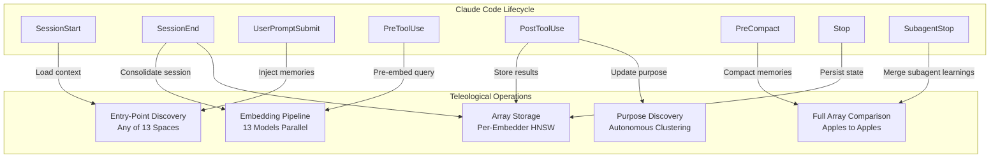
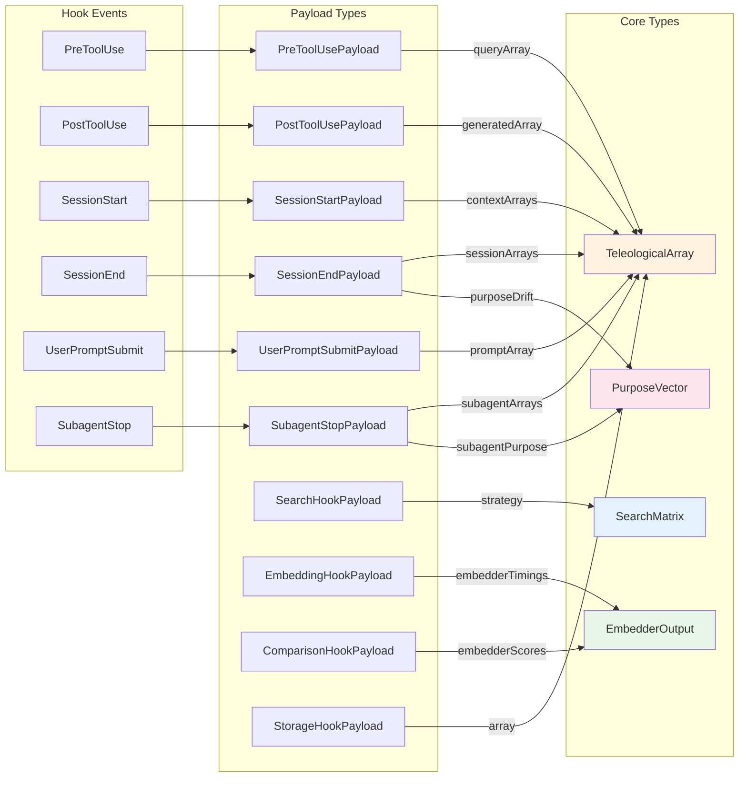
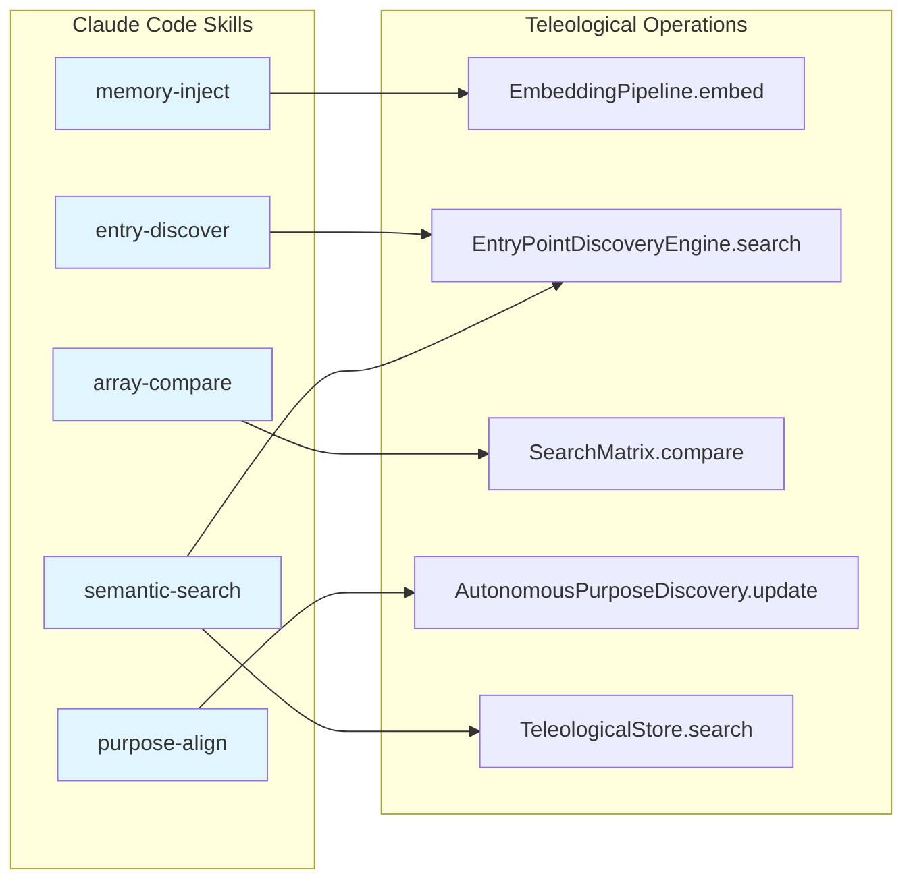
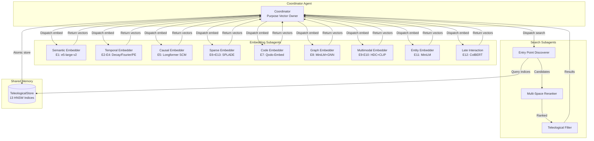

# Core Architecture: Teleological Array System

## Executive Summary

The Teleological Array System represents a paradigm shift in AI memory architecture, where **the 13-embedding array IS the fundamental unit of storage and comparison**. Unlike traditional single-vector approaches, this system maintains semantic fidelity across 13 distinct embedding spaces, enabling nuanced multi-perspective retrieval while enforcing strict "apples-to-apples" comparison semantics.

**Key Design Principles:**
1. **Atomic Arrays**: All 13 embeddings are generated, stored, and compared as a single unit
2. **No Manual North Star**: Goals emerge autonomously from data patterns
3. **Claude Code Hooks Integration**: Autonomous embedding pipeline via lifecycle hooks
4. **Parallel Multi-Space Search**: Find closest matches by searching all 13 spaces simultaneously

---

## 1. Data Model

### 1.1 TeleologicalArray (Atomic Unit)

The fundamental, indivisible unit of the teleological memory system. Every piece of content is represented as a TeleologicalArray containing exactly 13 embedding vectors generated atomically.

```rust
/// The fundamental unit of the teleological memory system.
///
/// A TeleologicalArray contains one embedding vector from each of the 13 embedders.
/// All comparisons operate on these arrays - never on isolated embeddings.
///
/// # Atomicity Guarantee
///
/// The 13 embeddings are ALWAYS generated, stored, and compared together.
/// There is no valid partial array - all 13 slots must be populated.
///
/// # Design Decision: Why 13 Fixed Embeddings?
///
/// 1. **Semantic Completeness**: Each embedder captures a distinct semantic axis
/// 2. **Comparison Safety**: Fixed structure enables compile-time type safety
/// 3. **Index Alignment**: Per-embedder HNSW indices have consistent schemas
/// 4. **Pipeline Stages**: 5-stage retrieval depends on specific embedder roles
#[derive(Clone, Debug, Serialize, Deserialize)]
pub struct TeleologicalArray {
    /// Unique identifier (UUID v4)
    pub id: Uuid,

    /// The 13 embedding vectors - one per embedder (ATOMIC)
    ///
    /// Invariant: All 13 slots are always populated.
    /// Use `EmbedderOutput::default()` for embedders that don't apply.
    pub embeddings: [EmbedderOutput; 13],

    /// 13D purpose alignment signature (one per embedder space)
    ///
    /// Each element is the cosine similarity of that embedder's output
    /// to the emergent goal centroid in that space.
    pub purpose_vector: PurposeVector,

    /// Per-embedder Johari awareness classification
    pub johari: JohariFingerprint,

    /// Aggregate alignment to emergent purpose (computed from purpose_vector)
    pub theta_to_purpose: f32,

    /// SHA-256 hash of source content for deduplication
    pub content_hash: [u8; 32],

    /// Timestamp of creation
    pub created_at: DateTime<Utc>,

    /// Last update timestamp
    pub last_updated: DateTime<Utc>,

    /// Access count for importance weighting
    pub access_count: u64,

    /// Optional source content (for debugging, not indexed)
    pub source_content: Option<String>,

    /// Optional metadata for application-specific data
    pub metadata: Option<TeleologicalMetadata>,
}

impl TeleologicalArray {
    /// Create a new TeleologicalArray with all 13 embeddings.
    ///
    /// # Panics
    /// Panics if any embedder output has invalid dimensions.
    pub fn new(embeddings: [EmbedderOutput; 13], content_hash: [u8; 32]) -> Self {
        // Validate all 13 embeddings have correct dimensions
        for (idx, output) in embeddings.iter().enumerate() {
            let embedder = Embedder::from_index(idx);
            output.validate_dimensions(embedder)
                .expect("Invalid embedder output dimensions");
        }

        Self {
            id: Uuid::new_v4(),
            embeddings,
            purpose_vector: PurposeVector::default(),
            johari: JohariFingerprint::zeroed(),
            theta_to_purpose: 0.0,
            content_hash,
            created_at: Utc::now(),
            last_updated: Utc::now(),
            access_count: 0,
            source_content: None,
            metadata: None,
        }
    }

    /// Get a specific embedder's output by index (0-12).
    #[inline]
    pub fn get_embedder(&self, idx: usize) -> Option<&EmbedderOutput> {
        self.embeddings.get(idx)
    }

    /// Get the dominant embedder (highest absolute magnitude).
    pub fn dominant_embedder(&self) -> Embedder {
        self.embeddings
            .iter()
            .enumerate()
            .max_by(|(_, a), (_, b)| {
                a.magnitude().partial_cmp(&b.magnitude())
                    .unwrap_or(std::cmp::Ordering::Equal)
            })
            .map(|(i, _)| Embedder::from_index(i))
            .unwrap_or(Embedder::Semantic)
    }
}
```

### 1.2 EmbedderOutput (Per-Embedder Vector)

```rust
/// Output from a single embedder within a TeleologicalArray.
///
/// Supports three embedding modalities:
/// - Dense: Standard floating-point vectors (E1-E5, E7-E11)
/// - Sparse: SPLADE-style term weights (E6, E13)
/// - TokenLevel: Per-token embeddings for late interaction (E12)
#[derive(Clone, Debug, Serialize, Deserialize)]
pub enum EmbedderOutput {
    /// Dense embedding vector (most embedders)
    Dense(Vec<f32>),

    /// Sparse embedding (SPLADE-style)
    Sparse(SparseVector),

    /// Token-level embeddings (ColBERT late interaction)
    TokenLevel(TokenLevelEmbedding),
}

impl EmbedderOutput {
    /// Compute vector magnitude for ranking.
    pub fn magnitude(&self) -> f32 {
        match self {
            Self::Dense(v) => v.iter().map(|x| x * x).sum::<f32>().sqrt(),
            Self::Sparse(s) => s.values.iter().map(|x| x * x).sum::<f32>().sqrt(),
            Self::TokenLevel(t) => {
                t.tokens.iter()
                    .flat_map(|tok| tok.iter())
                    .map(|x| x * x)
                    .sum::<f32>()
                    .sqrt()
            }
        }
    }

    /// Validate dimensions match expected for given embedder.
    pub fn validate_dimensions(&self, embedder: Embedder) -> Result<(), DimensionError> {
        let expected = embedder.expected_dims();
        let actual = self.dims();

        if !expected.matches(&actual) {
            return Err(DimensionError::Mismatch { embedder, expected, actual });
        }
        Ok(())
    }

    /// Get actual dimensions of this output.
    pub fn dims(&self) -> EmbedderDims {
        match self {
            Self::Dense(v) => EmbedderDims::Dense(v.len()),
            Self::Sparse(_) => EmbedderDims::Sparse,
            Self::TokenLevel(t) => EmbedderDims::TokenLevel(t.tokens.len()),
        }
    }
}

/// Sparse vector representation for SPLADE embeddings.
#[derive(Clone, Debug, Serialize, Deserialize)]
pub struct SparseVector {
    /// Vocabulary indices with non-zero weights
    pub indices: Vec<u32>,
    /// Corresponding weight values
    pub values: Vec<f32>,
    /// Vocabulary size (30522 for BERT tokenizer)
    pub vocab_size: u32,
}

impl SparseVector {
    /// Compute sparse dot product with another sparse vector.
    pub fn dot(&self, other: &Self) -> f32 {
        let mut i = 0;
        let mut j = 0;
        let mut sum = 0.0;

        while i < self.indices.len() && j < other.indices.len() {
            match self.indices[i].cmp(&other.indices[j]) {
                std::cmp::Ordering::Less => i += 1,
                std::cmp::Ordering::Greater => j += 1,
                std::cmp::Ordering::Equal => {
                    sum += self.values[i] * other.values[j];
                    i += 1;
                    j += 1;
                }
            }
        }
        sum
    }
}

/// Token-level embeddings for late interaction (E12 ColBERT).
#[derive(Clone, Debug, Serialize, Deserialize)]
pub struct TokenLevelEmbedding {
    /// Per-token 128D embeddings
    pub tokens: Vec<Vec<f32>>,
    /// Token dimension (always 128 for ColBERT)
    pub token_dim: usize,
}
```

### 1.3 Embedder Enumeration (13 Embedders)

```rust
/// The 13 embedders that comprise a TeleologicalArray.
///
/// Each embedder captures a distinct semantic axis:
/// - E1-E4: Core semantic and temporal patterns
/// - E5: Causal reasoning (asymmetric)
/// - E6, E13: Sparse lexical matching
/// - E7: Code understanding
/// - E8-E11: Graph, holographic, multimodal, entity
/// - E12: Token-level precision
#[derive(Clone, Copy, Debug, PartialEq, Eq, Hash, Serialize, Deserialize)]
#[repr(u8)]
pub enum Embedder {
    /// E1: Semantic - Core meaning representation (1024D dense)
    /// Model: e5-large-v2 | Purpose: V_meaning
    Semantic = 0,

    /// E2: Temporal Recent - Recency-weighted patterns (512D dense)
    /// Model: Custom exponential decay | Purpose: V_freshness
    TemporalRecent = 1,

    /// E3: Temporal Periodic - Cyclical/seasonal patterns (512D dense)
    /// Model: Fourier features | Purpose: V_periodicity
    TemporalPeriodic = 2,

    /// E4: Temporal Positional - Sequence ordering (512D dense)
    /// Model: Sinusoidal PE | Purpose: V_ordering
    TemporalPositional = 3,

    /// E5: Causal - Cause-effect chain representation (768D dense)
    /// Model: Longformer SCM | Purpose: V_causality
    /// NOTE: Asymmetric - direction matters for similarity
    Causal = 4,

    /// E6: SPLADE Primary - Sparse lexical matching (sparse ~30K vocab)
    /// Model: SPLADE v2 | Purpose: V_selectivity
    SpladePrimary = 5,

    /// E7: Code - Programming language understanding (1536D dense)
    /// Model: Qodo-Embed-1-1.5B | Purpose: V_correctness
    Code = 6,

    /// E8: Graph/GNN - Structural relationship patterns (384D dense)
    /// Model: MiniLM + GNN | Purpose: V_connectivity
    Graph = 7,

    /// E9: HDC - Holographic hyperdimensional (1024D dense)
    /// Model: 10K-bit projected | Purpose: V_robustness
    Hdc = 8,

    /// E10: Multimodal - Cross-modal bridge (768D dense)
    /// Model: CLIP | Purpose: V_multimodality
    Multimodal = 9,

    /// E11: Entity - Named entity/fact representation (384D dense)
    /// Model: MiniLM | Purpose: V_factuality
    Entity = 10,

    /// E12: Late Interaction - Token-level retrieval (128D/token)
    /// Model: ColBERT v2 | Purpose: V_precision
    LateInteraction = 11,

    /// E13: SPLADE Keyword - Term-specific matching (sparse ~30K vocab)
    /// Model: SPLADE v3 | Purpose: V_keyword_precision
    SpladeKeyword = 12,
}

impl Embedder {
    /// Get expected dimensions for this embedder.
    pub fn expected_dims(&self) -> EmbedderDims {
        match self {
            Self::Semantic => EmbedderDims::Dense(1024),
            Self::TemporalRecent => EmbedderDims::Dense(512),
            Self::TemporalPeriodic => EmbedderDims::Dense(512),
            Self::TemporalPositional => EmbedderDims::Dense(512),
            Self::Causal => EmbedderDims::Dense(768),
            Self::SpladePrimary => EmbedderDims::Sparse,
            Self::Code => EmbedderDims::Dense(1536),
            Self::Graph => EmbedderDims::Dense(384),
            Self::Hdc => EmbedderDims::Dense(1024),
            Self::Multimodal => EmbedderDims::Dense(768),
            Self::Entity => EmbedderDims::Dense(384),
            Self::LateInteraction => EmbedderDims::TokenLevel(0), // Variable
            Self::SpladeKeyword => EmbedderDims::Sparse,
        }
    }

    /// Convert 0-based index to Embedder.
    pub fn from_index(idx: usize) -> Self {
        match idx {
            0 => Self::Semantic,
            1 => Self::TemporalRecent,
            2 => Self::TemporalPeriodic,
            3 => Self::TemporalPositional,
            4 => Self::Causal,
            5 => Self::SpladePrimary,
            6 => Self::Code,
            7 => Self::Graph,
            8 => Self::Hdc,
            9 => Self::Multimodal,
            10 => Self::Entity,
            11 => Self::LateInteraction,
            12 => Self::SpladeKeyword,
            _ => panic!("Invalid embedder index: {}", idx),
        }
    }

    /// Get all embedders as a static slice.
    pub fn all() -> &'static [Embedder] {
        &[
            Self::Semantic,
            Self::TemporalRecent,
            Self::TemporalPeriodic,
            Self::TemporalPositional,
            Self::Causal,
            Self::SpladePrimary,
            Self::Code,
            Self::Graph,
            Self::Hdc,
            Self::Multimodal,
            Self::Entity,
            Self::LateInteraction,
            Self::SpladeKeyword,
        ]
    }

    /// Check if this embedder uses asymmetric similarity (direction matters).
    pub fn is_asymmetric(&self) -> bool {
        matches!(self, Self::Causal)
    }

    /// Check if this embedder produces sparse output.
    pub fn is_sparse(&self) -> bool {
        matches!(self, Self::SpladePrimary | Self::SpladeKeyword)
    }
}

#[derive(Clone, Copy, Debug, PartialEq)]
pub enum EmbedderDims {
    Dense(usize),
    Sparse,
    TokenLevel(usize), // Number of tokens
}

impl EmbedderDims {
    /// Check if actual dimensions match expected.
    pub fn matches(&self, actual: &Self) -> bool {
        match (self, actual) {
            (Self::Dense(exp), Self::Dense(act)) => exp == act,
            (Self::Sparse, Self::Sparse) => true,
            (Self::TokenLevel(_), Self::TokenLevel(_)) => true, // Variable OK
            _ => false,
        }
    }
}
```

### 1.4 Embedder Groups (Logical Groupings)

```rust
/// Predefined groups of embedders for domain-specific comparisons.
///
/// Groups enable focused retrieval using only relevant embedding spaces.
#[derive(Clone, Copy, Debug, PartialEq, Eq)]
pub enum EmbedderGroup {
    /// All 13 embedders (full comparison)
    All,

    /// E1 only - pure semantic similarity
    SemanticOnly,

    /// E2 + E3 + E4 - temporal patterns
    Temporal,

    /// E5 only - causal relationships (asymmetric)
    Causal,

    /// E6 + E13 - sparse lexical matching
    Lexical,

    /// E7 only - code understanding
    CodeOnly,

    /// E8 - graph/structural patterns
    Structural,

    /// E9 - holographic (robust to noise)
    Holographic,

    /// E10 - cross-modal embeddings
    CrossModal,

    /// E11 - entity/fact matching
    EntityMatching,

    /// E12 - token-level precision
    TokenPrecision,

    /// Custom subset via bitmask
    Custom(EmbedderMask),
}

/// Bitmask for selecting embedders (13 bits).
///
/// Efficient O(1) membership testing for embedder subsets.
#[derive(Clone, Copy, Debug, PartialEq, Eq, Serialize, Deserialize)]
pub struct EmbedderMask(u16);

impl EmbedderMask {
    /// Empty mask (no embedders).
    pub const fn empty() -> Self { Self(0) }

    /// All 13 embedders.
    pub const fn all() -> Self { Self(0x1FFF) }

    /// Add an embedder to the mask.
    pub const fn with(self, embedder: Embedder) -> Self {
        Self(self.0 | (1 << (embedder as u8)))
    }

    /// Check if mask contains embedder.
    pub const fn contains(&self, embedder: Embedder) -> bool {
        (self.0 & (1 << (embedder as u8))) != 0
    }

    /// Count of embedders in mask.
    pub const fn count(&self) -> usize {
        self.0.count_ones() as usize
    }

    /// Iterate over embedders in mask.
    pub fn iter(&self) -> impl Iterator<Item = Embedder> + '_ {
        Embedder::all().iter().copied().filter(|e| self.contains(*e))
    }
}

impl EmbedderGroup {
    /// Convert group to bitmask.
    pub fn to_mask(&self) -> EmbedderMask {
        match self {
            Self::All => EmbedderMask::all(),
            Self::SemanticOnly => EmbedderMask::empty().with(Embedder::Semantic),
            Self::Temporal => EmbedderMask::empty()
                .with(Embedder::TemporalRecent)
                .with(Embedder::TemporalPeriodic)
                .with(Embedder::TemporalPositional),
            Self::Causal => EmbedderMask::empty().with(Embedder::Causal),
            Self::Lexical => EmbedderMask::empty()
                .with(Embedder::SpladePrimary)
                .with(Embedder::SpladeKeyword),
            Self::CodeOnly => EmbedderMask::empty().with(Embedder::Code),
            Self::Structural => EmbedderMask::empty().with(Embedder::Graph),
            Self::Holographic => EmbedderMask::empty().with(Embedder::Hdc),
            Self::CrossModal => EmbedderMask::empty().with(Embedder::Multimodal),
            Self::EntityMatching => EmbedderMask::empty().with(Embedder::Entity),
            Self::TokenPrecision => EmbedderMask::empty().with(Embedder::LateInteraction),
            Self::Custom(mask) => *mask,
        }
    }
}
```

---

## 2. Hook Integration Layer

Claude Code provides 8 lifecycle hooks that integrate with the Teleological Array System. Each hook intercepts specific lifecycle events and can trigger embedding, search, or comparison operations.

### 2.1 Hook Types and Teleological Integration Points



### 2.1.1 Detailed Hook-to-Type Flow



### 2.2 Hook Payload Interfaces

```typescript
/// Base payload interface for all teleological hooks
interface TeleologicalHookPayload {
  /** Hook event type */
  hookType: HookType;

  /** Session identifier for correlation */
  sessionId: string;

  /** Timestamp of hook invocation */
  timestamp: string;

  /** Optional teleological array IDs involved */
  arrayIds?: string[];

  /** Which embedder spaces are active for this operation */
  activeEmbedders: EmbedderMask;
}

type HookType =
  | 'PreToolUse'
  | 'PostToolUse'
  | 'SessionStart'
  | 'SessionEnd'
  | 'UserPromptSubmit'
  | 'PreCompact'
  | 'Stop'
  | 'SubagentStop';

/// Payload for PreToolUse hook - triggers query embedding
interface PreToolUsePayload extends TeleologicalHookPayload {
  hookType: 'PreToolUse';

  /** Tool being invoked */
  toolName: string;

  /** Tool input parameters */
  toolInput: Record<string, unknown>;

  /** Pre-computed query embedding (if applicable) */
  queryArray?: TeleologicalArraySummary;

  /** Suggested entry-point embedder based on tool type */
  suggestedEntryPoint: Embedder;
}

/// Payload for PostToolUse hook - triggers result storage
interface PostToolUsePayload extends TeleologicalHookPayload {
  hookType: 'PostToolUse';

  /** Tool that was invoked */
  toolName: string;

  /** Tool output */
  toolOutput: string;

  /** Whether output should be embedded and stored */
  shouldStore: boolean;

  /** Content hash for deduplication check */
  contentHash: string;

  /** Generated teleological array (if shouldStore=true) */
  generatedArray?: TeleologicalArraySummary;
}

/// Payload for SessionStart hook - triggers context loading
interface SessionStartPayload extends TeleologicalHookPayload {
  hookType: 'SessionStart';

  /** Project path for scoped memory retrieval */
  projectPath: string;

  /** Previous session ID for continuity */
  previousSessionId?: string;

  /** Retrieved context arrays from previous sessions */
  contextArrays: TeleologicalArraySummary[];

  /** Current purpose vector (13D) */
  currentPurpose: number[];
}

/// Payload for SessionEnd hook - triggers consolidation
interface SessionEndPayload extends TeleologicalHookPayload {
  hookType: 'SessionEnd';

  /** Tasks completed in this session */
  tasksCompleted: string[];

  /** Session duration in seconds */
  durationSecs: number;

  /** Arrays created during session */
  sessionArrays: TeleologicalArraySummary[];

  /** Purpose drift detected during session */
  purposeDrift?: PurposeDriftInfo;

  /** Consolidated summary array */
  consolidationArray?: TeleologicalArraySummary;
}

/// Payload for UserPromptSubmit hook - triggers memory injection
interface UserPromptSubmitPayload extends TeleologicalHookPayload {
  hookType: 'UserPromptSubmit';

  /** User's prompt text */
  prompt: string;

  /** Prompt embedding for retrieval */
  promptArray: TeleologicalArraySummary;

  /** Entry-point discovery results */
  entryPointResults: EntryPointDiscoveryResult[];

  /** Retrieved memories to inject */
  injectedMemories: TeleologicalArraySummary[];
}

/// Payload for PreCompact hook - triggers memory compaction
interface PreCompactPayload extends TeleologicalHookPayload {
  hookType: 'PreCompact';

  /** Arrays to be compacted */
  candidateArrays: TeleologicalArraySummary[];

  /** Similarity threshold for merging */
  mergeThreshold: number;

  /** Comparison strategy to use */
  comparisonStrategy: SearchMatrixStrategy;
}

/// Payload for SubagentStop hook - triggers learning merge
interface SubagentStopPayload extends TeleologicalHookPayload {
  hookType: 'SubagentStop';

  /** Subagent type that stopped */
  subagentType: SubagentType;

  /** Subagent session identifier */
  subagentSessionId: string;

  /** Arrays created by subagent */
  subagentArrays: TeleologicalArraySummary[];

  /** Subagent's learned purpose vector */
  subagentPurpose: number[];

  /** How to merge with parent agent */
  mergeStrategy: SubagentMergeStrategy;
}

type SubagentType =
  | 'coder'
  | 'researcher'
  | 'tester'
  | 'reviewer'
  | 'architect'
  | 'documenter';

type SubagentMergeStrategy =
  | 'absorb'      // Parent absorbs all subagent arrays
  | 'selective'   // Parent selects high-value arrays
  | 'summarize'   // Consolidate into summary array
  | 'federated';  // Keep separate but linked

/// Summary view of TeleologicalArray for hook payloads
interface TeleologicalArraySummary {
  id: string;
  contentHash: string;
  purposeVector: number[];  // 13D
  dominantEmbedder: Embedder;
  createdAt: string;
  accessCount: number;
  thetaToPurpose: number;
}

/// Entry-point discovery result
interface EntryPointDiscoveryResult {
  embedder: Embedder;
  topMatchId: string;
  similarity: number;
  rank: number;
}

/// Purpose drift information
interface PurposeDriftInfo {
  magnitude: number;
  direction: number[];  // 13D delta
  fromPurpose: number[];
  toPurpose: number[];
}

/// Search hook payload for search operations
interface SearchHookPayload extends TeleologicalHookPayload {
  /** Search query text */
  query: string;

  /** Generated query array */
  queryArray: TeleologicalArraySummary;

  /** Search strategy used */
  strategy: SearchMatrixStrategy;

  /** Entry-point discovery results (if applicable) */
  entryPoints?: EntryPointDiscoveryResult[];

  /** Number of results requested */
  topK: number;

  /** Minimum similarity threshold */
  minSimilarity: number;

  /** Results returned */
  results?: SearchResultSummary[];

  /** Search latency in milliseconds */
  latencyMs?: number;
}

type SearchMatrixStrategy =
  | 'identity'
  | 'semantic_focused'
  | 'temporal_focused'
  | 'causal_focused'
  | 'code_focused'
  | 'hybrid_lexical'
  | 'entry_point_discovery'
  | 'custom';

/// Summary of a search result for hook payloads
interface SearchResultSummary {
  arrayId: string;
  similarity: number;
  rank: number;
  entryEmbedder?: Embedder;
  purposeAlignment: number;
}

/// Comparison hook payload for array comparisons
interface ComparisonHookPayload extends TeleologicalHookPayload {
  /** First array being compared */
  array1: TeleologicalArraySummary;

  /** Second array being compared */
  array2: TeleologicalArraySummary;

  /** Comparison type used */
  comparisonType: ComparisonType;

  /** Per-embedder similarity scores */
  embedderScores: number[];  // 13 values

  /** Final aggregated similarity */
  aggregatedSimilarity: number;

  /** Whether correlations were analyzed */
  correlationsAnalyzed: boolean;
}

type ComparisonType =
  | 'single_embedder'
  | 'embedder_group'
  | 'weighted_full'
  | 'matrix_strategy'
  | 'entry_point_discovery';

/// Embedding hook payload for embedding operations
interface EmbeddingHookPayload extends TeleologicalHookPayload {
  /** Content being embedded */
  contentHash: string;

  /** Content length in characters */
  contentLength: number;

  /** Generated array (if successful) */
  generatedArray?: TeleologicalArraySummary;

  /** Per-embedder timing in milliseconds */
  embedderTimings?: number[];  // 13 values

  /** Total embedding time in milliseconds */
  totalTimeMs: number;

  /** Whether any embedders failed */
  hadFailures: boolean;

  /** Failed embedder indices (if any) */
  failedEmbedders?: number[];
}

/// Storage hook payload for store operations
interface StorageHookPayload extends TeleologicalHookPayload {
  /** Array being stored */
  array: TeleologicalArraySummary;

  /** Whether this was a duplicate (deduplicated) */
  wasDuplicate: boolean;

  /** Storage operation type */
  operation: 'insert' | 'update' | 'delete';

  /** Indices updated */
  indicesUpdated: Embedder[];

  /** Storage latency in milliseconds */
  latencyMs: number;
}
```

### 2.3 Hook Configuration Schema

```typescript
/// Hook configuration for Teleological Array integration
interface TeleologicalHooksConfig {
  /** Enable autonomous embedding on PostToolUse */
  autoEmbedOnToolUse: boolean;

  /** Minimum content length to trigger embedding */
  minContentLength: number;

  /** File patterns to ignore for embedding */
  ignorePatterns: string[];

  /** Entry-point discovery configuration */
  entryPointConfig: {
    /** Which embedders to consider as entry points */
    candidateEmbedders: EmbedderMask;
    /** Candidates per space */
    perSpaceTopK: number;
    /** Minimum similarity threshold */
    minEntrySimilarity: number;
  };

  /** Session consolidation configuration */
  consolidationConfig: {
    /** Enable automatic session consolidation */
    autoConsolidate: boolean;
    /** Maximum arrays before triggering compaction */
    compactionThreshold: number;
    /** Similarity threshold for merging arrays */
    mergeThreshold: number;
  };

  /** Subagent coordination configuration */
  subagentConfig: {
    /** Default merge strategy */
    defaultMergeStrategy: SubagentMergeStrategy;
    /** Share purpose vector with subagents */
    sharePurpose: boolean;
    /** Inherit parent context arrays */
    inheritContext: boolean;
  };
}
```

### 2.4 Hook Registration Example

```bash
# .claude/hooks.json - Teleological hook configuration
{
  "hooks": {
    "PreToolUse": [
      {
        "matcher": {
          "tool_name": "Read|Edit|Write|Bash"
        },
        "handler": {
          "type": "command",
          "command": "npx contextgraph hooks pre-tool --embed-query"
        }
      }
    ],
    "PostToolUse": [
      {
        "matcher": {
          "tool_name": "Edit|Write"
        },
        "handler": {
          "type": "command",
          "command": "npx contextgraph hooks post-tool --auto-embed --train-patterns"
        }
      }
    ],
    "SessionStart": [
      {
        "handler": {
          "type": "command",
          "command": "npx contextgraph hooks session-start --load-context --purpose-bootstrap"
        }
      }
    ],
    "SessionEnd": [
      {
        "handler": {
          "type": "command",
          "command": "npx contextgraph hooks session-end --consolidate --export-purpose"
        }
      }
    ],
    "UserPromptSubmit": [
      {
        "handler": {
          "type": "command",
          "command": "npx contextgraph hooks prompt-submit --inject-memories"
        }
      }
    ],
    "SubagentStop": [
      {
        "handler": {
          "type": "command",
          "command": "npx contextgraph hooks subagent-stop --merge-learnings"
        }
      }
    ]
  }
}
```

---

## 3. Skills Architecture

Skills are auto-invoked capabilities defined in SKILL.md files. The Teleological Array System exposes skills for array manipulation, comparison operations, and autonomous search.

### 3.1 Skill-to-Teleological Mapping



### 3.2 Core Skills Definition

```yaml
# skills/memory-inject/SKILL.md
---
name: memory-inject
description: Inject content into teleological memory with full 13-embedding array generation
triggers:
  - "store this memory"
  - "remember this"
  - "embed this content"
parameters:
  content:
    type: string
    required: true
    description: Content to embed and store
  importance:
    type: number
    required: false
    default: 0.5
    description: Importance score [0, 1] for access weighting
  rationale:
    type: string
    required: false
    description: Reason for storing this memory
---

# Memory Inject Skill

Generates a complete 13-embedding TeleologicalArray and stores it atomically.

## Pipeline
1. Compute SHA-256 content hash for deduplication
2. Check if array with same hash exists (skip if duplicate)
3. Generate all 13 embeddings in parallel (GPU batched)
4. Compute purpose vector alignment
5. Store in per-embedder HNSW indices
6. Update autonomous purpose discovery

## Example Usage
```
/memory-inject content="The authentication flow uses JWT tokens..." importance=0.8
```
```

```yaml
# skills/semantic-search/SKILL.md
---
name: semantic-search
description: Search teleological memory using entry-point discovery pattern
triggers:
  - "search memory for"
  - "find related memories"
  - "retrieve context about"
parameters:
  query:
    type: string
    required: true
    description: Search query text
  top_k:
    type: number
    required: false
    default: 10
    description: Maximum results to return
  entry_embedder:
    type: string
    required: false
    description: Specific embedder to use as entry point (auto-detected if not specified)
  strategy:
    type: enum
    values: [full, entry_point, single_embedder, hybrid]
    required: false
    default: entry_point
    description: Search strategy to use
---

# Semantic Search Skill

Uses entry-point discovery to efficiently search across 13 embedding spaces.

## Search Strategies

### entry_point (default)
1. Query all 13 HNSW indices in parallel
2. Find space with highest similarity match
3. Use that space's candidates for full array comparison

### full
Full 5-stage retrieval pipeline:
1. Sparse recall (E13 SPLADE)
2. Semantic ANN (E1 Matryoshka)
3. Multi-space rerank (RRF all 13)
4. Teleological filter (purpose alignment)
5. Late interaction (E12 MaxSim)

### single_embedder
Query only the specified embedder's index.

### hybrid
Combine sparse (E6+E13) with semantic (E1) using RRF.

## Example Usage
```
/semantic-search query="How does the caching layer work?" top_k=5 strategy=full
```
```

```yaml
# skills/array-compare/SKILL.md
---
name: array-compare
description: Compare two TeleologicalArrays using apples-to-apples semantics
triggers:
  - "compare these memories"
  - "how similar are"
  - "measure similarity between"
parameters:
  array_id_1:
    type: string
    required: true
    description: First TeleologicalArray UUID
  array_id_2:
    type: string
    required: true
    description: Second TeleologicalArray UUID
  comparison_type:
    type: enum
    values: [full, single_embedder, embedder_group, purpose_vector]
    required: false
    default: full
    description: Type of comparison to perform
  embedder:
    type: string
    required: false
    description: Specific embedder for single_embedder comparison
  include_correlations:
    type: boolean
    required: false
    default: false
    description: Include cross-embedder correlation analysis
---

# Array Compare Skill

Performs type-safe apples-to-apples comparison between TeleologicalArrays.

## Comparison Types

### full
Compare all 13 embedders with weighted aggregation using SearchMatrix.identity().

### single_embedder
Compare only the specified embedder (E1 to E1, E7 to E7, etc.).

### embedder_group
Compare a logical group (Temporal, Lexical, Structural, etc.).

### purpose_vector
Compare 13D purpose alignment signatures.

## Type Safety Enforcement
- Compile-time: TypedEmbedderOutput<E> prevents cross-embedder comparison
- Runtime: validate_comparison() checks dimension compatibility

## Example Usage
```
/array-compare array_id_1="uuid-1" array_id_2="uuid-2" comparison_type=single_embedder embedder=Code
```
```

```yaml
# skills/entry-discover/SKILL.md
---
name: entry-discover
description: Find optimal entry point across 13 embedding spaces for a query
triggers:
  - "which embedding space best matches"
  - "find entry point for"
  - "discover best space"
parameters:
  query:
    type: string
    required: true
    description: Query text to analyze
  candidate_embedders:
    type: array
    items: string
    required: false
    description: Embedders to consider (all 13 by default)
  min_similarity:
    type: number
    required: false
    default: 0.3
    description: Minimum similarity threshold for valid entry point
---

# Entry Point Discovery Skill

Determines which of the 13 embedding spaces provides the best match for a query.

## Algorithm
1. Generate query TeleologicalArray (all 13 embeddings)
2. Query each candidate embedder's HNSW index in parallel
3. Find the space with the highest top-1 similarity
4. Return entry point information with ranking across spaces

## Use Cases
- Query routing: Direct code queries to E7, temporal queries to E2-E4
- Space analysis: Understand which semantic axes are most relevant
- Performance optimization: Skip irrelevant spaces in retrieval

## Example Usage
```
/entry-discover query="Fix the authentication bug in login.ts"
```

Returns:
```json
{
  "bestEntryPoint": "Code",
  "similarity": 0.87,
  "spaceRankings": [
    {"embedder": "Code", "similarity": 0.87, "rank": 1},
    {"embedder": "Semantic", "similarity": 0.72, "rank": 2},
    {"embedder": "Entity", "similarity": 0.65, "rank": 3},
    ...
  ]
}
```
```

### 3.3 Skill Registration

Skills are discovered from `.claude/skills/` or project-level `skills/` directories:

```
.claude/
  skills/
    memory-inject/
      SKILL.md
      handler.ts
    semantic-search/
      SKILL.md
      handler.ts
    array-compare/
      SKILL.md
      handler.ts
    entry-discover/
      SKILL.md
      handler.ts
```

---

## 4. Subagent Coordination

Subagents are specialized AI instances that coordinate for embedding, search, and comparison operations. The Teleological Array System defines coordination patterns for multi-agent memory operations.

### 4.1 Subagent Topology for Memory Operations



### 4.2 Subagent Type Definitions

```typescript
/// Subagent specialization for teleological operations
interface TeleologicalSubagent {
  /** Subagent type identifier */
  type: SubagentType;

  /** Embedder spaces this subagent is responsible for */
  embedderResponsibility: EmbedderMask;

  /** Whether subagent maintains its own purpose vector */
  ownsPurpose: boolean;

  /** Memory isolation level */
  memoryIsolation: MemoryIsolation;

  /** Coordination protocol with parent */
  coordinationProtocol: CoordinationProtocol;
}

type MemoryIsolation =
  | 'shared'      // Full access to parent's TeleologicalStore
  | 'scoped'      // Access to subset of arrays (by tag/namespace)
  | 'private'     // Own private store, merged on stop
  | 'federated';  // Distributed store with sync

type CoordinationProtocol =
  | 'synchronous'   // Wait for subagent completion
  | 'async_callback' // Continue, callback on completion
  | 'fire_and_forget' // No coordination
  | 'streaming';     // Stream results as available

/// Coordinator configuration for multi-subagent embedding
interface EmbeddingCoordinatorConfig {
  /** Maximum parallel subagents for embedding */
  maxParallelEmbedders: number;

  /** Timeout per embedder (ms) */
  embedderTimeoutMs: number;

  /** Fallback on embedder failure */
  fallbackOnFailure: 'skip' | 'default' | 'abort';

  /** GPU batch size per embedder */
  batchSize: number;
}

/// Search coordinator configuration
interface SearchCoordinatorConfig {
  /** Entry-point discovery parallelism */
  entryPointParallelism: number;

  /** Maximum candidates per space */
  perSpaceCandidates: number;

  /** Reranking strategy */
  rerankStrategy: RerankStrategy;

  /** Purpose alignment threshold */
  purposeAlignmentThreshold: number;
}

type RerankStrategy =
  | 'rrf'           // Reciprocal Rank Fusion
  | 'weighted_avg'  // Weighted average by embedder
  | 'max'           // Maximum across spaces
  | 'learned';      // ML-trained reranker
```

### 4.3 Subagent Coordination Protocol

```typescript
/// Protocol for subagent-to-coordinator communication
interface SubagentCoordinationMessage {
  /** Message type */
  type: CoordinationMessageType;

  /** Source subagent */
  source: SubagentId;

  /** Target (coordinator or another subagent) */
  target: SubagentId | 'coordinator';

  /** Payload */
  payload: CoordinationPayload;

  /** Correlation ID for request-response */
  correlationId: string;
}

type CoordinationMessageType =
  | 'EMBED_REQUEST'
  | 'EMBED_RESPONSE'
  | 'SEARCH_REQUEST'
  | 'SEARCH_RESPONSE'
  | 'PURPOSE_SYNC'
  | 'ARRAY_TRANSFER'
  | 'MERGE_REQUEST'
  | 'HEARTBEAT';

/// Embed request from coordinator to embedder subagent
interface EmbedRequestPayload {
  content: string;
  contentHash: string;
  targetEmbedders: EmbedderMask;
  priority: 'low' | 'normal' | 'high' | 'critical';
}

/// Embed response from embedder subagent
interface EmbedResponsePayload {
  embeddings: Map<Embedder, EmbedderOutput>;
  computeTimeMs: number;
  errors?: Map<Embedder, string>;
}

/// Purpose synchronization between subagents
interface PurposeSyncPayload {
  purposeVector: number[];  // 13D
  timestamp: string;
  driftMagnitude?: number;
}

/// Array transfer for merge operations
interface ArrayTransferPayload {
  arrays: TeleologicalArraySummary[];
  totalCount: number;
  batchIndex: number;
  isFinal: boolean;
}
```

### 4.4 Subagent Spawning Pattern

```typescript
/// Spawn subagents for parallel embedding
async function spawnEmbeddingSubagents(
  content: string,
  config: EmbeddingCoordinatorConfig
): Promise<TeleologicalArray> {
  const contentHash = computeSha256(content);

  // Define embedder groups for subagents
  const embedderGroups: EmbedderMask[] = [
    EmbedderMask.empty().with(Embedder.Semantic),  // E1
    EmbedderMask.empty()
      .with(Embedder.TemporalRecent)
      .with(Embedder.TemporalPeriodic)
      .with(Embedder.TemporalPositional),          // E2-E4
    EmbedderMask.empty().with(Embedder.Causal),    // E5
    EmbedderMask.empty()
      .with(Embedder.SpladePrimary)
      .with(Embedder.SpladeKeyword),               // E6, E13
    EmbedderMask.empty().with(Embedder.Code),      // E7
    EmbedderMask.empty().with(Embedder.Graph),     // E8
    EmbedderMask.empty()
      .with(Embedder.Hdc)
      .with(Embedder.Multimodal),                  // E9-E10
    EmbedderMask.empty().with(Embedder.Entity),    // E11
    EmbedderMask.empty().with(Embedder.LateInteraction), // E12
  ];

  // Spawn subagents in parallel
  const subagentPromises = embedderGroups.map(async (mask, idx) => {
    const subagent = await spawnSubagent({
      type: 'embedder',
      name: `embedder-${idx}`,
      embedderResponsibility: mask,
      memoryIsolation: 'shared',
      coordinationProtocol: 'synchronous',
    });

    return subagent.embed(content, mask);
  });

  // Wait for all subagents with timeout
  const results = await Promise.allSettled(subagentPromises);

  // Collect embeddings
  const embeddings: EmbedderOutput[] = new Array(13);
  for (const result of results) {
    if (result.status === 'fulfilled') {
      for (const [embedder, output] of result.value.entries()) {
        embeddings[embedder] = output;
      }
    } else if (config.fallbackOnFailure === 'abort') {
      throw new Error(`Embedding failed: ${result.reason}`);
    }
  }

  return new TeleologicalArray(embeddings, contentHash);
}
```

---

## 5. Comparison Architecture

### 5.1 Search Matrix Strategies

The Search Matrix enables flexible embedder-to-embedder or full-array comparisons with weighted aggregation.

```rust
/// Matrix-based search strategies for cross-embedder analysis.
///
/// The 13x13 weight matrix controls how embedder outputs are compared:
/// - Diagonal entries: same-embedder comparisons (E_i to E_i)
/// - Off-diagonal entries: cross-embedder correlations (analysis only)
///
/// # Apples-to-Apples Enforcement
///
/// By default, only diagonal entries are used (apples-to-apples).
/// Cross-embedder correlations are for analysis, not primary retrieval.
#[derive(Clone, Debug, Serialize, Deserialize)]
pub struct SearchMatrix {
    /// 13x13 weight matrix
    /// matrix[i][j] = weight for comparing embedder i to embedder j
    pub weights: [[f32; 13]; 13],

    /// Strategy name for logging/debugging
    pub name: String,

    /// Whether to use off-diagonal correlations
    /// Default: false (apples-to-apples only)
    pub use_correlations: bool,

    /// Aggregation method for combining per-embedder scores
    pub aggregation: AggregationMethod,
}

/// How to aggregate per-embedder similarity scores.
#[derive(Clone, Copy, Debug, Serialize, Deserialize)]
pub enum AggregationMethod {
    /// Weighted average: sum(weight_i * score_i) / sum(weight_i)
    WeightedAverage,

    /// Reciprocal Rank Fusion: sum(1 / (k + rank_i))
    Rrf { k: f32 },

    /// Maximum score across all embedders
    Max,

    /// Minimum score (conservative)
    Min,

    /// Geometric mean
    GeometricMean,
}

impl SearchMatrix {
    /// Identity matrix - pure apples-to-apples comparison.
    /// Equal weight (1/13) for each embedder.
    pub fn identity() -> Self {
        let mut weights = [[0.0; 13]; 13];
        for i in 0..13 {
            weights[i][i] = 1.0 / 13.0;
        }
        Self {
            weights,
            name: "identity".to_string(),
            use_correlations: false,
            aggregation: AggregationMethod::WeightedAverage,
        }
    }

    /// Semantic-focused - 50% weight on E1, rest distributed equally.
    pub fn semantic_focused() -> Self {
        let mut weights = [[0.0; 13]; 13];
        weights[0][0] = 0.5; // E1 Semantic
        for i in 1..13 {
            weights[i][i] = 0.5 / 12.0;
        }
        Self {
            weights,
            name: "semantic_focused".to_string(),
            use_correlations: false,
            aggregation: AggregationMethod::WeightedAverage,
        }
    }

    /// Temporal-focused - Emphasize E2+E3+E4 for time-aware retrieval.
    pub fn temporal_focused() -> Self {
        let mut weights = [[0.0; 13]; 13];
        weights[1][1] = 0.25; // E2 Temporal-Recent
        weights[2][2] = 0.20; // E3 Temporal-Periodic
        weights[3][3] = 0.15; // E4 Temporal-Positional
        for i in [0, 4, 5, 6, 7, 8, 9, 10, 11, 12] {
            weights[i][i] = 0.4 / 10.0;
        }
        Self {
            weights,
            name: "temporal_focused".to_string(),
            use_correlations: false,
            aggregation: AggregationMethod::WeightedAverage,
        }
    }

    /// Causal-focused - Emphasize E5 for cause-effect reasoning.
    pub fn causal_focused() -> Self {
        let mut weights = [[0.0; 13]; 13];
        weights[4][4] = 0.5; // E5 Causal
        for i in [0, 1, 2, 3, 5, 6, 7, 8, 9, 10, 11, 12] {
            weights[i][i] = 0.5 / 12.0;
        }
        Self {
            weights,
            name: "causal_focused".to_string(),
            use_correlations: false,
            aggregation: AggregationMethod::WeightedAverage,
        }
    }

    /// Code-focused - Emphasize E7 for programming content.
    pub fn code_focused() -> Self {
        let mut weights = [[0.0; 13]; 13];
        weights[6][6] = 0.5; // E7 Code
        for i in [0, 1, 2, 3, 4, 5, 7, 8, 9, 10, 11, 12] {
            weights[i][i] = 0.5 / 12.0;
        }
        Self {
            weights,
            name: "code_focused".to_string(),
            use_correlations: false,
            aggregation: AggregationMethod::WeightedAverage,
        }
    }

    /// Hybrid lexical - Use sparse embedders for BM25-like recall.
    pub fn hybrid_lexical() -> Self {
        let mut weights = [[0.0; 13]; 13];
        weights[5][5] = 0.35;  // E6 SPLADE Primary
        weights[12][12] = 0.35; // E13 SPLADE Keyword
        weights[0][0] = 0.30;  // E1 Semantic (for reranking)
        Self {
            weights,
            name: "hybrid_lexical".to_string(),
            use_correlations: false,
            aggregation: AggregationMethod::Rrf { k: 60.0 },
        }
    }

    /// Custom matrix from weights.
    pub fn custom(name: impl Into<String>, weights: [[f32; 13]; 13]) -> Self {
        Self {
            weights,
            name: name.into(),
            use_correlations: false,
            aggregation: AggregationMethod::WeightedAverage,
        }
    }

    /// Enable correlation analysis (cross-embedder patterns).
    pub fn with_correlations(mut self) -> Self {
        self.use_correlations = true;
        self
    }

    /// Set aggregation method.
    pub fn with_aggregation(mut self, method: AggregationMethod) -> Self {
        self.aggregation = method;
        self
    }
}
```

### 5.2 Comparison Types

```rust
/// Specifies how to compare two TeleologicalArrays.
#[derive(Clone, Debug)]
pub enum ComparisonType {
    /// Compare single embedder output (E_i to E_i only)
    SingleEmbedder(Embedder),

    /// Compare embedder group with equal weights
    EmbedderGroup(EmbedderGroup),

    /// Compare full arrays with specified weights
    WeightedFull([f32; 13]),

    /// Compare using a search matrix strategy
    MatrixStrategy(SearchMatrix),

    /// Entry-point discovery: find best space first
    EntryPointDiscovery(EntryPointConfig),
}

/// Configuration for entry-point discovery search.
///
/// Entry-point discovery finds which embedding space has the
/// closest match, then uses that as the starting point.
#[derive(Clone, Debug)]
pub struct EntryPointConfig {
    /// Which embedders to consider as entry points
    pub candidate_embedders: EmbedderMask,

    /// How many top candidates to consider per space
    pub per_space_top_k: usize,

    /// After finding entry point, which matrix to use for full comparison
    pub refinement_matrix: SearchMatrix,

    /// Minimum similarity threshold to consider an entry point valid
    pub min_entry_similarity: f32,
}

impl Default for EntryPointConfig {
    fn default() -> Self {
        Self {
            candidate_embedders: EmbedderMask::all(),
            per_space_top_k: 100,
            refinement_matrix: SearchMatrix::identity(),
            min_entry_similarity: 0.3,
        }
    }
}

/// Result of comparing two TeleologicalArrays.
#[derive(Clone, Debug, Serialize, Deserialize)]
pub struct ComparisonResult {
    /// Overall similarity score [0, 1]
    pub similarity: f32,

    /// Per-embedder breakdown (13 values)
    pub embedder_scores: [f32; 13],

    /// Which embedders contributed (based on comparison type)
    pub active_embedders: EmbedderMask,

    /// Entry point information (if using EntryPointDiscovery)
    pub entry_point: Option<EntryPointInfo>,

    /// Computation time in microseconds
    pub computation_time_us: u64,

    /// Optional: correlation patterns detected
    pub correlations: Option<CorrelationAnalysis>,
}

/// Information about the entry point used for discovery search.
#[derive(Clone, Debug, Serialize, Deserialize)]
pub struct EntryPointInfo {
    /// Which embedder was used as entry point
    pub embedder: Embedder,

    /// Similarity in the entry point space
    pub entry_similarity: f32,

    /// Rank in the entry point space
    pub entry_rank: usize,
}
```

### 5.3 Entry-Point Discovery Architecture

Entry-point discovery enables efficient multi-space search by first finding the best matching space, then using that as the anchor for full comparison.

```rust
/// Entry-point discovery engine for multi-space search.
///
/// # Algorithm
///
/// 1. Query each of the 13 HNSW indices in parallel
/// 2. Find the space with the highest similarity match
/// 3. Use matches from that space as entry points for full comparison
/// 4. Refine using the configured SearchMatrix
///
/// # Performance
///
/// - Stage 1 (parallel HNSW): O(log N) per space, 13 parallel queries
/// - Stage 2 (entry point selection): O(13 * top_k)
/// - Stage 3 (full comparison): O(top_k) with refinement matrix
///
/// Total: O(log N) + O(refinement_k) with parallelization
pub struct EntryPointDiscoveryEngine {
    /// Per-embedder HNSW indices
    indices: [HnswIndex; 13],

    /// Configuration
    config: EntryPointConfig,
}

impl EntryPointDiscoveryEngine {
    /// Execute entry-point discovery search.
    pub async fn search(
        &self,
        query: &TeleologicalArray,
        top_k: usize,
    ) -> CoreResult<Vec<(TeleologicalArray, ComparisonResult)>> {
        // Stage 1: Parallel query to all candidate spaces
        let mut space_results: Vec<(Embedder, Vec<(Uuid, f32)>)> = Vec::new();

        for embedder in self.config.candidate_embedders.iter() {
            let idx = embedder as usize;
            let query_vec = &query.embeddings[idx];
            let results = self.indices[idx]
                .search(query_vec, self.config.per_space_top_k)
                .await?;
            space_results.push((embedder, results));
        }

        // Stage 2: Find best entry point (space with highest top-1 similarity)
        let best_entry = space_results
            .iter()
            .filter_map(|(emb, results)| {
                results.first().map(|(id, sim)| (*emb, *id, *sim))
            })
            .max_by(|(_, _, a), (_, _, b)| {
                a.partial_cmp(b).unwrap_or(std::cmp::Ordering::Equal)
            });

        let (entry_embedder, _, entry_sim) = match best_entry {
            Some(entry) if entry.2 >= self.config.min_entry_similarity => entry,
            _ => return Ok(Vec::new()), // No valid entry point found
        };

        // Stage 3: Use entry point space candidates for full comparison
        let entry_idx = entry_embedder as usize;
        let candidates: Vec<Uuid> = space_results[entry_idx].1
            .iter()
            .take(top_k)
            .map(|(id, _)| *id)
            .collect();

        // Stage 4: Full comparison with refinement matrix
        let mut results = Vec::new();
        for candidate_id in candidates {
            let candidate = self.retrieve(candidate_id).await?;
            let comparison = self.compare_full(query, &candidate, &self.config.refinement_matrix);
            results.push((candidate, comparison));
        }

        // Sort by final similarity
        results.sort_by(|a, b| {
            b.1.similarity.partial_cmp(&a.1.similarity)
                .unwrap_or(std::cmp::Ordering::Equal)
        });

        Ok(results)
    }
}
```

---

## 6. Autonomous Embedding Pipeline

### 6.1 Claude Code Hooks Integration

The embedding pipeline integrates with Claude Code hooks for autonomous, event-driven embedding generation.

```rust
/// Claude Code hook events that trigger embedding operations.
///
/// These hooks enable autonomous embedding creation without manual intervention.
/// The system observes Claude Code lifecycle events and generates embeddings
/// when appropriate content is detected.
#[derive(Clone, Debug, Serialize, Deserialize)]
pub enum ClaudeCodeHookEvent {
    /// Pre-task: Analyze task description for relevant memories
    PreTask {
        task_id: String,
        description: String,
        context_files: Vec<PathBuf>,
    },

    /// Post-edit: Embed edited file content
    PostEdit {
        file_path: PathBuf,
        diff: String,
        full_content: String,
    },

    /// Post-command: Embed command output if significant
    PostCommand {
        command: String,
        stdout: String,
        stderr: String,
        exit_code: i32,
    },

    /// Session-start: Load relevant memories for new session
    SessionStart {
        session_id: String,
        project_path: PathBuf,
    },

    /// Session-end: Consolidate session learnings
    SessionEnd {
        session_id: String,
        tasks_completed: Vec<String>,
        duration_secs: u64,
    },
}

/// Handler for Claude Code hook events.
///
/// Implements autonomous embedding creation based on observed events.
pub struct ClaudeCodeHookHandler {
    /// Embedding pipeline for generating TeleologicalArrays
    pipeline: EmbeddingPipeline,

    /// Memory store for persistence
    store: Arc<dyn TeleologicalMemoryStore>,

    /// Configuration for hook behavior
    config: HookConfig,
}

impl ClaudeCodeHookHandler {
    /// Handle a Claude Code hook event.
    pub async fn handle(&self, event: ClaudeCodeHookEvent) -> CoreResult<HookResult> {
        match event {
            ClaudeCodeHookEvent::PreTask { description, context_files, .. } => {
                // Retrieve relevant memories for the task
                let query_array = self.pipeline.embed(&description).await?;
                let memories = self.store.search_semantic(
                    &query_array.semantic,
                    TeleologicalSearchOptions::quick(10)
                        .with_min_similarity(0.5),
                ).await?;

                Ok(HookResult::RetrievedContext {
                    memories: memories.into_iter().map(|r| r.fingerprint).collect(),
                    query_embedding_id: query_array.id,
                })
            }

            ClaudeCodeHookEvent::PostEdit { file_path, full_content, .. } => {
                // Embed the edited file content
                if self.should_embed_file(&file_path, &full_content) {
                    let array = self.pipeline.embed(&full_content).await?;
                    let id = self.store.store(array.clone()).await?;

                    Ok(HookResult::EmbeddedContent {
                        id,
                        content_hash: array.content_hash,
                    })
                } else {
                    Ok(HookResult::Skipped {
                        reason: "Content below embedding threshold".into(),
                    })
                }
            }

            ClaudeCodeHookEvent::SessionEnd { tasks_completed, .. } => {
                // Consolidate session learnings
                let summary = tasks_completed.join("\n");
                let array = self.pipeline.embed(&summary).await?;
                let id = self.store.store(array).await?;

                Ok(HookResult::SessionConsolidated { id })
            }

            _ => Ok(HookResult::NoAction),
        }
    }

    /// Check if file content should be embedded.
    fn should_embed_file(&self, path: &Path, content: &str) -> bool {
        // Skip binary files, small files, and ignored patterns
        let extension = path.extension().and_then(|e| e.to_str()).unwrap_or("");
        let is_text = matches!(extension, "rs" | "py" | "ts" | "js" | "md" | "txt" | "json");
        let is_significant = content.len() >= self.config.min_content_length;

        is_text && is_significant
    }
}

/// Result of handling a Claude Code hook event.
#[derive(Clone, Debug, Serialize, Deserialize)]
pub enum HookResult {
    /// Retrieved context for a task
    RetrievedContext {
        memories: Vec<TeleologicalFingerprint>,
        query_embedding_id: Uuid,
    },

    /// Embedded new content
    EmbeddedContent {
        id: Uuid,
        content_hash: [u8; 32],
    },

    /// Session learning consolidated
    SessionConsolidated {
        id: Uuid,
    },

    /// Event skipped
    Skipped {
        reason: String,
    },

    /// No action taken
    NoAction,
}

/// Configuration for hook behavior.
#[derive(Clone, Debug)]
pub struct HookConfig {
    /// Minimum content length to trigger embedding
    pub min_content_length: usize,

    /// File patterns to ignore
    pub ignore_patterns: Vec<String>,

    /// Whether to embed command outputs
    pub embed_command_output: bool,

    /// Maximum command output length to embed
    pub max_command_output_length: usize,
}

impl Default for HookConfig {
    fn default() -> Self {
        Self {
            min_content_length: 100,
            ignore_patterns: vec![
                "*.lock".into(),
                "*.min.js".into(),
                "node_modules/*".into(),
                "target/*".into(),
            ],
            embed_command_output: true,
            max_command_output_length: 10_000,
        }
    }
}
```

### 6.2 Embedding Pipeline (13-Embedder Atomic Generation)

```rust
/// Pipeline for generating complete TeleologicalArrays.
///
/// All 13 embeddings are generated atomically - there is no partial array.
/// Failures in any embedder cause the entire operation to fail.
pub struct EmbeddingPipeline {
    /// GPU-accelerated embedder instances
    embedders: [Arc<dyn Embedder>; 13],

    /// Batch queue for efficient GPU utilization
    batch_queue: BatchQueue,

    /// Configuration
    config: PipelineConfig,
}

impl EmbeddingPipeline {
    /// Embed content into a complete TeleologicalArray.
    ///
    /// # Atomicity
    ///
    /// All 13 embeddings are generated or none are. Partial failures
    /// result in an error, not a partial array.
    pub async fn embed(&self, content: &str) -> CoreResult<TeleologicalArray> {
        // Compute content hash for deduplication
        let content_hash = {
            let mut hasher = Sha256::new();
            hasher.update(content.as_bytes());
            hasher.finalize().into()
        };

        // Generate all 13 embeddings in parallel
        let embedding_futures: Vec<_> = self.embedders
            .iter()
            .enumerate()
            .map(|(idx, embedder)| {
                let content = content.to_string();
                async move {
                    embedder.embed(&content).await
                        .map(|output| (idx, output))
                        .map_err(|e| (idx, e))
                }
            })
            .collect();

        let results = futures::future::join_all(embedding_futures).await;

        // Collect results, fail if any embedder failed
        let mut embeddings: [Option<EmbedderOutput>; 13] = Default::default();
        for result in results {
            match result {
                Ok((idx, output)) => embeddings[idx] = Some(output),
                Err((idx, error)) => {
                    let embedder = Embedder::from_index(idx);
                    return Err(CoreError::Embedding {
                        embedder,
                        source: error.into(),
                    });
                }
            }
        }

        // Convert Option array to concrete array (all should be Some)
        let embeddings: [EmbedderOutput; 13] = embeddings
            .into_iter()
            .enumerate()
            .map(|(idx, opt)| {
                opt.unwrap_or_else(|| panic!("Embedder {} did not produce output", idx))
            })
            .collect::<Vec<_>>()
            .try_into()
            .expect("Exactly 13 embeddings");

        Ok(TeleologicalArray::new(embeddings, content_hash))
    }

    /// Batch embed multiple contents efficiently.
    ///
    /// Uses GPU batching for higher throughput.
    pub async fn embed_batch(&self, contents: &[String]) -> CoreResult<Vec<TeleologicalArray>> {
        // Queue all items for batched processing
        let futures: Vec<_> = contents
            .iter()
            .map(|content| self.embed(content))
            .collect();

        let results = futures::future::join_all(futures).await;

        results.into_iter().collect()
    }
}
```

---

## 7. Autonomous Purpose Discovery

### 7.1 No Manual North Star

Goals emerge from data patterns through clustering and drift analysis. There is no manual `set_north_star` operation.

```rust
/// Autonomous purpose discovery from stored TeleologicalArrays.
///
/// # Design Philosophy
///
/// Manual north star creation is INVALID because:
/// 1. A single 1024D embedding cannot be compared to 13 diverse embeddings
/// 2. Each embedder space has different semantics (meaning vs causality vs code)
/// 3. Goals should emerge from what the system actually stores
///
/// Instead, purpose emerges from:
/// - Clustering of stored arrays
/// - Temporal patterns in access
/// - Drift detection across sessions
pub struct AutonomousPurposeDiscovery {
    /// Memory store for accessing stored arrays
    store: Arc<dyn TeleologicalMemoryStore>,

    /// Per-embedder clustering state
    cluster_states: [ClusterState; 13],

    /// Current emergent purpose (13D)
    current_purpose: RwLock<PurposeVector>,

    /// Purpose evolution history
    purpose_history: RwLock<Vec<PurposeSnapshot>>,
}

impl AutonomousPurposeDiscovery {
    /// Bootstrap purpose from existing data.
    ///
    /// This is called during system initialization to discover
    /// the emergent purpose from stored memories.
    pub async fn bootstrap(&self) -> CoreResult<PurposeVector> {
        // Sample stored arrays
        let samples = self.store.retrieve_random(1000).await?;

        if samples.is_empty() {
            // No data yet - return uniform purpose
            return Ok(PurposeVector::uniform());
        }

        // For each embedder space, find the centroid
        let mut centroids: [Vec<f32>; 13] = Default::default();

        for embedder in Embedder::all() {
            let idx = *embedder as usize;
            let space_vectors: Vec<_> = samples
                .iter()
                .filter_map(|arr| arr.get_dense_embedding(idx))
                .collect();

            if !space_vectors.is_empty() {
                centroids[idx] = compute_centroid(&space_vectors);
            }
        }

        // Purpose vector is the normalized magnitude of each centroid
        let purpose: [f32; 13] = centroids
            .iter()
            .map(|c| {
                if c.is_empty() { 0.0 } else { magnitude(c) }
            })
            .collect::<Vec<_>>()
            .try_into()
            .unwrap();

        // Normalize to unit sum
        let sum: f32 = purpose.iter().sum();
        let purpose = if sum > 0.0 {
            purpose.map(|v| v / sum)
        } else {
            [1.0 / 13.0; 13]
        };

        let purpose_vector = PurposeVector(purpose);
        *self.current_purpose.write().await = purpose_vector.clone();

        Ok(purpose_vector)
    }

    /// Update purpose based on new arrays.
    ///
    /// Called after each storage operation to incrementally update
    /// the emergent purpose.
    pub async fn update(&self, new_arrays: &[TeleologicalArray]) -> CoreResult<()> {
        let mut current = self.current_purpose.write().await;

        for array in new_arrays {
            // Exponential moving average update
            for i in 0..13 {
                let new_contribution = array.purpose_vector.0[i];
                current.0[i] = 0.99 * current.0[i] + 0.01 * new_contribution;
            }
        }

        // Re-normalize
        let sum: f32 = current.0.iter().sum();
        if sum > 0.0 {
            for v in &mut current.0 {
                *v /= sum;
            }
        }

        // Record snapshot
        self.purpose_history.write().await.push(PurposeSnapshot {
            timestamp: Utc::now(),
            purpose: current.clone(),
        });

        Ok(())
    }

    /// Detect purpose drift.
    ///
    /// Returns drift magnitude and direction if significant drift detected.
    pub async fn detect_drift(&self) -> Option<PurposeDrift> {
        let history = self.purpose_history.read().await;

        if history.len() < 2 {
            return None;
        }

        let recent = &history[history.len() - 1].purpose;
        let previous = &history[history.len() - 2].purpose;

        let drift_magnitude: f32 = recent.0.iter()
            .zip(previous.0.iter())
            .map(|(a, b)| (a - b).powi(2))
            .sum::<f32>()
            .sqrt();

        if drift_magnitude > 0.1 {
            let direction: Vec<f32> = recent.0.iter()
                .zip(previous.0.iter())
                .map(|(a, b)| a - b)
                .collect();

            Some(PurposeDrift {
                magnitude: drift_magnitude,
                direction,
                from_purpose: previous.clone(),
                to_purpose: recent.clone(),
            })
        } else {
            None
        }
    }
}

/// Snapshot of purpose at a point in time.
#[derive(Clone, Debug, Serialize, Deserialize)]
pub struct PurposeSnapshot {
    pub timestamp: DateTime<Utc>,
    pub purpose: PurposeVector,
}

/// Detected purpose drift.
#[derive(Clone, Debug)]
pub struct PurposeDrift {
    pub magnitude: f32,
    pub direction: Vec<f32>,
    pub from_purpose: PurposeVector,
    pub to_purpose: PurposeVector,
}

/// 13D purpose alignment signature.
#[derive(Clone, Debug, Default, Serialize, Deserialize)]
pub struct PurposeVector(pub [f32; 13]);

impl PurposeVector {
    /// Uniform purpose (equal weight to all embedders).
    pub fn uniform() -> Self {
        Self([1.0 / 13.0; 13])
    }

    /// Compute cosine similarity with another purpose vector.
    pub fn cosine_similarity(&self, other: &Self) -> f32 {
        let dot: f32 = self.0.iter().zip(other.0.iter()).map(|(a, b)| a * b).sum();
        let mag_a: f32 = self.0.iter().map(|x| x * x).sum::<f32>().sqrt();
        let mag_b: f32 = other.0.iter().map(|x| x * x).sum::<f32>().sqrt();

        if mag_a > 0.0 && mag_b > 0.0 {
            dot / (mag_a * mag_b)
        } else {
            0.0
        }
    }
}
```

---

## 8. Storage Architecture

### 8.1 Per-Embedder HNSW Indices

Each of the 13 embedders has its own HNSW index for efficient single-space search.

```rust
/// Storage layer for TeleologicalArrays with per-embedder indices.
pub struct TeleologicalStore {
    /// Primary storage (RocksDB)
    primary: RocksDbBackend,

    /// Per-embedder HNSW indices for fast ANN search
    hnsw_indices: [HnswIndex; 13],

    /// Sparse inverted index for E6 and E13
    sparse_index: SparseInvertedIndex,

    /// Purpose vector index (13D HNSW)
    purpose_index: HnswIndex,

    /// Configuration
    config: StorageConfig,
}

/// HNSW index configuration per embedder.
#[derive(Clone, Debug)]
pub struct HnswConfig {
    /// Maximum number of connections per node
    pub m: usize,

    /// Size of dynamic candidate list during construction
    pub ef_construction: usize,

    /// Size of dynamic candidate list during search
    pub ef_search: usize,

    /// Distance metric
    pub distance: DistanceMetric,
}

impl Default for HnswConfig {
    fn default() -> Self {
        Self {
            m: 16,
            ef_construction: 200,
            ef_search: 100,
            distance: DistanceMetric::Cosine,
        }
    }
}

/// Per-embedder HNSW configuration (optimized for each space).
pub fn embedder_hnsw_configs() -> [HnswConfig; 13] {
    [
        // E1: Semantic (1024D) - standard config
        HnswConfig { m: 16, ef_construction: 200, ef_search: 100, distance: DistanceMetric::Cosine },

        // E2: Temporal-Recent (512D) - fewer connections for temporal locality
        HnswConfig { m: 12, ef_construction: 150, ef_search: 80, distance: DistanceMetric::Cosine },

        // E3: Temporal-Periodic (512D)
        HnswConfig { m: 12, ef_construction: 150, ef_search: 80, distance: DistanceMetric::Cosine },

        // E4: Temporal-Positional (512D)
        HnswConfig { m: 12, ef_construction: 150, ef_search: 80, distance: DistanceMetric::Cosine },

        // E5: Causal (768D) - asymmetric, needs more connections
        HnswConfig { m: 24, ef_construction: 300, ef_search: 150, distance: DistanceMetric::Cosine },

        // E6: SPLADE (sparse) - not used for HNSW, placeholder
        HnswConfig::default(),

        // E7: Code (1536D) - higher dimensionality needs more exploration
        HnswConfig { m: 24, ef_construction: 250, ef_search: 120, distance: DistanceMetric::Cosine },

        // E8: Graph (384D) - lower dim, fewer connections OK
        HnswConfig { m: 12, ef_construction: 150, ef_search: 80, distance: DistanceMetric::Cosine },

        // E9: HDC (1024D) - standard config
        HnswConfig { m: 16, ef_construction: 200, ef_search: 100, distance: DistanceMetric::Cosine },

        // E10: Multimodal (768D)
        HnswConfig { m: 16, ef_construction: 200, ef_search: 100, distance: DistanceMetric::Cosine },

        // E11: Entity (384D)
        HnswConfig { m: 12, ef_construction: 150, ef_search: 80, distance: DistanceMetric::Cosine },

        // E12: Late-Interaction (variable) - not used for HNSW, uses MaxSim
        HnswConfig::default(),

        // E13: SPLADE (sparse) - not used for HNSW, placeholder
        HnswConfig::default(),
    ]
}
```

### 8.2 5-Stage Retrieval Pipeline

```rust
/// 5-stage retrieval pipeline implementation.
///
/// | Stage | Name | Index | Latency |
/// |-------|------|-------|---------|
/// | 1 | Recall | E13 SPLADE inverted | <5ms |
/// | 2 | Semantic ANN | E1 Matryoshka 128D | <10ms |
/// | 3 | Multi-space rerank | All 13 HNSW | <20ms |
/// | 4 | Teleological filter | Purpose vector | <10ms |
/// | 5 | Late interaction | E12 MaxSim | <15ms |
pub struct RetrievalPipeline {
    store: Arc<TeleologicalStore>,
    config: PipelineConfig,
}

impl RetrievalPipeline {
    /// Execute full 5-stage retrieval.
    pub async fn retrieve(
        &self,
        query: &TeleologicalArray,
        top_k: usize,
    ) -> CoreResult<Vec<TeleologicalSearchResult>> {
        let timer = Instant::now();

        // Stage 1: Sparse recall (E13 SPLADE)
        let sparse_candidates = self.store.search_sparse(
            &query.embeddings[12].as_sparse()?,
            10_000,
        ).await?;
        let stage1_time = timer.elapsed();

        // Stage 2: Semantic ANN (E1 Matryoshka 128D)
        let semantic_candidates = self.narrow_by_semantic(
            &query.embeddings[0],
            &sparse_candidates,
            1_000,
        ).await?;
        let stage2_time = timer.elapsed() - stage1_time;

        // Stage 3: Multi-space rerank (RRF across all 13)
        let reranked = self.rerank_multispace(
            query,
            &semantic_candidates,
            100,
        ).await?;
        let stage3_time = timer.elapsed() - stage2_time - stage1_time;

        // Stage 4: Teleological filter (purpose alignment)
        let aligned = self.filter_by_alignment(
            &query.purpose_vector,
            &reranked,
            50,
        ).await?;
        let stage4_time = timer.elapsed() - stage3_time - stage2_time - stage1_time;

        // Stage 5: Late interaction (E12 MaxSim)
        let final_results = self.rerank_late_interaction(
            &query.embeddings[11],
            &aligned,
            top_k,
        ).await?;
        let stage5_time = timer.elapsed() - stage4_time - stage3_time - stage2_time - stage1_time;

        // Log stage timings
        tracing::debug!(
            stage1_us = stage1_time.as_micros(),
            stage2_us = stage2_time.as_micros(),
            stage3_us = stage3_time.as_micros(),
            stage4_us = stage4_time.as_micros(),
            stage5_us = stage5_time.as_micros(),
            total_us = timer.elapsed().as_micros(),
            "5-stage retrieval completed"
        );

        Ok(final_results)
    }
}
```

---

## 9. Type Safety Guarantees

### 9.1 Compile-Time Safety

```rust
/// Marker trait ensuring we only compare compatible types.
pub trait ApplesToApples<Other> {}

// TeleologicalArray can be compared to TeleologicalArray
impl ApplesToApples<TeleologicalArray> for TeleologicalArray {}

// EmbedderOutput can be compared to same embedder's output
impl ApplesToApples<EmbedderOutput> for EmbedderOutput {}

/// Strongly-typed embedder output to prevent cross-embedder comparisons.
///
/// The const generic E ensures compile-time type safety.
pub struct TypedEmbedderOutput<const E: u8> {
    output: EmbedderOutput,
}

impl<const E: u8> TypedEmbedderOutput<E> {
    /// Can only compare to same embedder type.
    pub fn similarity(&self, other: &TypedEmbedderOutput<E>) -> f32 {
        compute_output_similarity(&self.output, &other.output)
    }
}

// Compile-time error if you try to compare different embedders:
// let e1: TypedEmbedderOutput<0> = ...;
// let e5: TypedEmbedderOutput<4> = ...;
// e1.similarity(&e5); // ERROR: expected TypedEmbedderOutput<0>, found TypedEmbedderOutput<4>
```

### 9.2 Runtime Validation

```rust
/// Validates that a comparison is apples-to-apples.
pub fn validate_comparison(
    comparison_type: &ComparisonType,
    array1: &TeleologicalArray,
    array2: &TeleologicalArray,
) -> Result<(), ComparisonError> {
    // Validate both arrays have all 13 embedders populated
    for embedder in Embedder::all() {
        let idx = *embedder as usize;
        array1.embeddings[idx].validate_dimensions(*embedder)?;
        array2.embeddings[idx].validate_dimensions(*embedder)?;
    }

    // Validate comparison type constraints
    match comparison_type {
        ComparisonType::WeightedFull(weights) => {
            let sum: f32 = weights.iter().sum();
            if (sum - 1.0).abs() > 0.001 {
                return Err(ComparisonError::InvalidWeights {
                    expected_sum: 1.0,
                    actual_sum: sum,
                });
            }
        }
        ComparisonType::MatrixStrategy(matrix) => {
            // Diagonal must be non-negative
            for i in 0..13 {
                if matrix.weights[i][i] < 0.0 {
                    return Err(ComparisonError::NegativeWeight {
                        embedder: Embedder::from_index(i),
                    });
                }
            }
            // Off-diagonal must be zero if correlations disabled
            if !matrix.use_correlations {
                for i in 0..13 {
                    for j in 0..13 {
                        if i != j && matrix.weights[i][j] != 0.0 {
                            return Err(ComparisonError::UnexpectedCorrelation {
                                from: Embedder::from_index(i),
                                to: Embedder::from_index(j),
                            });
                        }
                    }
                }
            }
        }
        _ => {}
    }

    Ok(())
}
```

---

## 10. MCP Tool Integration

### 10.1 Memory Tools

```rust
/// MCP tool for storing TeleologicalArrays.
///
/// Generates all 13 embeddings atomically and stores the complete array.
#[derive(Debug, Serialize, Deserialize)]
pub struct StoreMemoryTool {
    /// Content to embed and store
    pub content: String,

    /// Optional importance score [0, 1]
    pub importance: Option<f32>,

    /// Optional rationale for storage
    pub rationale: Option<String>,

    /// Optional metadata
    pub metadata: Option<serde_json::Value>,
}

/// MCP tool for searching TeleologicalArrays.
#[derive(Debug, Serialize, Deserialize)]
pub struct SearchMemoryTool {
    /// Query text
    pub query: String,

    /// Maximum results
    pub top_k: Option<usize>,

    /// Search strategy
    pub strategy: Option<SearchStrategy>,

    /// Minimum similarity threshold
    pub min_similarity: Option<f32>,

    /// Embedder group to focus on
    pub embedder_group: Option<String>,
}

#[derive(Debug, Serialize, Deserialize)]
pub enum SearchStrategy {
    /// Full 5-stage pipeline
    Full,

    /// Entry-point discovery (find best space first)
    EntryPoint,

    /// Single embedder only
    SingleEmbedder { embedder: String },

    /// Custom matrix strategy
    CustomMatrix { weights: [[f32; 13]; 13] },
}

/// MCP tool for comparing two TeleologicalArrays.
#[derive(Debug, Serialize, Deserialize)]
pub struct CompareMemoryTool {
    /// First memory ID
    pub id1: Uuid,

    /// Second memory ID
    pub id2: Uuid,

    /// Comparison type
    pub comparison_type: Option<String>,

    /// Whether to include correlation analysis
    pub include_correlations: Option<bool>,
}
```

---

## 11. Full Architecture Flow

```mermaid
flowchart TB
    subgraph "Claude Code Extensibility Layer"
        direction TB
        HOOKS[Hooks<br/>PreToolUse | PostToolUse<br/>SessionStart | SessionEnd<br/>UserPromptSubmit | PreCompact<br/>Stop | SubagentStop]
        SKILLS[Skills<br/>memory-inject | semantic-search<br/>array-compare | entry-discover<br/>purpose-align]
        SUBAGENTS[Subagents<br/>coder | researcher | tester<br/>reviewer | architect | documenter]
    end

    subgraph "Teleological Array System"
        direction TB

        subgraph "Embedding Layer"
            EMB[EmbeddingPipeline<br/>13 Parallel Embedders]
            E1[E1: Semantic<br/>1024D]
            E2[E2-E4: Temporal<br/>512D x3]
            E5[E5: Causal<br/>768D]
            E6[E6+E13: SPLADE<br/>Sparse]
            E7[E7: Code<br/>1536D]
            E8[E8-E11: Graph/HDC/Multi/Entity]
            E12[E12: Late Interaction<br/>128D/token]
        end

        subgraph "Storage Layer"
            STORE[TeleologicalStore]
            HNSW[Per-Embedder HNSW<br/>13 Indices]
            SPARSE[Sparse Inverted Index<br/>E6 + E13]
            PURPOSE_IDX[Purpose Index<br/>13D HNSW]
        end

        subgraph "Search Layer"
            ENTRY[Entry-Point Discovery<br/>Any of 13 Spaces]
            PIPELINE[5-Stage Pipeline]
            COMPARE[SearchMatrix<br/>Apples-to-Apples]
        end

        subgraph "Purpose Layer"
            DISCOVER[AutonomousPurposeDiscovery]
            DRIFT[Drift Detection]
            CLUSTER[Per-Embedder Clustering]
        end
    end

    %% Hook connections
    HOOKS -->|"PreToolUse"| ENTRY
    HOOKS -->|"PostToolUse"| EMB
    HOOKS -->|"SessionStart"| ENTRY
    HOOKS -->|"SessionEnd"| DISCOVER
    HOOKS -->|"UserPromptSubmit"| ENTRY
    HOOKS -->|"SubagentStop"| COMPARE

    %% Skill connections
    SKILLS -->|"memory-inject"| EMB
    SKILLS -->|"semantic-search"| ENTRY
    SKILLS -->|"array-compare"| COMPARE
    SKILLS -->|"entry-discover"| ENTRY

    %% Subagent connections
    SUBAGENTS -->|"Dispatch embed"| EMB
    SUBAGENTS -->|"Dispatch search"| ENTRY

    %% Embedding flow
    EMB --> E1 & E2 & E5 & E6 & E7 & E8 & E12
    E1 & E2 & E5 & E6 & E7 & E8 & E12 -->|"13 vectors"| STORE

    %% Storage indexing
    STORE --> HNSW & SPARSE & PURPOSE_IDX

    %% Search flow
    ENTRY -->|"Query 13 indices"| HNSW
    ENTRY -->|"Best space"| PIPELINE
    PIPELINE -->|"Candidates"| COMPARE
    COMPARE -->|"Results"| HOOKS

    %% Purpose flow
    STORE -->|"New arrays"| DISCOVER
    DISCOVER --> DRIFT
    DISCOVER --> CLUSTER

    style HOOKS fill:#e3f2fd
    style SKILLS fill:#e3f2fd
    style SUBAGENTS fill:#e3f2fd
    style EMB fill:#fff3e0
    style STORE fill:#f3e5f5
    style ENTRY fill:#e8f5e9
    style DISCOVER fill:#fce4ec
```

---

## 12. Performance Targets

| Operation | Target Latency | Notes |
|-----------|----------------|-------|
| Single embed (all 13) | <35ms | GPU batched |
| Batch embed (64 items) | <120ms | Full GPU utilization |
| Storage per memory | ~17KB | PQ-8/Float8/Binary quantized |
| Stage 1 (sparse recall) | <5ms | Inverted index |
| Stage 2 (semantic ANN) | <10ms | Matryoshka 128D |
| Stage 3 (multi-space rerank) | <20ms | RRF fusion |
| Stage 4 (teleological filter) | <10ms | 13D purpose vector |
| Stage 5 (late interaction) | <15ms | E12 MaxSim |
| **Total pipeline @ 1M** | **<60ms** | Full 5-stage |
| **Total pipeline @ 100K** | **<30ms** | Typical workload |
| Entry-point discovery | <40ms | Parallel HNSW queries |
| Purpose alignment check | <1ms | 13D cosine similarity |
| Hook invocation overhead | <5ms | Per-hook |
| Subagent spawn | <50ms | With coordination setup |

---

## 13. Migration Path

### 13.1 Current State
- `TeleologicalFingerprint` type exists (close to target)
- Old `north_star` handler REMOVED (commit 0780263)
- Teleological purpose system introduced (commit 054fda2)

### 13.2 Target State
- All storage uses `TeleologicalArray` (atomic 13-embedding unit)
- All comparisons use `SearchMatrix` strategies
- Autonomous purpose discovery (no manual north star)
- Claude Code hooks for autonomous embedding
- Entry-point discovery for efficient multi-space search
- Skills for array manipulation and search
- Subagent coordination for parallel embedding

### 13.3 Migration Steps
1. Rename `TeleologicalFingerprint` to `TeleologicalArray`
2. Update all storage operations to use atomic arrays
3. Implement `SearchMatrix` comparison strategies
4. Deploy Claude Code hook handlers
5. Implement entry-point discovery engine
6. Migrate purpose from manual to autonomous discovery
7. Remove any remaining single-embedding comparison paths
8. Register skills for memory operations
9. Implement subagent coordination protocols

---

## References

**Multi-Embedding Architecture (2025):**
- [HAKES: Scalable Vector Database](https://doi.org/10.14778/3746405.3746427) - Two-stage filter/refine design
- [Weaviate Multiple Vector Embeddings](https://weaviate.io/developers/weaviate/config-refs/schema/multi-vector) - Per-space configuration
- [Azure Cosmos DB Integrated Vector Database](https://learn.microsoft.com/en-us/azure/cosmos-db/vector-database) - Schema flexibility for AI agents

**Autonomous Agent Memory (2025):**
- [A-Mem: Agentic Memory for LLM Agents](https://arxiv.org/pdf/2502.12110) - Dynamic memory organization
- [Mem0: Production-Ready AI Agents](https://arxiv.org/pdf/2504.19413) - Scalable long-term memory
- [Memory in the Age of AI Agents Survey](https://github.com/Shichun-Liu/Agent-Memory-Paper-List) - Comprehensive paper list

**Claude Code Integration:**
- [Claude Code Hooks Guide](https://code.claude.com/docs/en/hooks-guide) - Lifecycle hooks
- [Enabling Claude Code to Work Autonomously](https://www.anthropic.com/news/enabling-claude-code-to-work-more-autonomously) - Autonomous workflows
- [Claude Code Best Practices](https://www.anthropic.com/engineering/claude-code-best-practices) - Agentic coding patterns

**Vector Search Algorithms:**
- [HNSW Index Design](https://skyzh.github.io/write-you-a-vector-db/cpp-06-02-hnsw.html) - Hierarchical navigation
- [Mastering ANN in 2025](https://sparkco.ai/blog/mastering-approximate-nearest-neighbor-in-2025) - State of the art
- [Proximity Graph-based ANNS](https://zilliz.com/learn/pg-based-anns) - Graph index techniques

---

*Document Version: 3.0.0*
*Last Updated: 2026-01-09*
*Status: Architectural Specification with Claude Code Integration*
