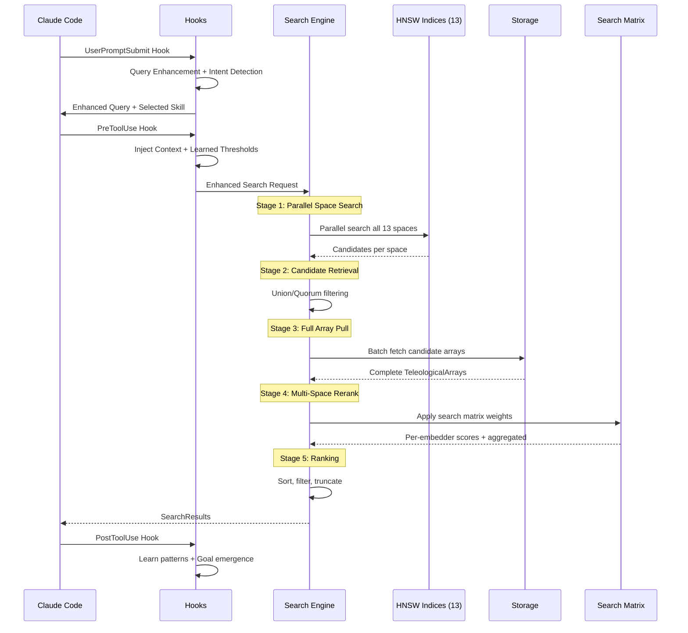

# Search System Technical Specification

```xml
<technical_spec id="TECH-SEARCH" version="1.0" implements="SPEC-SEARCH">
<metadata>
  <title>Teleological Search System Implementation</title>
  <status>approved</status>
  <last_updated>2026-01-09</last_updated>
  <related_specs>
    <spec_ref>TECH-STORAGE</spec_ref>
    <spec_ref>TECH-EMBEDDING</spec_ref>
    <spec_ref>TECH-MCP</spec_ref>
  </related_specs>
</metadata>

<overview>
The search system enables finding relevant teleological arrays using a 5-stage pipeline
that searches all 13 embedding spaces in parallel. The core innovation
is that candidates are discovered from ALL embedding spaces simultaneously - if an item is close in even ONE
space, it becomes a candidate for full comparison.

Key features:
- Parallel search across all 13 HNSW indices
- MUVERA-inspired fixed dimensional encoding for 8x speedup
- Apples-to-apples per-embedder comparison
- Configurable search matrices for weighted fusion
- RRF and other aggregation strategies
- Query-adaptive weighting via hooks
- Sparse + dense hybrid search
- Autonomous goal emergence from results
</overview>

<architecture_diagram>

</architecture_diagram>

<!-- ============================================================ -->
<!-- SECTION 1: FIVE-STAGE SEARCH PIPELINE                        -->
<!-- ============================================================ -->

<section id="pipeline">
<title>Five-Stage Search Pipeline</title>

<stage id="stage-1" name="Parallel Space Search">
<description>
Search all 13 embedding spaces in parallel for candidate discovery.
Every space is searched simultaneously to ensure no relevant candidates are missed.
</description>

<embedding_spaces>
| Index | Name | Dimension | Use Case |
|-------|------|-----------|----------|
| E1 | Semantic | 1024 | General meaning, concepts |
| E2 | TemporalRecent | 512 | Recency-weighted time |
| E3 | TemporalPeriodic | 512 | Cyclical patterns |
| E4 | TemporalPositional | 512 | Absolute timestamps |
| E5 | Causal | 768 | Cause-effect relationships |
| E6 | Sparse | ~30K | Exact keyword matching |
| E7 | Code | 1536 | AST/code structure |
| E8 | Graph | 384 | Relationship structure |
| E9 | HDC | Binary | Hyperdimensional computing |
| E10 | Multimodal | 768 | Cross-modal alignment |
| E11 | Entity | 384 | Named entity links |
| E12 | LateInteraction | 128/tok | Token-level precision |
| E13 | SPLADE | ~30K | Learned sparse expansion |
</embedding_spaces>

<selection_strategies>
```rust
#[derive(Clone, Copy, Debug)]
pub enum DiscoveryStrategy {
    /// Search all spaces, union all results (default, highest recall)
    UnionAll,

    /// Search all spaces, require match in at least N spaces
    QuorumN(usize),

    /// Search primary spaces first, expand if needed
    Tiered {
        primary_spaces: EmbedderMask,
        expand_threshold: usize,
    },

    /// MUVERA-style fixed dimensional encoding (8x faster)
    Muvera {
        k_sim: usize,      // Similarity buckets
        dim_proj: usize,   // Projection dimension
        r_reps: usize,     // Repetitions
    },
}
```
</selection_strategies>
</stage>

<stage id="stage-2" name="Candidate Retrieval">
<description>
Fast approximate nearest neighbor (ANN) search across selected spaces using HNSW indices.
Each index returns top-k candidates independently, then results are aggregated.
</description>

<algorithm>
```rust
pub async fn discover(
    &self,
    query_array: &TeleologicalArray,
    config: &DiscoveryConfig,
) -> Result<DiscoveredCandidates, SearchError> {
    let active_spaces = config.active_spaces.iter_enabled().collect::<Vec<_>>();

    // PARALLEL: Search all active spaces simultaneously
    let space_searches = active_spaces.iter().map(|&space_idx| {
        let index = self.indices[space_idx].clone();
        let embedding = query_array.embeddings[space_idx].clone();
        let k = config.candidates_per_space;
        let threshold = config.space_thresholds.map(|t| t[space_idx]);

        async move {
            let start = Instant::now();
            let mut results = index.search(&embedding, k).await?;

            if let Some(thresh) = threshold {
                results.retain(|(_, score)| *score >= thresh);
            }

            Ok::<_, SearchError>((space_idx, results, start.elapsed().as_micros() as u64))
        }
    });

    let space_results = futures::future::try_join_all(space_searches).await?;

    // Aggregate candidates with provenance tracking
    let mut candidate_map: HashMap<Uuid, CandidateInfo> = HashMap::new();

    for (space_idx, results, _time_us) in space_results {
        for (id, score) in results {
            let entry = candidate_map.entry(id).or_insert_with(|| CandidateInfo {
                id,
                discovered_via: EmbedderMask::empty(),
                best_scores: [0.0; 13],
            });
            entry.discovered_via.enable(space_idx);
            entry.best_scores[space_idx] = score;
        }
    }

    // Apply strategy filtering
    let candidates = match config.strategy {
        DiscoveryStrategy::UnionAll => candidate_map.into_values().collect(),
        DiscoveryStrategy::QuorumN(n) => candidate_map.into_values()
            .filter(|c| c.discovered_via.count() >= n)
            .collect(),
        // ... other strategies
    };

    Ok(DiscoveredCandidates { candidates, stats })
}
```
</algorithm>

<performance>
- Single-space HNSW search: &lt;2ms for 1M vectors
- 13-space parallel discovery: &lt;20ms total
- Memory per index: ~1.5GB for 1M 1024D vectors
</performance>
</stage>

<stage id="stage-3" name="Full Array Pull">
<description>
Batch fetch complete TeleologicalArrays for all discovered candidates from storage.
This enables apples-to-apples comparison across all 13 embedding spaces.
</description>

<algorithm>
```rust
impl FullArrayComparison {
    pub async fn fetch_candidates(
        &self,
        candidates: &[CandidateInfo],
    ) -> Result<Vec<TeleologicalArray>, SearchError> {
        let fetch_futures = candidates.iter()
            .map(|c| self.storage.fetch(c.id));

        futures::future::try_join_all(fetch_futures).await
    }
}
```
</algorithm>

<performance>
- Batch fetch 100 arrays: &lt;5ms
- Uses connection pooling and prepared statements
</performance>
</stage>

<stage id="stage-4" name="Multi-Space Rerank">
<description>
Compute per-embedder similarities (apples-to-apples) and apply search matrix
weights using RRF fusion or weighted aggregation.
</description>

<per_embedder_similarity>
```rust
pub struct TeleologicalComparator {
    similarity_fns: [Box<dyn SimilarityFn>; 13],
}

impl TeleologicalComparator {
    pub fn new() -> Self {
        Self {
            similarity_fns: [
                Box::new(CosineSimilarity),                    // E1: Semantic
                Box::new(TemporalRecentSimilarity { decay: 0.1 }), // E2
                Box::new(CosineSimilarity),                    // E3: Periodic
                Box::new(CosineSimilarity),                    // E4: Positional
                Box::new(AsymmetricCausalSimilarity),          // E5: Causal
                Box::new(SparseSimilarity),                    // E6: Sparse
                Box::new(CosineSimilarity),                    // E7: Code
                Box::new(CosineSimilarity),                    // E8: Graph
                Box::new(HammingSimilarity),                   // E9: HDC
                Box::new(CosineSimilarity),                    // E10: Multimodal
                Box::new(TransESimilarity),                    // E11: Entity
                Box::new(MaxSimSimilarity),                    // E12: LateInteraction
                Box::new(SparseSimilarity),                    // E13: SPLADE
            ],
        }
    }

    pub fn compute_similarities(
        &self,
        query: &TeleologicalArray,
        candidate: &TeleologicalArray,
    ) -> [f32; 13] {
        let mut scores = [0.0f32; 13];
        for i in 0..13 {
            scores[i] = self.similarity_fns[i].compute(
                &query.embeddings[i],
                &candidate.embeddings[i],
            );
        }
        scores
    }
}
```
</per_embedder_similarity>

<rrf_fusion>
```rust
/// Reciprocal Rank Fusion algorithm
/// Reference: "Reciprocal Rank Fusion outperforms Condorcet and individual Rank Learning Methods"
pub fn rrf_fusion(rankings: &[Vec<(Uuid, f32)>], k: f32) -> Vec<(Uuid, f32)> {
    let mut scores: HashMap<Uuid, f32> = HashMap::new();

    for ranking in rankings {
        for (rank, (id, _original_score)) in ranking.iter().enumerate() {
            *scores.entry(*id).or_default() += 1.0 / (k + rank as f32 + 1.0);
        }
    }

    let mut result: Vec<_> = scores.into_iter().collect();
    result.sort_by(|a, b| b.1.partial_cmp(&a.1).unwrap());
    result
}
```
</rrf_fusion>
</stage>

<stage id="stage-5" name="Result Scoring and Ranking">
<description>
Apply final scoring, filtering, and ranking to produce SearchResults.
Optionally analyze correlations and trigger goal emergence.
</description>

<algorithm>
```rust
pub fn finalize_results(
    &self,
    scored: Vec<ScoredCandidate>,
    config: &SearchQuery,
) -> SearchResults {
    let mut matches: Vec<SearchMatch> = scored.into_iter()
        .filter(|s| {
            config.min_similarity
                .map(|min| s.final_score >= min)
                .unwrap_or(true)
        })
        .take(config.top_k)
        .enumerate()
        .map(|(rank, s)| SearchMatch {
            array: s.array,
            similarity: s.final_score,
            embedder_scores: if config.include_breakdown {
                Some(s.embedder_scores)
            } else {
                None
            },
            discovered_via: s.discovered_via,
            correlations: if config.analyze_correlations {
                Some(CorrelationAnalysis::compute(&s))
            } else {
                None
            },
            rank: rank + 1,
        })
        .collect();

    SearchResults {
        matches,
        query_time_us,
        candidates_discovered,
        candidates_evaluated,
        discovery_stats,
        metadata,
    }
}
```
</algorithm>
</stage>

</section>

<!-- ============================================================ -->
<!-- SECTION 2: DATA MODELS                                       -->
<!-- ============================================================ -->

<data_models>

<model name="SearchQuery">
  <description>A search query specifying what to find and how</description>
  <field name="query_array" type="TeleologicalArray" constraints="required">
    The query teleological array
  </field>
  <field name="comparison" type="ComparisonType" constraints="required">
    How to compare arrays (search matrix configuration)
  </field>
  <field name="top_k" type="usize" constraints="default: 10">
    Maximum results to return
  </field>
  <field name="discovery" type="DiscoveryConfig" constraints="required">
    Parallel search configuration across all spaces
  </field>
  <field name="filter" type="Option&lt;SearchFilter&gt;" constraints="optional">
    Optional filters (time range, purpose, etc.)
  </field>
  <field name="min_similarity" type="Option&lt;f32&gt;" constraints="optional, range: 0.0-1.0">
    Minimum similarity threshold
  </field>
  <field name="include_breakdown" type="bool" constraints="default: false">
    Whether to include per-embedder breakdown in results
  </field>
  <field name="analyze_correlations" type="bool" constraints="default: false">
    Whether to analyze cross-embedder correlations
  </field>
</model>

<model name="DiscoveryConfig">
  <description>Configuration for parallel multi-space search</description>
  <field name="active_spaces" type="EmbedderMask" constraints="default: all 13">
    Which embedding spaces to search (all 13 by default)
  </field>
  <field name="candidates_per_space" type="usize" constraints="default: 100">
    Candidates per space (higher = better recall, slower)
  </field>
  <field name="strategy" type="DiscoveryStrategy" constraints="required">
    Discovery strategy (UnionAll, QuorumN, Tiered, Muvera)
  </field>
  <field name="space_thresholds" type="Option&lt;[f32; 13]&gt;" constraints="optional">
    Per-space similarity thresholds for candidate inclusion
  </field>
</model>

<model name="SearchResults">
  <description>Results from a search query</description>
  <field name="matches" type="Vec&lt;SearchMatch&gt;" constraints="required">
    Matched arrays with scores
  </field>
  <field name="query_time_us" type="u64" constraints="required">
    Query execution time in microseconds
  </field>
  <field name="candidates_discovered" type="usize" constraints="required">
    Number of candidates discovered (before filtering)
  </field>
  <field name="candidates_evaluated" type="usize" constraints="required">
    Number of candidates evaluated (after deduplication)
  </field>
  <field name="discovery_stats" type="DiscoveryStats" constraints="required">
    Per-space discovery statistics
  </field>
  <field name="metadata" type="SearchMetadata" constraints="required">
    Query metadata
  </field>
</model>

<model name="SearchMatch">
  <description>A single search result match</description>
  <field name="array" type="TeleologicalArray" constraints="required">
    The matched teleological array
  </field>
  <field name="similarity" type="f32" constraints="required, range: 0.0-1.0">
    Overall similarity score
  </field>
  <field name="embedder_scores" type="Option&lt;[f32; 13]&gt;" constraints="optional">
    Per-embedder similarity scores (apples-to-apples)
  </field>
  <field name="discovered_via" type="EmbedderMask" constraints="required">
    Which spaces discovered this candidate
  </field>
  <field name="correlations" type="Option&lt;CorrelationAnalysis&gt;" constraints="optional">
    Cross-embedder correlation analysis
  </field>
  <field name="rank" type="usize" constraints="required">
    Rank in results (1-indexed)
  </field>
</model>

<model name="SearchMatrix">
  <description>13x13 search matrix for configurable similarity aggregation</description>
  <field name="name" type="String" constraints="required">
    Matrix name for identification
  </field>
  <field name="weights" type="[[f32; 13]; 13]" constraints="required">
    13x13 weight matrix (diagonal = embedder weights, off-diagonal = correlations)
  </field>
  <field name="use_correlations" type="bool" constraints="default: false">
    Whether to use off-diagonal (cross-embedder) weights
  </field>
  <field name="aggregation" type="AggregationType" constraints="required">
    Aggregation function (WeightedSum, RRF, Geometric, Max, Min)
  </field>
  <field name="thresholds" type="Option&lt;[f32; 13]&gt;" constraints="optional">
    Optional per-embedder thresholds
  </field>
</model>

<model name="EmbedderMask">
  <description>Bitmask for selecting which of 13 embedders to use</description>
  <field name="mask" type="u16" constraints="required">
    16-bit mask (13 bits used)
  </field>
  <methods>
    - empty() -> EmbedderMask
    - all() -> EmbedderMask
    - from(embedders: &amp;[Embedder]) -> EmbedderMask
    - enable(&amp;mut self, idx: usize)
    - disable(&amp;mut self, idx: usize)
    - is_enabled(&amp;self, idx: usize) -> bool
    - count(&amp;self) -> usize
    - iter_enabled(&amp;self) -> impl Iterator&lt;Item = usize&gt;
    - intersects(&amp;self, other: EmbedderMask) -> bool
  </methods>
</model>

</data_models>

<!-- ============================================================ -->
<!-- SECTION 3: COMPONENT CONTRACTS                               -->
<!-- ============================================================ -->

<component_contracts>

<component name="CandidateRetriever" path="src/search/retriever.rs">
  <trait_definition>
```rust
/// Trait for retrieving candidates from HNSW indices
#[async_trait]
pub trait CandidateRetriever: Send + Sync {
    /// Search a single embedding space for candidates
    async fn search_space(
        &self,
        space_idx: usize,
        embedding: &EmbedderOutput,
        k: usize,
        threshold: Option<f32>,
    ) -> Result<Vec<(Uuid, f32)>, SearchError>;

    /// Search multiple spaces in parallel
    async fn search_parallel(
        &self,
        query_array: &TeleologicalArray,
        active_spaces: &EmbedderMask,
        k: usize,
        thresholds: Option<[f32; 13]>,
    ) -> Result<Vec<SpaceSearchResult>, SearchError>;

    /// Get index statistics
    fn stats(&self, space_idx: usize) -> IndexStats;
}
```
  </trait_definition>
  <implementation>HnswCandidateRetriever</implementation>
  <implements>REQ-SEARCH-03, REQ-SEARCH-04</implements>
</component>

<component name="MultiSpaceRanker" path="src/search/ranker.rs">
  <trait_definition>
```rust
/// Trait for ranking candidates across multiple embedding spaces
#[async_trait]
pub trait MultiSpaceRanker: Send + Sync {
    /// Compare query to candidates and rank by matrix-weighted score
    async fn rank_candidates(
        &self,
        query: &TeleologicalArray,
        candidates: &[CandidateInfo],
        matrix: &SearchMatrix,
    ) -> Result<Vec<ScoredCandidate>, SearchError>;

    /// Compute per-embedder similarities for a single candidate
    fn compute_embedder_scores(
        &self,
        query: &TeleologicalArray,
        candidate: &TeleologicalArray,
    ) -> [f32; 13];

    /// Apply search matrix aggregation
    fn aggregate_scores(
        &self,
        embedder_scores: &[f32; 13],
        matrix: &SearchMatrix,
    ) -> f32;
}
```
  </trait_definition>
  <implementation>TeleologicalRanker</implementation>
  <implements>REQ-SEARCH-05, REQ-SEARCH-06</implements>
</component>

<component name="RRFFusion" path="src/search/fusion.rs">
  <description>Reciprocal Rank Fusion algorithm implementation</description>
  <algorithm>
```rust
/// RRF Fusion for combining rankings from multiple sources
/// Formula: RRF(d) = sum(1 / (k + rank_i(d)))
///
/// Reference: Cormack et al., "Reciprocal Rank Fusion outperforms
/// Condorcet and individual Rank Learning Methods", SIGIR 2009
pub struct RRFFusion {
    /// Constant to prevent division by zero and control rank sensitivity
    /// Standard value is 60
    k: f32,
}

impl RRFFusion {
    pub fn new(k: f32) -> Self {
        Self { k }
    }

    /// Fuse multiple rankings into a single ranking
    /// Each ranking is a list of (id, score) pairs
    pub fn fuse(&self, rankings: &[Vec<(Uuid, f32)>]) -> Vec<(Uuid, f32)> {
        let mut scores: HashMap<Uuid, f32> = HashMap::new();

        for ranking in rankings {
            for (rank, (id, _)) in ranking.iter().enumerate() {
                *scores.entry(*id).or_default() += 1.0 / (self.k + rank as f32 + 1.0);
            }
        }

        let mut result: Vec<_> = scores.into_iter().collect();
        result.sort_by(|a, b| b.1.partial_cmp(&a.1).unwrap());
        result
    }

    /// Fuse with weights per ranking source
    pub fn fuse_weighted(
        &self,
        rankings: &[(Vec<(Uuid, f32)>, f32)], // (ranking, weight)
    ) -> Vec<(Uuid, f32)> {
        let mut scores: HashMap<Uuid, f32> = HashMap::new();

        for (ranking, weight) in rankings {
            for (rank, (id, _)) in ranking.iter().enumerate() {
                *scores.entry(*id).or_default() +=
                    weight * (1.0 / (self.k + rank as f32 + 1.0));
            }
        }

        let mut result: Vec<_> = scores.into_iter().collect();
        result.sort_by(|a, b| b.1.partial_cmp(&a.1).unwrap());
        result
    }
}
```
  </algorithm>
  <implements>REQ-SEARCH-07</implements>
</component>

<component name="TeleologicalSearchEngine" path="src/search/engine.rs">
  <trait_definition>
```rust
/// Primary search engine for teleological arrays
#[async_trait]
pub trait TeleologicalSearchEngine: Send + Sync {
    /// Execute a search query using parallel multi-space search
    async fn search(
        &self,
        query: SearchQuery,
    ) -> Result<SearchResults, SearchError>;

    /// Execute multiple queries in parallel
    async fn search_batch(
        &self,
        queries: Vec<SearchQuery>,
    ) -> Result<Vec<SearchResults>, SearchError>;

    /// Get search statistics
    fn stats(&self) -> SearchStats;
}
```
  </trait_definition>
  <implementation>DefaultTeleologicalSearchEngine</implementation>
  <implements>REQ-SEARCH-08, REQ-SEARCH-09</implements>
</component>

<component name="SearchQueryBuilder" path="src/search/builder.rs">
  <description>Fluent builder for constructing search queries</description>
  <methods>
    - new() -> Self
    - query(array: TeleologicalArray) -> Self
    - preset(name: &amp;str) -> Self
    - matrix(matrix: SearchMatrix) -> Self
    - discovery(config: DiscoveryConfig) -> Self
    - muvera(k_sim: usize, dim_proj: usize, r_reps: usize) -> Self
    - quorum(n: usize) -> Self
    - candidates_per_space(k: usize) -> Self
    - only_spaces(mask: EmbedderMask) -> Self
    - top_k(k: usize) -> Self
    - min_similarity(threshold: f32) -> Self
    - with_breakdown() -> Self
    - with_correlations() -> Self
    - created_after(time: DateTime&lt;Utc&gt;) -> Self
    - created_before(time: DateTime&lt;Utc&gt;) -> Self
    - build() -> Result&lt;SearchQuery, QueryError&gt;
  </methods>
  <implements>REQ-SEARCH-10</implements>
</component>

</component_contracts>

<!-- ============================================================ -->
<!-- SECTION 4: MUVERA-INSPIRED MULTI-VECTOR RETRIEVAL            -->
<!-- ============================================================ -->

<section id="muvera">
<title>MUVERA-Inspired Multi-Vector Retrieval</title>

<overview>
MUVERA (Multi-Vector Retrieval via Fixed Dimensional Encodings) provides 8-10x speedup
over standard multi-vector search by encoding variable-length multi-vector representations
into fixed dimensional encodings (FDEs).

Reference: https://arxiv.org/abs/2405.19504 (NeurIPS 2024)
</overview>

<algorithm>
```rust
/// MUVERA-style encoding for fast multi-vector retrieval
pub struct MuveraEncoder {
    /// Number of similarity buckets
    k_sim: usize,

    /// Projection dimension per bucket
    dim_proj: usize,

    /// Number of repetitions (for accuracy)
    r_reps: usize,

    /// Random projection matrices per repetition
    projections: Vec<Array2<f32>>,

    /// Bucket assignment hash functions
    hash_functions: Vec<RandomHash>,
}

impl MuveraEncoder {
    /// Encode a teleological array into a fixed dimensional encoding (FDE)
    /// Output dimension: r_reps * k_sim * dim_proj
    pub fn encode(&self, array: &TeleologicalArray) -> Vec<f32> {
        let mut fde = vec![0.0; self.r_reps * self.k_sim * self.dim_proj];

        for rep in 0..self.r_reps {
            // For each embedding in the array
            for (space_idx, embedding) in array.embeddings.iter().enumerate() {
                // Assign to bucket using hash
                let bucket = self.hash_functions[rep].hash(space_idx) % self.k_sim;

                // Project embedding to lower dimension
                let projected = self.projections[rep].dot(embedding);

                // Accumulate in FDE using max pooling
                let offset = rep * self.k_sim * self.dim_proj + bucket * self.dim_proj;
                for (i, val) in projected.iter().enumerate() {
                    fde[offset + i] = fde[offset + i].max(*val);
                }
            }
        }

        fde
    }

    /// Compute approximate similarity between FDEs
    /// Approximates MaxSim operation
    pub fn similarity(fde_a: &[f32], fde_b: &[f32]) -> f32 {
        fde_a.iter()
            .zip(fde_b.iter())
            .map(|(a, b)| a * b)
            .sum::<f32>() / (fde_a.len() as f32)
    }
}
```
</algorithm>

<configuration>
| Parameter | Recommended | Trade-off |
|-----------|-------------|-----------|
| k_sim | 64 | Higher = better accuracy, more memory |
| dim_proj | 32 | Higher = better accuracy, slower |
| r_reps | 20 | Higher = better accuracy, more memory |
| FDE dimension | 64 * 32 * 20 = 40,960 | Single vector per document |
</configuration>

<performance>
- Encoding time: &lt;1ms per array
- Search time: &lt;3ms for 1M documents
- Speedup vs full multi-space: 8-10x
- Recall@10 loss: ~2-5% vs exact search
</performance>

</section>

<!-- ============================================================ -->
<!-- SECTION 5: SEARCH HOOKS                                      -->
<!-- ============================================================ -->

<section id="hooks">
<title>Search Hooks Integration</title>

<hook name="UserPromptSubmit">
<description>
Fires before any tool is called, enabling query enhancement and automatic skill invocation.
</description>
<triggers>Before tool execution</triggers>
<responsibilities>
  1. Analyze query intent (semantic, temporal, causal, code)
  2. Detect implicit constraints (time ranges, entity refs)
  3. Expand query with synonyms/related concepts
  4. Select optimal search matrix preset
  5. Configure discovery strategy based on intent
  6. Auto-invoke appropriate search skill
</responsibilities>
<implementation_path>.claude/hooks/search-query-enhance.ts</implementation_path>
<implements>REQ-SEARCH-11</implements>
</hook>

<hook name="PreToolUse">
<description>
Fires before each MCP search tool invocation, enabling context injection and learned parameters.
</description>
<triggers>Before MCP tool call</triggers>
<responsibilities>
  1. Inject session context (recent memories, active goals)
  2. Add teleological purpose alignment filters
  3. Apply user preference weights to search matrix
  4. Configure per-space thresholds from learned patterns
  5. Enable/disable spaces based on query type
  6. Add ReasoningBank-learned optimal configurations
</responsibilities>
<implementation_path>.claude/hooks/search-context-inject.ts</implementation_path>
<implements>REQ-SEARCH-12</implements>
</hook>

<hook name="PostToolUse">
<description>
Fires after search tool returns results, enabling learning from search patterns.
</description>
<triggers>After tool returns</triggers>
<responsibilities>
  1. Log search patterns for learning
  2. Update query-result correlation cache
  3. Track which embedding spaces contributed most
  4. Feed results to teleological purpose analyzer
  5. Store successful patterns in ReasoningBank
  6. Trigger autonomous goal emergence clustering
</responsibilities>
<implementation_path>.claude/hooks/search-result-learn.ts</implementation_path>
<implements>REQ-SEARCH-13</implements>
</hook>

<hook_config>
```yaml
# .claude/hooks.yaml
hooks:
  - name: search-query-enhance
    event: UserPromptSubmit
    path: ./hooks/search-query-enhance.ts
    priority: 100
    config:
      enableExpansion: true
      maxExpansions: 5
      learnFromHistory: true
      autoInvokeSkill: true

  - name: search-context-inject
    event: PreToolUse
    path: ./hooks/search-context-inject.ts
    priority: 90
    config:
      injectPurpose: true
      injectSession: true
      learnedThresholds: true
      enableGoalEmergence: true

  - name: search-result-learn
    event: PostToolUse
    path: ./hooks/search-result-learn.ts
    priority: 80
    config:
      storePatterns: true
      updateContributions: true
      minRewardToStore: 0.3
      triggerGoalEmergence: true
```
</hook_config>

</section>

<!-- ============================================================ -->
<!-- SECTION 6: SEARCH SKILLS                                     -->
<!-- ============================================================ -->

<section id="skills">
<title>Search Skills (SKILL.md Examples)</title>

<skill name="semantic-search">
```yaml
# .claude/skills/semantic-search/SKILL.md
---
name: semantic-search
description: Search memories by semantic meaning and conceptual similarity
version: 1.0.0
triggers:
  - find
  - search
  - lookup
  - "what was"
  - "show me"
  - recall
  - remember
arguments:
  - name: query
    type: string
    required: true
    description: Natural language search query
  - name: top_k
    type: number
    default: 10
    description: Maximum results to return
  - name: min_similarity
    type: number
    default: 0.5
    description: Minimum similarity threshold
tools:
  - mcp__contextgraph__search_teleological
config:
  search_matrix: semantic_dominant
  discovery_strategy: UnionAll
  primary_spaces: [E1, E10]
---

# Semantic Search Skill

Performs semantic similarity search across the teleological memory system,
prioritizing meaning and conceptual alignment over keyword matching.

## Search Configuration

- 50% weight on E1 (Semantic embeddings)
- Balanced weight on supporting spaces
- UnionAll discovery strategy for broad recall

## Example Usage

```
User: find memories about user authentication

Found 8 relevant memories:
1. [0.92] Authentication flow redesign
2. [0.87] User login rate limiting implementation
3. [0.81] Password hashing migration to Argon2
```
```
</skill>

<skill name="parallel-search">
```yaml
# .claude/skills/parallel-search/SKILL.md
---
name: parallel-search
description: Parallel search across all 13 embedding spaces
version: 1.0.0
triggers:
  - explore
  - discover
  - "any connection"
  - "find anything"
  - comprehensive
arguments:
  - name: query
    type: string
    required: true
  - name: candidates_per_space
    type: number
    default: 100
  - name: discovery_strategy
    type: string
    default: UnionAll
    enum: [UnionAll, QuorumN, Tiered, Muvera]
  - name: quorum_n
    type: number
    default: 2
tools:
  - mcp__contextgraph__search_teleological
config:
  search_matrix: parallel_optimized
  active_spaces: all
---

# Parallel Search Skill

Comprehensive multi-space search that discovers relevant memories through
ANY of the 13 embedding spaces. A memory is considered relevant if it's
close to the query in even ONE embedding space.

## Discovery Strategies

| Strategy | Use Case | Trade-off |
|----------|----------|-----------|
| UnionAll | Exploration | Higher recall, more candidates |
| QuorumN(n) | Precision | Only items in N+ spaces |
| Tiered | Balanced | Start narrow, expand if needed |
| Muvera | Performance | 8x faster, slight recall loss |
```
</skill>

<skill name="causal-search">
```yaml
# .claude/skills/causal-search/SKILL.md
---
name: causal-search
description: Search for causal relationships and cause-effect chains
version: 1.0.0
triggers:
  - why
  - cause
  - because
  - "led to"
  - effect
  - reason
arguments:
  - name: query
    type: string
    required: true
  - name: direction
    type: string
    default: bidirectional
    enum: [backward, forward, bidirectional]
  - name: chain_depth
    type: number
    default: 2
tools:
  - mcp__contextgraph__search_teleological
  - mcp__contextgraph__expand_causal
config:
  search_matrix: knowledge_graph
  discovery_strategy: QuorumN
  quorum_n: 2
  primary_spaces: [E5, E11, E8]
---

# Causal Search Skill

Searches for causal relationships, following cause-effect chains
through the teleological memory system.

## Directions

- **backward**: Find what caused this
- **forward**: Find what this caused
- **bidirectional**: Find both causes and effects
```
</skill>

<skill name="temporal-search">
```yaml
# .claude/skills/temporal-search/SKILL.md
---
name: temporal-search
description: Time-aware search with recency weighting
version: 1.0.0
triggers:
  - when
  - recent
  - yesterday
  - "last week"
  - before
  - after
arguments:
  - name: query
    type: string
    required: true
  - name: time_range
    type: object
    properties:
      after: { type: string, format: date-time }
      before: { type: string, format: date-time }
  - name: recency_weight
    type: number
    default: 0.3
tools:
  - mcp__contextgraph__search_teleological
config:
  search_matrix: temporal_aware
  primary_spaces: [E2, E3, E4, E1]
---

# Temporal Search Skill

Time-aware search that understands natural language time expressions
and weights results by recency.

## Time Expressions Understood

- "yesterday", "last week", "last month"
- "recent", "this morning"
- "before [date]", "after [date]"
```
</skill>

<skill name="context-search">
```yaml
# .claude/skills/context-search/SKILL.md
---
name: context-search
version: 1.0.0
description: |
  Search for relevant context by combining session history, teleological
  purpose alignment, and multi-space similarity.
triggers:
  - context
  - "get context"
  - background
  - "what do we know"
arguments:
  - name: query
    type: string
    required: true
  - name: depth
    type: string
    default: normal
    enum: [shallow, normal, deep]
  - name: recency_weight
    type: number
    default: 0.3
  - name: purpose_alignment
    type: boolean
    default: true
  - name: include_causal_chain
    type: boolean
    default: false
tools:
  - mcp__contextgraph__search_teleological
  - mcp__contextgraph__get_purpose_chain
  - mcp__contextgraph__expand_causal
config:
  max_results:
    shallow: 5
    normal: 15
    deep: 50
  discovery_strategy:
    shallow: Tiered
    normal: UnionAll
    deep: UnionAll
  search_matrix:
    shallow: parallel_optimized
    normal: correlation_aware
    deep: recall_maximizing
hooks:
  pre_execute:
    - name: search-context-inject
      inject: [sessionContext, purposeFilter, learnedThresholds]
  post_execute:
    - name: search-result-learn
      store_pattern: true
subagents:
  - type: semantic-search-agent
    always_include: true
  - type: temporal-search-agent
    include_when: query.contains_temporal_reference
  - type: causal-search-agent
    include_when: include_causal_chain == true
---

# Context Search Skill

Retrieves comprehensive context for a given topic by searching across
multiple embedding spaces and filtering by teleological purpose alignment.

## Performance Characteristics

| Depth | Avg Latency | Memory | Use Case |
|-------|-------------|--------|----------|
| shallow | <20ms | ~1MB | Quick lookups |
| normal | <50ms | ~5MB | General context |
| deep | <150ms | ~20MB | Research, analysis |
```
</skill>

</section>

<!-- ============================================================ -->
<!-- SECTION 7: SEARCH SUBAGENTS                                  -->
<!-- ============================================================ -->

<section id="subagents">
<title>Search Subagent Specifications</title>

<subagent name="search-coordinator">
<description>
Coordinates multi-space search across specialized subagents.
</description>
<type>coordinator</type>
<capabilities>
  - query-intent-analysis
  - subagent-orchestration
  - result-aggregation
  - timeout-handling
</capabilities>
<responsibilities>
  1. Parse user query intent
  2. Select appropriate search subagents
  3. Coordinate parallel execution
  4. Aggregate and rank results
  5. Handle timeouts and fallbacks
</responsibilities>
<config>
```yaml
coordinator:
  timeout: 5000
  fusion_strategy: rrf
  min_subagents: 1
  max_subagents: 5
```
</config>
</subagent>

<subagent name="semantic-search-agent">
<description>
Specialized agent for semantic similarity search.
</description>
<type>specialist</type>
<capabilities>
  - semantic-embedding
  - conceptual-expansion
  - synonym-matching
</capabilities>
<default_config>
```yaml
spaces: [E1, E10]
matrix: semantic_dominant
discovery_strategy: Tiered
candidates_per_space: 100
```
</default_config>
<always_include>true</always_include>
<weight>1.0</weight>
</subagent>

<subagent name="causal-search-agent">
<description>
Specialized agent for causal relationship search.
</description>
<type>specialist</type>
<capabilities>
  - causal-chain-traversal
  - cause-effect-detection
  - temporal-ordering
</capabilities>
<default_config>
```yaml
spaces: [E5, E11, E8]
matrix: knowledge_graph
discovery_strategy: QuorumN
quorum_n: 2
candidates_per_space: 150
```
</default_config>
<include_when>intent_contains: [causal, why, cause, effect]</include_when>
<weight>0.8</weight>
</subagent>

<subagent name="temporal-search-agent">
<description>
Specialized agent for time-aware search.
</description>
<type>specialist</type>
<capabilities>
  - temporal-parsing
  - recency-weighting
  - periodic-pattern-detection
</capabilities>
<default_config>
```yaml
spaces: [E2, E3, E4]
matrix: temporal_aware
discovery_strategy: UnionAll
candidates_per_space: 100
```
</default_config>
<include_when>intent_contains: [temporal, when, recent, yesterday]</include_when>
<weight>0.7</weight>
</subagent>

<subagent name="code-search-agent">
<description>
Specialized agent for code and implementation search.
</description>
<type>specialist</type>
<capabilities>
  - ast-matching
  - code-structure-analysis
  - api-discovery
</capabilities>
<default_config>
```yaml
spaces: [E7, E12]
matrix: code_focused
discovery_strategy: Tiered
candidates_per_space: 100
```
</default_config>
<include_when>intent_contains: [code, function, class, implementation]</include_when>
<weight>0.9</weight>
</subagent>

<subagent name="entity-search-agent">
<description>
Specialized agent for named entity search.
</description>
<type>specialist</type>
<capabilities>
  - entity-recognition
  - knowledge-graph-traversal
  - relationship-discovery
</capabilities>
<default_config>
```yaml
spaces: [E11, E8]
matrix: knowledge_graph
discovery_strategy: UnionAll
candidates_per_space: 100
```
</default_config>
<include_when>has_named_entities: true</include_when>
<weight>0.6</weight>
</subagent>

<swarm_config>
```yaml
# .claude/agents/search-swarm.yaml
swarm:
  name: search-swarm
  topology: hierarchical

  coordinator:
    agent: search-coordinator
    config:
      timeout: 5000
      fusion_strategy: rrf
      min_subagents: 1
      max_subagents: 5

  specialists:
    - agent: semantic-search-agent
      always_include: true
      weight: 1.0

    - agent: causal-search-agent
      include_when:
        intent_contains: [causal, why, cause, effect]
      weight: 0.8

    - agent: temporal-search-agent
      include_when:
        intent_contains: [temporal, when, recent, yesterday]
      weight: 0.7

    - agent: code-search-agent
      include_when:
        intent_contains: [code, function, class, implementation]
      weight: 0.9

    - agent: entity-search-agent
      include_when:
        has_named_entities: true
      weight: 0.6

  aggregation:
    strategy: rrf
    k: 60
    dedup: true
    max_results: 50

  fallback:
    on_timeout: return_partial
    on_error: retry_with_semantic_only
    max_retries: 2
```
</swarm_config>

</section>

<!-- ============================================================ -->
<!-- SECTION 8: QUERY-ADAPTIVE WEIGHTING                          -->
<!-- ============================================================ -->

<section id="adaptive-weighting">
<title>Query-Adaptive Weighting</title>

<overview>
Search matrix weights are dynamically adjusted based on query intent,
learned patterns from ReasoningBank, and session context.
</overview>

<intent_detection>
```typescript
async function analyzeQueryIntent(query: string): Promise<IntentAnalysis> {
  const patterns = {
    semantic: /what|meaning|about|explain|describe|find|search/i,
    temporal: /when|recent|yesterday|last|before|after|during/i,
    causal: /why|cause|because|result|effect|lead to/i,
    code: /function|class|method|api|implementation|code/i,
    entity: /who|person|company|project|named/i,
    relational: /related|similar|like|connected|associated/i,
    exploratory: /explore|discover|any connection|comprehensive/i,
    context: /context|background|relevant|what do we know/i,
  };

  const matches: IntentType[] = [];
  for (const [type, pattern] of Object.entries(patterns)) {
    if (pattern.test(query)) matches.push(type as IntentType);
  }

  return {
    type: matches[0] || 'semantic',
    secondaryTypes: matches.slice(1),
    confidence: matches.length > 0 ? 0.8 : 0.5,
    precision: query.includes('exactly') ? 'high' : 'normal',
  };
}
```
</intent_detection>

<weight_selection>
| Intent Type | Primary Matrix | Primary Spaces | Discovery Strategy |
|-------------|----------------|----------------|-------------------|
| semantic | semantic_dominant | E1, E10 | UnionAll |
| temporal | temporal_aware | E2, E3, E4 | UnionAll |
| causal | knowledge_graph | E5, E11, E8 | QuorumN(2) |
| code | code_focused | E7, E12 | Tiered |
| entity | knowledge_graph | E11, E8 | UnionAll |
| relational | correlation_aware | All | UnionAll |
| exploratory | parallel_optimized | All | UnionAll |
| context | correlation_aware | All | UnionAll |
</weight_selection>

<learned_thresholds>
```typescript
async function getLearnedThresholds(toolName: string): Promise<number[] | null> {
  const patterns = await reasoningBank.searchPatterns({
    task: `search-${toolName}`,
    k: 10,
    minReward: 0.8,
  });

  if (patterns.length < 5) return null; // Not enough data

  // Aggregate successful threshold configurations
  const thresholds = new Array(13).fill(0);
  const counts = new Array(13).fill(0);

  patterns.forEach(pattern => {
    if (pattern.output?.spaceThresholds) {
      pattern.output.spaceThresholds.forEach((t: number, i: number) => {
        if (t > 0) {
          thresholds[i] += t;
          counts[i]++;
        }
      });
    }
  });

  return thresholds.map((t, i) => counts[i] > 0 ? t / counts[i] : 0.4);
}
```
</learned_thresholds>

</section>

<!-- ============================================================ -->
<!-- SECTION 9: SPARSE + DENSE HYBRID SEARCH                      -->
<!-- ============================================================ -->

<section id="hybrid-search">
<title>Sparse + Dense Hybrid Search</title>

<overview>
Combines dense semantic embeddings (E1, E7, E10) with sparse lexical
embeddings (E6, E13) for best-of-both-worlds retrieval.
</overview>

<sparse_embeddings>
| Embedder | Type | Dimension | Description |
|----------|------|-----------|-------------|
| E6 | Sparse TF-IDF | ~30K | Bag-of-words with IDF weighting |
| E13 | SPLADE | ~30K | Learned sparse expansion |
</sparse_embeddings>

<hybrid_fusion>
```rust
/// Hybrid fusion combining sparse and dense retrieval
pub struct HybridFusion {
    /// Weight for dense scores
    dense_weight: f32,

    /// Weight for sparse scores
    sparse_weight: f32,

    /// RRF constant
    rrf_k: f32,
}

impl HybridFusion {
    pub fn fuse(
        &self,
        dense_results: &[(Uuid, f32)],
        sparse_results: &[(Uuid, f32)],
    ) -> Vec<(Uuid, f32)> {
        // Option 1: Linear interpolation
        let linear = self.linear_fusion(dense_results, sparse_results);

        // Option 2: RRF fusion (often better)
        let rrf = RRFFusion::new(self.rrf_k).fuse(&[
            dense_results.to_vec(),
            sparse_results.to_vec(),
        ]);

        // Use RRF by default
        rrf
    }

    fn linear_fusion(
        &self,
        dense: &[(Uuid, f32)],
        sparse: &[(Uuid, f32)],
    ) -> Vec<(Uuid, f32)> {
        let mut scores: HashMap<Uuid, f32> = HashMap::new();

        for (id, score) in dense {
            *scores.entry(*id).or_default() += self.dense_weight * score;
        }

        for (id, score) in sparse {
            *scores.entry(*id).or_default() += self.sparse_weight * score;
        }

        let mut result: Vec<_> = scores.into_iter().collect();
        result.sort_by(|a, b| b.1.partial_cmp(&a.1).unwrap());
        result
    }
}
```
</hybrid_fusion>

<precision_retrieval_matrix>
```rust
/// Precision retrieval matrix - lexical exactness with late interaction
pub fn precision_retrieval() -> SearchMatrix {
    let mut m = SearchMatrix::identity();
    m.weights[5][5] = 0.25;   // E6: Sparse TF-IDF
    m.weights[12][12] = 0.25; // E13: SPLADE
    m.weights[11][11] = 0.25; // E12: Late Interaction
    m.weights[0][0] = 0.15;   // E1: Semantic
    // Remaining 10% distributed across other spaces
    m.name = "precision_retrieval".into();
    m.aggregation = AggregationType::RRF { k: 60.0 };
    m
}
```
</precision_retrieval_matrix>

</section>

<!-- ============================================================ -->
<!-- SECTION 10: PREDEFINED SEARCH MATRICES                       -->
<!-- ============================================================ -->

<section id="matrices">
<title>Predefined Search Matrices</title>

<matrix name="identity">
<description>Equal weight on all embedders - pure apples-to-apples comparison</description>
<weights>
  Each embedder: 1/13 = 0.077
</weights>
<aggregation>WeightedSum</aggregation>
<use_case>Baseline, fair comparison</use_case>
</matrix>

<matrix name="semantic_dominant">
<description>Semantic similarity is primary signal</description>
<weights>
  E1 (Semantic): 0.50
  Others: 0.50/12 each
</weights>
<aggregation>WeightedSum</aggregation>
<use_case>General semantic search</use_case>
</matrix>

<matrix name="temporal_aware">
<description>Time patterns matter more</description>
<weights>
  E2 (Temporal Recent): 0.25
  E3 (Temporal Periodic): 0.15
  E4 (Temporal Positional): 0.10
  E1 (Semantic): 0.20
  Others: 0.30/9 each
</weights>
<aggregation>WeightedSum</aggregation>
<use_case>Recency-sensitive queries</use_case>
</matrix>

<matrix name="knowledge_graph">
<description>Entities and causality emphasized</description>
<weights>
  E5 (Causal): 0.30
  E11 (Entity): 0.25
  E1 (Semantic): 0.20
  Others: 0.25/10 each
</weights>
<aggregation>WeightedSum</aggregation>
<use_case>Causal reasoning, entity lookup</use_case>
</matrix>

<matrix name="code_focused">
<description>Code structure and precision</description>
<weights>
  E7 (Code/AST): 0.40
  E1 (Semantic): 0.25
  E12 (Late Interaction): 0.15
  Others: 0.20/10 each
</weights>
<aggregation>WeightedSum</aggregation>
<use_case>Code search, API discovery</use_case>
</matrix>

<matrix name="precision_retrieval">
<description>Lexical exactness with late interaction</description>
<weights>
  E6 (Sparse): 0.25
  E13 (SPLADE): 0.25
  E12 (Late Interaction): 0.25
  E1 (Semantic): 0.15
  Others: 0.10/9 each
</weights>
<aggregation>RRF { k: 60.0 }</aggregation>
<use_case>Exact phrase matching</use_case>
</matrix>

<matrix name="correlation_aware">
<description>Enables off-diagonal cross-embedder weights</description>
<weights>
  Diagonal: 0.06 each (~78% total)
  E1-E8: 0.02 (Semantic-Graph correlation)
  E2-E3: 0.02 (Temporal correlations)
  E5-E11: 0.03 (Entity-Causal)
  E6-E13: 0.02 (Sparse correlations)
</weights>
<aggregation>WeightedSum</aggregation>
<use_correlations>true</use_correlations>
<use_case>Cross-domain discovery</use_case>
</matrix>

<matrix name="parallel_optimized">
<description>Higher weight on good discovery spaces</description>
<weights>
  E1 (Semantic): 0.20
  E6 (Sparse): 0.15
  E13 (SPLADE): 0.15
  E5 (Causal): 0.12
  E7 (Code): 0.12
  E12 (Late Interaction): 0.10
  Others: 0.16/7 each
</weights>
<aggregation>WeightedSum</aggregation>
<use_case>Performance-critical parallel search</use_case>
</matrix>

<matrix name="recall_maximizing">
<description>RRF aggregation for best recall</description>
<weights>Equal on diagonal (identity)</weights>
<aggregation>RRF { k: 60.0 }</aggregation>
<use_case>High recall RAG, don't miss anything</use_case>
</matrix>

<matrix name="precision_maximizing">
<description>Geometric mean penalizes low scores</description>
<weights>Equal on diagonal (identity)</weights>
<aggregation>WeightedGeometric</aggregation>
<use_case>High precision, confident matches only</use_case>
</matrix>

</section>

<!-- ============================================================ -->
<!-- SECTION 11: PERFORMANCE TARGETS                              -->
<!-- ============================================================ -->

<performance_budgets>
  <metric name="single_space_search" target="&lt;2ms">HNSW index search for 1M vectors</metric>
  <metric name="parallel_discovery" target="&lt;20ms">All 13 spaces searched in parallel</metric>
  <metric name="muvera_encoding" target="&lt;1ms">Single-vector FDE encoding</metric>
  <metric name="muvera_search" target="&lt;3ms">8x faster than full discovery</metric>
  <metric name="batch_fetch" target="&lt;5ms">Fetch 100 arrays from storage</metric>
  <metric name="per_embedder_comparison" target="&lt;1ms">13x parallel similarity computation</metric>
  <metric name="matrix_aggregation" target="&lt;0.1ms">Simple arithmetic operations</metric>
  <metric name="correlation_analysis" target="&lt;2ms">Optional cross-embedder analysis</metric>
  <metric name="full_pipeline" target="&lt;30ms">Complete search for 1M memories</metric>
</performance_budgets>

<implementation_notes>
<note category="performance">
  Use HNSW indices with ef_construction=200, M=16 for optimal recall/speed trade-off.
</note>
<note category="performance">
  MUVERA provides 8-10x speedup with ~2-5% recall loss - use for latency-critical paths.
</note>
<note category="scaling">
  candidates_per_space: Higher values improve recall but increase comparison cost.
</note>
<note category="scaling">
  Quorum N: Higher N reduces candidates but may miss relevant results.
</note>
<note category="integration">
  All search operations integrate with hooks for context injection and learning.
</note>
<note category="integration">
  ReasoningBank stores successful search patterns for future optimization.
</note>
</implementation_notes>

</technical_spec>
```

## References

- [MUVERA: Multi-Vector Retrieval via Fixed Dimensional Encodings](https://arxiv.org/abs/2405.19504) - NeurIPS 2024
- [Google Research: Making multi-vector retrieval as fast as single-vector search](https://research.google/blog/muvera-making-multi-vector-retrieval-as-fast-as-single-vector-search/)
- [ParlayANN: Scalable Parallel Graph-Based ANN Search](https://dl.acm.org/doi/10.1145/3627535.3638475)
- [CMU: New Techniques for Parallelism in Nearest Neighbor Search](http://reports-archive.adm.cs.cmu.edu/anon/anon/2025/CMU-CS-25-100.pdf)
- [Weaviate MUVERA Implementation](https://weaviate.io/blog/muvera)
- [Qdrant MUVERA Embeddings](https://qdrant.tech/articles/muvera-embeddings/)
