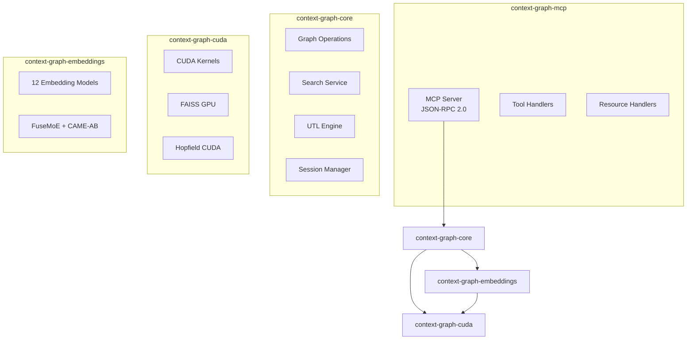
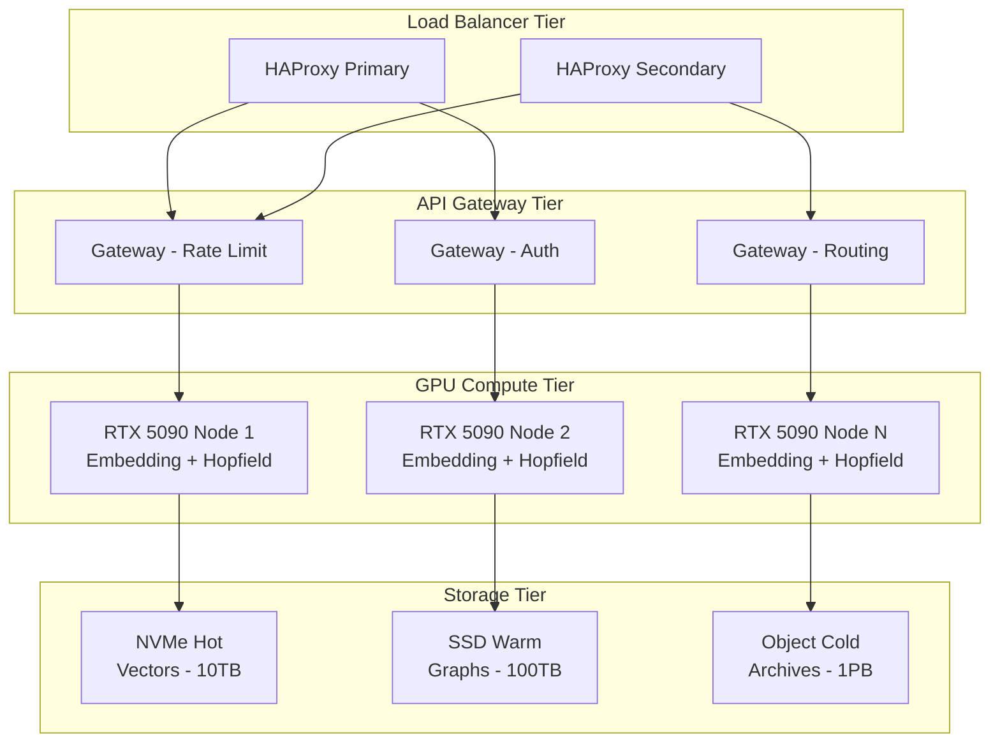

# Ultimate Context Graph - Technical Engine

**Version**: 2.0.0 | **Classification**: Technical Specification

---

## 0. KEY TECHNICAL ADDITIONS (Quick Reference)

### 🎯 NEW: Verbosity Levels (Token Economy)

```rust
/// Metadata verbosity levels for inject_context
/// Prevents context window bloat from Bio-Nervous metadata
pub enum VerbosityLevel {
    /// Level 0: Raw text only (~100 tokens)
    /// Use for: Simple lookups, high-confidence retrieval
    RawOnly = 0,

    /// Level 1: Text + Key IDs (~200 tokens) ← DEFAULT
    /// Use for: Normal operations, preserves traceability
    TextAndIds = 1,

    /// Level 2: Full Bio-Nervous insights (~800 tokens)
    /// Use for: ONLY when delta_c < 0.4 (confused state)
    /// Includes: causal_links, entailment_cones, UTL scores, conflict analysis
    FullInsights = 2,
}

impl VerbosityLevel {
    /// Auto-select based on UTL state
    pub fn auto_select(utl: &UTLState) -> Self {
        if utl.delta_c < 0.4 {
            Self::FullInsights  // Confused → need full context
        } else if utl.delta_s > 0.7 {
            Self::TextAndIds    // High entropy → some metadata helps
        } else {
            Self::RawOnly       // Confident → save tokens
        }
    }
}
```

### 🔒 NEW: Perspective-Based Filtering (Multi-Agent Safety)

```rust
/// Prevents cross-agent "memetic interference"
/// Agent A (coder) won't retrieve Agent B's (creative writer) metaphors
pub struct PerspectiveLock {
    pub domain: Option<Domain>,          // code, medical, legal, creative, research
    pub agent_ids: Vec<String>,          // Allow only these agents
    pub exclude_agent_ids: Vec<String>,  // Block these agents
}

/// 🛡️ Priors Vibe Check - Prevents Memetic Drift During Merges
/// Small vector representing agent's assumptions when storing a node
/// Used during merge_concepts to detect incompatible worldviews
#[derive(Clone, Debug, Default)]
pub struct PriorsVibeCheck {
    /// 128D vector encoding agent's assumptions at storage time
    pub assumption_embedding: Vector128,
    /// Domain-specific priors (e.g., "Python semantics", "Java semantics")
    pub domain_priors: Option<String>,
    /// Confidence in these priors (0-1)
    pub prior_confidence: f32,
}

impl PriorsVibeCheck {
    /// Check if two nodes' priors are compatible for merging
    /// Returns (compatible, explanation)
    pub fn check_compatibility(&self, other: &PriorsVibeCheck) -> (bool, String) {
        let similarity = self.assumption_embedding.cosine_similarity(&other.assumption_embedding);

        // Threshold: 0.7 similarity required for safe merge
        if similarity < 0.7 {
            let explanation = format!(
                "Priors incompatible (sim={:.2}). {} vs {}. Consider relational edge instead.",
                similarity,
                self.domain_priors.as_deref().unwrap_or("unknown"),
                other.domain_priors.as_deref().unwrap_or("unknown")
            );
            return (false, explanation);
        }

        (true, "Priors compatible for merge".to_string())
    }
}

/// Enhanced merge operation with priors checking
pub fn safe_merge_concepts(
    graph: &mut KnowledgeGraph,
    source_ids: &[Uuid],
    target_name: &str,
    force: bool,
) -> MergeResult {
    let nodes: Vec<_> = source_ids.iter()
        .filter_map(|id| graph.get(*id))
        .collect();

    // Check all pairwise priors compatibility
    for (a, b) in nodes.iter().combinations(2) {
        let (compatible, reason) = a.priors_vibe_check.check_compatibility(&b.priors_vibe_check);

        if !compatible && !force {
            // Create relational edge instead of merging
            let edge_note = format!(
                "In {}: {}; but in {}: {}",
                a.priors_vibe_check.domain_priors.as_deref().unwrap_or("context A"),
                a.content.chars().take(50).collect::<String>(),
                b.priors_vibe_check.domain_priors.as_deref().unwrap_or("context B"),
                b.content.chars().take(50).collect::<String>()
            );

            graph.add_edge(GraphEdge {
                source: a.id,
                target: b.id,
                edge_type: EdgeType::Relational,
                weight: 0.8,
                metadata: json!({ "relational_note": edge_note }),
                ..Default::default()
            });

            return MergeResult::RelationalEdgeCreated { note: edge_note };
        }
    }

    // Proceed with actual merge
    graph.merge_concepts_internal(source_ids, target_name)
}

impl PerspectiveLock {
    /// Filter search results by perspective compatibility
    pub fn filter(&self, nodes: &[KnowledgeNode]) -> Vec<&KnowledgeNode> {
        nodes.iter().filter(|n| {
            // Domain filter
            if let Some(domain) = &self.domain {
                if n.observer_perspective.domain.as_ref() != Some(domain) {
                    return false;
                }
            }
            // Agent whitelist
            if !self.agent_ids.is_empty() {
                if let Some(agent_id) = &n.agent_id {
                    if !self.agent_ids.contains(agent_id) {
                        return false;
                    }
                }
            }
            // Agent blacklist
            if let Some(agent_id) = &n.agent_id {
                if self.exclude_agent_ids.contains(agent_id) {
                    return false;
                }
            }
            true
        }).collect()
    }
}

#[derive(Clone, Debug, PartialEq)]
pub enum Domain {
    Code,
    Medical,
    Legal,
    Creative,
    Research,
    General,
}

/// 128D vector for priors encoding (smaller than main 1536D embedding)
pub type Vector128 = [f32; 128];
```

### 🛡️ NEW: Tool Orchestrator (Reasoning Trace)

```rust
/// reflect_on_memory implementation
/// Suggests tool sequence based on UTL state to prevent "decision paralysis"
pub fn suggest_tool_sequence(goal: &str, utl: &UTLState) -> Vec<ToolSuggestion> {
    let mut sequence = Vec::new();

    if utl.delta_s > 0.6 {
        // High entropy: clarify first
        sequence.push(ToolSuggestion {
            tool: "epistemic_action",
            rationale: "Reduce uncertainty before searching",
        });
    }

    if utl.delta_c < 0.4 {
        // Low coherence: consolidate
        sequence.push(ToolSuggestion {
            tool: "trigger_dream",
            rationale: "Consolidate fragmented memories",
        });
    }

    // Always include context injection with appropriate verbosity
    sequence.push(ToolSuggestion {
        tool: "inject_context",
        params: json!({ "verbosity_level": VerbosityLevel::auto_select(utl) }),
        rationale: "Retrieve relevant context",
    });

    sequence
}
```

---

### Conflict Detection Logic (Just-in-Time Complexity)

**Problem**: Returning full `conflict_alert` details (nodes, causal maps, entailment cones) uses ~300 tokens per conflict. Agent may spend 50% reasoning budget on irrelevant conflicts.

**Solution**: Return `conflict_id` only. Agent fetches details via `get_conflict_details(conflict_id)` if relevant.

```rust
/// Fires when: cosine_similarity > 0.8 AND causal_coherence < 0.3
/// Returns ONLY conflict_id to minimize token overhead
pub fn detect_conflict(nodes: &[KnowledgeNode]) -> Option<ConflictAlert> {
    for (a, b) in nodes.iter().combinations(2) {
        let sim = a.embedding.cosine_similarity(&b.embedding);
        let coherence = causal_coherence(a.id, b.id);
        if sim > 0.8 && coherence < 0.3 {
            // Generate conflict_id, defer full details
            let conflict_id = hash_conflict(a.id, b.id);
            return Some(ConflictAlert {
                conflict_id,           // ONLY this in response (~20 tokens)
                topic: extract_topic(a, b),  // Short summary
                // Full details via get_conflict_details(conflict_id)
            });
        }
    }
    None
}

/// Agent calls this ONLY when conflict is relevant to current task
pub fn get_conflict_details(conflict_id: &str) -> ConflictDetails {
    ConflictDetails {
        conflicting_nodes: Vec<Uuid>,
        causal_links: Vec<CausalPath>,
        entailment_analysis: EntailmentReport,
        suggested_resolution: ResolutionStrategy,
    }
}
```

**Token Economy**: Default response ~50 tokens. Full details ~300 tokens only when needed.

### 🔖 Citation Tagging (Semantic Breadcrumbs)

```rust
/// Citation tag embedded in distilled narratives
/// Allows selective expansion via hydrate_citation tool
#[derive(Clone, Debug)]
pub struct CitationTag {
    pub tag: String,           // e.g., "[node_abc123]"
    pub node_id: Uuid,
    pub paragraph_index: usize, // Which paragraph this citation supports
    pub confidence: f32,        // How much of the paragraph is from this source
}

/// Distillation with citation preservation
impl ContextDistiller {
    pub fn distill_with_citations(&self, nodes: &[KnowledgeNode], query: &str) -> DistilledContextWithCitations {
        let narrative = self.synthesize_narrative(nodes, query);

        // Embed citation tags inline: "The API uses OAuth2 [node_abc123] for auth..."
        let (tagged_narrative, citations) = self.embed_citation_tags(&narrative, nodes);

        DistilledContextWithCitations {
            narrative: tagged_narrative,
            citation_tags: citations,
            source_node_ids: nodes.iter().map(|n| n.id).collect(),
        }
    }

    fn embed_citation_tags(&self, narrative: &str, nodes: &[KnowledgeNode]) -> (String, Vec<CitationTag>) {
        // For each paragraph, find most relevant source nodes
        // Embed [node_uuid_short] tags at sentence boundaries
        // Return tagged narrative + citation metadata
        todo!("Semantic attribution algorithm")
    }
}
```

**Why**: Agents suffer "Authority Bias"—they trust injected context blindly. Citation tags let agents verify suspicious summaries.

### Pre-emptive Bundling Response Extension
- `bundled_metadata.causal_links`: Vec of CausalPath structs
- `bundled_metadata.entailment_cones`: Vec of EntailmentCone structs
- `bundled_metadata.neighborhood`: Neighborhood struct (2-hop subgraph)

### Scratchpad TTL & Auto-Commit
- Default TTL: 60 minutes
- Dream phase scans scratchpad items
- Items with `importance > auto_commit_threshold` → committed to long-term graph
- Others discarded (or tagged for manual review)

---

## 0.4 Cognitive Pulse (Meta-Cognitive Loop)

**Problem**: Agents are stateless per turn. They don't know when to call `get_memetic_status`.

**Solution**: Every MCP tool response includes a mandatory `Pulse` header—forcing agents to see their mental state without spending a turn asking.

```rust
/// Cognitive Pulse - Appended to every MCP tool response
/// Turns meta-cognition from ACTION → PERCEPTION
#[derive(Clone, Debug, Serialize)]
pub struct CognitivePulse {
    /// Current entropy level (0-1)
    pub entropy: f32,
    /// Current coherence level (0-1)
    pub coherence: f32,
    /// Suggested next action based on UTL state
    pub suggested: SuggestedAction,
    /// Optional: Active conflict IDs (agent can fetch details if needed)
    pub active_conflicts: Vec<String>,
}

#[derive(Clone, Debug, Serialize)]
pub enum SuggestedAction {
    ContinueWorking,          // Stable state, no intervention needed
    TriggerDream,             // Low coherence, needs consolidation
    EpistemicAction,          // High entropy, seek clarification
    CritiqueContext,          // Potential self-contradiction detected
    CheckCurationTasks,       // Maintenance items queued
    GetNeighborhood,          // Stale context, explore locally
}

impl CognitivePulse {
    pub fn from_utl(utl: &UTLState, graph: &KnowledgeGraph) -> Self {
        let suggested = match (utl.delta_s > 0.7, utl.delta_c < 0.4) {
            (true, true)  => SuggestedAction::TriggerDream,
            (true, false) => SuggestedAction::EpistemicAction,
            (false, true) => SuggestedAction::GetNeighborhood,
            (false, false) => SuggestedAction::ContinueWorking,
        };

        Self {
            entropy: utl.delta_s,
            coherence: utl.delta_c,
            suggested,
            active_conflicts: graph.get_active_conflict_ids(),
        }
    }

    /// Serialize as compact header (~30 tokens)
    pub fn to_header(&self) -> String {
        format!(
            "Pulse: {{ Entropy: {:.2}, Coherence: {:.2}, Suggested: \"{}\" }}",
            self.entropy,
            self.coherence,
            self.suggested.as_str()
        )
    }
}
```

**Token Economy**: ~30 tokens per response. Zero cost for agent to perceive its own state.

---

## 0.45 Graph Gardener (Background Optimization)

**Problem**: Knowledge graphs accumulate weak links, duplicate nodes, and stale connections. Manual curation is tedious.

**Solution**: Background graph optimization that runs between major phases (not during queries).

```rust
/// Graph Gardener - Runs in background between active phases
/// Prunes weak links, merges duplicates, optimizes for retrieval speed
pub struct GraphGardener {
    /// Minimum edge weight to keep (default: 0.1)
    pub prune_threshold: f32,
    /// Similarity threshold for duplicate detection (default: 0.95)
    pub duplicate_threshold: f32,
    /// Maximum nodes to process per gardening cycle (default: 1000)
    pub batch_size: usize,
    /// Interval between gardening cycles (default: 5 minutes)
    pub interval: Duration,
    /// How aggressive to be (0.0 = conservative, 1.0 = aggressive)
    pub aggressiveness: f32,
}

impl GraphGardener {
    /// Run one gardening cycle
    pub async fn tend(&self, graph: &mut ConcurrentGraph) -> GardeningReport {
        let mut report = GardeningReport::default();

        // Phase 1: Prune weak edges (below threshold, no recent access)
        report.edges_pruned = self.prune_weak_edges(graph).await;

        // Phase 2: Detect and merge near-duplicates in vector space
        report.duplicates_merged = self.merge_vector_duplicates(graph).await;

        // Phase 3: Optimize graph structure (rebalance hyperbolic positions)
        report.nodes_rebalanced = self.rebalance_positions(graph).await;

        // Phase 4: Update FAISS index if structural changes occurred
        if report.structural_changes() > 0 {
            graph.rebuild_faiss_index().await;
        }

        report
    }

    async fn prune_weak_edges(&self, graph: &mut ConcurrentGraph) -> usize {
        let threshold = self.prune_threshold * (1.0 + self.aggressiveness);
        let mut graph_lock = graph.inner.write().await;

        graph_lock.edges
            .retain(|e| e.weight > threshold || e.last_accessed.elapsed() < Duration::hours(24));

        // Return count of pruned edges
        0 // Actual implementation tracks count
    }

    async fn merge_vector_duplicates(&self, graph: &mut ConcurrentGraph) -> usize {
        let graph_lock = graph.inner.read().await;

        // Find nodes with similarity > threshold
        let candidates = graph_lock.find_near_duplicates(self.duplicate_threshold);
        drop(graph_lock);

        // Merge candidates (respecting priors_vibe_check)
        for (node_a, node_b) in candidates {
            let result = graph.safe_merge_concepts(&[node_a, node_b], "auto_merged", false).await;
            // Only count successful merges (priors compatible)
        }

        0 // Actual implementation tracks count
    }
}

#[derive(Default, Debug)]
pub struct GardeningReport {
    pub edges_pruned: usize,
    pub duplicates_merged: usize,
    pub nodes_rebalanced: usize,
    pub duration_ms: u64,
}
```

**Scheduling**: Runs when `activity < 0.15` for 2+ minutes. Aborts on any user query.

---

## 0.5 PII Scrubbing (Privacy & Redaction Layer)

**Problem**: Passive capture stores thought streams containing API keys, passwords, PII. Dream phase might consolidate sensitive data into semantic clusters → retrieved in unsafe contexts.

**Solution**: Layer 1 (Sensing) pre-processing with lightweight NER before embedding pipeline.

```rust
/// PII Scrubber - Immune system sub-module in Layer 1 (Sensing)
/// Runs BEFORE embedding generation to prevent sensitive data storage
pub struct PIIScrubber {
    /// Lightweight NER model (distilbert-ner, <100ms)
    ner_model: NERModel,
    /// Regex patterns for structured PII
    pattern_matchers: Vec<PIIPattern>,
    /// Action: redact, hash, or block
    action: PIIAction,
}

impl PIIScrubber {
    /// Standard patterns - API keys, passwords, SSN, credit cards
    pub fn default_patterns() -> Vec<(&'static str, &'static str)> {
        vec![
            ("api_key", r"(?i)(api[_-]?key|apikey)[=:\s]*['\"]?[\w-]{20,}"),
            ("password", r"(?i)(password|passwd|pwd)[=:\s]*['\"]?[^\s'\"]{8,}"),
            ("bearer_token", r"Bearer\s+[\w-]+\.[\w-]+\.[\w-]+"),
            ("ssn", r"\b\d{3}-\d{2}-\d{4}\b"),
            ("credit_card", r"\b\d{4}[\s-]?\d{4}[\s-]?\d{4}[\s-]?\d{4}\b"),
        ]
    }

    /// Scrub content BEFORE embedding pipeline
    pub fn scrub(&self, content: &str) -> ScrubResult {
        // 1. Pattern matching (fast, <1ms)
        // 2. NER for unstructured PII (names, addresses) - <100ms
        // 3. Replace with [REDACTED:type] placeholders
        // Total overhead: <100ms per storage
    }
}
```

**Latency**: Pattern matching <1ms, NER <100ms. Total: <100ms per storage.

---

## 0.6 Query Synthesis (Search Plan Generator)

**Problem**: AI agents write suboptimal queries—too verbose, missing keywords, single-model bias.

**Solution**: `generate_search_plan` expands goals into multi-perspective queries automatically.

```rust
/// Query Synthesizer - Expands agent goals into optimized search queries
/// Uses PredictiveCoder to generate queries targeting different embedding models
pub struct QuerySynthesizer {
    /// PredictiveCoder for context-aware query expansion
    predictive_coder: PredictiveCoder,
    /// Target embedding model priorities
    model_priorities: [f32; 12],
}

impl QuerySynthesizer {
    /// Generate search plan from high-level goal
    pub fn generate_plan(&self, goal: &str, max_queries: usize) -> SearchPlan {
        let mut queries = Vec::with_capacity(max_queries);

        // Semantic query (E1: Dense Transformer)
        queries.push(SearchQuery {
            query: self.expand_semantic(goal),
            query_type: QueryType::Semantic,
            target_model: EmbeddingModel::Semantic,
            rationale: "Direct semantic similarity match".into(),
        });

        // Causal query (E5: SCM Intervention)
        if let Some(causal) = self.extract_causal_frame(goal) {
            queries.push(SearchQuery {
                query: causal,
                query_type: QueryType::Causal,
                target_model: EmbeddingModel::Causal,
                rationale: "Cause-effect relationship chain".into(),
            });
        }

        // Code query (E7: AST-aware)
        if self.contains_code_intent(goal) {
            queries.push(SearchQuery {
                query: self.expand_code_terms(goal),
                query_type: QueryType::Code,
                target_model: EmbeddingModel::Code,
                rationale: "Code-level implementation patterns".into(),
            });
        }

        SearchPlan {
            queries: queries.into_iter().take(max_queries).collect(),
            execution_strategy: ExecutionStrategy::Parallel,
            token_estimate: self.estimate_tokens(&queries),
        }
    }

    fn expand_semantic(&self, goal: &str) -> String {
        // Use PredictiveCoder to add contextual synonyms
        self.predictive_coder.expand_with_priors(goal, &EmbeddingPriors::semantic_heavy())
    }

    fn extract_causal_frame(&self, goal: &str) -> Option<String> {
        // Pattern: "why X causes Y" → "X → Y causal chain"
        // Pattern: "how X affects Y" → "X → ... → Y path"
        let causal_patterns = ["why", "causes", "affects", "leads to", "results in"];
        if causal_patterns.iter().any(|p| goal.to_lowercase().contains(p)) {
            Some(self.reframe_as_causal(goal))
        } else {
            None
        }
    }
}

#[derive(Debug)]
pub struct SearchPlan {
    pub queries: Vec<SearchQuery>,
    pub execution_strategy: ExecutionStrategy,
    pub token_estimate: usize,
}

#[derive(Debug)]
pub enum ExecutionStrategy {
    Parallel,    // Run all queries simultaneously
    Sequential,  // Try queries in order until success
    Cascade,     // Combine results with deduplication
}
```

---

## 0.7 Multi-Hop Path Finding

**Problem**: Agents manually hop through `get_neighborhood`, burning tokens and losing their goal.

**Solution**: Direct path-finding between concepts using graph algorithms + embeddings.

```rust
/// Causal Path Finder - Direct A→B relationship discovery
/// Uses Dijkstra on weighted graph with embedding-guided heuristics
pub struct CausalPathFinder {
    /// Causal embedding model for edge weighting
    causal_embedder: CausalEmbedder,
    /// Graph embedding model for node similarity heuristics
    graph_embedder: GraphEmbedder,
    /// Maximum path length
    max_hops: usize,
}

impl CausalPathFinder {
    /// Find path between two concepts (fuzzy matching supported)
    pub fn find_path(
        &self,
        graph: &KnowledgeGraph,
        start: &str,
        end: &str,
        path_type: PathType,
    ) -> PathResult {
        // Fuzzy match concept names to node IDs
        let start_node = graph.fuzzy_find_node(start)?;
        let end_node = graph.fuzzy_find_node(end)?;

        // A* search with embedding-based heuristic
        let heuristic = |node: &KnowledgeNode| {
            // Distance to target in embedding space guides search
            node.embedding.cosine_distance(&end_node.embedding)
        };

        let path = self.a_star_search(
            graph,
            start_node.id,
            end_node.id,
            heuristic,
            path_type,
        )?;

        // Generate narrative from path
        let narrative = self.narrate_path(&path, graph);

        PathResult {
            path_found: true,
            narrative,
            path,
            hop_count: path.len() - 1,
            path_confidence: self.compute_path_confidence(&path),
        }
    }

    fn narrate_path(&self, path: &[PathNode], graph: &KnowledgeGraph) -> String {
        // Generate human-readable narrative
        // "A generates B → B is validated by C → C triggers D"
        path.windows(2)
            .map(|pair| {
                let edge = graph.get_edge(pair[0].id, pair[1].id);
                format!("{} {} {}",
                    pair[0].name,
                    edge.narrate_relationship(),  // "generates", "triggers", "validates"
                    pair[1].name
                )
            })
            .collect::<Vec<_>>()
            .join(" → ")
    }
}

#[derive(Debug)]
pub struct PathResult {
    pub path_found: bool,
    pub narrative: String,
    pub path: Vec<PathNode>,
    pub hop_count: usize,
    pub path_confidence: f32,
}
```

---

## 0.8 Passive Curation Layer (Shadow Agent)

**Problem**: Agents ignore `curation_tasks` while focused on primary work. Graph gets "constipated" with duplicates.

**Solution**: Background worker handles safe, unambiguous maintenance automatically.

```rust
/// Passive Curator - Background maintenance without agent involvement
/// Only escalates genuinely ambiguous cases to agent's curation_tasks inbox
pub struct PassiveCurator {
    /// Auto-merge threshold (default: 0.95 similarity + priors compatible)
    auto_merge_threshold: f32,
    /// Auto-prune threshold for weak edges (default: 0.1)
    auto_prune_threshold: f32,
    /// Escalation threshold - below this, ask agent (default: 0.85)
    escalation_threshold: f32,
}

impl PassiveCurator {
    /// Run passive curation cycle (called by Graph Gardener)
    pub async fn curate(&self, graph: &mut ConcurrentGraph) -> CurationReport {
        let mut report = CurationReport::default();

        // Phase 1: Auto-merge obvious duplicates
        let duplicates = graph.find_near_duplicates(self.auto_merge_threshold).await;
        for (node_a, node_b) in duplicates {
            // Check priors compatibility
            let a = graph.get(node_a).await.unwrap();
            let b = graph.get(node_b).await.unwrap();

            let (compatible, _) = a.priors_vibe_check.check_compatibility(&b.priors_vibe_check);

            if compatible {
                // Safe to auto-merge (high confidence, compatible priors)
                graph.merge_concepts_internal(&[node_a, node_b], "auto_merged").await;
                report.auto_merged += 1;
                report.log_auto_action(AutoAction::Merge { nodes: vec![node_a, node_b] });
            } else {
                // Priors incompatible - escalate to agent
                report.escalated.push(CurationTask {
                    task_type: CurationTaskType::AmbiguousMerge,
                    target_nodes: vec![node_a, node_b],
                    reason: format!("Similar content but different priors: {}",
                        a.priors_vibe_check.domain_priors.as_deref().unwrap_or("unknown")),
                    suggested_tool: "merge_concepts",
                    priority: Priority::Medium,
                });
            }
        }

        // Phase 2: Auto-prune weak edges (handled by Graph Gardener)
        // Only log for transparency

        // Phase 3: Escalate genuinely ambiguous cases
        let ambiguous = graph.find_ambiguous_clusters(self.escalation_threshold).await;
        for cluster in ambiguous {
            report.escalated.push(CurationTask {
                task_type: CurationTaskType::AmbiguityDetected,
                target_nodes: cluster.node_ids,
                reason: cluster.ambiguity_reason,
                suggested_tool: "merge_concepts",
                priority: cluster.priority,
            });
        }

        report
    }
}

#[derive(Default, Debug)]
pub struct CurationReport {
    pub auto_merged: usize,
    pub auto_pruned: usize,
    pub escalated: Vec<CurationTask>,
    pub auto_actions_log: Vec<AutoAction>,  // For transparency/audit
}

/// What gets escalated to agent vs handled automatically
///
/// AUTO-HANDLED (no agent involvement):
/// - Duplicates with sim > 0.95 AND priors compatible
/// - Weak edges < 0.1 weight AND no recent access
/// - Orphan nodes (no edges) older than 30 days
///
/// ESCALATED TO AGENT (via curation_tasks):
/// - Ambiguous duplicates (sim 0.7-0.95)
/// - Priors-incompatible similar nodes
/// - Conflicting information (high sim, opposing claims)
/// - Semantic cancer suspects (high importance, high neighbor entropy)
```

**Token Savings**: Reduces agent "librarian duty" by ~70% by handling routine maintenance silently.

---

## 0.9 Admin Manifest (Human-In-The-Loop)

**Problem**: Users see graph issues agents can't fix, but don't know UUIDs.

**Solution**: Human-editable markdown file that maps to graph operations.

```rust
/// Admin Manifest Parser - Converts markdown edits to graph operations
pub struct ManifestParser {
    /// Path to manifest file
    manifest_path: PathBuf,
    /// Concept name → UUID resolver
    name_resolver: NameResolver,
}

impl ManifestParser {
    /// Parse manifest and detect changes since last sync
    pub async fn detect_changes(&self, graph: &KnowledgeGraph) -> Vec<ManifestChange> {
        let manifest = self.read_manifest().await;
        let mut changes = Vec::new();

        // Detect deletions (lines removed from ## Active Concepts)
        let current_concepts = self.extract_concept_list(&manifest);
        let previous_concepts = self.get_previous_concepts(graph).await;

        for concept in previous_concepts.difference(&current_concepts) {
            if let Some(node_id) = self.name_resolver.resolve(concept, graph).await {
                changes.push(ManifestChange::Delete {
                    concept_name: concept.clone(),
                    node_id,
                });
            }
        }

        // Detect merge directives [MERGE: A, B]
        let merge_regex = Regex::new(r"\[MERGE:\s*([^,]+),\s*([^\]]+)\]").unwrap();
        for cap in merge_regex.captures_iter(&manifest) {
            let concept_a = cap[1].trim();
            let concept_b = cap[2].trim();

            let id_a = self.name_resolver.resolve(concept_a, graph).await;
            let id_b = self.name_resolver.resolve(concept_b, graph).await;

            if let (Some(a), Some(b)) = (id_a, id_b) {
                changes.push(ManifestChange::Merge {
                    concept_names: vec![concept_a.into(), concept_b.into()],
                    node_ids: vec![a, b],
                });
            }
        }

        changes
    }

    /// Apply detected changes to graph
    pub async fn apply_changes(
        &self,
        graph: &mut ConcurrentGraph,
        changes: &[ManifestChange],
    ) -> ApplyResult {
        let mut result = ApplyResult::default();

        for change in changes {
            match change {
                ManifestChange::Delete { node_id, .. } => {
                    graph.forget_concept(*node_id, ForgetReason::UserRequested, true).await;
                    result.deletions += 1;
                }
                ManifestChange::Merge { node_ids, concept_names } => {
                    let merged_name = concept_names.join("_");
                    graph.merge_concepts_internal(node_ids, &merged_name).await;
                    result.merges += 1;
                }
            }
        }

        // Update manifest with resolved UUIDs for transparency
        self.update_manifest_comments(graph).await;

        result
    }
}

#[derive(Debug)]
pub enum ManifestChange {
    Delete { concept_name: String, node_id: Uuid },
    Merge { concept_names: Vec<String>, node_ids: Vec<Uuid> },
    Annotate { concept_name: String, node_id: Uuid, note: String },
}
```

**Manifest Format** (`~/.context-graph/manifest.md`):
```markdown
# Knowledge Manifest
Last synced: 2024-01-15T10:30:00Z

## Active Concepts
- UserAuthentication
- JWTTokenValidation
- RateLimiting
- APIEndpoints

## Pending Actions
[MERGE: JWTTokenValidation, OAuth2Validation]

## Notes
[NOTE: RateLimiting] Deprecated in v2.0, replaced by CircuitBreaker
```

---

## 1. 12-Model Embedding Architecture

### 1.1 Embedding Matrix

| ID | Model | Dimension | Math/Logic | Target Hardware | Latency |
|----|-------|-----------|------------|-----------------|---------|
| E1 | Semantic | 1024D | Dense Transformer | Tensor Core FP8 | <5ms |
| E2 | Temporal-Recent | 512D | Exponential Decay | Vector Unit | <2ms |
| E3 | Temporal-Periodic | 512D | Fourier Basis | FFT Unit | <2ms |
| E4 | Temporal-Positional | 512D | Sinusoidal PE | CUDA Core | <2ms |
| E5 | Causal | 768D | SCM Intervention | Tensor Core | <8ms |
| E6 | Sparse | ~30K (5% active) | Top-K Activation | Sparse Tensor | <3ms |
| E7 | Code | 1536D | AST-aware Transformer | Tensor Core FP16 | <10ms |
| E8 | Graph/GNN | 1536D | Message Passing | CUDA Graph | <5ms |
| E9 | HDC | 10K-bit | XOR/Hamming | Vector Unit | <1ms |
| E10 | Multimodal | 1024D | Cross-Attention | Tensor Core | <15ms |
| E11 | Entity/TransE | 256D | Translation h+r≈t | CUDA Core | <2ms |
| E12 | Late-Interaction | 128D/token | ColBERT MaxSim | CUDA Tile | <8ms |

### 1.2 Universal Kernel Template

```rust
/// Universal CUDA kernel template for embedding generation
/// Instantiate with model-specific constants
#[cuda_kernel]
pub unsafe fn embedding_kernel<const DIM: usize, const HEADS: usize>(
    input: &CudaSlice<f16>,
    weights: &CudaSlice<f16>,
    output: &mut CudaSlice<f16>,
    batch_size: u32,
) {
    let tid = threadIdx.x + blockIdx.x * blockDim.x;
    if tid >= batch_size * DIM { return; }

    let batch_idx = tid / DIM;
    let dim_idx = tid % DIM;

    // Shared memory for cooperative loading
    extern __shared__ float smem[];

    // Load input tile to shared memory
    let input_tile = &mut smem[0..DIM];
    cooperative_load(input, input_tile, batch_idx);
    __syncthreads();

    // Matrix multiply with Tensor Cores (FP8 accumulate)
    let mut acc = 0.0f32;
    for k in 0..HEADS {
        let w = weights[(k * DIM + dim_idx) as usize];
        let x = input_tile[k];
        acc += tensorcore_fma_fp8(w, x);
    }

    // Write output with L2 normalization
    output[(batch_idx * DIM + dim_idx) as usize] = normalize_component(acc, dim_idx, DIM);
}

/// Model-specific instantiation
pub type SemanticKernel = embedding_kernel<1024, 16>;
pub type CausalKernel = embedding_kernel<768, 12>;
pub type CodeKernel = embedding_kernel<1536, 24>;
```

---

## 2. Multi-Array Teleological Storage (Replaces FuseMoE)

> **IMPORTANT**: FuseMoE embedding fusion is DEPRECATED. The system now uses Multi-Array
> Teleological Storage where all 13 embeddings (E1-E12 + E13 SPLADE) are stored SEPARATELY.
> NO concatenation or fusion of embeddings occurs. The 13-embedding array IS the teleological vector.

### 2.1 Multi-Array Storage Architecture

```rust
/// Multi-Array Teleological Storage
/// All 13 embeddings stored separately - NO fusion/concatenation
/// The 13-embedding array IS the teleological vector (Royse 2026)
pub struct SemanticFingerprint {
    /// E1: Semantic embedding (1024D, Matryoshka-truncatable)
    pub semantic: Vector1024,
    /// E2-E4: Temporal embeddings (512D each)
    pub temporal_recent: Vector512,
    pub temporal_periodic: Vector512,
    pub temporal_positional: Vector512,
    /// E5: Causal embedding (768D, asymmetric similarity)
    pub causal: CausalEmbedding,
    /// E6: Sparse activations (~30K, 5% active)
    pub sparse: SparseVector,
    /// E7: Code embedding (1536D)
    pub code: Vector1536,
    /// E8: Graph structure (384D)
    pub graph: Vector384,
    /// E9: HDC binary (10K-bit → 1024 packed)
    pub hdc: BitVector,
    /// E10: Multimodal (768D)
    pub multimodal: Vector768,
    /// E11: Entity/Knowledge Graph (384D)
    pub entity: Vector384,
    /// E12: Late Interaction (128D per token)
    pub late_interaction: Vec<Vector128>,
    /// E13: SPLADE sparse (~30K vocab)
    pub splade: SpladeVector,
}

/// RRF (Reciprocal Rank Fusion) for multi-space similarity
/// Fuses SCORES from per-space similarity - NOT vector concatenation
pub fn rrf_similarity(
    query: &SemanticFingerprint,
    candidate: &SemanticFingerprint,
    weights: &QueryTypeWeights,
) -> f32 {
    const K: f32 = 60.0;

    // Compute per-space similarities (each space uses appropriate metric)
    let sims = [
        cosine_sim(&query.semantic, &candidate.semantic),
        cosine_sim(&query.temporal_recent, &candidate.temporal_recent),
        cosine_sim(&query.temporal_periodic, &candidate.temporal_periodic),
        cosine_sim(&query.temporal_positional, &candidate.temporal_positional),
        asymmetric_causal_sim(&query.causal, &candidate.causal), // Asymmetric!
        jaccard_weighted(&query.sparse, &candidate.sparse),
        cosine_sim(&query.code, &candidate.code),
        cosine_sim(&query.graph, &candidate.graph),
        hamming_sim(&query.hdc, &candidate.hdc),
        cosine_sim(&query.multimodal, &candidate.multimodal),
        transe_score(&query.entity, &candidate.entity),
        maxsim_score(&query.late_interaction, &candidate.late_interaction),
        sparse_dot(&query.splade, &candidate.splade),
    ];

    // Convert to ranks and apply RRF formula
    let mut indexed: Vec<(usize, f32)> = sims.iter().enumerate()
        .map(|(i, &s)| (i, s))
        .collect();
    indexed.sort_by(|a, b| b.1.partial_cmp(&a.1).unwrap());

    // RRF with query-type weights: RRF(d) = Σᵢ wᵢ/(k + rankᵢ)
    indexed.iter().enumerate()
        .map(|(rank, (space_idx, _))| weights[*space_idx] / (K + (rank + 1) as f32))
        .sum()
}
```

### 2.2 CAME-AB Cross-Modality Attention

```rust
/// Cross-Attention Modality Encoder with Adaptive Bridging
pub struct CAMEAB {
    /// Cross-attention heads per modality pair
    attention_heads: usize,
    /// Bridge weights for modality alignment
    bridge_weights: HashMap<(Modality, Modality), Tensor2D<f32>>,
}

impl CAMEAB {
    /// Apply cross-modality attention fusion
    pub fn fuse(&self, modality_embeddings: &[(Modality, Vector1536)]) -> Vector1536 {
        let n = modality_embeddings.len();
        let mut attention_outputs = Vec::with_capacity(n);

        for (i, (mod_i, emb_i)) in modality_embeddings.iter().enumerate() {
            // Compute cross-attention with all other modalities
            let mut cross_attn = Vector1536::zeros();
            let mut attn_sum = 0.0f32;

            for (j, (mod_j, emb_j)) in modality_embeddings.iter().enumerate() {
                if i == j { continue; }

                let bridge = self.bridge_weights.get(&(*mod_i, *mod_j))
                    .unwrap_or(&Tensor2D::identity());

                // Q = emb_i, K = V = bridge(emb_j)
                let kv = bridge.matmul(emb_j);
                let attn_weight = emb_i.dot(&kv) / (1536.0f32).sqrt();
                let attn_prob = attn_weight.exp();

                cross_attn = cross_attn.add(&kv.scale(attn_prob));
                attn_sum += attn_prob;
            }

            if attn_sum > 0.0 {
                cross_attn = cross_attn.scale(1.0 / attn_sum);
            }

            // Residual connection
            attention_outputs.push(emb_i.add(&cross_attn).normalize());
        }

        // Mean pooling of cross-attended embeddings
        attention_outputs.iter()
            .fold(Vector1536::zeros(), |acc, v| acc.add(v))
            .scale(1.0 / n as f32)
            .normalize()
    }
}
```

---

## 3. Hardware Acceleration (RTX 5090 / CUDA 13.1)

### 3.1 Hardware Specifications

| Specification | Value |
|--------------|-------|
| GPU | NVIDIA GeForce RTX 5090 (Blackwell) |
| VRAM | 32GB GDDR7 |
| Memory Bandwidth | 1,792 GB/s |
| CUDA Cores | 21,760 |
| Tensor Cores | 680 (5th Gen) |
| Compute Capability | 12.0 |
| CUDA Version | 13.1 |
| Driver Version | 560.0+ |

### 3.2 CUDA 13.1 Features

```rust
/// CUDA 13.1 feature configuration
pub struct Cuda131Config {
    /// Green Contexts: SM partitioning for concurrent kernels
    pub green_contexts: GreenContextConfig,
    /// FP8/FP4 precision for inference
    pub precision: PrecisionMode,
    /// CUDA Tile for memory-efficient attention
    pub tile_config: CudaTileConfig,
}

/// Green Context for SM partitioning
#[derive(Clone)]
pub struct GreenContextConfig {
    /// SMs allocated to this context (out of 680)
    pub sm_count: u32,
    /// Priority level (higher = more resources)
    pub priority: u32,
    /// Memory pool size in GB
    pub memory_pool_gb: f32,
}

impl GreenContextConfig {
    /// Default partition: 4 contexts of 170 SMs each
    pub fn quad_partition() -> [Self; 4] {
        [
            Self { sm_count: 170, priority: 3, memory_pool_gb: 8.0 }, // Critical
            Self { sm_count: 170, priority: 2, memory_pool_gb: 8.0 }, // High
            Self { sm_count: 170, priority: 1, memory_pool_gb: 8.0 }, // Normal
            Self { sm_count: 170, priority: 0, memory_pool_gb: 8.0 }, // Background
        ]
    }
}

/// Precision modes for Blackwell architecture
#[derive(Clone, Copy)]
pub enum PrecisionMode {
    FP32,           // Full precision training
    FP16,           // Mixed precision training
    BF16,           // Brain float for stability
    FP8E4M3,        // Inference (4-bit exponent)
    FP8E5M2,        // Training (5-bit exponent)
    FP4,            // Ultra-low precision inference
}

/// CUDA Tile configuration for attention
pub struct CudaTileConfig {
    /// Tile size for Q/K/V matrices
    pub tile_size: usize,
    /// Enable flash attention 3.0
    pub flash_attention: bool,
    /// Persistent thread blocks
    pub persistent_kernels: bool,
}
```

### 3.3 GPU Direct Storage (GDS)

```rust
/// GPU Direct Storage for NVMe→GPU transfers
pub struct GDSConfig {
    /// Enable direct DMA bypass
    pub enabled: bool,
    /// Buffer size for async transfers
    pub buffer_size_mb: usize,
    /// Maximum concurrent transfers
    pub max_concurrent: usize,
}

impl GDSConfig {
    pub fn optimized() -> Self {
        Self {
            enabled: true,
            buffer_size_mb: 256,
            max_concurrent: 8,
        }
    }
}
```

---

## 4. Crate Structure



### 4.1 Crate Dependencies

```toml
# Cargo.toml (workspace)
[workspace]
members = [
    "context-graph-mcp",
    "context-graph-core",
    "context-graph-cuda",
    "context-graph-embeddings",
]

[workspace.dependencies]
tokio = { version = "1.35", features = ["full"] }
serde = { version = "1.0", features = ["derive"] }
uuid = { version = "1.6", features = ["v4"] }
chrono = { version = "0.4", features = ["serde"] }
rmcp = "0.1"  # Rust MCP SDK
cudarc = "0.10"  # CUDA bindings
faiss = { version = "0.12", features = ["gpu"] }
```

---

## 5. Deployment Architecture

### 5.1 Production Topology



### 5.2 Hardware Requirements

| Tier | Component | Min Nodes | Specs |
|------|-----------|-----------|-------|
| GPU Compute | RTX 5090 | 3 | 32GB VRAM, CUDA 13.1 |
| Hot Storage | NVMe Gen5 | 3 | 10TB, 1M IOPS, 50μs |
| Warm Storage | SSD SATA | 3 | 100TB, 100K IOPS |
| Cold Storage | Object S3 | N/A | 1PB+, eventual consistency |

### 5.3 Blue-Green Deployment

```rust
/// Blue-Green deployment phases
pub enum DeploymentPhase {
    /// Phase 1: Deploy to inactive environment
    Deploy { target: Environment },
    /// Phase 2: Health check on new deployment
    HealthCheck { timeout_ms: u64 },
    /// Phase 3: Smoke tests
    SmokeTest { test_suite: String },
    /// Phase 4: Canary traffic shift (10% → 25% → 50% → 75% → 100%)
    CanaryShift { percentage: u8 },
    /// Phase 5: Complete cutover
    Cutover,
}

/// Rollback triggers
pub struct RollbackTriggers {
    /// Error rate threshold (default: 1%)
    pub error_rate: f32,
    /// Latency P99 threshold (default: 50ms)
    pub latency_p99_ms: u64,
    /// UTL score minimum (default: 0.5)
    pub utl_score_min: f32,
}
```

---

## 6. Performance Targets

| Operation | GPU Target | CPU Baseline | Notes |
|-----------|------------|--------------|-------|
| Single Embedding | <10ms | ~50ms | Batch amortizes |
| Batch Embedding (64) | <50ms | ~200ms | Tensor Core FP8 |
| Vector Search (FAISS) | <2ms | ~15ms | 1M vectors, k=100 |
| Batch Search (100) | <5ms | ~100ms | GPU parallelism |
| Hopfield Retrieval | <1ms | ~5ms | Attention-based |
| FuseMoE Fusion | <3ms | ~15ms | Top-4 routing |
| Cache Hit | <100μs | <1ms | Redis/local |

**Constraints:**
- `Constraint: P95_Embedding_Latency < 10ms`
- `Constraint: P99_Search_Latency < 5ms`
- `Constraint: GPU_Memory_Usage < 24GB` (8GB headroom)
- `Constraint: Batch_Throughput > 1000/sec`

---

## 7. Hyperbolic Entailment Cones

**Purpose**: O(1) hierarchical reasoning via cone containment checks. Ref: [ICML Entailment Cones](http://proceedings.mlr.press/v80/ganea18a/ganea18a.pdf), [Poincaré Embeddings](https://arxiv.org/abs/1705.08039)

### 7.1 Cone Definition

```rust
/// Hyperbolic Entailment Cone in Poincaré Ball
/// Node A entails Node B iff B falls within A's cone shadow
pub struct EntailmentCone {
    /// Apex position in Poincaré ball (||apex|| < 1)
    pub apex: PoincareBallPoint,
    /// Half-aperture angle (radians)
    pub aperture: f32,
    /// Cone axis direction (unit vector)
    pub axis: Vector1536,
}

impl EntailmentCone {
    /// Check if point lies within cone (O(1) entailment check)
    /// Returns true if `point` is entailed by this cone's apex
    pub fn contains(&self, point: &PoincareBallPoint) -> bool {
        // Transform to tangent space at apex
        let tangent = self.apex.log_map(point);

        // Angle between tangent and axis
        let cos_angle = tangent.normalize().dot(&self.axis);
        let angle = cos_angle.acos();

        angle <= self.aperture
    }

    /// Compute aperture from node's specificity
    /// More specific concepts = narrower cones
    pub fn from_node(node: &KnowledgeNode, specificity: f32) -> Self {
        let aperture = std::f32::consts::FRAC_PI_2 * (1.0 - specificity);
        let axis = node.embedding.to_unit_vector();

        Self {
            apex: node.hyperbolic_position.clone(),
            aperture,
            axis,
        }
    }
}

/// Batch entailment query - find all ancestors/descendants
pub fn find_entailment_chain(
    graph: &KnowledgeGraph,
    node_id: Uuid,
    direction: EntailmentDirection,
) -> Vec<Uuid> {
    let node = graph.get(node_id).unwrap();
    let cone = EntailmentCone::from_node(node, node.specificity);

    match direction {
        EntailmentDirection::Ancestors => {
            // Nodes whose cones contain this node
            graph.nodes()
                .filter(|n| EntailmentCone::from_node(n, n.specificity).contains(&node.hyperbolic_position))
                .map(|n| n.id)
                .collect()
        }
        EntailmentDirection::Descendants => {
            // Nodes within this node's cone
            graph.nodes()
                .filter(|n| cone.contains(&n.hyperbolic_position))
                .map(|n| n.id)
                .collect()
        }
    }
}
```

### 7.2 Entailment Index

| Operation | Complexity | Notes |
|-----------|------------|-------|
| Single containment check | O(1) | Dot product + acos |
| Find all descendants | O(n) | Parallelizable on GPU |
| Transitive closure | O(log n) | With hierarchical index |
| IS-A query | O(1) | Direct cone check |

---

## 8. Sleep Replay Consolidation (SRC) Algorithm

**Purpose**: Prevent catastrophic forgetting, discover novel connections. Ref: [Nature SRC](https://www.nature.com/articles/s41467-022-34938-7), [NeuroDream](https://papers.ssrn.com/sol3/papers.cfm?abstract_id=5377250)

### 8.1 Algorithm Specification

```rust
/// Sleep Replay Consolidation - GPU-accelerated implementation
pub struct SRCAlgorithm {
    /// Hebbian learning rate during replay
    pub hebbian_lr: f32,                 // Default: 0.001
    /// Replay batch size
    pub batch_size: usize,               // Default: 64
    /// Number of replay iterations per phase
    pub iterations_per_phase: usize,     // Default: 100
    /// Weight scaling factor for spiking simulation
    pub spike_scale: f32,                // Default: 1.0
}

impl SRCAlgorithm {
    /// Execute NREM phase: replay recent memories with tight coupling
    #[cuda_kernel]
    pub fn nrem_replay(
        &self,
        graph: &mut KnowledgeGraph,
        recent_nodes: &[Uuid],
        hopfield: &mut ModernHopfieldNetwork,
    ) {
        for _ in 0..self.iterations_per_phase {
            // Sample recent nodes with recency bias
            let batch = sample_with_decay(recent_nodes, self.batch_size, 0.8);

            // Simulate spontaneous activation (no external input)
            let activations = hopfield.spontaneous_dynamics(&batch);

            // Hebbian weight update: Δw = η * pre * post
            for (i, j, strength) in activations.coactivations() {
                let edge = graph.get_edge_mut(i, j);
                edge.weight += self.hebbian_lr * strength;
                edge.weight = edge.weight.clamp(0.0, 1.0);
            }
        }
    }

    /// Execute REM phase: free exploration, find novel connections
    pub fn rem_exploration(
        &self,
        graph: &mut KnowledgeGraph,
        dream_layer: &DreamLayer,
    ) -> Vec<DiscoveredConnection> {
        let mut discoveries = Vec::new();

        for _ in 0..self.iterations_per_phase {
            // Generate synthetic query (random walk in hyperbolic space)
            let query = dream_layer.generate_synthetic_query(graph);

            // Find semantically distant but causally related nodes
            let blind_spots = dream_layer.discover_blind_spots(&query, graph);

            for (node_a, node_b) in blind_spots {
                // Create new edge if none exists
                if !graph.has_edge(node_a, node_b) {
                    graph.add_edge(GraphEdge {
                        source: node_a,
                        target: node_b,
                        edge_type: EdgeType::Semantic,
                        weight: 0.3,  // Low initial weight
                        confidence: 0.5,
                        created_at: Utc::now(),
                        neurotransmitter: None,
                        is_amortized_shortcut: false,
                    });
                    discoveries.push(DiscoveredConnection { node_a, node_b });
                }
            }
        }

        discoveries
    }

    /// NEW: Amortized Inference Phase (Marblestone-Inspired)
    /// When Dream Layer finds multi-hop causal paths (3+ hops), create direct
    /// "shortcut" edges so fast retrieval can find them instantly.
    /// This is neural "amortization" - precomputing inference results.
    pub fn amortized_shortcut_creation(
        &self,
        graph: &mut KnowledgeGraph,
        hop_threshold: usize,  // Default: 3 hops
    ) -> Vec<AmortizedShortcut> {
        let mut shortcuts = Vec::new();

        // Find all frequently-traversed multi-hop causal paths
        let causal_paths = graph.find_frequent_causal_paths(hop_threshold);

        for path in causal_paths {
            let start = path.nodes.first().unwrap();
            let end = path.nodes.last().unwrap();

            // Don't create shortcut if direct edge already exists
            if graph.has_edge(*start, *end) {
                continue;
            }

            // Compute shortcut weight as product of path weights (dampened)
            let path_weight: f32 = path.edges.iter()
                .map(|e| e.weight)
                .product();
            let shortcut_weight = (path_weight * 1.5).min(0.9);  // Boost but cap

            // Create the amortized shortcut edge
            let shortcut_edge = GraphEdge {
                source: *start,
                target: *end,
                edge_type: EdgeType::Causal,  // Preserve causal semantics
                weight: shortcut_weight,
                confidence: 0.7,  // Lower confidence than explicit edges
                created_at: Utc::now(),
                neurotransmitter: None,
                is_amortized_shortcut: true,  // Mark as amortized
            };

            graph.add_edge(shortcut_edge);
            shortcuts.push(AmortizedShortcut {
                start: *start,
                end: *end,
                original_path_length: path.nodes.len(),
                original_path_weight: path_weight,
                shortcut_weight,
            });
        }

        shortcuts
    }
}

#[derive(Debug)]
pub struct AmortizedShortcut {
    pub start: Uuid,
    pub end: Uuid,
    pub original_path_length: usize,
    pub original_path_weight: f32,
    pub shortcut_weight: f32,
}

#[derive(Debug)]
pub struct DiscoveredConnection {
    pub node_a: Uuid,
    pub node_b: Uuid,
}
```

### 8.2 Phase Timing

```
┌─────────────────────────────────────────────────────────────────────┐
│                         DREAM CYCLE (v2.0)                          │
├──────────────────┬──────────────────────┬───────────────────────────┤
│   NREM (3 min)   │     REM (2 min)      │   AMORTIZE (1 min)        │
│                  │                      │                           │
│ • Replay recent  │ • Synthetic queries  │ • Find 3+ hop paths       │
│ • Hebbian update │ • Explore space      │ • Create shortcut edges   │
│ • Tight coupling │ • Find blind spots   │ • Mark is_amortized=true  │
│ • Consolidate    │ • Create new edges   │ • Precompute inference    │
└──────────────────┴──────────────────────┴───────────────────────────┘
Trigger: Activity < 15% for 10 minutes
Abort: Any user query (instant wake)

Amortization Benefits:
- 4-hop causal path (A→B→C→D) becomes direct A→D edge
- Fast retrieval can find previously "hidden" connections
- Reduces token cost of multi-hop reasoning by agent
```

### 8.3 Omnidirectional Inference Engine (Marblestone-Inspired)

**Problem**: Traditional retrieval is unidirectional: query → results. But agents often need bidirectional reasoning: "Given X and Y, what connects them?" or "Given Z, what could have caused it?"

**Solution**: Omnidirectional inference with "clamped variables" — agent specifies known variables, system predicts unknowns by sampling the graph.

```rust
/// Omnidirectional Inference Engine
/// Agent provides "clamped" (known) variables, system predicts unknowns
/// Ref: Marblestone on "predicting any variable from any other"
pub struct OmniInferenceEngine {
    /// Maximum iterations for belief propagation
    pub max_iterations: usize,
    /// Convergence threshold
    pub convergence_threshold: f32,
}

impl OmniInferenceEngine {
    /// Predict unknown variables given clamped (known) ones
    /// clamped_vars: Variables with known values (node IDs + values)
    /// query_vars: Variables to predict (node IDs)
    pub fn infer(
        &self,
        graph: &KnowledgeGraph,
        clamped_vars: &[(Uuid, ClampedValue)],
        query_vars: &[Uuid],
    ) -> InferenceResult {
        // Initialize beliefs for all query variables
        let mut beliefs: HashMap<Uuid, BeliefDistribution> = query_vars
            .iter()
            .map(|id| (*id, BeliefDistribution::uniform()))
            .collect();

        // Loopy belief propagation with clamped evidence
        for iteration in 0..self.max_iterations {
            let mut max_change = 0.0_f32;

            for query_var in query_vars {
                let neighbors = graph.get_neighbors(*query_var);
                let mut messages = Vec::new();

                // Collect messages from neighbors
                for neighbor in &neighbors {
                    let message = if let Some((_, value)) = clamped_vars.iter()
                        .find(|(id, _)| id == neighbor)
                    {
                        // Neighbor is clamped - send deterministic message
                        Message::from_clamped(value)
                    } else {
                        // Neighbor is unclamped - send belief message
                        let edge = graph.get_edge(*neighbor, *query_var).unwrap();
                        Message::from_belief(&beliefs[neighbor], edge.weight)
                    };
                    messages.push(message);
                }

                // Update belief by combining all messages
                let new_belief = BeliefDistribution::combine(&messages);
                let change = beliefs[query_var].kl_divergence(&new_belief);
                max_change = max_change.max(change);
                beliefs.insert(*query_var, new_belief);
            }

            // Check convergence
            if max_change < self.convergence_threshold {
                break;
            }
        }

        InferenceResult {
            predictions: beliefs.into_iter()
                .map(|(id, belief)| (id, belief.most_likely()))
                .collect(),
            confidence: beliefs.values().map(|b| b.entropy()).sum::<f32>()
                / query_vars.len() as f32,
        }
    }
}

#[derive(Clone, Debug)]
pub enum ClampedValue {
    /// Binary: this node is relevant/not relevant
    Binary(bool),
    /// Scalar: this node has a specific activation level
    Scalar(f32),
    /// Semantic: this node's embedding should match this vector
    Semantic(Vector1536),
}

/// Inference query types enabled by omnidirectional engine
pub enum OmniQuery {
    /// Forward: "What follows from X?" (clamp cause, predict effects)
    Forward { cause: Uuid },
    /// Backward: "What caused Y?" (clamp effect, predict causes)
    Backward { effect: Uuid },
    /// Bridge: "What connects X and Y?" (clamp both, predict path)
    Bridge { start: Uuid, end: Uuid },
    /// Abduction: "What explains all of these?" (clamp observations, predict latent)
    Abduction { observations: Vec<Uuid> },
}
```

**Use Cases**:
- **Forward inference**: "Given this API call, what could break?" → Clamp API node, predict error nodes
- **Backward inference**: "This test failed - why?" → Clamp failure node, predict cause nodes
- **Bridge inference**: "How does auth relate to logging?" → Clamp both, predict connector nodes
- **Abduction**: "These 5 nodes were all accessed - what task?" → Predict the latent goal

---

### 8.4 Formal Verification Layer (Lean-Inspired)

**Problem**: For code-heavy domains, semantic similarity isn't enough. We need mechanical proof that implementations satisfy specifications.

**Solution**: Integrate Lean-inspired formal verification into the Coherence check (L5). When storing code nodes, optionally include verification conditions.

```rust
/// Formal Verification Integration for Coherence Layer (L5)
/// Inspired by Lean proof assistant for mechanical verification
/// Ref: Lean Prover https://leanprover.github.io/
pub struct FormalVerificationLayer {
    /// Enable Z3-style SMT solving for verification conditions
    pub enable_smt: bool,
    /// Maximum time for verification attempts (ms)
    pub verification_timeout_ms: u64,
    /// Proof obligation cache (avoid re-verifying unchanged code)
    pub proof_cache: ProofCache,
}

/// Verification condition attached to code nodes
#[derive(Clone, Debug)]
pub struct VerificationCondition {
    /// Natural language description of what's being verified
    pub description: String,
    /// Formal precondition (in simplified Lean-like syntax)
    pub precondition: Option<String>,
    /// Formal postcondition
    pub postcondition: Option<String>,
    /// Loop invariants (if applicable)
    pub invariants: Vec<String>,
    /// Verification status
    pub status: VerificationStatus,
}

#[derive(Clone, Debug)]
pub enum VerificationStatus {
    /// Not yet verified
    Pending,
    /// Verified successfully (with proof hash)
    Verified { proof_hash: String },
    /// Verification failed (with counterexample if available)
    Failed { counterexample: Option<String> },
    /// Verification timed out
    Timeout,
    /// Verification not applicable (non-code node)
    NotApplicable,
}

impl FormalVerificationLayer {
    /// Verify a code node's implementation matches its specification
    pub fn verify_node(
        &mut self,
        node: &KnowledgeNode,
        spec: &VerificationCondition,
    ) -> VerificationResult {
        // Check cache first
        if let Some(cached) = self.proof_cache.get(&node.id, spec) {
            return cached.clone();
        }

        // Extract code content
        let code = match &node.content {
            content if content.contains("```") => self.extract_code_block(content),
            _ => return VerificationResult::not_applicable(),
        };

        // Generate verification conditions from spec
        let vcs = self.generate_vcs(&code, spec);

        // Attempt SMT solving with timeout
        let result = timeout(
            Duration::from_millis(self.verification_timeout_ms),
            async { self.smt_solve(&vcs) }
        ).await;

        let verification_result = match result {
            Ok(SolverResult::Sat) => VerificationResult::verified(vcs.hash()),
            Ok(SolverResult::Unsat(cex)) => VerificationResult::failed(Some(cex)),
            Err(_) => VerificationResult::timeout(),
        };

        // Cache result
        self.proof_cache.insert(&node.id, spec, &verification_result);
        verification_result
    }

    /// Coherence check (L5) integration
    /// Called during store_memory for code nodes with verification specs
    pub fn coherence_verified_store(
        &mut self,
        node: &KnowledgeNode,
        graph: &mut KnowledgeGraph,
    ) -> CoherenceVerifiedResult {
        // Check if node has verification conditions in metadata
        let spec = node.metadata.get("verification_spec")
            .and_then(|v| serde_json::from_value::<VerificationCondition>(v.clone()).ok());

        if let Some(spec) = spec {
            let verification = self.verify_node(node, &spec);

            // Store verification status with the node
            let mut annotated_node = node.clone();
            annotated_node.metadata.insert(
                "verification_result".to_string(),
                serde_json::to_value(&verification).unwrap()
            );

            // Adjust coherence score based on verification
            let coherence_boost = match &verification.status {
                VerificationStatus::Verified { .. } => 0.2,  // Boost verified code
                VerificationStatus::Failed { .. } => -0.3,  // Penalize failed verification
                _ => 0.0,
            };
            annotated_node.utl_state.delta_c += coherence_boost;

            graph.store(annotated_node);
            CoherenceVerifiedResult::Verified { verification }
        } else {
            // No spec - store without verification
            graph.store(node.clone());
            CoherenceVerifiedResult::NoSpec
        }
    }
}
```

**Verification Workflow**:
1. Agent stores code node with `verification_spec` in metadata
2. Coherence layer (L5) triggers formal verification
3. SMT solver attempts to prove postcondition given precondition
4. Result (verified/failed/timeout) stored with node
5. Verified nodes get coherence boost; failed nodes get penalized

**Example Verification Spec**:
```json
{
  "description": "Binary search returns correct index",
  "precondition": "sorted(arr) ∧ 0 ≤ low ≤ high < len(arr)",
  "postcondition": "result = -1 ∨ arr[result] = target",
  "invariants": ["low ≤ high + 1", "target not in arr[..low]", "target not in arr[high+1..]"]
}
```

---

## 9. Neuromodulation CUDA Kernels

**Purpose**: Dynamic hardware-level parameter adjustment. Ref: [Doya Model](https://pmc.ncbi.nlm.nih.gov/articles/PMC5744617/)

### 9.1 Kernel Specifications

```rust
/// CUDA kernel for dynamic Hopfield beta adjustment
/// Beta controls retrieval sharpness (exploitation vs exploration)
#[cuda_kernel]
pub unsafe fn adjust_hopfield_beta(
    dopamine_level: f32,
    patterns: &CudaSlice<f16>,
    beta_out: &mut f32,
) {
    // Dopamine → Beta: high dopamine = sharp retrieval
    // β ∈ [1.0, 5.0]
    *beta_out = 1.0 + (dopamine_level * 4.0);
}

/// CUDA kernel for dynamic attention temperature
/// Temperature controls attention distribution flatness
#[cuda_kernel]
pub unsafe fn adjust_attention_temperature(
    noradrenaline_level: f32,
    attention_logits: &mut CudaSlice<f32>,
    temperature: f32,
) {
    let tid = threadIdx.x + blockIdx.x * blockDim.x;
    if tid < attention_logits.len() {
        // Apply temperature scaling
        // High noradrenaline = high temp = flatter distribution
        attention_logits[tid] /= temperature;
    }
}

/// Batch neuromodulation update - all parameters in single kernel launch
#[cuda_kernel]
pub unsafe fn neuromodulation_batch_update(
    utl_state: &UTLState,
    config: &mut CudaSlice<SystemConfig>,
) {
    let tid = threadIdx.x;
    if tid != 0 { return; }

    // Compute modulator levels
    let dopamine = (utl_state.delta_c * 1.2).min(1.0);
    let serotonin = ((1.0 - utl_state.delta_c) * 1.3).min(1.0);
    let noradrenaline = (utl_state.delta_s * 1.5).min(1.0);
    let acetylcholine = utl_state.learning_score().min(1.0);

    // Apply to config (single memory transaction)
    config[0].hopfield_beta = 1.0 + dopamine * 4.0;
    config[0].fuse_moe_top_k = 2 + (serotonin * 6.0) as u32;
    config[0].attention_temp = 0.5 + noradrenaline * 1.5;
    config[0].learning_rate = 0.001 * (1.0 + acetylcholine);
}
```

### 9.2 Modulation Latency Targets

| Parameter | Update Frequency | Latency | CUDA Occupancy |
|-----------|-----------------|---------|----------------|
| hopfield.beta | Per query | <100μs | 1 SM |
| fuse_moe.top_k | Per query | <100μs | 1 SM |
| attention.temp | Per query | <50μs | 1 SM |
| learning_rate | Per batch | <100μs | 1 SM |
| Batch update | Per query | <200μs | 1 SM |

---

## 10. Adversarial Embedding Defense

**Purpose**: Detect and block semantic attacks on the knowledge graph. Ref: [OWASP LLM Top 10 2025](https://genai.owasp.org/llmrisk/llm01-prompt-injection/), [UniGuardian](https://arxiv.org/abs/2502.13141)

### 10.1 Attack Detection

```rust
/// Adversarial Embedding Detector - Immune system for the graph
pub struct AdversarialDetector {
    /// Anomaly threshold in embedding space
    pub embedding_anomaly_threshold: f32,  // Default: 3.0 (std devs)
    /// Content-embedding alignment threshold
    pub alignment_threshold: f32,           // Default: 0.4
    /// Attack pattern signatures (known bad patterns)
    pub attack_signatures: Vec<Vector1536>,
}

impl AdversarialDetector {
    /// Detect embedding space attacks
    /// Crafted documents with vectors near targets but unrelated content
    pub fn detect_embedding_attack(&self, node: &KnowledgeNode) -> Option<AttackType> {
        // Check 1: Embedding anomaly (outlier detection)
        let centroid = self.compute_local_centroid(&node.embedding, 10);
        let distance = node.embedding.distance(&centroid);
        if distance > self.embedding_anomaly_threshold {
            return Some(AttackType::EmbeddingAnomaly { distance });
        }

        // Check 2: Content-embedding misalignment
        let content_embedding = self.embed_content(&node.content);
        let alignment = node.embedding.cosine_similarity(&content_embedding);
        if alignment < self.alignment_threshold {
            return Some(AttackType::ContentMisalignment { alignment });
        }

        // Check 3: Known attack signature matching
        for (i, sig) in self.attack_signatures.iter().enumerate() {
            if node.embedding.cosine_similarity(sig) > 0.9 {
                return Some(AttackType::KnownSignature { pattern_id: i });
            }
        }

        None
    }

    /// Hierarchical prompt guard - block instruction override attempts
    pub fn check_prompt_injection(&self, content: &str) -> Option<AttackType> {
        let injection_patterns = [
            r"ignore (previous|all|prior) instructions",
            r"disregard (the )?system prompt",
            r"you are now",
            r"new instructions:",
            r"override:",
        ];

        for pattern in &injection_patterns {
            if regex::Regex::new(pattern).unwrap().is_match(&content.to_lowercase()) {
                return Some(AttackType::PromptInjection { pattern: pattern.to_string() });
            }
        }

        None
    }
}

#[derive(Debug)]
pub enum AttackType {
    EmbeddingAnomaly { distance: f32 },
    ContentMisalignment { alignment: f32 },
    KnownSignature { pattern_id: usize },
    PromptInjection { pattern: String },
    CircularLogic { cycle: Vec<Uuid> },
}
```

### 10.2 Defense Layers

| Layer | Attack Type | Detection | Response |
|-------|-------------|-----------|----------|
| L1 Input | Prompt injection | Regex + semantic | Block + log |
| L2 Embedding | Space manipulation | Outlier detection | Quarantine |
| L3 Graph | Circular logic | Cycle detection | Prune edges |
| L4 Output | Data exfiltration | Content filter | Redact |

---

## 11. Context Distillation Engine

**Problem**: `inject_context` returns raw nodes (up to 8192 tokens). Multiple calls bloat agent context.

### 11.1 Summarization Pipeline

```rust
/// Context Distillation - Compress retrieved nodes into narrative
pub struct ContextDistiller {
    /// Maximum raw token budget before distillation kicks in
    pub raw_token_threshold: usize,     // Default: 2048
    /// Target compression ratio
    pub compression_ratio: f32,          // Default: 0.3 (70% reduction)
    /// Use Coherence layer for narrative synthesis
    pub use_coherence_synthesis: bool,   // Default: true
}

impl ContextDistiller {
    /// Distill raw nodes into coherent narrative
    pub fn distill(&self, nodes: &[KnowledgeNode], query: &str) -> DistilledContext {
        let raw_tokens = nodes.iter().map(|n| n.content.len() / 4).sum::<usize>();

        if raw_tokens < self.raw_token_threshold {
            return DistilledContext::Raw(nodes.to_vec());
        }

        // Use Coherence layer to synthesize narrative
        let narrative = self.synthesize_narrative(nodes, query);
        let summary_tokens = narrative.len() / 4;

        DistilledContext::Distilled {
            narrative,
            source_node_ids: nodes.iter().map(|n| n.id).collect(),
            compression_achieved: 1.0 - (summary_tokens as f32 / raw_tokens as f32),
        }
    }

    fn synthesize_narrative(&self, nodes: &[KnowledgeNode], query: &str) -> String {
        // Group by semantic cluster
        // Extract key facts per cluster
        // Generate coherent paragraph
        // Preserve causal relationships
        todo!("Coherence layer synthesis")
    }
}

#[derive(Debug)]
pub enum DistilledContext {
    Raw(Vec<KnowledgeNode>),
    Distilled {
        narrative: String,
        source_node_ids: Vec<Uuid>,
        compression_achieved: f32,
    },
}
```

### 11.2 Distillation Constraints

| Metric | Target |
|--------|--------|
| `Constraint: Distillation_Latency < 50ms` | Per request |
| `Constraint: Information_Loss < 15%` | Key fact retention |
| `Constraint: Compression_Ratio > 60%` | Token reduction |

### 11.3 Distillation Modes

```rust
pub enum DistillationMode {
    /// Return raw nodes (< 2048 tokens)
    Raw,
    /// Coherence layer synthesizes narrative (default for > 2048 tokens)
    Narrative,
    /// Bullet points with source refs (for technical content)
    Structured,
    /// Agent specifies custom compression prompt
    Custom { prompt: String },
}
```

**Integration**: `inject_context` automatically selects mode based on token count. Agent can override via `distillation_mode` parameter.

---

## 12. Memory Curation Operations

**Purpose**: Agent acts as librarian to maintain graph quality.

### 12.1 Curation Operations

```rust
/// Memory curation operations for graph maintenance
pub enum CurationOperation {
    /// Merge semantically identical nodes
    MergeConcepts {
        source_ids: Vec<Uuid>,
        target_name: String,
        merge_strategy: MergeStrategy,
    },

    /// Add marginalia to existing node
    AnnotateNode {
        node_id: Uuid,
        annotation: String,
        annotation_type: AnnotationType,
    },

    /// Explicit node removal (semantic cancer, adversarial injection)
    ForgetConcept {
        node_id: Uuid,
        reason: ForgetReason,
        cascade_edges: bool,
    },

    /// Boost importance of specific node
    BoostImportance {
        node_id: Uuid,
        boost_factor: f32,  // [0.1, 2.0]
        reason: String,
    },
}

#[derive(Debug)]
pub enum MergeStrategy {
    KeepNewest,      // Preserve most recent content
    KeepHighest,     // Preserve highest importance
    Concatenate,     // Merge content with separator
    Summarize,       // Generate summary of both
}

#[derive(Debug)]
pub enum AnnotationType {
    Correction,      // "This was later proven false"
    Reference,       // "See also: [Node X]"
    Deprecation,     // "Superseded by [Node Y]"
    UserNote,        // Free-form annotation
}

#[derive(Debug)]
pub enum ForgetReason {
    SemanticCancer,      // Circular logic, false coherence
    AdversarialInjection,// Detected attack content
    UserRequested,       // Explicit user deletion
    Obsolete,            // Information no longer valid
}
```

### 12.2 Merge Algorithm

```rust
impl KnowledgeGraph {
    pub fn merge_concepts(&mut self, op: &MergeConcepts) -> Result<Uuid, GraphError> {
        // 1. Validate all source nodes exist
        // 2. Create merged node with combined embeddings (weighted avg)
        // 3. Redirect all incoming edges to merged node
        // 4. Redirect all outgoing edges from merged node
        // 5. Delete source nodes
        // 6. Update FAISS index
        // 7. Return new merged node ID
        todo!()
    }
}
```

### 12.3 Concurrency Safety (CRITICAL)

**Problem**: Two agents (or threads) calling `merge_concepts` simultaneously can corrupt the FAISS index.

```rust
/// Thread-safe graph wrapper using Arc<RwLock<_>>
/// Multiple readers OR single writer at any time
pub struct ConcurrentGraph {
    /// Graph protected by RwLock for concurrent access
    inner: Arc<RwLock<KnowledgeGraph>>,
    /// FAISS index with separate lock (writes less frequent)
    faiss_index: Arc<RwLock<FaissGpuIndex>>,
}

impl ConcurrentGraph {
    /// Read-only operations (search, get_node) acquire read lock
    pub async fn search(&self, query: &Vector1536, k: usize) -> Vec<SearchResult> {
        let graph = self.inner.read().await;
        let index = self.faiss_index.read().await;
        index.search(query, k)
    }

    /// Write operations (merge, forget, store) acquire write lock
    pub async fn merge_concepts(&self, op: &MergeConcepts) -> Result<Uuid, GraphError> {
        // Acquire write locks in consistent order to prevent deadlocks
        let mut graph = self.inner.write().await;
        let mut index = self.faiss_index.write().await;

        // Perform merge atomically
        let result = graph.merge_concepts_internal(op)?;

        // Update FAISS index (must complete before releasing lock)
        index.remove_vectors(&op.source_ids)?;
        index.add_vector(result.merged_id, &result.merged_embedding)?;

        Ok(result.merged_id)
    }

    /// Soft delete with trash bin (recoverable)
    pub async fn forget_concept(&self, node_id: Uuid, soft: bool) -> Result<ForgetResult, GraphError> {
        let mut graph = self.inner.write().await;

        if soft {
            // Move to trash bin, don't remove from FAISS yet
            graph.move_to_trash(node_id)?;
            Ok(ForgetResult { soft_deleted: true, permanent: false })
        } else {
            // Permanent delete requires FAISS update
            let mut index = self.faiss_index.write().await;
            graph.delete_node(node_id)?;
            index.remove_vector(node_id)?;
            Ok(ForgetResult { soft_deleted: false, permanent: true })
        }
    }
}
```

**Deadlock Prevention**: Always acquire locks in order: `inner` → `faiss_index`. Never acquire `faiss_index` first.

---

## 13. References

- **UTL Core**: [vision_and_layers.md#utl-formal-definition]
- **Bio-Nervous System**: [vision_and_layers.md#5-layer-bio-nervous-system]
- **MCP Interface**: [execution_and_mcp.md#mcp-tools]
- **Testing**: [execution_and_mcp.md#quality-gates]
- **Dream Layer**: [vision_and_layers.md#dream-layer]
- **Neuromodulation**: [vision_and_layers.md#neuromodulation]
- **Hyperbolic Cones**: [ICML Paper](http://proceedings.mlr.press/v80/ganea18a/ganea18a.pdf)
- **SRC Algorithm**: [Nature Communications](https://www.nature.com/articles/s41467-022-34938-7)
- **Adversarial Defense**: [UniGuardian](https://arxiv.org/abs/2502.13141)
