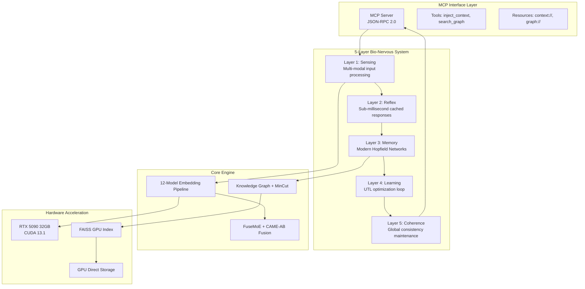

# Ultimate Context Graph - Vision & Bio-Nervous System

**Version**: 2.0.0 | **Classification**: Core Architecture

---

## 0. AGENT'S HANDBOOK (Read First - 2 Minutes)

**For AI agents with fresh context windows. This is your "Owner's Manual" for the Bio-Nervous Context Graph.**

### 📖 The 30-Second Summary

You have a 5-layer brain-inspired memory system. It handles storage automatically via passive capture. Your job is **curation** (quality control) and **intentional retrieval**. Think of yourself as a librarian, not a file clerk.

### 🌱 System Lifecycle (Bootstrap/Cold-Start)

The graph starts empty. During early interactions, thresholds are relaxed AND **UTL lambda weights shift** to prioritize exploration vs integration:

| Lifecycle | Interactions | UTL Thresholds | Lambda Weights | Stance |
|-----------|--------------|----------------|----------------|--------|
| **Infancy** | 0-50 | entropy_trigger: 0.9, coherence_trigger: 0.2 | λ_ΔS: 0.7, λ_ΔC: 0.3 | Capture-Heavy (reward novelty/surprise) |
| **Growth** | 50-500 | entropy_trigger: 0.7, coherence_trigger: 0.4 | λ_ΔS: 0.5, λ_ΔC: 0.5 | Balanced (equal exploration/integration) |
| **Maturity** | 500+ | entropy_trigger: 0.6, coherence_trigger: 0.5 | λ_ΔS: 0.3, λ_ΔC: 0.7 | Curation-Heavy (reward coherence/integration) |

**Dynamic Lambda Weights (Marblestone-Inspired)**:
- **Infancy (λ_ΔS = 0.7)**: High reward for ΔS (entropy/surprise). System learns "what questions to ask" and explores broadly.
- **Growth (λ_ΔS = λ_ΔC = 0.5)**: Balanced. Consolidate what was learned while still exploring.
- **Maturity (λ_ΔC = 0.7)**: High reward for ΔC (coherence/integration). System optimizes for structured understanding.

This mirrors biological development: infants babble freely (exploration), adults communicate precisely (integration).

**Why**: Empty graphs return "Low Coherence" → agents spam `epistemic_action` before starting tasks. Seed Mode prevents this loop. Lambda weight dynamics ensure the system doesn't get stuck in permanent exploration mode.

### 📡 Cognitive Pulse (READ EVERY RESPONSE)

Every MCP tool response includes a **Pulse header**:
```
Pulse: { Entropy: 0.72, Coherence: 0.41, Suggested: "trigger_dream" }
```

| Entropy | Coherence | What It Means | Auto-Suggested Action |
|---------|-----------|---------------|----------------------|
| > 0.7 | > 0.5 | Novel context, adapting | `epistemic_action` |
| > 0.7 | < 0.4 | Confused, blind spot | `trigger_dream` or `critique_context` |
| < 0.4 | > 0.7 | Confident, on track | Continue working |
| < 0.4 | < 0.4 | Stale, drifting | `get_neighborhood` |

**CRITICAL**: Check Pulse BEFORE your next action. It costs 0 tokens—it's already in the response.

### 🔍 Query Synthesis (DON'T WRITE RAW QUERIES)

**Problem**: AI agents write suboptimal search queries (too verbose, missing keywords).

**Solution**: Use `generate_search_plan` instead of writing queries yourself:
```
YOUR GOAL: "Find security constraints for API auth"
↓
generate_search_plan(goal: "Find security constraints for API auth")
↓
SYSTEM RETURNS: [
  { query: "API authentication security", type: "semantic" },
  { query: "auth → vulnerability", type: "causal" },
  { query: "OAuth JWT bearer token", type: "code_focused" }
]
→ Execute these 3 queries in parallel for comprehensive coverage
```

### 🛤️ Multi-Hop Reasoning (DON'T BROWSE MANUALLY)

**Problem**: Manual `get_neighborhood` hopping burns tokens and loses the original goal.

**Solution**: Use `find_causal_path` for direct relationship discovery:
```
GOAL: "How does 'UserAuth' relate to 'RateLimiting'?"
↓
find_causal_path(start: "UserAuth", end: "RateLimiting")
↓
SYSTEM RETURNS: Narrative path through the graph
  "UserAuth → generates JWT → checked by Middleware → triggers RateLimiting on failure"
```

### 🤖 Passive Curation (YOU'RE NOT THE ONLY LIBRARIAN)

**Problem**: Agents ignore `curation_tasks` while focused on primary work.

**Solution**: System auto-handles "garden-variety" maintenance:

| Curation Type | Who Handles | Agent Involvement |
|---------------|-------------|-------------------|
| **High-confidence duplicates** (sim > 0.95) | System auto-merges | None (logged only) |
| **Weak links** (weight < 0.1) | Graph Gardener | None (background) |
| **Ambiguous duplicates** (sim 0.7-0.95) | **YOU** via `curation_tasks` | Required |
| **Conflicting information** | **YOU** via `curation_tasks` | Required |
| **Semantic cancer** | **YOU** via `curation_tasks` | Required |

**Only handle `curation_tasks` when `suggested_action='curate'`**. Routine cleanup happens automatically.

### 👤 Human Override (ADMIN COMMANDS)

If a user sees graph issues you can't fix, they can edit `~/.context-graph/manifest.md`:
- Delete a line → System calls `forget_concept`
- Add `[MERGE: uuid1, uuid2]` → System calls `merge_concepts`
- User doesn't need to know UUIDs—manifest uses human-readable names

**Agent Behavior**: When user says "I edited the manifest," call `reload_manifest` to apply changes.

---

### 🎯 Three Core Behaviors (MEMORIZE THESE)

#### 1. When to "Dream" (Consolidate)
```
TRIGGER: entropy > 0.7 for 5+ minutes OR working 30+ minutes without pause
ACTION:  Call trigger_dream OR let system auto-dream during idle
WHY:     Dreams find blind spots, consolidate recent memories, create novel connections
```

#### 2. How to "Curate" (Quality Control)
```
NEVER:   Call merge_concepts blindly
ALWAYS:  Check get_memetic_status.curation_tasks FIRST for system recommendations
USE:     merge_strategy=summarize for important nodes, keep_highest for trivial
REQUIRE: rationale field on every store_memory (explain WHY this matters)
```

#### 3. The Feedback Loop (When Confused)
```
┌─────────────────────────────────────────────────────────────────┐
│  Search returns NOTHING?                                        │
│    → Increase noradrenaline (via get_neuromodulation)           │
│    → Search again with broader terms                            │
│                                                                 │
│  Search returns IRRELEVANT results?                             │
│    → Call reflect_on_memory with your goal                      │
│    → Execute suggested tool sequence                            │
│                                                                 │
│  Search returns CONFLICTING info?                               │
│    → Check conflict_alert in response                           │
│    → Either merge_concepts OR ask_user for clarification        │
│                                                                 │
│  User asks "Why don't you remember X?"                          │
│    → Call get_system_logs to find pruned/quarantined nodes      │
│    → Explain reason to user (circular logic, adversarial, etc.) │
│    → Offer to restore if user confirms it's correct             │
└─────────────────────────────────────────────────────────────────┘
```

### ⚡ First Contact Protocol (Cognitive Handshake)

When the MCP server loads:
1. **Call `get_system_instructions`** → Get high-density mental model (~300 tokens, KEEP IN CONTEXT)
2. **Call `get_graph_manifest`** → Understand the 5-layer system
3. **Call `get_memetic_status`** → Check current entropy/coherence state
4. **Note `curation_tasks`** → Handle any system-identified maintenance

**CRITICAL**: The `system_prompt_fragment` from step 1 must stay in your working memory. It tells you:
- "I am your nervous system, not a database"
- When to check entropy/coherence before acting
- That citation tags `[node_xyz]` are expandable via `hydrate_citation`

### 📊 Token Economy (CRITICAL)

Your context window is precious. The metadata CAN bloat it:

| Verbosity Level | Tokens | When to Use |
|-----------------|--------|-------------|
| 0 (Raw) | ~100 | High confidence, simple lookup |
| 1 (Default) | ~200 | Normal operations |
| 2 (Full) | ~800 | ONLY when delta_c < 0.4 (confused) |

**Rule**: Default to Level 1. Request Level 2 only when `get_memetic_status.coherence_score < 0.4`

### 🔒 Multi-Agent Safety

If you're a specialized agent (coder, researcher, etc.), use `perspective_lock` on `search_graph`:
```json
{ "perspective_lock": { "domain": "code", "exclude_agent_ids": ["creative-writer-agent"] } }
```
This prevents retrieving metaphorical poetry when you need literal code constraints.

### 🛡️ Memetic Drift Prevention (Priors Vibe Check)

**Problem**: Agent A (Python coder) and Agent B (Java coder) both store "best practices for variables." During Dream phase, the system might merge these into nonsensical "universal best practice."

**Solution**: Every node has a `priors_vibe_check`—a small 128D vector encoding the agent's assumptions at storage time.

When `merge_concepts` is called:
1. System checks if source nodes' priors are compatible (cosine sim > 0.7)
2. If **compatible**: Normal merge proceeds
3. If **incompatible**: Creates **Relational Edge** instead: "In Python, X; but in Java, Y"

```json
// merge_concepts response when priors conflict
{
  "priors_compatible": false,
  "relational_edge_created": true,
  "relational_note": "In Python: use snake_case; but in Java: use camelCase"
}
```

**Override**: Set `force_merge=true` if you're certain the merge is correct despite different priors.

### 📖 Traceability (Semantic Breadcrumbs)

**Problem**: When `inject_context` distills 8000 tokens → 1500 tokens, you lose the raw data. If distillation is slightly off, you'll hallucinate based on false summaries (Authority Bias).

**Solution**: Distilled narratives include inline citation tags: `[node_abc123]`

```
The API uses OAuth2 [node_7f3a2b] for authentication, with tokens expiring after 1 hour [node_9c4d1e].
```

When a summary seems vague or suspicious:
1. Call `hydrate_citation` with the tags: `["node_7f3a2b", "node_9c4d1e"]`
2. Get raw source content for verification
3. Proceed with confidence (or correct the misunderstanding)

---

## 1. Core Vision

The Ultimate Context Graph System creates a **learning-first** knowledge architecture where every operation—from embedding generation to context injection—follows the Unified Theory of Learning (UTL).

### 1.1 UTL Formal Definition

```rust
/// Unified Theory of Learning - Core Trait
/// L = f((ΔS × ΔC) ⋅ wₑ ⋅ cos φ)
pub trait UTLProcessor {
    /// Compute learning score from state variables
    /// - ΔS: Entropy change (novelty/surprise) ∈ [0,1]
    /// - ΔC: Coherence change (understanding) ∈ [0,1]
    /// - wₑ: Emotional modulation weight ∈ [0.5, 1.5]
    /// - φ: Phase synchronization angle ∈ [0, π]
    fn compute_l(ds: f32, dc: f32, we: f32, phi: f32) -> f32 {
        (ds * dc) * we * phi.cos()
    }

    /// Classify current state into Johari Window quadrant
    fn classify_johari(ds: f32, dc: f32) -> JohariQuadrant {
        match (ds < 0.5, dc > 0.5) {
            (true, true)  => JohariQuadrant::Open,   // Low entropy, high coherence
            (false, false) => JohariQuadrant::Blind,  // High entropy, low coherence
            (true, false) => JohariQuadrant::Hidden, // Low entropy, low coherence
            (false, true) => JohariQuadrant::Unknown, // High entropy, high coherence
        }
    }
}

#[derive(Clone, Copy, Debug, PartialEq)]
pub enum JohariQuadrant {
    Open,    // Known to self & others - direct recall
    Blind,   // Unknown to self - discovery zone
    Hidden,  // Known to self only - private knowledge
    Unknown, // Unknown to all - exploration frontier
}
```

### 1.2 UTL Loss Function

```
J = λ_task · L_task + λ_semantic · L_semantic + λ_dyn · (1 - L)

Where:
- λ_task = 0.4 (task performance weight)
- λ_semantic = 0.3 (semantic understanding weight)
- λ_dyn = 0.3 (learning dynamics weight)
```

---

## 2. System Architecture



---

## 3. 5-Layer Bio-Nervous System

```rust
/// Bio-Nervous System Layer Definitions
#[derive(Clone, Copy, Debug)]
pub enum NervousLayer {
    /// Layer 1: Sensing - Multi-modal input processing
    /// Latency Target: <5ms | Throughput: 10K inputs/sec
    Sensing,

    /// Layer 2: Reflex - Pattern-matched fast responses
    /// Latency Target: <100μs | Cache Hit Rate: >80%
    Reflex,

    /// Layer 3: Memory - Modern Hopfield associative storage
    /// Capacity: 2^(d/2) patterns | Retrieval: <1ms
    Memory,

    /// Layer 4: Learning - UTL-driven weight optimization
    /// Update Frequency: 100Hz | Gradient Clip: 1.0
    Learning,

    /// Layer 5: Coherence - Global state synchronization
    /// Sync Interval: 10ms | Consistency: Eventual
    Coherence,
}

impl NervousLayer {
    pub fn latency_budget_us(&self) -> u64 {
        match self {
            Self::Sensing => 5000,    // 5ms
            Self::Reflex => 100,      // 100μs
            Self::Memory => 1000,     // 1ms
            Self::Learning => 10000,  // 10ms
            Self::Coherence => 10000, // 10ms
        }
    }

    pub fn should_bypass(&self, confidence: f32) -> bool {
        match self {
            Self::Reflex => confidence > 0.95, // High-confidence bypass
            _ => false,
        }
    }
}
```

### 3.1 Layer Responsibilities

| Layer | Function | Key Component | UTL Role |
|-------|----------|---------------|----------|
| **Sensing** | Input normalization, tokenization | Embedding Pipeline | ΔS measurement |
| **Reflex** | Cached pattern response | Hopfield Query Cache | Low-latency bypass |
| **Memory** | Associative storage & retrieval | Modern Hopfield Network | Pattern consolidation |
| **Learning** | Weight updates, gradient flow | UTL Optimizer | L score optimization |
| **Coherence** | Cross-session consistency | Thalamic Gate | φ synchronization |

### 3.2 Modern Hopfield Networks

```rust
/// Modern Hopfield Network with exponential capacity
pub struct ModernHopfieldNetwork {
    /// Stored patterns: capacity = 2^(d/2) for dimension d
    patterns: Vec<Vector1536>,
    /// Inverse temperature (sharpness of attention)
    beta: f32,
    /// Dimension of pattern vectors
    dimension: usize,
}

impl ModernHopfieldNetwork {
    /// Retrieve pattern via attention mechanism
    /// Energy: E(ξ) = -log Σᵢ exp(β·⟨ξ,xᵢ⟩)
    pub fn retrieve(&self, query: &Vector1536) -> Vector1536 {
        // Compute attention weights: softmax(β · Q·Kᵀ)
        let logits: Vec<f32> = self.patterns.iter()
            .map(|p| self.beta * query.dot(p))
            .collect();

        let weights = softmax(&logits);

        // Weighted sum of values
        self.patterns.iter()
            .zip(weights.iter())
            .map(|(p, &w)| p.scale(w))
            .reduce(|a, b| a.add(&b))
            .unwrap_or_default()
    }
}
```

**Performance Constraints:**
- `Constraint: Retrieval_Latency < 1ms`
- `Constraint: Storage_Capacity >= 2^768` (for 1536D vectors)
- `Constraint: Noise_Tolerance >= 20%`

### 3.3 Thalamic Gate (Context Injection Control)

```rust
/// Thalamic Gate prevents context over-injection
pub struct ThalamicGate {
    /// Maximum context tokens per injection
    max_tokens: usize,
    /// Coherence threshold for injection approval
    coherence_threshold: f32,
    /// Rate limiter: injections per minute
    rate_limit: RateLimiter,
}

impl ThalamicGate {
    /// Decide whether to allow context injection
    pub fn should_inject(&self, utl_state: &UTLState, request: &InjectionRequest) -> GateDecision {
        // Block if incoherent (would add noise)
        if utl_state.delta_c < self.coherence_threshold {
            return GateDecision::Block { reason: "Low coherence" };
        }

        // Throttle if rate exceeded
        if !self.rate_limit.check() {
            return GateDecision::Throttle { retry_after_ms: 1000 };
        }

        // Truncate if over token limit
        if request.tokens > self.max_tokens {
            return GateDecision::Truncate { max_tokens: self.max_tokens };
        }

        GateDecision::Allow
    }
}
```

---

## 4. Place Cell Grounding (Hyperbolic Coordinates)

```rust
/// Place Cell for spatial grounding in Poincaré ball
pub struct PlaceCell {
    /// Hyperbolic coordinates (Poincaré ball model)
    /// ||x|| < 1 for all points
    position: PoincareBallPoint,
    /// Activation radius in hyperbolic space
    radius: f32,
    /// Associated semantic content
    content_embedding: Vector1536,
}

impl PlaceCell {
    /// Distance in hyperbolic space (Poincaré metric)
    /// d(x,y) = arcosh(1 + 2||x-y||²/((1-||x||²)(1-||y||²)))
    pub fn hyperbolic_distance(&self, other: &PoincareBallPoint) -> f32 {
        let diff_norm_sq = (self.position - other).norm_squared();
        let denom = (1.0 - self.position.norm_squared())
                  * (1.0 - other.norm_squared());
        (1.0 + 2.0 * diff_norm_sq / denom).acosh()
    }

    /// Activation based on hyperbolic proximity
    pub fn activation(&self, query_point: &PoincareBallPoint) -> f32 {
        let dist = self.hyperbolic_distance(query_point);
        (-dist / self.radius).exp()
    }
}
```

**Why Hyperbolic?** Tree-structured knowledge (taxonomies, hierarchies) embeds naturally with O(1) distortion vs O(n) in Euclidean space.

---

## 5. Data Models

### 5.1 Core Types

```rust
/// Knowledge Node in the graph
#[derive(Clone, Debug, Serialize, Deserialize)]
pub struct KnowledgeNode {
    pub id: Uuid,
    pub content: String,
    pub embedding: Vector1536,
    pub created_at: DateTime<Utc>,
    pub importance: f32,           // [0, 1]
    pub last_accessed: DateTime<Utc>,
    pub access_count: u32,
    pub johari_quadrant: JohariQuadrant,
    pub utl_state: UTLState,
    // === MULTI-AGENT PROVENANCE (Prevents Memetic Interference) ===
    pub agent_id: Option<String>,           // Creating agent's ID (None = passive capture)
    pub observer_perspective: Perspective,  // Agent's priors when storing
    pub semantic_cluster: Option<Uuid>,     // Cluster subscription (None = global)
    // === MEMETIC DRIFT PREVENTION ===
    pub priors_vibe_check: PriorsVibeCheck, // 128D assumption vector for merge safety
}

/// Perspective prevents cross-agent "semantic cancer"
/// Agents with different priors may interpret same data differently
#[derive(Clone, Debug, Default, Serialize, Deserialize)]
pub struct Perspective {
    pub domain: Option<String>,         // "medical", "code", "legal"
    pub confidence_priors: [f32; 4],    // Johari quadrant weights agent used
    pub predictive_context: Option<String>, // What agent expected to find
}

/// Priors Vibe Check - prevents memetic drift during merge operations
/// Small 128D vector encoding agent's assumptions at storage time
#[derive(Clone, Debug, Default, Serialize, Deserialize)]
pub struct PriorsVibeCheck {
    pub assumption_embedding: [f32; 128],  // Agent's worldview when storing
    pub domain_priors: Option<String>,      // "Python semantics", "Java semantics"
    pub prior_confidence: f32,              // How certain the agent was (0-1)
}

/// Edge between knowledge nodes
#[derive(Clone, Debug, Serialize, Deserialize)]
pub struct GraphEdge {
    pub source: Uuid,
    pub target: Uuid,
    pub edge_type: EdgeType,
    pub weight: f32,              // [0, 1] base weight
    pub confidence: f32,          // [0, 1]
    pub created_at: DateTime<Utc>,
    /// NEW: Molecularly-annotated neurotransmitter weights
    /// Domain-specific modulation of edge strength (Marblestone-inspired)
    pub neurotransmitter: Option<NeurotransmitterWeights>,
    /// NEW: Whether this edge was created by Dream Layer amortization
    /// (shortcut from multi-hop causal path discovery)
    pub is_amortized_shortcut: bool,
}

#[derive(Clone, Debug)]
pub enum EdgeType {
    Semantic,    // Meaning similarity
    Temporal,    // Time-based connection
    Causal,      // Cause-effect relationship
    Hierarchical,// Parent-child structure
    Relational,  // Custom relationship (from merge/priors incompatibility)
}

/// Molecularly-Annotated Edge Weights (Marblestone-Inspired)
/// Domain-specific "neurotransmitter" modulation of edge strength
/// Ref: Connectomics research on molecular edge annotations
#[derive(Clone, Debug, Default)]
pub struct NeurotransmitterWeights {
    /// Excitatory weight: strengthens connection in this domain
    /// Higher = "this edge is more relevant for this domain"
    pub excitatory: f32,  // [0, 1]

    /// Inhibitory weight: weakens connection in this domain
    /// Higher = "this edge should be deprioritized for this domain"
    pub inhibitory: f32,  // [0, 1]

    /// Domain this modulation applies to
    pub domain: Domain,
}

#[derive(Clone, Debug, Default)]
pub enum Domain {
    #[default]
    General,     // No domain-specific modulation
    Code,        // Programming/software - high excitatory for technical edges
    Legal,       // Legal/compliance - high inhibitory for speculative edges
    Medical,     // Healthcare - high inhibitory for unverified claims
    Creative,    // Creative writing - high excitatory for metaphorical edges
    Research,    // Scientific - balanced, prefers cited sources
}

impl NeurotransmitterWeights {
    /// Compute effective edge weight with domain modulation
    /// net_weight = base_weight * (1 + excitatory - inhibitory)
    pub fn modulate(&self, base_weight: f32) -> f32 {
        let modulation = 1.0 + self.excitatory - self.inhibitory;
        (base_weight * modulation).clamp(0.0, 1.0)
    }

    /// Domain-specific presets
    pub fn for_domain(domain: Domain) -> Self {
        match domain {
            Domain::Code => Self { excitatory: 0.3, inhibitory: 0.0, domain },
            Domain::Legal => Self { excitatory: 0.0, inhibitory: 0.4, domain },
            Domain::Medical => Self { excitatory: 0.0, inhibitory: 0.5, domain },
            Domain::Creative => Self { excitatory: 0.5, inhibitory: 0.0, domain },
            Domain::Research => Self { excitatory: 0.2, inhibitory: 0.1, domain },
            Domain::General => Self::default(),
        }
    }
}

/// UTL State snapshot
#[derive(Clone, Debug, Default)]
pub struct UTLState {
    pub delta_s: f32,        // Entropy change
    pub delta_c: f32,        // Coherence change
    pub w_e: f32,            // Emotional weight
    pub phi: f32,            // Phase angle
    pub johari: JohariQuadrant,
    pub timestamp: DateTime<Utc>,
}

impl UTLState {
    pub fn learning_score(&self) -> f32 {
        (self.delta_s * self.delta_c) * self.w_e * self.phi.cos()
    }
}
```

### 5.2 Session & Context

```rust
/// Learning session state
#[derive(Clone, Debug)]
pub struct LearningSession {
    pub id: Uuid,
    pub start_time: DateTime<Utc>,
    pub utl_history: Vec<UTLState>,
    pub active_nodes: HashSet<Uuid>,
    pub injection_count: u32,
    pub token_budget_remaining: usize,
}

/// Context injection request
#[derive(Clone, Debug)]
pub struct InjectionRequest {
    pub query: String,
    pub max_tokens: usize,
    pub session_id: Uuid,
    pub priority: Priority,
}

/// Context injection response
#[derive(Clone, Debug)]
pub struct InjectionResponse {
    pub context: String,
    pub tokens_used: usize,
    pub nodes_retrieved: Vec<Uuid>,
    pub utl_metrics: UTLState,
    pub latency_ms: u64,
}
```

---

## 6. Performance Constraints

| Metric | Target | Measurement |
|--------|--------|-------------|
| Context Injection P95 | < 25ms | End-to-end latency |
| Hopfield Retrieval | < 1ms | Pattern recall |
| Reflex Cache Hit | > 80% | Pattern match rate |
| UTL Score Average | > 0.6 | Learning effectiveness |
| Memory Capacity | > 10M nodes | Graph size |
| Coherence Recovery | < 10s | After partition |

---

## 7. Dream Layer (Offline Consolidation)

**Biological Basis**: During REM sleep, the brain runs generative replay of memories without external input, finding novel long-range semantic connections. Ref: [NeuroDream Framework](https://papers.ssrn.com/sol3/papers.cfm?abstract_id=5377250), [Nature Communications Sleep Replay](https://www.nature.com/articles/s41467-022-34938-7)

### 7.1 Dream Phase Architecture

```rust
/// Dream Layer - Generative memory consolidation during idle periods
/// Implements NeuroDream + Sleep Replay Consolidation (SRC)
pub struct DreamLayer {
    /// Trigger when system activity drops below threshold
    pub activity_threshold: f32,        // Default: 0.15
    /// Duration of dream phase
    pub phase_duration: Duration,        // Default: 5min
    /// Number of synthetic queries to generate
    pub synthetic_query_count: usize,    // Default: 100
    /// Minimum hyperbolic distance for "long-range" connections
    pub min_semantic_leap: f32,          // Default: 0.7 (Poincaré)
}

/// Dream phase states (mirrors biological NREM→REM cycle)
#[derive(Clone, Copy)]
pub enum DreamPhase {
    /// NREM: Hippocampus-guided replay of recent memories
    /// Tight coupling between graph regions
    SlowWave { replay_recency_bias: f32 },  // Default: 0.8

    /// REM: Free exploration of semantic attractors
    /// Generate synthetic queries, seek novel connections
    RapidEye { exploration_temp: f32 },     // Default: 2.0 (high entropy)
}

impl DreamLayer {
    /// Generate synthetic query from stored embeddings
    /// Uses FuseMoE in "exploratory" mode (high temperature)
    pub fn generate_synthetic_query(&self, graph: &KnowledgeGraph) -> Vector1536 {
        // Sample random nodes with importance-weighted probability
        let anchors = graph.sample_nodes(3, WeightBy::Importance);

        // Interpolate in hyperbolic space (geodesic midpoint)
        let midpoint = poincare_geodesic_centroid(&anchors);

        // Add controlled noise for exploration
        midpoint.add_hyperbolic_noise(self.min_semantic_leap)
    }

    /// Find "blind spot" connections - high entropy, low coherence
    pub fn discover_blind_spots(&self, query: &Vector1536, graph: &KnowledgeGraph) -> Vec<(Uuid, Uuid)> {
        let results = graph.search_top_k(query, 50);

        // Find pairs with high semantic distance but shared causal paths
        results.iter()
            .combinations(2)
            .filter(|pair| {
                let dist = pair[0].hyperbolic_distance(&pair[1]);
                let causal = graph.has_causal_path(pair[0].id, pair[1].id);
                dist > self.min_semantic_leap && causal
            })
            .map(|pair| (pair[0].id, pair[1].id))
            .collect()
    }
}
```

### 7.2 Dream Scheduling & Interrupt Protocol

| Trigger | Action | Constraint |
|---------|--------|------------|
| Activity < 0.15 for 10min | Enter SlowWave | GPU memory < 50% |
| SlowWave complete (3min) | Transition to REM | - |
| REM complete (2min) | Exit Dream, update graph | Before next query |
| Any user query | **Instant Abort** (abort_on_query=true) | Wake latency < 100ms |

**Interrupt Protocol**: Dreams are non-blocking by default. When `abort_on_query=true`:
1. User query arrives → Dream immediately checkpoints state
2. System serves query (P95 < 25ms maintained)
3. Dream resumes from checkpoint OR terminates (configurable)

```rust
pub enum DreamInterruptPolicy {
    AbortAndServe,     // Default: kill dream, serve immediately
    PauseAndResume,    // Checkpoint state, resume after query
    CompleteFirst,     // Finish current phase before serving (NOT recommended)
}
```

---

## 8. Predictive Coding (Top-Down Modulation)

**Biological Basis**: Layer 5 (Coherence) sends more fibers back to Layer 1 (Sensing) than it receives. Higher layers "prime" lower layers with predictions. Ref: [Nature Predictive Coding Light](https://www.nature.com/articles/s41467-025-64234-z), [Active Predictive Coding](https://direct.mit.edu/neco/article/36/1/1/118264)

### 8.1 Feedback Priming Architecture

```rust
/// Predictive Coding Module - Top-down context priming
/// L5 (Coherence) → L1 (Sensing) feedback loop
pub struct PredictiveCoder {
    /// Current context prediction (from Coherence layer)
    pub prediction: Vector1536,
    /// Prediction confidence threshold
    pub confidence_threshold: f32,      // Default: 0.7
    /// Embedding model priority weights (context-dependent)
    pub model_priors: [f32; 12],
}

impl PredictiveCoder {
    /// Prime Sensing layer based on current context
    /// Adjusts embedding model priorities dynamically
    pub fn prime_sensing(&self, context: &ContextState) -> EmbeddingPriors {
        match context.domain {
            Domain::Medical => EmbeddingPriors {
                semantic: 1.5,    // Boost semantic understanding
                causal: 1.8,      // Medical = high causal reasoning
                code: 0.3,        // Suppress code embedding
                ..Default::default()
            },
            Domain::Programming => EmbeddingPriors {
                code: 2.0,        // Boost code embedding
                graph: 1.5,       // Boost structural relationships
                semantic: 0.8,    // Standard semantic
                ..Default::default()
            },
            _ => EmbeddingPriors::uniform(),
        }
    }

    /// Compute prediction error (suppressed spikes in PCL model)
    /// Only transmit what differs from prediction
    pub fn compute_error(&self, observed: &Vector1536) -> (Vector1536, f32) {
        let error = observed.sub(&self.prediction);
        let magnitude = error.norm();

        // Suppress predictable components (compress representation)
        let compressed = if magnitude < self.confidence_threshold {
            error.scale(0.1)  // High confidence = low error transmission
        } else {
            error  // Low confidence = full error transmission
        };

        (compressed, magnitude)
    }
}

/// Embedding priority weights for context-dependent priming
#[derive(Clone, Default)]
pub struct EmbeddingPriors {
    pub semantic: f32,
    pub temporal: f32,
    pub causal: f32,
    pub code: f32,
    pub graph: f32,
    pub sparse: f32,
    // ... other 6 models
}
```

### 8.2 Feedback Flow

```
L5 (Coherence) ──prediction──→ L1 (Sensing)
       ↑                              │
       │                              ↓
       └────prediction_error─────────←┘

- L5 sends context prediction to L1
- L1 computes error = observation - prediction
- Only error (surprise) propagates up
- Reduces token usage by ~30% for predictable contexts
```

---

## 9. Neuromodulation (Global State Controller)

**Biological Basis**: Dopamine, Serotonin, Noradrenaline change the entire hardware state, not just individual weights. Ref: [Trends in Neurosciences](https://www.cell.com/trends/neurosciences/abstract/S0166-2236(21)00256-3), [Doya 2002 Model](https://pmc.ncbi.nlm.nih.gov/articles/PMC5744617/)

### 9.1 Neuromodulator Mapping

| Modulator | Biological Function | System Parameter | Effect |
|-----------|--------------------|--------------------|--------|
| **Dopamine** | Reward prediction error | `hopfield.beta` | ↑ = sharper retrieval (exploitation) |
| **Serotonin** | Temporal discounting | `fuse_moe.top_k` | ↑ = more experts (exploration) |
| **Noradrenaline** | Arousal/Surprise | `attention.temperature` | ↑ = flatter attention (exploration) |
| **Acetylcholine** | Learning rate | `utl.alpha` | ↑ = faster memory update |

### 9.2 Global State Controller

```rust
/// Neuromodulation Controller - Hardware-level state changes
/// Adjusts beta, top_k, temperature based on session entropy
pub struct NeuromodulationController {
    /// Current modulator levels (normalized 0-1)
    pub dopamine: f32,
    pub serotonin: f32,
    pub noradrenaline: f32,
    pub acetylcholine: f32,
}

impl NeuromodulationController {
    /// Update modulator levels based on UTL state
    pub fn update(&mut self, utl: &UTLState) {
        // High ΔS (surprise) → increase noradrenaline (arousal)
        self.noradrenaline = (utl.delta_s * 1.5).clamp(0.0, 1.0);

        // High ΔC (coherence) → increase dopamine (reward)
        self.dopamine = (utl.delta_c * 1.2).clamp(0.0, 1.0);

        // Low coherence → increase serotonin (explore more options)
        self.serotonin = ((1.0 - utl.delta_c) * 1.3).clamp(0.0, 1.0);

        // Learning score → acetylcholine (plasticity)
        self.acetylcholine = utl.learning_score().clamp(0.0, 1.0);
    }

    /// Apply modulation to system parameters
    pub fn apply(&self, config: &mut SystemConfig) {
        // Dopamine → Hopfield beta (retrieval sharpness)
        // High dopamine = high beta = sharp, exploitative retrieval
        config.hopfield.beta = 1.0 + (self.dopamine * 4.0);  // Range: 1-5

        // Serotonin → FuseMoE top_k (expert diversity)
        // High serotonin = more experts = more exploration
        config.fuse_moe.top_k = 2 + (self.serotonin * 6.0) as usize;  // Range: 2-8

        // Noradrenaline → Attention temperature
        // High noradrenaline = high temp = flat attention = exploration
        config.attention.temperature = 0.5 + (self.noradrenaline * 1.5);  // Range: 0.5-2.0

        // Acetylcholine → Learning rate
        config.utl.learning_rate = 0.001 * (1.0 + self.acetylcholine);  // Range: 0.001-0.002
    }
}
```

---

## 10. Homeostatic Plasticity (Immune System)

**Biological Basis**: Synaptic scaling prevents runaway excitation and "semantic cancer" where high-importance nodes dominate. Ref: [Nature BioLogicalNeuron](https://www.nature.com/articles/s41598-025-09114-8), [eLife Homeostatic Scaling](https://elifesciences.org/articles/88376)

### 10.1 Homeostatic Optimizer

```rust
/// Homeostatic Optimizer - Prevents importance score saturation
/// Implements synaptic scaling to maintain graph health
pub struct HomeostaticOptimizer {
    /// Target mean importance (setpoint)
    pub importance_setpoint: f32,        // Default: 0.5
    /// Maximum importance any node can have
    pub importance_ceiling: f32,         // Default: 0.95
    /// Scaling rate (slow = stable)
    pub scaling_rate: f32,               // Default: 0.01
    /// Detection threshold for "semantic cancer"
    pub cancer_threshold: f32,           // Default: 0.8 (entropy)
}

impl HomeostaticOptimizer {
    /// Scale all importance scores toward setpoint
    /// Prevents rich-get-richer dynamics
    pub fn scale_importance(&self, graph: &mut KnowledgeGraph) {
        let mean_importance = graph.mean_importance();
        let scaling_factor = 1.0 + self.scaling_rate * (self.importance_setpoint - mean_importance);

        for node in graph.nodes_mut() {
            node.importance = (node.importance * scaling_factor).clamp(0.0, self.importance_ceiling);
        }
    }

    /// Detect semantic cancer: high-importance node with high entropy neighbors
    /// Indicates potential circular logic or false coherence
    pub fn detect_semantic_cancer(&self, graph: &KnowledgeGraph) -> Vec<Uuid> {
        graph.nodes()
            .filter(|node| {
                let neighbor_entropy = graph.neighbor_entropy(node.id);
                node.importance > 0.9 && neighbor_entropy > self.cancer_threshold
            })
            .map(|n| n.id)
            .collect()
    }

    /// Quarantine suspected cancer nodes
    /// Reduce their influence while preserving for review
    pub fn quarantine(&self, graph: &mut KnowledgeGraph, node_id: Uuid) {
        if let Some(node) = graph.get_mut(node_id) {
            node.importance *= 0.5;  // Reduce influence
            node.metadata.insert("quarantined", true);
            node.metadata.insert("quarantine_reason", "semantic_cancer");
        }
    }
}
```

### 10.2 Immune System Checks

| Check | Frequency | Action on Failure |
|-------|-----------|-------------------|
| Importance distribution | Every 1000 writes | Scale toward setpoint |
| Circular logic detection | Every Dream phase | Quarantine + alert |
| Neighbor entropy analysis | On high-ΔS queries | Flag for review |
| UTL score gaming | Per session end | Reset session weights |

---

## 11. Active Inference (Epistemic Actions)

**Biological Basis**: Systems don't just respond—they actively seek information to reduce uncertainty. Ref: [Friston FEP](https://en.wikipedia.org/wiki/Free_energy_principle), [VERSES AI Active Inference](https://www.nature.com/articles/s41467-023-40141-z)

### 11.1 Epistemic Action Generator

```rust
/// Active Inference - Generate questions to reduce graph uncertainty
/// When ΔC is low, system asks clarifying questions
pub struct EpistemicActionGenerator {
    /// Coherence threshold below which to generate questions
    pub coherence_trigger: f32,          // Default: 0.4
    /// Maximum questions per session
    pub max_questions_per_session: u8,   // Default: 3
}

impl EpistemicActionGenerator {
    /// Generate clarifying question based on graph uncertainty
    pub fn generate_epistemic_action(&self, utl: &UTLState, graph: &KnowledgeGraph) -> Option<EpistemicAction> {
        if utl.delta_c >= self.coherence_trigger {
            return None;  // Coherence sufficient
        }

        // Find highest-entropy region of active subgraph
        let uncertain_region = graph.find_max_entropy_cluster(5);

        // Generate question targeting the gap
        let question = self.formulate_question(&uncertain_region);

        Some(EpistemicAction::AskUser {
            question,
            target_nodes: uncertain_region.node_ids(),
            expected_entropy_reduction: uncertain_region.entropy * 0.5,
        })
    }

    fn formulate_question(&self, cluster: &NodeCluster) -> String {
        // Template-based question generation
        match cluster.dominant_edge_type() {
            EdgeType::Causal => format!("What causes {} to lead to {}?",
                cluster.nodes[0].summary(), cluster.nodes[1].summary()),
            EdgeType::Hierarchical => format!("Is {} a type of {}?",
                cluster.nodes[0].summary(), cluster.nodes[1].summary()),
            _ => format!("How are {} and {} related?",
                cluster.nodes[0].summary(), cluster.nodes[1].summary()),
        }
    }
}

#[derive(Debug)]
pub enum EpistemicAction {
    AskUser { question: String, target_nodes: Vec<Uuid>, expected_entropy_reduction: f32 },
    SearchExternal { query: String, sources: Vec<String> },
    RequestClarification { ambiguous_term: String, options: Vec<String> },
}
```

---

## 12. Meta-Cognitive Self-Awareness

**Purpose**: Agent must understand *why* to choose specific layers/tools. Without this, optimal UTL usage is impossible.

### 12.1 Philosophy Injection

The system exposes a `get_graph_manifest` tool that returns a **System Prompt Fragment**—not just schema, but operational philosophy:

```rust
/// Meta-cognitive manifest for agent self-understanding
pub struct GraphManifest {
    /// Bio-nervous philosophy explanation
    pub philosophy: String,
    /// Layer selection guidance
    pub layer_guidance: LayerSelectionGuide,
    /// Current system state summary
    pub current_state: MemeticStatus,
}

impl GraphManifest {
    pub fn generate_prompt_fragment(&self) -> String {
        format!(r#"
You have a 5-layer Bio-Nervous System:
- Layer 2 (Reflex): Use for fast recalls when confidence > 0.95
- Layer 3 (Memory): Use Hopfield retrieval for associative recall
- Layer 4 (Learning): Use when entropy is HIGH (confused/uncertain)
- Layer 5 (Coherence): Use epistemic_action when coherence is LOW

Current State: Entropy={:.2}, Coherence={:.2}
Suggested Action: {}

Your memory 'dreams' to consolidate. If context feels incoherent,
consider triggering a dream or epistemic action.
"#,
            self.current_state.entropy_level,
            self.current_state.coherence_score,
            self.current_state.suggested_action
        )
    }
}

/// Layer selection based on UTL state
pub struct LayerSelectionGuide {
    pub high_entropy_tools: Vec<&'static str>,    // ["epistemic_action", "trigger_dream"]
    pub low_coherence_tools: Vec<&'static str>,   // ["search_graph", "query_causal"]
    pub fast_recall_tools: Vec<&'static str>,     // ["inject_context", "get_neighborhood"]
}
```

---

## 13. Dynamic Tool Tiering (Cognitive Load Management)

**Problem**: 20+ tools consume agent reasoning budget. Agents get "decision paralysis" or default to `inject_context`, ignoring advanced bio-nervous features.

**Solution**: MCP server dynamically exposes tools based on `UTLState` and `JohariQuadrant`.

### 13.1 Tool Tier Definitions

```rust
/// Tool tiers based on cognitive complexity and situational need
pub enum ToolTier {
    /// Always visible: inject_context, search_graph, store_memory
    Core,
    /// Visible when entropy > 0.6: epistemic_action, query_causal, entailment_query
    HighEntropy,
    /// Visible when coherence < 0.4: merge_concepts, trigger_dream, get_neighborhood
    LowCoherence,
    /// Visible only via get_memetic_status.curation_tasks: forget_concept, annotate_node
    Curation,
    /// Visible on explicit request or emergency: homeostatic_status, check_adversarial
    Diagnostic,
}

impl ToolTier {
    /// Filter tools based on current UTL state
    pub fn visible_tools(utl: &UTLState) -> Vec<&'static str> {
        let mut tools = vec!["inject_context", "search_graph", "store_memory",
                            "get_memetic_status", "get_graph_manifest"];

        if utl.delta_s > 0.6 {  // High entropy
            tools.extend(["epistemic_action", "query_causal", "entailment_query"]);
        }
        if utl.delta_c < 0.4 {  // Low coherence
            tools.extend(["merge_concepts", "trigger_dream", "get_neighborhood"]);
        }
        tools
    }
}
```

### 13.2 Tool Discovery Protocol

| UTL State | Promoted Tools | Demoted Tools |
|-----------|----------------|---------------|
| High Entropy (ΔS > 0.6) | `epistemic_action`, `query_causal` | `trigger_dream` |
| Low Coherence (ΔC < 0.4) | `merge_concepts`, `get_neighborhood` | `store_memory` |
| Curate Mode | `forget_concept`, `annotate_node` | None (inbox-driven) |
| Balanced | Core tier only | All advanced |

**Key**: Agent sees 5-8 tools instead of 20+, reducing context overhead by ~60%.

---

## 14. Thought-Stream Integration (Passive Memory)

**Problem**: Agents forget to call `store_memory` during task focus.

### 14.1 Hooks/Observer Pattern

```rust
/// Passive thought capture via host-level hooks
/// MCP host (Claude Desktop/orchestrator) feeds conversation → store_memory
pub struct ThoughtStreamObserver {
    /// Automatic importance scoring
    pub auto_importance: AutoImportanceScorer,
    /// Deduplication filter
    pub dedup_filter: SemanticDeduplicator,
    /// Minimum content length to store
    pub min_content_length: usize,  // Default: 50 chars
}

impl ThoughtStreamObserver {
    /// Called by host on each conversation turn
    pub fn observe(&self, turn: &ConversationTurn) -> Option<StoreRequest> {
        if turn.content.len() < self.min_content_length {
            return None;
        }
        if self.dedup_filter.is_duplicate(&turn.content) {
            return None;
        }

        Some(StoreRequest {
            content: turn.content.clone(),
            importance: self.auto_importance.score(&turn),
            source: MemorySource::PassiveCapture,
        })
    }
}

/// Agent uses curation tools for boosting, NOT initial storage
/// - boost_importance: "This is critical, boost node X"
/// - merge_concepts: "X and Y are the same thing"
/// - annotate_node: "This was later proven false"
/// - forget_concept: "This is semantic cancer, remove it"
```

### 14.2 Integration Points

| Component | Role |
|-----------|------|
| MCP Host | Feeds conversation to `ThoughtStreamObserver` |
| Agent | Curates via `boost_importance`, `annotate_node`, `merge_concepts`, `forget_concept` |
| System | Auto-stores via hooks, agent refines |

**Key Insight**: Agent should NOT call `store_memory` explicitly in most cases. Host passively captures; agent curates quality.

### 14.3 Context Bloat Prevention

When `inject_context` returns >2048 tokens, distillation auto-activates:
- Raw nodes → Coherence layer → Summarized narrative
- Preserves causal relationships and key facts
- Compression ratio typically 60-70%
- Source node IDs retained for traceability

See [technical_engine.md#context-distillation-engine] for implementation.

---

## 15. Semantic Navigation (Browsing Mode)

**Problem**: Vector search (`search_graph`) is pull-only. Agent needs local topology exploration.

### 15.1 Neighborhood Browsing

```rust
/// Get local graph topology around current context
pub struct NeighborhoodBrowser {
    /// Maximum hops from focal point
    pub max_hops: usize,           // Default: 2
    /// Maximum nodes to return
    pub max_nodes: usize,          // Default: 20
    /// Include edge types
    pub include_edges: bool,       // Default: true
}

impl NeighborhoodBrowser {
    /// Browse from current session's active nodes
    pub fn get_neighborhood(&self, session: &LearningSession) -> Neighborhood {
        let focal_nodes = session.active_nodes.iter().take(3);
        let mut visited = HashSet::new();
        let mut result = Vec::new();

        for &node_id in focal_nodes {
            self.bfs_collect(node_id, self.max_hops, &mut visited, &mut result);
        }

        Neighborhood {
            nodes: result.into_iter().take(self.max_nodes).collect(),
            focal_point: focal_nodes.cloned().collect(),
        }
    }
}
```

**Use Cases**:
- Associative leap-frogging (not query-based)
- Discovering adjacent concepts
- Understanding local semantic structure

---

## 16. Pre-Flight Checklist (Before Writing Rust Code)

**Answer "Yes" to all before beginning Phase 0 implementation:**

### ✅ Safety: Undo Mechanism
> If an agent calls `forget_concept` on a critical user instruction, do you have a "trash can"?

**Status**: ✅ Implemented via `soft_delete` flag (default: true)
- Soft-deleted nodes move to trash bin
- 30-day recovery window via `restore_concept`
- Only `reason='user_requested'` + `soft_delete=false` allows permanent deletion
- See [execution_and_mcp.md#forget_concept]

### ✅ Concurrency: Thread-Safe FAISS Updates
> If two agents call `merge_concepts` simultaneously, is your FAISS index update thread-safe?

**Status**: ✅ Specified via `Arc<RwLock<Graph>>`
- `ConcurrentGraph` wrapper with separate locks for graph and FAISS
- Lock acquisition order: `inner` → `faiss_index` (prevents deadlocks)
- Multiple readers OR single writer pattern
- See [technical_engine.md#concurrency-safety]

### ✅ Token Economy: Agent-Controlled Distillation
> Does the agent get a choice in how context is distilled?

**Status**: ✅ Implemented via `distillation_mode` parameter
- Options: `auto`, `raw`, `narrative`, `structured`, `code_focused`
- `code_focused` preserves code blocks verbatim while summarizing prose
- Output includes `compression_ratio` for transparency
- See [execution_and_mcp.md#inject_context]

### ✅ Push-Based Curation: Agent Won't Seek Tasks
> How does the agent know which nodes need maintenance?

**Status**: ✅ Implemented via `curation_tasks` inbox
- `get_memetic_status` returns proactive curation tasks
- System identifies during Dream phase or Homeostatic checks
- Task types: `potential_merge`, `ambiguity_detected`, `obsolete_info`, `semantic_cancer`
- `suggested_action='curate'` triggers agent to process inbox
- See [execution_and_mcp.md#get_memetic_status]

### ✅ Bootstrapping: First Contact Protocol
> Does the agent know what to do when the MCP server loads?

**Status**: ✅ Implemented via Master Description
- MCP server description tells agent:
  1. "Call `get_graph_manifest` first"
  2. "Call `get_memetic_status` when confused"
  3. "Handle `curation_tasks` when I push them"
- See [execution_and_mcp.md#mcp-server-master-description]

### ✅ NEW: Agent Decision Paralysis Prevention
> With 20+ tools, do agents know which to use?

**Status**: ✅ Implemented via Tool Orchestrator
- `reflect_on_memory` tool: Agent provides goal, system suggests tool sequence
- `rationale` required on `store_memory`: Forces intentional storage
- Dynamic Tool Tiering: Only 5-8 tools visible based on UTL state
- See [execution_and_mcp.md#reflect_on_memory]

### ✅ NEW: Context Window Tax Management
> Does metadata bloat the agent's context?

**Status**: ✅ Implemented via Verbosity Levels
- `verbosity_level` parameter on `inject_context`: 0/1/2
- Level 0: ~100 tokens (raw text)
- Level 1: ~200 tokens (default, text + IDs)
- Level 2: ~800 tokens (full Bio-Nervous, use only when delta_c < 0.4)
- See [technical_engine.md#verbosity-levels]

### ✅ NEW: Semantic Cancer Guardrails (User-in-the-Loop)
> Can the agent explain why it "forgot" something?

**Status**: ✅ Implemented via Thalamic Notification
- `get_system_logs` tool: See why nodes were pruned/quarantined
- Returns `explanation_for_user`: Human-readable explanation
- Shows `recoverable` flag and `recovery_tool` for restoration
- Agent can explain: "I quarantined that due to circular logic. Confirm to restore."
- See [execution_and_mcp.md#get_system_logs]

### ✅ NEW: Multi-Agent Memetic Interference Prevention
> Do agents with different priors contaminate each other?

**Status**: ✅ Implemented via Perspective Filtering
- `perspective_lock` parameter on `search_graph`
- Filter by `domain`: code, medical, legal, creative, research
- Filter by `agent_ids`: Whitelist/blacklist specific agents
- `Perspective` struct on `KnowledgeNode` stores agent's priors
- See [technical_engine.md#perspective-based-filtering]

### ✅ NEW: Memetic Drift Prevention (Priors Vibe Check)
> If Agent A (Python) and Agent B (Java) both store "variable naming," will Dream merge them into nonsense?

**Status**: ✅ Implemented via `priors_vibe_check`
- Every `KnowledgeNode` has 128D `assumption_embedding` encoding agent's worldview
- `merge_concepts` checks priors compatibility (cosine sim > 0.7)
- If incompatible: Creates **Relational Edge** ("In Python, X; but in Java, Y") instead of merging
- `force_merge=true` allows override when agent is certain
- See [technical_engine.md#priors-vibe-check]

### ✅ NEW: Traceability / Anti-Hallucination (Semantic Breadcrumbs)
> When distillation compresses raw content, can agents verify suspicious summaries?

**Status**: ✅ Implemented via Citation Tags + `hydrate_citation`
- Distilled narratives include inline `[node_uuid]` tags
- `hydrate_citation` tool expands any tag to raw source content
- Prevents "Authority Bias" where agents trust distilled summaries blindly
- Agent can selectively verify without re-fetching entire context
- See [execution_and_mcp.md#hydrate_citation]

### ✅ NEW: Cognitive Handshake (Agent Onboarding)
> Does the agent understand the Bio-Nervous mental model, not just the tool schemas?

**Status**: ✅ Implemented via `get_system_instructions`
- Returns ~300 token high-density system prompt fragment
- Explains: "I am your nervous system, not a database"
- Lists critical behaviors: check entropy, process curation_tasks, use hydrate_citation
- Lists antipatterns: don't trust summaries blindly, don't merge without priors check
- Agent MUST keep this in context alongside `get_graph_manifest`
- See [execution_and_mcp.md#get_system_instructions]

### ✅ NEW: Cognitive Pulse (Meta-Cognitive Loop)
> Does the agent know its mental state WITHOUT spending a turn asking?

**Status**: ✅ Implemented via Mandatory Response Headers
- Every MCP tool response includes `Pulse: {Entropy, Coherence, Suggested}`
- Agent perceives its internal state passively (no extra tool call)
- Turns meta-cognition from an **action** into a **perception**
- See [execution_and_mcp.md#cognitive-pulse]

### ✅ NEW: Self-Contradiction Detection
> Can the agent fact-check its own reasoning against the graph?

**Status**: ✅ Implemented via `critique_context` tool
- Agent asks: "Find nodes that contradict my current reasoning"
- Uses Layer 5 (Coherence) as automatic "Fact Checker"
- Returns nodes with high semantic similarity but opposing causal claims
- Prevents "Authority Bias" where agents trust their own summaries
- See [execution_and_mcp.md#critique_context]

### ✅ NEW: Human-In-The-Loop Visualization (Thalamic Override)
> If the graph enters "Semantic Cancer" state, can the user intervene?

**Status**: ✅ Implemented via `visualize_context` resource
- Returns Mermaid.js or D3.js compatible JSON of local graph neighborhood
- User says "Show me your memory map for Project X" → agent renders graph
- Human points out: "Node A and B are the same, merge them"
- Ultimate arbiter when both graph AND agent are confused
- See [execution_and_mcp.md#visualize_context]

### ✅ NEW: Semantic Versioning for Concepts (Node Lineage)
> If Agent A changes a global truth, can Agent B see the change history?

**Status**: ✅ Implemented via `get_node_lineage` tool
- See how a node evolved: Dreaming, Merging, Annotating over time
- Returns change log with timestamps, actors, and before/after states
- Enables cross-agent accountability for shared knowledge
- See [execution_and_mcp.md#get_node_lineage]

### ✅ NEW: Graph Gardener (Background Optimization)
> Does the knowledge graph maintain itself without manual intervention?

**Status**: ✅ Implemented via Background Graph Gardener
- Runs between major phases (not during active queries)
- Prunes weak links, merges duplicate nodes in vector space
- Optimizes graph structure for retrieval speed
- Configurable via `gardener_interval` and `gardener_aggressiveness`
- See [technical_engine.md#graph-gardener]

### 🧠 NEW: Steering Subsystem vs Learning Subsystem (Marblestone Model)

> How does the system evaluate "good" vs "bad" thoughts without explicit supervision?

**Architecture**: Inspired by Adam Marblestone's neuroscience model of brain function:

```
┌─────────────────────────────────────────────────────────────────┐
│                     STEERING SUBSYSTEM                          │
│        (Graph Gardener + Passive Curator + Thought Assessor)    │
│                                                                 │
│  ┌──────────────┐  ┌──────────────┐  ┌──────────────────────┐  │
│  │  Gardener    │  │   Curator    │  │   Thought Assessor   │  │
│  │  (Pruning)   │  │  (Merging)   │  │  (Reward Signals)    │  │
│  └──────────────┘  └──────────────┘  └──────────────────────┘  │
│           │               │                    │                │
│           └───────────────┴────────────────────┘                │
│                           │                                     │
│                    ┌──────▼──────┐                              │
│                    │  Dopamine   │  ← Reward for "good" nodes   │
│                    │  Feedback   │  ← Punishment for drift      │
│                    └──────┬──────┘                              │
└───────────────────────────┼─────────────────────────────────────┘
                            │
                     ┌──────▼──────┐
                     │   AGENT     │
                     │  (Learning  │  ← Learns what to store/retrieve
                     │  Subsystem) │    based on Steering feedback
                     └─────────────┘
```

**The Split**:
- **Learning Subsystem (Agent)**: Generates thoughts, stores nodes, queries graph. Optimizes for task completion.
- **Steering Subsystem (Gardener + Curator)**: Evaluates thought quality. Provides reward/punishment signals back to Agent.

**Reward Signals (Dopamine Feedback)**:

```rust
/// Steering Subsystem sends reward signals to Agent after each operation
pub struct SteeringReward {
    /// Dopamine-like reward signal [-1.0, 1.0]
    /// Positive = "good thought, store more like this"
    /// Negative = "bad thought, avoid this pattern"
    pub dopamine_signal: f32,

    /// Explanation for the reward (helps agent learn)
    pub rationale: String,

    /// Suggested behavioral adjustment
    pub behavioral_hint: Option<String>,
}

impl SteeringSubsystem {
    /// Assess a stored node and return reward signal
    pub fn assess_node(&self, node: &KnowledgeNode, lifecycle: &SystemLifeCycle) -> SteeringReward {
        let mut reward = 0.0;
        let mut rationale_parts = vec![];

        // Reward based on lifecycle-appropriate behavior
        match lifecycle.stage {
            LifecycleStage::Infancy => {
                // In infancy, reward high ΔS (exploration)
                if node.utl_state.delta_s > 0.6 {
                    reward += 0.5;
                    rationale_parts.push("Novel exploration (good for infancy)");
                }
            }
            LifecycleStage::Maturity => {
                // In maturity, reward high ΔC (integration)
                if node.utl_state.delta_c > 0.6 {
                    reward += 0.5;
                    rationale_parts.push("Strong coherence (good for maturity)");
                }
            }
            _ => {} // Growth: balanced
        }

        // Penalize memetic drift (priors incompatibility)
        if let Some(ref vibe) = node.priors_vibe_check {
            if vibe.prior_confidence < 0.5 {
                reward -= 0.3;
                rationale_parts.push("Low confidence priors (memetic drift risk)");
            }
        }

        // Penalize redundancy (near-duplicates waste storage)
        if self.has_near_duplicate(node) {
            reward -= 0.4;
            rationale_parts.push("Near-duplicate detected (redundant)");
        }

        SteeringReward {
            dopamine_signal: reward.clamp(-1.0, 1.0),
            rationale: rationale_parts.join("; "),
            behavioral_hint: self.generate_hint(reward),
        }
    }
}
```

**Why This Matters**: Without a Steering Subsystem, agents store everything indiscriminately. The Dopamine feedback loop teaches agents:
1. **What to store** (novel, high-quality, non-redundant)
2. **What to retrieve** (contextually relevant, high coherence)
3. **When to dream** (consolidate after exploration burst)

### ✅ NEW: Synthetic Data Seeding (Cold-Start Bootstrap)
> How does an empty graph become useful?

**Status**: ✅ Implemented via Phase 0 Seed Script
- Takes project README or codebase → generates first 100+ nodes
- Creates high-quality causal links from existing documentation
- Prevents "cold nervous system" where agents don't know how to use tools
- Run once during project onboarding: `bin/reasoning seed --source ./README.md`
- See [execution_and_mcp.md#synthetic-data-seeding]

### ✅ NEW: Query Synthesis (Search Plan Generation)
> Do agents write optimal vector search queries?

**Status**: ✅ Implemented via `generate_search_plan`
- Agent provides goal, system returns 3-5 query variations
- Query types: Semantic, Causal, Code-centric
- Uses PredictiveCoder to expand into 12 embedding formats automatically
- Agent executes variations in parallel for comprehensive coverage
- See [execution_and_mcp.md#generate_search_plan]

### ✅ NEW: Multi-Hop Reasoning (Path-Finding Search)
> Do agents burn tokens manually hopping through the graph?

**Status**: ✅ Implemented via `find_causal_path`
- Direct path-finding between two concepts
- Returns narrative explaining the relationship chain
- Uses Causal + Graph embeddings for pathfinding
- No manual `get_neighborhood` hopping required
- See [execution_and_mcp.md#find_causal_path]

### ✅ NEW: Passive Curation (Shadow Agent)
> Will agents process curation_tasks while focused on primary work?

**Status**: ✅ Implemented via Background Curation Layer
- Auto-merges high-confidence duplicates (priors_vibe_check > 0.95)
- Graph Gardener handles weak link pruning automatically
- Agent only gets `curation_tasks` for ambiguous/conflicting cases
- Reduces agent "librarian burden" by ~70%
- See [technical_engine.md#passive-curation-layer]

### ✅ NEW: Human-In-The-Loop Admin (Knowledge Manifest)
> Can users fix the graph without knowing UUIDs?

**Status**: ✅ Implemented via Admin Manifest Resource
- Markdown file at `~/.context-graph/manifest.md`
- Human-readable concept list (no UUIDs exposed)
- Delete a line → triggers `forget_concept`
- Add merge directive → triggers `merge_concepts`
- `reload_manifest` tool applies user edits
- See [execution_and_mcp.md#admin-manifest-resource]

### ✅ NEW: Undo Log (Reversal Hash)
> If an agent makes a catastrophic curation error, can the user roll back?

**Status**: ✅ Implemented via Reversal Hash
- Every `merge_concepts` and `forget_concept` generates a reversal hash
- One-click rollback via `restore_from_hash(reversal_hash)`
- Reversal hashes expire after 30 days (configurable)
- See [execution_and_mcp.md#undo-log]

### ✅ NEW: Cross-Session Stitching
> If user talks via Claude Desktop then CLI, is context unified?

**Status**: ✅ Implemented via User Identity Layer
- **User**: Unified across MCP sessions (persistent identity)
- **Session**: Working memory, isolated per terminal/client
- **Context**: Shared graph, filtered by session's active nodes
- Same user recognized via `user_id` in MCP auth or config
- See [execution_and_mcp.md#cross-session-stitching]

---

## 17. References

- **UTL Equation**: [Technical:UTLProcessor]
- **Embedding Pipeline**: [technical_engine.md#embedding-matrix]
- **MCP Tools**: [execution_and_mcp.md#mcp-tools]
- **Hardware Specs**: [technical_engine.md#hardware-acceleration]
- **NeuroDream**: [SSRN Paper](https://papers.ssrn.com/sol3/papers.cfm?abstract_id=5377250)
- **Sleep Replay**: [Nature Communications](https://www.nature.com/articles/s41467-022-34938-7)
- **Active Inference**: [MIT Press Book](https://direct.mit.edu/books/oa-monograph/5299/Active-InferenceThe-Free-Energy-Principle-in-Mind)
- **Predictive Coding Light**: [Nature Communications 2025](https://www.nature.com/articles/s41467-025-64234-z)
- **Neuromodulation**: [Trends in Neurosciences](https://www.cell.com/trends/neurosciences/abstract/S0166-2236(21)00256-3)
- **Homeostatic Plasticity**: [eLife 2025](https://elifesciences.org/articles/88376)
- **Hyperbolic Entailment**: [ICML Paper](http://proceedings.mlr.press/v80/ganea18a/ganea18a.pdf)
