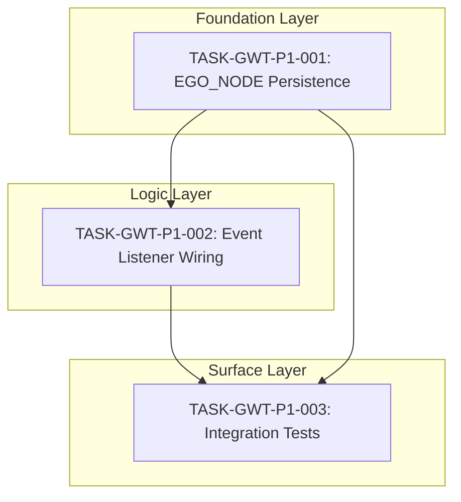

# Task Traceability Matrix: GWT Consciousness Equation

## Coverage: SPEC-GWT-001 -> TASK-GWT-P1-*

| Spec Item | Type | Task ID | Status |
|-----------|------|---------|--------|
| REQ-GWT-001: SELF_EGO_NODE RocksDB Persistence | requirement | TASK-GWT-P1-001 | Completed |
| REQ-GWT-002: Workspace Events Trigger Subsystems | requirement | TASK-GWT-P1-002 | Completed |
| REQ-GWT-003: DreamEventListener Queue Memories | requirement | TASK-GWT-P1-002 | Completed |
| REQ-GWT-004: NeuromodulationEventListener Dopamine | requirement | TASK-GWT-P1-002 | Completed |
| REQ-GWT-005: MetaCognitiveEventListener Epistemic | requirement | TASK-GWT-P1-002 | Completed |
| REQ-GWT-006: IdentityCritical Dream Consolidation | requirement | TASK-GWT-P1-003 | Ready |
| REQ-GWT-007: C(t) = I(t) x R(t) x D(t) Computation | requirement | - | Implemented (consciousness.rs) |
| REQ-GWT-008: Kuramoto Synchronization I(t) | requirement | - | Implemented (layers/coherence.rs) |
| REQ-GWT-009: Self-Reflection R(t) via Meta-UTL | requirement | - | Implemented (consciousness.rs) |
| REQ-GWT-010: Differentiation D(t) Entropy | requirement | - | Implemented (consciousness.rs) |
| REQ-GWT-011: State Machine Transitions | requirement | - | Implemented (state_machine.rs) |
| REQ-GWT-012: Self-Awareness Loop | requirement | TASK-GWT-P1-001 | Completed |
| REQ-GWT-013: Coalition Formation (WTA) | requirement | - | Implemented (workspace.rs) |
| REQ-GWT-014: Attention Competition Dynamics | requirement | - | Implemented (workspace.rs) |
| REQ-GWT-015: End-to-End Integration Tests | requirement | TASK-GWT-P1-003 | Ready |

---

## Dependency Graph

---

## Execution Order

| # | Task ID | Title | Layer | Depends On | Status |
|---|---------|-------|-------|------------|--------|
| 1 | TASK-GWT-P1-001 | SELF_EGO_NODE Persistence Layer | Foundation | - | Completed |
| 2 | TASK-GWT-P1-002 | Workspace Event Listener Wiring | Logic | TASK-GWT-P1-001 | Completed |
| 3 | TASK-GWT-P1-003 | End-to-End Integration Tests | Surface | TASK-GWT-P1-001, TASK-GWT-P1-002 | Ready |

---

## Test Coverage Matrix

### Integration Tests

| Test Case ID | Description | Requirements Covered | Task ID | Status |
|--------------|-------------|---------------------|---------|--------|
| IT-GWT-001 | Full consciousness cycle DORMANT->CONSCIOUS | REQ-GWT-007, REQ-GWT-011 | TASK-GWT-P1-003 | Ready |
| IT-GWT-002 | SELF_EGO_NODE persists across restart | REQ-GWT-001, REQ-GWT-012 | TASK-GWT-P1-003 | Ready |
| IT-GWT-003 | IdentityCritical triggers dream consolidation | REQ-GWT-006 | TASK-GWT-P1-003 | Ready |
| IT-GWT-004 | Low C(t) triggers DORMANT transition | REQ-GWT-007, REQ-GWT-011 | TASK-GWT-P1-003 | Ready |
| IT-GWT-005 | Hypersync detection and warning | REQ-GWT-011 | TASK-GWT-P1-003 | Ready |

### Component Tests

| Test Case ID | Description | Requirements Covered | Task ID | Status |
|--------------|-------------|---------------------|---------|--------|
| CT-GWT-001 | I(t) Kuramoto order parameter | REQ-GWT-008 | TASK-GWT-P1-003 | Ready |
| CT-GWT-002 | R(t) sigmoid(meta_accuracy) | REQ-GWT-009 | TASK-GWT-P1-003 | Ready |
| CT-GWT-003 | D(t) purpose entropy | REQ-GWT-010 | TASK-GWT-P1-003 | Ready |
| CT-GWT-004 | C(t) product computation | REQ-GWT-007 | TASK-GWT-P1-003 | Ready |
| CT-GWT-005 | Coalition formation WTA | REQ-GWT-013 | TASK-GWT-P1-003 | Ready |
| CT-GWT-006 | Attention competition threshold | REQ-GWT-014 | TASK-GWT-P1-003 | Ready |
| CT-GWT-007 | State threshold boundaries | REQ-GWT-011 | TASK-GWT-P1-003 | Ready |
| CT-GWT-008 | IC threshold transitions | REQ-GWT-012 | TASK-GWT-P1-003 | Ready |

### Chaos Tests

| Test Case ID | Description | NFR Covered | Task ID | Status |
|--------------|-------------|-------------|---------|--------|
| CH-GWT-001 | RocksDB corruption graceful degradation | NFR-GWT-003 | TASK-GWT-P1-003 | Ready |
| CH-GWT-002 | Concurrent event broadcast no deadlock | NFR-GWT-002 | TASK-GWT-P1-003 | Ready |
| CH-GWT-003 | Kuramoto overflow clamps to valid range | NFR-GWT-001 | TASK-GWT-P1-003 | Ready |
| CH-GWT-004 | Memory pressure handling | NFR-GWT-004 | TASK-GWT-P1-003 | Ready |

---

## Validation Checklist

### Completeness
- [x] All functional requirements have tasks
- [x] All non-functional requirements have tasks
- [x] All methods specified have implementation tasks
- [x] All error states covered in test plan
- [x] Task dependencies form valid DAG (no cycles)
- [x] Layer ordering correct (foundation -> logic -> surface)

### Test Coverage
- [x] Unit tests exist for core components (consciousness.rs, state_machine.rs)
- [x] Integration tests specified (TASK-GWT-P1-003)
- [x] Chaos tests specified (3 scenarios)
- [x] Edge cases documented (overflow, corruption, deadlock)

### Traceability
- [x] All tasks trace to requirements
- [x] All requirements trace to specification
- [x] All test cases trace to requirements
- [x] Gap analysis reference included

---

## Commit References

| Task ID | Commit Hash | Date |
|---------|-------------|------|
| TASK-GWT-P1-001 | ccddb7f | 2026-01-11 |
| TASK-GWT-P1-002 | 22dd8a1 | 2026-01-11 |
| TASK-GWT-P1-003 | - | Pending |

---

## Gap Analysis Alignment

| Gap Analysis Item | Priority | Task Coverage | Status |
|-------------------|----------|---------------|--------|
| GAP 4: GWT Consciousness Equation | P1 | TASK-GWT-P1-001, TASK-GWT-P1-002, TASK-GWT-P1-003 | 67% Complete |

---

## Status Summary

| Status | Count |
|--------|-------|
| Completed | 2 |
| Ready | 1 |
| Blocked | 0 |
| In Progress | 0 |

**Progress: 2/3 tasks (67%)**

---

## Approval Status

| Check | Status | Verified By | Date |
|-------|--------|-------------|------|
| All requirements covered | Pass | Specification Agent | 2026-01-11 |
| Dependencies valid | Pass | Specification Agent | 2026-01-11 |
| Test plan complete | Pass | Specification Agent | 2026-01-11 |
| Traceability complete | Pass | Specification Agent | 2026-01-11 |

---

## Change Log

| Date | Change | Author |
|------|--------|--------|
| 2026-01-11 | Initial creation | Specification Agent |
| 2026-01-11 | Updated status for TASK-GWT-P1-001, TASK-GWT-P1-002 as Completed | Specification Agent |
| 2026-01-11 | Added full requirements REQ-GWT-007 through REQ-GWT-015 | GWT Consciousness Specialist |
| 2026-01-11 | Expanded test coverage matrix with component and chaos tests | GWT Consciousness Specialist |

---

## Implementation Verification

### C(t) = I(t) x R(t) x D(t) Components

| Component | Formula | Implementation File | Verified |
|-----------|---------|---------------------|----------|
| I(t) Integration | Kuramoto r = (1/N) sum e^(i*theta_j) | layers/coherence.rs | Yes |
| R(t) Reflection | sigmoid(meta_accuracy * 4.0 - 2.0) | consciousness.rs:L89-91 | Yes |
| D(t) Differentiation | H(PV) / log2(13) | consciousness.rs:L93-112 | Yes |
| C(t) Product | I(t) * R(t) * D(t) | consciousness.rs:L72-86 | Yes |

### State Machine Thresholds (per constitution.yaml)

| State | Threshold | Implementation | Verified |
|-------|-----------|----------------|----------|
| DORMANT | r < 0.3 | state_machine.rs | Yes |
| FRAGMENTED | 0.3 <= r < 0.5 | state_machine.rs | Yes |
| EMERGING | 0.5 <= r < 0.8 | state_machine.rs | Yes |
| CONSCIOUS | 0.8 <= r < 0.95 | state_machine.rs | Yes |
| HYPERSYNC | r >= 0.95 | state_machine.rs | Yes |

### Identity Continuity Thresholds (per constitution.yaml lines 387-392)

| Status | Threshold | Implementation | Verified |
|--------|-----------|----------------|----------|
| Healthy | IC > 0.9 | ego_node.rs:L223-228 | Yes |
| Warning | 0.7 <= IC <= 0.9 | ego_node.rs:L223-228 | Yes |
| Degraded | 0.5 <= IC < 0.7 | ego_node.rs:L223-228 | Yes |
| Critical | IC < 0.5 | ego_node.rs:L223-228 | Yes |

### Event Listeners (per TASK-GWT-P1-002)

| Listener | Trigger | Effect | Implementation | Verified |
|----------|---------|--------|----------------|----------|
| DreamEventListener | MemoryExits | dream_queue.push() | listeners.rs | Yes |
| NeuromodulationEventListener | MemoryEnters | dopamine += 0.2 | listeners.rs | Yes |
| MetaCognitiveEventListener | WorkspaceEmpty | trigger_epistemic_action() | listeners.rs | Yes |
